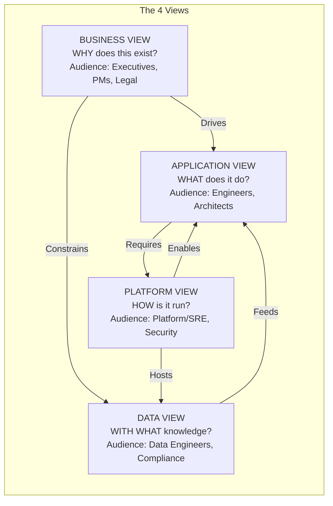
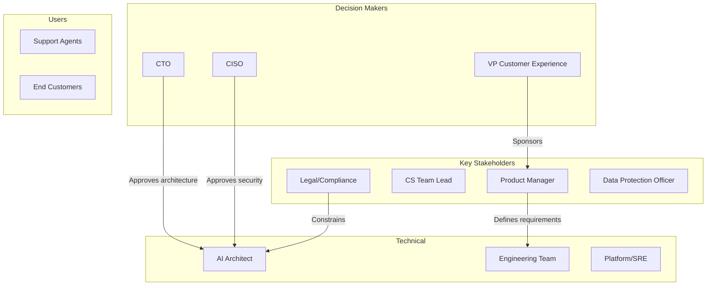
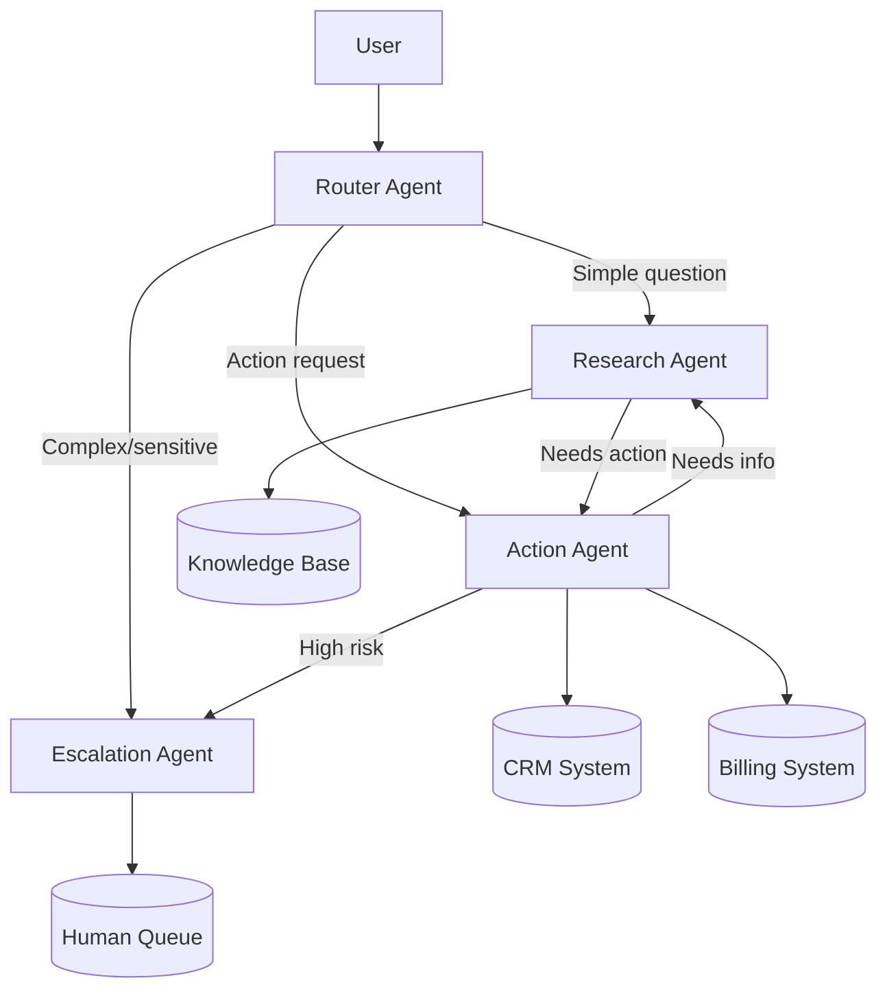
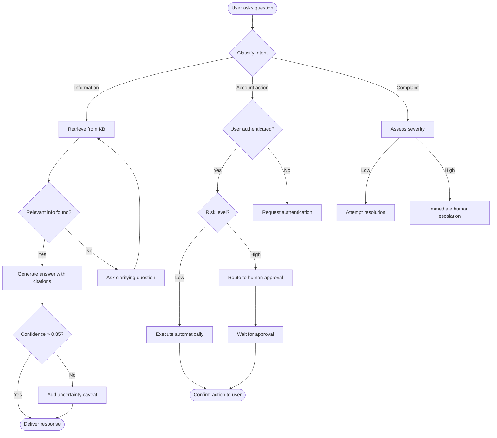
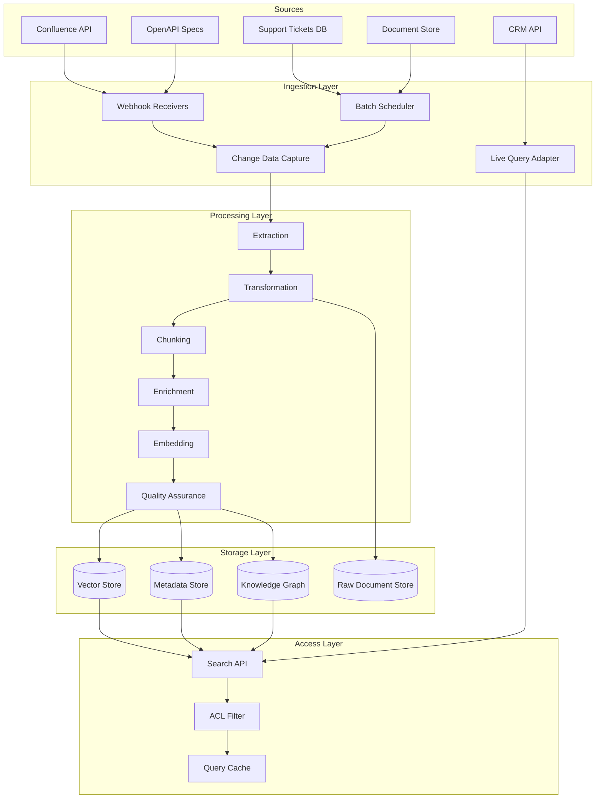
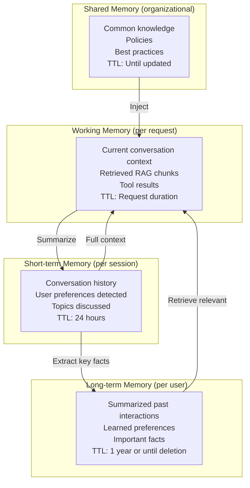
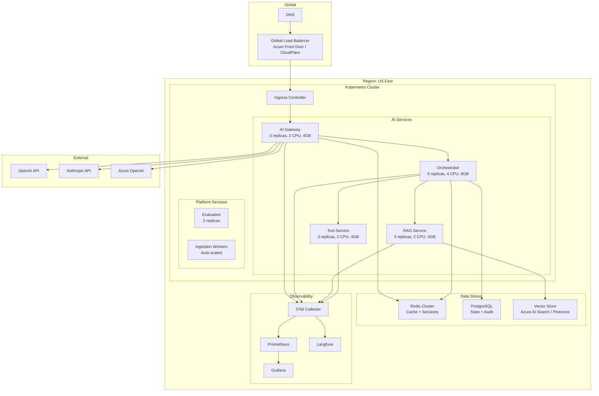
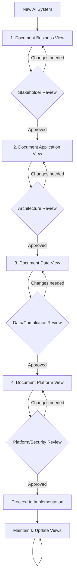

# The Four Architecture Views Framework

## Overview

Every agentic AI system must be documented and understood through four complementary views. Each view answers a different fundamental question and serves a different audience.



**Critical Principle:** No view is complete without the others. A technically brilliant system (Application View) that doesn't deliver business value (Business View) is waste. A system with perfect data (Data View) but no operational excellence (Platform View) will fail in production.

---

## View 1: Business View — "WHY"

### Purpose

The Business View establishes **why** this AI system exists, what value it creates, what risks it introduces, and how success is measured in business terms.

### Key Questions

| Question | Why It Matters |
|----------|---------------|
| What business problem does this solve? | Ensures the system has a reason to exist |
| What's the current cost of this problem? | Quantifies the opportunity |
| What's the expected ROI? | Justifies investment |
| What happens when the AI is wrong? | Sizes the risk |
| Who is accountable for outcomes? | Establishes ownership |
| What regulations apply? | Defines compliance boundaries |
| What's the competitive impact? | Prioritizes urgency |

### Components of the Business View

#### 1. Problem Statement

A precise description of the business problem, not the technical solution.

**Template:**
```
PROBLEM: [Target users] currently [pain point] which results in 
[quantified business impact: $X/year, Y hours/week, Z% error rate].

CURRENT STATE: [How the problem is handled today]
DESIRED STATE: [What success looks like in business terms]
GAP: [What's preventing the desired state]
```

**Example:**
```
PROBLEM: Customer support agents currently spend 60% of their time 
researching product documentation to answer customer questions, 
resulting in 8-minute average handle time (industry average: 4 min), 
$2.4M/year in excess labor costs, and 3.2/5 customer satisfaction scores.

CURRENT STATE: Agents manually search 15+ knowledge bases, often 
giving inconsistent or outdated answers.
DESIRED STATE: AI assistant provides agents with accurate, sourced 
answers in <10 seconds, reducing handle time to 3 minutes.
GAP: No unified knowledge system exists; information is scattered 
and unstructured.
```

#### 2. ROI Model

| Cost Category | Amount | Notes |
|---------------|--------|-------|
| **Investment** | | |
| Development (one-time) | $X | Team, timeline |
| Infrastructure (monthly) | $Y/mo | Compute, storage, APIs |
| Model costs (monthly) | $Z/mo | Token usage at expected volume |
| Maintenance (monthly) | $W/mo | Updates, monitoring, improvements |
| **Benefits** | | |
| Labor savings | $A/yr | Reduced handle time × volume |
| Quality improvement | $B/yr | Fewer escalations, returns |
| Revenue impact | $C/yr | Better conversion, retention |
| **ROI** | | |
| Payback period | X months | |
| Annual net value | $D/yr | Benefits - ongoing costs |
| 3-year NPV | $E | |

#### 3. Risk Assessment

| Risk | Likelihood | Impact | Mitigation | Residual Risk |
|------|-----------|--------|------------|---------------|
| AI provides incorrect information leading to customer harm | Medium | High | Human review for high-stakes answers; RAG grounding | Low |
| Model provider increases pricing 3x | Medium | Medium | Multi-provider architecture; cost monitoring | Low |
| Data breach through AI system | Low | Critical | Input/output filtering; access controls; audit | Low |
| Regulatory change prohibits AI for this use case | Low | High | Modular design allowing graceful disable; human fallback | Medium |
| Users don't trust/adopt the AI | Medium | High | Gradual rollout; confidence indicators; easy override | Medium |

#### 4. Success Metrics (Business KPIs)

| Metric | Baseline | Target | Measurement Method |
|--------|----------|--------|-------------------|
| Average Handle Time | 8 min | 3 min | Contact center platform |
| First Contact Resolution | 62% | 85% | CRM tracking |
| Customer Satisfaction | 3.2/5 | 4.5/5 | Post-interaction survey |
| Agent Satisfaction | 3.0/5 | 4.0/5 | Quarterly survey |
| Cost per Interaction | $12.50 | $5.00 | Total cost / volume |
| Answer Accuracy | N/A | >95% | Weekly audit sample |

#### 5. Stakeholder Map



#### 6. Compliance Requirements

| Regulation | Requirement | Impact on Architecture |
|-----------|-------------|----------------------|
| GDPR | Right to explanation | Must log reasoning; explainability engine needed |
| GDPR | Right to deletion | Must be able to purge user data from all stores including vector DBs |
| SOC 2 | Audit trail | Complete logging of all AI interactions |
| Industry-specific | Data residency | Model calls must stay within region |
| Internal policy | Human oversight | High-risk actions require approval |

---

## View 2: Application View — "WHAT"

### Purpose

The Application View describes **what** the system does — the agents, their capabilities, workflows, integrations, and user interactions.

### Key Questions

| Question | Why It Matters |
|----------|---------------|
| What agents exist and what do they do? | Defines system capabilities |
| How do agents interact with each other? | Establishes coordination patterns |
| What tools do agents have access to? | Defines action space |
| What workflows exist? | Shows end-to-end processes |
| How do users interact with the system? | Defines UX patterns |
| What are the error modes? | Ensures resilience |

### Components of the Application View

#### 1. Agent Catalog

| Agent | Purpose | Autonomy Level | Tools | Model | Trust Level |
|-------|---------|---------------|-------|-------|-------------|
| Router Agent | Classify and route requests | Level 3 (autonomous) | None | GPT-4o-mini | High |
| Research Agent | Find information in knowledge base | Level 3 | Search, DB Read | GPT-4o | High |
| Action Agent | Execute customer actions | Level 1 (human approves) | CRM Write, Billing | GPT-4o | Medium |
| Escalation Agent | Handle complex/sensitive cases | Level 0 (suggest only) | Ticket Create | GPT-4o | Low |

#### 2. Agent Interaction Topology



#### 3. Workflow Definitions

**Workflow: Customer Question Answering**



#### 4. API Contracts

```yaml
# Agent Interaction API
POST /v1/chat/completions
Request:
  conversation_id: string
  message: string
  attachments: File[]
  metadata:
    channel: "web" | "mobile" | "slack" | "api"
    user_id: string
    session_context: object

Response (streaming):
  event: "token" | "tool_call" | "status" | "done"
  data:
    content: string          # For token events
    tool_name: string        # For tool_call events
    tool_input: object       # For tool_call events
    status: string           # For status events (thinking, searching, etc.)
    citations: Citation[]    # For done events
    confidence: float        # For done events
    trace_id: string         # Always present
```

#### 5. Integration Map

| External System | Integration Type | Direction | Auth Method | SLA |
|----------------|-----------------|-----------|-------------|-----|
| Knowledge Base (Confluence) | REST API | Read | OAuth2 | 99.9% |
| CRM (Salesforce) | REST API | Read/Write | OAuth2 | 99.95% |
| Billing (Stripe) | REST API | Read/Write | API Key | 99.99% |
| Ticketing (Jira) | REST API | Write | OAuth2 | 99.9% |
| Email (SendGrid) | REST API | Write | API Key | 99.5% |
| Analytics (Snowflake) | SQL | Read | Service Account | 99.9% |

#### 6. Error Handling Matrix

| Error Scenario | Detection | Response | Recovery |
|---------------|-----------|----------|----------|
| Model timeout | 30s timeout | Retry with fallback model | Automatic |
| RAG returns no results | Empty retrieval | Ask clarifying question | User-guided |
| Tool execution failure | Error response | Inform user, suggest alternative | Graceful |
| Confidence below threshold | Score < 0.6 | Add caveat, offer human escalation | User choice |
| Rate limit hit | 429 response | Queue and retry with backoff | Automatic |
| Harmful output detected | Output guardrail | Regenerate with safety prompt | Automatic |

---

## View 3: Data View — "WITH WHAT DATA"

### Purpose

The Data View describes **what data** the system uses, where it comes from, how it's processed, how it's governed, and how freshness/quality are maintained.

### Key Questions

| Question | Why It Matters |
|----------|---------------|
| What data sources feed the AI? | Defines knowledge scope |
| How fresh must the data be? | Determines pipeline architecture |
| Who can access what data? | Security and compliance |
| How is data quality ensured? | Output quality depends on input quality |
| What's the data lineage? | Audit and debugging |
| How is PII handled? | Regulatory compliance |

### Components of the Data View

#### 1. Knowledge Source Inventory

| Source | Type | Volume | Freshness Requirement | Update Frequency | Owner |
|--------|------|--------|----------------------|-----------------|-------|
| Product Documentation | Confluence pages | 5,000 pages | < 1 hour | Event-driven | Product team |
| API Reference | OpenAPI specs | 200 endpoints | < 15 min | On deploy |Engineering |
| Support Tickets (resolved) | Structured data | 500K tickets | < 24 hours | Nightly batch | CS team |
| Internal Policies | PDF/Word docs | 300 documents | < 1 week | Weekly batch | Legal |
| Customer Data | CRM records | 2M records | Real-time (live query) | N/A (live) | Sales ops |
| Release Notes | Markdown files | 500 releases | < 1 hour | Event-driven | Engineering |

#### 2. Data Pipeline Architecture



#### 3. Access Control Matrix

| Data Source | Public | Support Agent | Manager | Admin | AI Agent |
|------------|--------|---------------|---------|-------|----------|
| Product docs | Read | Read | Read | Read/Write | Read |
| Customer PII | No | Read (own cases) | Read (team) | Read (all) | Masked |
| Billing data | No | Read (summary) | Read (detail) | Full | Read (summary) |
| Internal policies | No | Read (relevant) | Read (all) | Full | Read (relevant) |
| Agent conversations | No | Own only | Team | All | Own context |

#### 4. Data Quality Framework

| Dimension | Measurement | Target | Alert Threshold |
|-----------|-------------|--------|----------------|
| **Completeness** | % of expected documents indexed | >98% | <95% |
| **Freshness** | Time since last update per source | Within SLA | 2x SLA |
| **Accuracy** | Random audit sample accuracy | >99% | <97% |
| **Consistency** | Cross-source contradiction rate | <1% | >3% |
| **Relevance** | Retrieval precision@10 | >0.8 | <0.7 |
| **Coverage** | % of user queries with relevant docs | >90% | <85% |

#### 5. Data Lineage

```mermaid
flowchart LR
    subgraph "Source of Truth"
        DOC[Confluence Page<br/>ID: 12345<br/>Updated: 2024-01-15]
    end

    subgraph "Processing"
        EXTRACTED[Extracted Text<br/>Processor: v2.1<br/>Time: 2024-01-15T10:30Z]
        CHUNKED[Chunks: 5<br/>Strategy: semantic<br/>Avg size: 400 tokens]
        EMBEDDED[Vectors: 5<br/>Model: text-embedding-3-small<br/>Dims: 1536]
    end

    subgraph "Storage"
        INDEXED[Vector Store<br/>Index: prod-kb<br/>IDs: vec_001-005]
    end

    subgraph "Usage"
        RETRIEVED[Retrieved in response<br/>Query: "How to reset password"<br/>Similarity: 0.94<br/>Rank: 1]
    end

    DOC --> EXTRACTED --> CHUNKED --> EMBEDDED --> INDEXED --> RETRIEVED
```

#### 6. PII Handling Strategy

| PII Type | Detection Method | Handling in Context | Handling in Storage | Retention |
|----------|-----------------|--------------------|--------------------|-----------|
| Names | NER + regex | Replace with [CUSTOMER] | Encrypted | 90 days |
| Email | Regex | Replace with [EMAIL] | Encrypted | 90 days |
| Phone | Regex | Replace with [PHONE] | Encrypted | 90 days |
| SSN/ID | Regex | Never include | Never store | N/A |
| Address | NER | Replace with [ADDRESS] | Encrypted | 90 days |
| Financial | Regex + NER | Summarize only | Encrypted | 30 days |

#### 7. Memory Architecture



---

## View 4: Platform View — "HOW/WHERE"

### Purpose

The Platform View describes **how** the system is deployed, operated, secured, monitored, and scaled in production.

### Key Questions

| Question | Why It Matters |
|----------|---------------|
| Where does the system run? | Infrastructure planning |
| How is it deployed and updated? | Operational excellence |
| How is it monitored? | Issue detection |
| How does it scale? | Capacity planning |
| How is it secured? | Threat mitigation |
| What does it cost to run? | Financial sustainability |

### Components of the Platform View

#### 1. Infrastructure Architecture



#### 2. Deployment Strategy

| Aspect | Strategy | Rationale |
|--------|----------|-----------|
| Deployment method | GitOps (ArgoCD/Flux) | Declarative, auditable, rollback |
| Release strategy | Canary (10% → 50% → 100%) | Detect regressions before full rollout |
| Rollback | Automated on quality regression | Evaluation scores trigger rollback |
| Environment promotion | Dev → Staging → Prod | Evaluation gates at each stage |
| Model updates | Blue-green with evaluation | Compare old vs. new model quality |
| Secret management | Vault / Azure Key Vault | Rotation, audit, least privilege |

**Deployment Pipeline:**

```mermaid
flowchart LR
    CODE[Code Commit] --> BUILD[Build & Test]
    BUILD --> EVAL_DEV[Run Evals (Dev)]
    EVAL_DEV -->|"Pass"| DEPLOY_STG[Deploy Staging]
    EVAL_DEV -->|"Fail"| REJECT[Reject]
    DEPLOY_STG --> EVAL_STG[Run Evals (Staging)]
    EVAL_STG -->|"Pass"| CANARY[Canary 10%]
    CANARY --> MONITOR[Monitor 30min]
    MONITOR -->|"Healthy"| FULL[Full Rollout]
    MONITOR -->|"Degraded"| ROLLBACK[Automatic Rollback]
```

#### 3. Observability Stack

| Layer | Tool | Purpose |
|-------|------|---------|
| Traces | Langfuse / LangSmith | AI-specific traces with prompts, completions, tool calls |
| Metrics | Prometheus + Grafana | System and business metrics |
| Logs | Structured JSON → ELK/Loki | Searchable event logs |
| Alerts | PagerDuty / OpsGenie | Incident notification and escalation |
| Evaluation | Braintrust / Custom | Continuous quality measurement |
| Cost | Custom dashboard | Token usage, cost per interaction |

**Key Dashboards:**

1. **Operations Dashboard:** Request rate, latency P50/P95/P99, error rate, model availability
2. **Quality Dashboard:** Eval scores over time, hallucination rate, user satisfaction, confidence distribution
3. **Cost Dashboard:** Token usage by model, cost per interaction, budget utilization, cost trends
4. **Security Dashboard:** Guardrail triggers, injection attempts, PII detections, anomalous patterns

#### 4. Scaling Strategy

| Component | Scaling Trigger | Min | Max | Scale Speed |
|-----------|----------------|-----|-----|-------------|
| AI Gateway | CPU > 70% OR request queue > 100 | 3 | 20 | 30s |
| Orchestrator | Active agents > 80% capacity | 5 | 50 | 60s |
| RAG Service | Query latency P95 > 500ms | 3 | 15 | 30s |
| Tool Service | Concurrent executions > 80% | 3 | 30 | 30s |
| Ingestion Workers | Queue depth > 1000 | 1 | 20 | 60s |
| Vector Store | Query latency OR storage > 80% | N/A | N/A | Manual (resize) |

#### 5. Security Architecture

```mermaid
flowchart TB
    subgraph "Perimeter"
        WAF_S[WAF Rules]
        DDOS[DDoS Protection]
        GEO[Geo-blocking]
    end

    subgraph "Authentication"
        OIDC[OpenID Connect]
        APIKEY[API Key Management]
        MTLS[mTLS (service-to-service)]
    end

    subgraph "AI-Specific Security"
        INJECT[Prompt Injection Detection]
        JAILBREAK[Jailbreak Detection]
        PII_F[PII Filtering]
        CONTENT[Content Safety]
    end

    subgraph "Data Security"
        ENCRYPT[Encryption at rest (AES-256)]
        TLS_S[TLS 1.3 in transit]
        MASK[Dynamic Data Masking]
        DLP_S[Data Loss Prevention]
    end

    subgraph "Operational Security"
        RBAC[Role-Based Access Control]
        AUDIT_S[Audit Logging]
        ROTATION[Secret Rotation]
        VULN[Vulnerability Scanning]
    end
```

#### 6. Cost Model

| Component | Unit Cost | Monthly Volume | Monthly Cost |
|-----------|-----------|----------------|--------------|
| GPT-4o (input) | $2.50/1M tokens | 500M tokens | $1,250 |
| GPT-4o (output) | $10.00/1M tokens | 200M tokens | $2,000 |
| GPT-4o-mini (input) | $0.15/1M tokens | 2B tokens | $300 |
| GPT-4o-mini (output) | $0.60/1M tokens | 800M tokens | $480 |
| Embeddings | $0.02/1M tokens | 100M tokens | $2 |
| Vector Store | $0.10/GB/month | 50GB | $5 |
| Kubernetes | $X/node | 10 nodes | $3,000 |
| Redis | $X/instance | 3 instances | $500 |
| PostgreSQL | $X/instance | 2 instances | $400 |
| Observability | $X/GB ingested | 100GB/month | $500 |
| **Total** | | | **~$8,437/mo** |

#### 7. Disaster Recovery

| Scenario | RTO | RPO | Strategy |
|----------|-----|-----|----------|
| Single pod failure | 0 min | 0 | Kubernetes auto-restart, multiple replicas |
| Node failure | 2 min | 0 | Pod rescheduling, PodDisruptionBudgets |
| AZ failure | 5 min | 0 | Multi-AZ deployment |
| Region failure | 30 min | 5 min | Active-passive in secondary region |
| Provider outage (OpenAI) | 0 min | 0 | Automatic failover to Anthropic/Azure |
| Vector store corruption | 4 hours | 24 hours | Rebuild from source documents |
| Database failure | 5 min | 1 min | Synchronous replication + automated failover |

---

## How to Document Each View

### Documentation Process



### When to Update Views

| Trigger | Views to Update |
|---------|----------------|
| New business requirement | Business → Application → Data → Platform |
| New data source added | Data → Application (if new capability) → Platform (if new infra) |
| Security incident | Platform → Application (if behavior change) |
| Cost overrun | Platform → Application (if optimization needed) → Business (if scope change) |
| Model change | Platform → Application (if behavior change) |
| Scale change | Platform → Business (if cost impact) |

---

## Architecture Documentation Template

### Cover Page

```markdown
# [System Name] Architecture Document

**Version:** X.Y
**Last Updated:** YYYY-MM-DD
**Author:** [Name]
**Status:** Draft | In Review | Approved
**Reviewers:** [Names]

## Change History
| Version | Date | Author | Changes |
|---------|------|--------|---------|
| 1.0 | 2024-01-15 | J. Smith | Initial architecture |
| 1.1 | 2024-02-01 | J. Smith | Added multi-agent support |
```

### Template Structure

```markdown
# 1. Business View
## 1.1 Problem Statement
## 1.2 Value Proposition & ROI
## 1.3 Success Metrics
## 1.4 Risk Assessment
## 1.5 Stakeholders
## 1.6 Compliance Requirements
## 1.7 Constraints & Assumptions

# 2. Application View
## 2.1 System Context Diagram
## 2.2 Agent Catalog
## 2.3 Agent Interaction Topology
## 2.4 Workflow Definitions
## 2.5 API Contracts
## 2.6 Integration Map
## 2.7 Error Handling
## 2.8 Human-in-the-Loop Design

# 3. Data View
## 3.1 Knowledge Source Inventory
## 3.2 Data Pipeline Architecture
## 3.3 Access Control Matrix
## 3.4 Data Quality Framework
## 3.5 Data Lineage
## 3.6 PII & Sensitive Data Handling
## 3.7 Memory Architecture
## 3.8 Retention & Deletion Policies

# 4. Platform View
## 4.1 Infrastructure Architecture
## 4.2 Deployment Strategy
## 4.3 Observability Stack
## 4.4 Scaling Strategy
## 4.5 Security Architecture
## 4.6 Cost Model
## 4.7 Disaster Recovery
## 4.8 Operational Runbooks

# 5. Architecture Decision Records (ADRs)
## ADR-001: [Decision Title]
- Status: Accepted
- Context: [Why this decision was needed]
- Decision: [What was decided]
- Consequences: [Positive and negative outcomes]
- Alternatives Considered: [What else was evaluated]

# 6. Appendices
## A. Glossary
## B. Reference Documents
## C. Technology Evaluation Matrices
```

---

## Summary

The Four Views Framework ensures comprehensive architecture documentation:

| View | Question | Audience | Key Artifact |
|------|----------|----------|--------------|
| **Business** | WHY? | Executives, PMs, Legal | ROI model, risk assessment |
| **Application** | WHAT? | Engineers, Architects | Agent topology, workflows |
| **Data** | WITH WHAT? | Data Engineers, Compliance | Pipeline design, access control |
| **Platform** | HOW? | Platform/SRE, Security | Infrastructure, deployment, monitoring |

Every architecture decision should be traceable to a business need (Business View), implemented as a capability (Application View), fed by governed data (Data View), and run on reliable infrastructure (Platform View).
