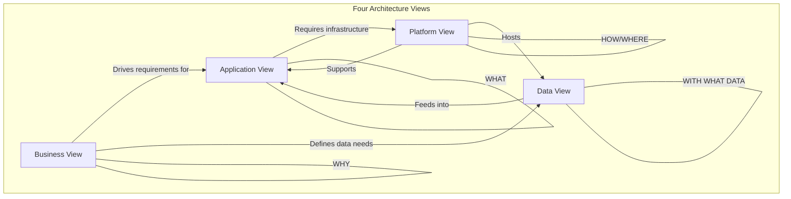

# The Agentic AI Architect: Concept & Mindset

## 1. What is a Senior/Principal Agentic AI Architect?

### Definition

A Senior/Principal Agentic AI Architect is a technical leader who designs, governs, and evolves **autonomous AI systems** that can perceive, reason, plan, and act — while maintaining alignment with business goals, safety constraints, and operational excellence.

Unlike traditional software architects who design request-response systems, the Agentic AI Architect designs systems where **the AI itself makes decisions**, calls tools, delegates to sub-agents, and operates with varying degrees of autonomy. This introduces fundamentally new challenges around control, observability, cost management, and alignment.

### Core Responsibilities

| Domain | Responsibility |
|--------|---------------|
| **System Design** | Define end-to-end architecture for agentic systems including orchestration, memory, tools, and guardrails |
| **Model Strategy** | Select, fine-tune, and route between models based on task complexity, cost, and latency |
| **Data Architecture** | Design knowledge pipelines, vector stores, context management, and data governance |
| **Safety & Alignment** | Implement guardrails, human-in-the-loop controls, output validation, and red-teaming |
| **Platform Engineering** | Define the AI platform layer (gateways, observability, evaluation, deployment) |
| **Cost Optimization** | Design for token efficiency, caching, model routing, and resource allocation |
| **Governance** | Establish policies for model usage, data handling, audit trails, and compliance |
| **Team Enablement** | Create reference architectures, patterns, and standards that teams can follow |

### The "Agentic" Distinction

Traditional AI systems are **reactive** — they receive input, generate output, and return. Agentic AI systems are **proactive** — they:

- **Plan**: Decompose complex goals into sub-tasks
- **Reason**: Evaluate options, weigh tradeoffs, and select strategies
- **Act**: Call external tools, APIs, and services autonomously
- **Reflect**: Evaluate their own outputs and iterate
- **Delegate**: Route tasks to specialized sub-agents
- **Remember**: Maintain short-term and long-term memory across interactions
- **Adapt**: Modify behavior based on feedback and changing context

This shift from reactive to proactive AI creates architectural challenges that don't exist in traditional ML systems:

```
Traditional ML System:
  Input → Model → Output → Done

Agentic AI System:
  Goal → Plan → [Reason → Act → Observe → Reflect]* → Result
                      ↕           ↕
                   Tools       Memory
                      ↕           ↕
                 Sub-agents   Knowledge
```

---

## 2. AI Developer vs. AI Architect Mindset

### The Developer Mindset

An AI developer focuses on **making things work**:

- "How do I call this LLM API?"
- "How do I implement RAG for this use case?"
- "How do I get the agent to use tools correctly?"
- "How do I improve this prompt?"

The developer operates within a defined architecture, solves scoped problems, and optimizes individual components.

### The Architect Mindset

An AI architect focuses on **making things work at scale, reliably, safely, and cost-effectively**:

- "What happens when this agent makes a wrong decision at 3 AM with no human oversight?"
- "How do we ensure consistent behavior across 50 different agent implementations?"
- "What's our strategy when OpenAI raises prices 3x or deprecates a model?"
- "How do we prove to regulators that our AI system is compliant?"
- "What's the blast radius if the vector database goes down?"
- "How do we evaluate whether this agent is actually improving business outcomes?"

### Key Mindset Shifts

| Dimension | Developer Thinking | Architect Thinking |
|-----------|-------------------|-------------------|
| **Scope** | Single feature/agent | Entire AI platform |
| **Time horizon** | Sprint/quarter | 2-5 years |
| **Success metric** | "It works" | "It works reliably, safely, at scale, within budget" |
| **Failure mode** | Bug fix | Systemic risk assessment |
| **Model selection** | "Use GPT-4" | "Route between models based on task, cost, latency, compliance" |
| **Prompt engineering** | Optimize one prompt | Design prompt management infrastructure |
| **RAG** | Build one pipeline | Design knowledge platform with governance |
| **Tools** | Integrate one tool | Design tool registry with access control and audit |
| **Testing** | Unit tests | Evaluation frameworks, red-teaming, adversarial testing |
| **Cost** | "API costs are fine" | "Token economics at 10M requests/day" |
| **Security** | Input validation | Threat modeling for autonomous AI agents |
| **Vendor** | Use one provider | Multi-provider strategy with fallback and portability |

### The Architect's Questions Framework

Before designing any agentic system, the architect asks:

**Business Alignment:**
1. What business outcome does this agent enable?
2. What's the cost of the agent being wrong?
3. What's the ROI threshold for this investment?
4. Who is accountable when the agent fails?

**System Boundaries:**
5. What decisions can the agent make autonomously?
6. What requires human approval?
7. What actions are irreversible?
8. What's the maximum blast radius of a failure?

**Operational Reality:**
9. What's the expected load pattern?
10. What's the latency budget?
11. What's the cost budget per interaction?
12. How do we detect degradation?

**Evolution:**
13. How do we update models without breaking behavior?
14. How do we add new capabilities?
15. How do we deprecate old agents?
16. How do we handle vendor changes?

---

## 3. Full Accountability Matrix

The AI Architect is accountable across seven domains. Each requires specific competencies and produces specific artifacts.

### 3.1 Business Accountability

| Aspect | Description | Artifacts |
|--------|-------------|-----------|
| **Value alignment** | AI systems solve real business problems with measurable impact | Business case documents, ROI models |
| **Stakeholder management** | Technical decisions are communicated in business terms | Architecture decision records (ADRs) |
| **Risk quantification** | Business impact of AI failures is understood and mitigated | Risk registers, impact assessments |
| **Success metrics** | Clear KPIs tied to business outcomes, not just technical metrics | OKR frameworks, dashboards |
| **Build vs. buy** | Rational decisions about custom vs. vendor solutions | Technology evaluation matrices |

### 3.2 Model Accountability

| Aspect | Description | Artifacts |
|--------|-------------|-----------|
| **Model selection** | Right model for right task (capability, cost, latency, compliance) | Model selection framework |
| **Model routing** | Dynamic routing based on complexity, cost, availability | Routing policies, fallback chains |
| **Fine-tuning strategy** | When and how to fine-tune vs. prompt engineer | Fine-tuning decision trees |
| **Model lifecycle** | Version management, deprecation, migration | Model registry, migration playbooks |
| **Vendor strategy** | Multi-provider approach, avoiding lock-in | Provider comparison matrices |

### 3.3 Data Accountability

| Aspect | Description | Artifacts |
|--------|-------------|-----------|
| **Knowledge architecture** | How data flows into AI context (RAG, fine-tuning, grounding) | Knowledge pipeline designs |
| **Data quality** | Ensuring AI has access to accurate, fresh, relevant data | Data quality frameworks |
| **Data governance** | Access control, lineage, retention, compliance | Data governance policies |
| **Context management** | Efficient use of context windows, memory systems | Context strategy documents |
| **Embeddings strategy** | Model selection, chunking, indexing, refresh cycles | Embedding pipeline designs |

### 3.4 Security Accountability

| Aspect | Description | Artifacts |
|--------|-------------|-----------|
| **Threat modeling** | AI-specific threats (injection, jailbreak, data exfiltration) | Threat models, attack trees |
| **Input validation** | Guardrails against prompt injection and adversarial inputs | Input validation pipelines |
| **Output validation** | Ensuring AI outputs don't leak sensitive data or cause harm | Output filtering rules |
| **Access control** | What tools/data each agent can access | RBAC policies, permission matrices |
| **Audit trails** | Complete record of all AI decisions and actions | Logging architecture, audit schemas |

### 3.5 Scale Accountability

| Aspect | Description | Artifacts |
|--------|-------------|-----------|
| **Capacity planning** | Token throughput, concurrent agents, memory usage | Capacity models |
| **Performance** | Latency budgets, throughput targets, optimization strategies | Performance budgets |
| **Reliability** | Uptime targets, failure modes, recovery procedures | SLAs, runbooks |
| **Elasticity** | Scaling policies for variable load | Auto-scaling configurations |
| **Multi-region** | Geographic distribution for latency and compliance | Deployment topology |

### 3.6 Cost Accountability

| Aspect | Description | Artifacts |
|--------|-------------|-----------|
| **Token economics** | Understanding and optimizing token usage per interaction | Cost models, token budgets |
| **Caching strategy** | Semantic caching, response caching, embedding caching | Caching architecture |
| **Model routing for cost** | Using cheaper models for simpler tasks | Routing cost policies |
| **Resource optimization** | Right-sizing infrastructure, spot instances, reserved capacity | Infrastructure cost analysis |
| **Chargeback** | Attributing AI costs to business units/products | Cost allocation models |

### 3.7 Governance Accountability

| Aspect | Description | Artifacts |
|--------|-------------|-----------|
| **AI policy** | Organizational standards for AI development and deployment | AI governance framework |
| **Compliance** | Regulatory requirements (GDPR, SOC2, industry-specific) | Compliance mapping |
| **Ethics** | Fairness, bias mitigation, transparency | Ethics review process |
| **Change management** | How changes to AI systems are reviewed and approved | Change control procedures |
| **Incident response** | How AI-specific incidents are handled | IR playbooks |

---

## 4. Career Progression: Junior to Staff Architect

### Level 1: Junior AI Engineer (0-2 years)

**Focus:** Learning to build individual AI components

**Competencies:**
- Can call LLM APIs and handle responses
- Understands basic prompt engineering
- Can build simple RAG pipelines
- Understands vector databases at a basic level
- Can implement simple agent loops (ReAct, function calling)
- Writes basic evaluations for AI outputs

**Scope:** Single feature within an existing architecture

**Decision authority:** Implementation details within defined patterns

---

### Level 2: Mid-Level AI Engineer (2-4 years)

**Focus:** Building robust AI features with production concerns

**Competencies:**
- Designs effective RAG pipelines with proper chunking, retrieval, and ranking
- Implements multi-step agent workflows with error handling
- Understands model selection tradeoffs
- Can fine-tune models for specific tasks
- Implements proper evaluation frameworks
- Handles edge cases, fallbacks, and degradation gracefully
- Understands token costs and basic optimization

**Scope:** Complete features or services within a team

**Decision authority:** Technology choices within team scope, implementation approaches

---

### Level 3: Senior AI Engineer (4-7 years)

**Focus:** Designing systems, mentoring others, cross-team influence

**Competencies:**
- Designs end-to-end agentic systems with multiple agents
- Creates reusable patterns and shared infrastructure
- Conducts threat modeling for AI systems
- Designs evaluation frameworks that measure business outcomes
- Optimizes systems for cost and performance at scale
- Understands regulatory implications of AI design choices
- Mentors junior engineers in AI architecture patterns

**Scope:** Multiple teams, shared platform components

**Decision authority:** Architecture within a domain, significant technology choices

---

### Level 4: Staff AI Architect (7-12 years)

**Focus:** Organization-wide AI architecture, strategy, and governance

**Competencies:**
- Defines the organization's AI platform architecture
- Creates reference architectures that dozens of teams follow
- Designs governance frameworks for safe AI deployment
- Makes build-vs-buy decisions at the organizational level
- Balances innovation with operational excellence
- Influences vendor strategy and partnerships
- Defines evaluation and safety standards
- Creates career development frameworks for AI engineers
- Communicates technical strategy to executive leadership
- Designs for 3-5 year technology evolution

**Scope:** Entire organization or major business unit

**Decision authority:** Platform architecture, organizational standards, vendor strategy

---

### Level 5: Principal AI Architect (12+ years)

**Focus:** Industry-wide influence, pioneering new approaches

**Competencies:**
- Defines architecture for novel AI paradigms before industry patterns exist
- Influences industry standards and best practices
- Designs systems that operate at extreme scale (billions of interactions)
- Navigates complex regulatory environments across jurisdictions
- Creates new architectural patterns that others adopt
- Balances technical vision with organizational constraints
- Drives M&A technical due diligence for AI companies/products

**Scope:** Multiple organizations, industry influence

**Decision authority:** Strategic technical direction, industry partnerships

---

## 5. The Four Architecture Views

Every agentic AI system must be understood through four complementary views. No single view is complete without the others.



### 5.1 Business View — "WHY"

**Question:** Why does this AI system exist and how does it create value?

**Contents:**
- Business problem statement
- Value hypothesis and ROI model
- Success metrics (business KPIs, not technical metrics)
- Risk tolerance and failure impact
- Stakeholder map
- Regulatory constraints
- Ethical considerations

### 5.2 Application View — "WHAT"

**Question:** What does the system do and how do components interact?

**Contents:**
- Agent topology (single agent, multi-agent, hierarchical)
- Workflow definitions
- Tool integrations
- User interaction patterns
- API contracts
- Error handling and fallback behavior
- Human-in-the-loop decision points

### 5.3 Data View — "WITH WHAT DATA"

**Question:** What data does the system need, where does it come from, and how is it governed?

**Contents:**
- Knowledge sources and ingestion pipelines
- Vector store architecture
- Context management strategy
- Data freshness requirements
- Access control and classification
- Data lineage and provenance
- Memory architecture (short-term, long-term, shared)

### 5.4 Platform View — "HOW/WHERE"

**Question:** How is the system deployed, operated, and scaled?

**Contents:**
- Infrastructure architecture
- AI Gateway configuration
- Model hosting and routing
- Observability stack
- Evaluation pipeline
- Security controls
- Deployment strategy
- Scaling policies
- Cost management

---

## 6. Design Principles for AI Systems

### Principle 1: Graduated Autonomy

Never give an agent more autonomy than the use case requires. Design systems where autonomy can be dialed up or down based on confidence, risk, and proven reliability.

```
Level 0: AI suggests, human decides and acts
Level 1: AI decides, human approves before action
Level 2: AI acts, human is notified and can reverse
Level 3: AI acts autonomously, human reviews periodically
Level 4: AI acts and adapts, human sets boundaries only
```

**Application:** Start every agent at Level 0-1. Promote to higher levels only after demonstrated reliability through evaluation.

### Principle 2: Observability by Default

Every AI decision, tool call, reasoning step, and output must be observable. You cannot govern what you cannot see.

**Requirements:**
- Trace every request through the entire agent execution
- Log reasoning chains, not just final outputs
- Record tool calls with inputs and outputs
- Measure latency, cost, and quality at every step
- Alert on anomalous behavior patterns

### Principle 3: Fail Safe, Not Fail Silent

When an AI system fails, it must fail in a way that is detectable, reversible, and minimizes harm. Silent failures in AI systems compound over time.

**Patterns:**
- Default to human escalation on uncertainty
- Implement confidence thresholds for autonomous action
- Design circuit breakers for repeated failures
- Maintain rollback capability for all AI-initiated actions
- Alert on quality degradation before users notice

### Principle 4: Context is Architecture

The quality of an AI system is determined by the quality of the context it receives. Context architecture (what data, in what format, at what time) is the most important design decision.

**Considerations:**
- What context does the agent need for this decision?
- How fresh does the context need to be?
- What's the cost of including this context (tokens)?
- What's the cost of missing this context (quality)?
- How is context prioritized when the window is limited?

### Principle 5: Model Agnosticism

Design systems that can switch models without architectural changes. Models improve, deprecate, and change pricing constantly.

**Implementation:**
- Abstract model interactions behind interfaces
- Design prompts that work across model families
- Implement model routing that can redirect traffic
- Store evaluation results per model for comparison
- Plan for model migrations as a routine operation

### Principle 6: Defense in Depth for AI

AI systems need multiple layers of protection because no single guardrail is sufficient against the creativity of adversarial inputs and the unpredictability of model behavior.

**Layers:**
1. Input validation and sanitization
2. System prompt hardening
3. Output content filtering
4. Action validation before execution
5. Result verification after execution
6. Anomaly detection on behavior patterns
7. Human review for high-risk decisions

### Principle 7: Evaluation-Driven Development

You cannot improve what you cannot measure. Every AI system needs automated evaluation that runs continuously, not just during development.

**Framework:**
- Define quality dimensions (accuracy, helpfulness, safety, consistency)
- Create evaluation datasets that cover edge cases
- Run evaluations on every prompt/model/pipeline change
- Track quality metrics over time (regression detection)
- Include adversarial test cases (red-teaming)

### Principle 8: Cost-Aware Design

Token costs scale with usage. What costs $10/day in development can cost $100K/day in production. Design for cost efficiency from the start.

**Strategies:**
- Route simple tasks to cheaper/smaller models
- Implement semantic caching for repeated queries
- Optimize context length (include only what's needed)
- Use streaming to reduce perceived latency without more tokens
- Monitor cost per interaction and set budgets/alerts

### Principle 9: Evolutionary Architecture

AI technology changes faster than any other software domain. Design for change: new models, new paradigms, new regulations, new capabilities.

**Approach:**
- Use loose coupling between components
- Define clear interfaces that survive technology changes
- Build platform capabilities that serve multiple use cases
- Design for plugin-based extensibility
- Maintain migration paths from current to next-generation approaches

### Principle 10: Human-Centered AI

Regardless of the agent's autonomy, the system must ultimately serve human goals, remain understandable to humans, and keep humans in control.

**Requirements:**
- Users must be able to understand why the AI did something
- Users must be able to correct AI behavior
- Users must be able to override AI decisions
- The system must degrade gracefully when AI is unavailable
- AI assistance should amplify human capability, not replace human judgment for high-stakes decisions

---

## 7. Anti-Patterns to Avoid

### Anti-Pattern 1: "The God Agent"

**Description:** Building a single monolithic agent that handles everything — all domains, all tasks, all complexity levels.

**Why it fails:**
- Impossible to evaluate effectively (too many dimensions)
- Single point of failure for all AI capabilities
- Prompt becomes unwieldy and contradictory
- Cannot optimize cost (everything uses the most capable model)
- Cannot assign appropriate trust levels

**Correct pattern:** Decompose into specialized agents with clear responsibilities, coordinated through an orchestration layer.

---

### Anti-Pattern 2: "Prompt and Pray"

**Description:** Relying solely on prompt engineering without architectural guardrails, evaluation, or fallback mechanisms.

**Why it fails:**
- Prompts are brittle and model-dependent
- No guarantee of consistent behavior
- No detection of degradation
- No recovery from failures
- Cannot prove compliance

**Correct pattern:** Prompts are one layer in a defense-in-depth architecture that includes validation, evaluation, monitoring, and fallback.

---

### Anti-Pattern 3: "RAG Everything"

**Description:** Adding RAG to every interaction regardless of whether retrieval actually improves the response.

**Why it fails:**
- Adds latency to every request
- Irrelevant context can confuse the model
- Increases cost (more tokens)
- Creates dependency on retrieval infrastructure availability
- May retrieve outdated or incorrect information

**Correct pattern:** Route between RAG and non-RAG paths based on query classification. Only retrieve when the model's parametric knowledge is insufficient.

---

### Anti-Pattern 4: "Infinite Agent Loop"

**Description:** Agent architectures without proper termination conditions, leading to runaway execution, escalating costs, and no meaningful output.

**Why it fails:**
- Unbounded token consumption
- No guaranteed termination
- Costs spiral out of control
- User waits indefinitely
- System resources exhausted

**Correct pattern:** Define maximum iterations, token budgets, time limits, and confidence thresholds. Implement circuit breakers and graceful degradation.

---

### Anti-Pattern 5: "Security Afterthought"

**Description:** Building agentic capabilities first, then trying to add security controls after the architecture is set.

**Why it fails:**
- Agent autonomy creates attack surface that's hard to constrain retroactively
- Tool access permissions become all-or-nothing
- Audit trails are incomplete
- Prompt injection vectors are baked into the design
- Data leakage paths are established

**Correct pattern:** Design security from the start: principle of least privilege for tool access, input/output validation at every boundary, complete audit logging, and threat modeling before implementation.

---

### Anti-Pattern 6: "Vendor Lock-in by Default"

**Description:** Building directly on a single provider's proprietary APIs, frameworks, and infrastructure without abstraction.

**Why it fails:**
- Provider pricing changes can break your cost model overnight
- Model deprecation forces emergency rewrites
- No ability to leverage better models from other providers
- Compliance requirements may prohibit certain providers in certain regions
- Business continuity risk if provider has outages

**Correct pattern:** Abstract provider-specific details behind interfaces. Use AI gateways that support multiple providers. Design evaluation frameworks that make model swaps testable.

---

### Anti-Pattern 7: "Evaluation Desert"

**Description:** Deploying AI systems without continuous evaluation, relying on manual testing or user complaints to detect issues.

**Why it fails:**
- Model behavior changes between versions without warning
- Quality degradation is gradual and hard to notice manually
- Cannot prove compliance without evaluation evidence
- Cannot compare improvements objectively
- Issues are discovered by users, not by the team

**Correct pattern:** Automated evaluation pipelines that run on every change and continuously in production. Define quality baselines and alert on regression.

---

### Anti-Pattern 8: "Memory Without Limits"

**Description:** Allowing agents to accumulate unlimited context/memory without relevance filtering, summarization, or expiration.

**Why it fails:**
- Context window fills with irrelevant information
- Token costs grow linearly with conversation length
- Old information may contradict current state
- Performance degrades as context grows
- Privacy/compliance issues with retained data

**Correct pattern:** Design memory with explicit tiers (working memory, short-term, long-term), relevance-based retrieval, summarization strategies, and time-based expiration policies.

---

### Anti-Pattern 9: "Cost Blindness"

**Description:** Ignoring token economics during design, then facing sticker shock when the system reaches production scale.

**Why it fails:**
- $0.01 per request × 10M requests/day = $100K/day
- No budget allocation or chargeback model
- Cannot optimize what you don't measure
- Business case collapses when true costs are known
- No ability to predict costs for new features

**Correct pattern:** Model costs from day one. Set token budgets per interaction. Implement cost tracking and alerting. Design routing policies that optimize cost/quality tradeoffs.

---

### Anti-Pattern 10: "The Demo Trap"

**Description:** Architecting production systems based on what works in demos — small scale, happy path, no adversarial users, unlimited budget.

**Why it fails:**
- Demos don't have concurrent users
- Demos don't have adversarial inputs
- Demos don't run for months without maintenance
- Demos don't need to handle model deprecation
- Demos don't need audit trails

**Correct pattern:** Design for production from the start: consider scale, security, reliability, cost, compliance, and maintainability. Use demos to validate concepts, not architectures.

---

## Summary

The journey from AI developer to AI architect is a shift from "making it work" to "making it work reliably, safely, at scale, within budget, and aligned with business goals." The Agentic AI Architect must simultaneously hold business value, technical excellence, operational reality, and governance requirements — designing systems where autonomous AI operates within well-defined boundaries that protect the organization while delivering transformative value.
