# Production Agentic AI Reference Architecture

## Overview

This document defines the complete reference architecture for production-grade Agentic AI systems. Every layer is designed for reliability, security, observability, and cost efficiency.

---

## Full System Architecture

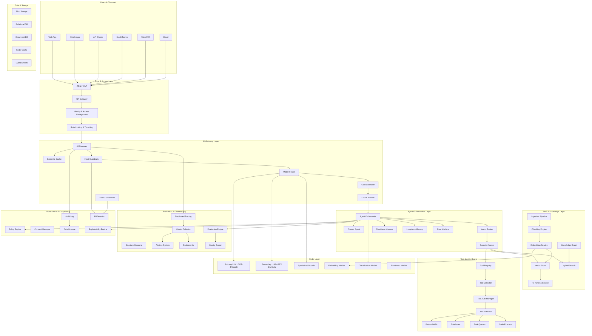

---

## Layer-by-Layer Deep Dive

---

### Layer 1: Users & Channels

**Purpose:** Accept requests from all user-facing interfaces and normalize them into a standard format for downstream processing.

**Components:**

| Component | Role | Key Considerations |
|-----------|------|-------------------|
| Web Application | Browser-based UI with chat/form interfaces | Streaming support (SSE/WebSocket), progressive rendering |
| Mobile Application | Native apps with push notifications | Offline handling, bandwidth optimization, response size limits |
| API Clients | Programmatic access for automation | Versioned APIs, SDK support, webhook callbacks |
| Slack/Teams | Conversational interfaces in workplace tools | Thread context, character limits, rich formatting |
| Voice/IVR | Speech-to-text → AI → text-to-speech | Latency sensitivity, interruption handling, turn-taking |
| Email | Async processing of email requests | Attachment handling, threading, response formatting |

**Key Design Decisions:**

1. **Channel normalization:** All channels produce a standard `ConversationMessage` format regardless of source
2. **Context preservation:** Each channel maintains its own session/conversation context
3. **Streaming strategy:** Determine which channels support streaming vs. batch responses
4. **Multimodal handling:** How images, files, and voice are processed varies by channel

**Technology Options:**
- Web: React/Next.js with streaming, Vercel AI SDK
- Mobile: React Native, Swift/Kotlin with streaming HTTP
- Chat platforms: Slack Bolt, Microsoft Bot Framework
- Voice: Azure Speech Services, AWS Transcribe/Polly, Twilio

---

### Layer 2: Edge & Access Layer

**Purpose:** Protect the system, authenticate users, and control access before any AI processing occurs.

**Components:**

| Component | Role | Key Considerations |
|-----------|------|-------------------|
| CDN/WAF | DDoS protection, geographic routing, static asset delivery | Bot detection, IP reputation, geo-blocking |
| API Gateway | Request routing, protocol translation, versioning | Rate limiting, request transformation, documentation |
| Identity & Access Management | AuthN/AuthZ for all requests | OAuth2/OIDC, API keys, service-to-service auth |
| Rate Limiting | Protect against abuse and manage capacity | Per-user limits, tier-based quotas, burst allowance |

**Key Design Decisions:**

1. **Authentication strategy:** JWT tokens with short TTL, refresh tokens, API keys for service accounts
2. **Authorization granularity:** Per-agent, per-tool, per-data-source permissions
3. **Rate limiting model:** Token-based (as AI costs are token-based, not just request-based)
4. **Multi-tenant isolation:** How different customers/teams are isolated

**Technology Options:**
- CDN/WAF: Cloudflare, AWS CloudFront + WAF, Azure Front Door
- API Gateway: Kong, AWS API Gateway, Azure APIM, Envoy
- Identity: Auth0, Entra ID, Keycloak, Clerk
- Rate Limiting: Redis-based sliding window, token bucket algorithms

---

### Layer 3: AI Gateway Layer

**Purpose:** The AI-specific gateway that handles model routing, caching, guardrails, cost control, and resilience for all AI interactions.

This is the **most architecturally significant layer** unique to AI systems. It is the control plane for all model interactions.

**Components:**

| Component | Role | Key Considerations |
|-----------|------|-------------------|
| AI Gateway | Central control point for all LLM/model calls | Provider abstraction, unified API, telemetry |
| Semantic Cache | Cache responses for semantically similar queries | Similarity threshold, TTL, cache invalidation |
| Model Router | Route requests to optimal model based on task/cost/latency | Routing rules, A/B testing, fallback chains |
| Input Guardrails | Validate and sanitize inputs before model processing | Prompt injection detection, PII filtering, topic filtering |
| Output Guardrails | Validate model outputs before returning to user | Content safety, factuality checks, format validation |
| Cost Controller | Track and enforce token budgets | Per-request limits, daily budgets, alerting |
| Circuit Breaker | Prevent cascading failures when providers are down | Failure thresholds, half-open states, fallback routing |

**Key Design Decisions:**

1. **Semantic cache similarity threshold:** Too low = cache misses; too high = stale/incorrect responses. Typical: 0.92-0.97 cosine similarity.
2. **Routing strategy:**
   - Complexity-based: Simple queries → cheap models, complex → expensive
   - Latency-based: Time-sensitive → faster models
   - Cost-based: Budget remaining determines model selection
   - Compliance-based: Certain data must stay in certain regions/providers
3. **Guardrail placement:** Input guardrails BEFORE model call (save money), output guardrails AFTER (catch model failures)
4. **Circuit breaker thresholds:** How many failures before switching providers? How long to wait before retrying?

**Semantic Cache Strategy:**

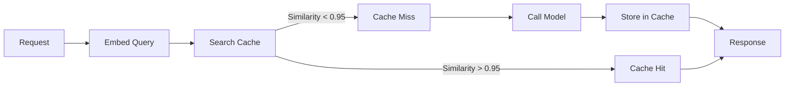

**Model Routing Decision Tree:**

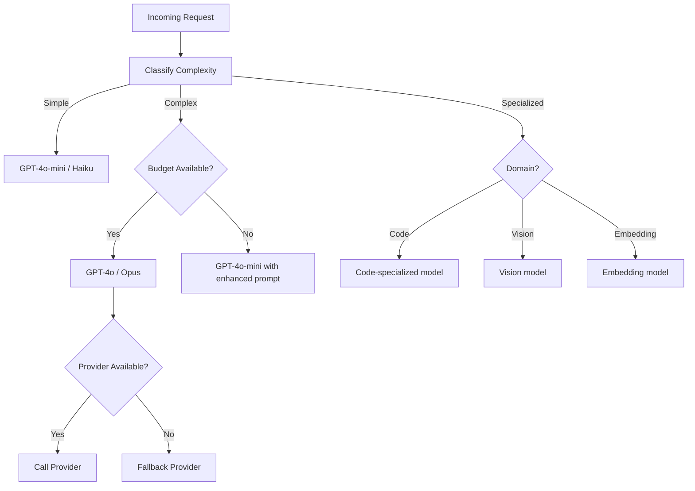

**Technology Options:**
- AI Gateway: LiteLLM, Portkey, Helicone, Azure AI Gateway, custom
- Semantic Cache: GPTCache, Redis + vector similarity, custom
- Guardrails: NeMo Guardrails, Guardrails AI, LLM Guard, custom
- Circuit Breaker: Resilience4j patterns, custom implementation

---

### Layer 4: Agent Orchestration Layer

**Purpose:** Manage the lifecycle of agent execution — planning, routing, state management, memory, and coordination between multiple agents.

**Components:**

| Component | Role | Key Considerations |
|-----------|------|-------------------|
| Agent Orchestrator | Manages overall execution flow | Timeout handling, retry logic, execution policies |
| Planner Agent | Decomposes goals into sub-tasks | Plan quality, re-planning on failure, plan validation |
| Executor Agents | Specialized agents for specific domains | Agent isolation, capability boundaries, trust levels |
| Agent Router | Routes tasks to appropriate specialized agent | Routing accuracy, load balancing, capability matching |
| Short-term Memory | Working memory for current conversation | Context window management, summarization |
| Long-term Memory | Persistent memory across conversations | Relevance decay, privacy, storage costs |
| State Machine | Tracks agent execution state | Persistence, recovery, visualization |

**Agent Topology Patterns:**

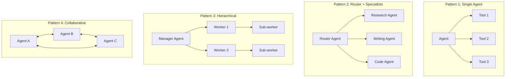

**Key Design Decisions:**

1. **Orchestration pattern:** Single agent vs. multi-agent? Static workflow vs. dynamic planning?
2. **Memory strategy:** What goes in short-term vs. long-term? How is relevance determined?
3. **State persistence:** Where is execution state stored? How do we recover from crashes?
4. **Agent boundaries:** What can each agent access? How are permissions scoped?
5. **Termination conditions:** Max iterations, token budget, time limit, confidence threshold
6. **Error recovery:** Retry? Re-plan? Escalate to human? Fail gracefully?

**Execution State Machine:**

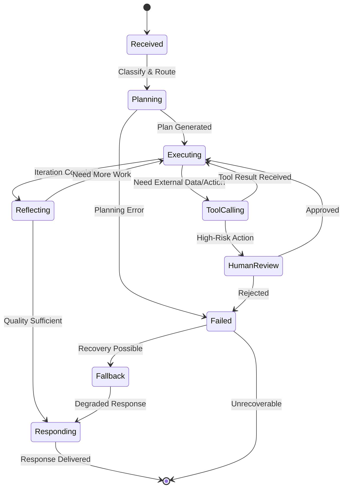

**Technology Options:**
- Orchestration: LangGraph, AutoGen, CrewAI, Semantic Kernel, custom
- State Management: Redis, PostgreSQL with JSONB, Temporal
- Memory: Mem0, Zep, custom vector-based memory
- Workflow: Temporal, Prefect, custom state machines

---

### Layer 5: RAG & Knowledge Layer

**Purpose:** Provide agents with relevant, accurate, and up-to-date information from organizational knowledge bases.

**Components:**

| Component | Role | Key Considerations |
|-----------|------|-------------------|
| Ingestion Pipeline | Extract and process documents from various sources | Format handling, scheduling, incremental updates |
| Chunking Engine | Split documents into optimal retrieval units | Chunk size, overlap, semantic boundaries |
| Embedding Service | Generate vector representations | Model selection, batching, versioning |
| Vector Store | Store and retrieve embeddings | Scalability, filtering, hybrid search |
| Re-ranking Service | Re-order retrieved results by relevance | Cross-encoder models, latency budget |
| Knowledge Graph | Structured relationships between entities | Entity resolution, relationship extraction |
| Hybrid Search | Combine vector + keyword + graph search | Fusion strategy, weight tuning |

**RAG Pipeline Architecture:**

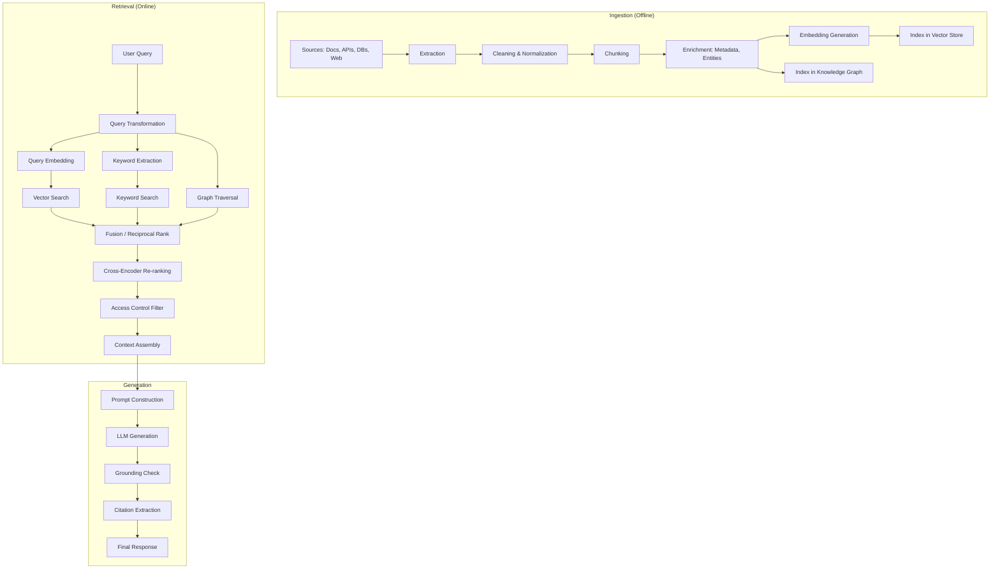

**Key Design Decisions:**

1. **Chunking strategy:**
   - Fixed size (512 tokens) — simple but may split semantic units
   - Semantic (by heading/paragraph) — preserves meaning but variable size
   - Recursive (split large, keep small) — balanced approach
   - Document-specific (code: by function, legal: by clause)

2. **Embedding model selection:**
   | Model | Dimensions | Speed | Quality | Cost |
   |-------|-----------|-------|---------|------|
   | text-embedding-3-large | 3072 | Medium | Highest | $$ |
   | text-embedding-3-small | 1536 | Fast | Good | $ |
   | Cohere embed-v3 | 1024 | Fast | High | $$ |
   | Open source (BGE, E5) | 768-1024 | Self-hosted | Good | Infrastructure |

3. **Retrieval strategy:**
   - Vector only: Fast, good for semantic similarity
   - Hybrid (vector + BM25): Better recall, handles exact terms
   - Graph-augmented: Best for relationship queries
   - Multi-step: Query → retrieve → refine query → retrieve again

4. **Freshness requirements:**
   - Real-time: Event-driven ingestion (< 1 min latency)
   - Near real-time: Streaming ingestion (< 15 min)
   - Batch: Scheduled ingestion (hourly/daily)
   - On-demand: Retrieve from source at query time

**Technology Options:**
- Vector Stores: Pinecone, Weaviate, Qdrant, Azure AI Search, pgvector, Chroma
- Embedding: OpenAI, Cohere, Voyage AI, HuggingFace models
- Knowledge Graph: Neo4j, Azure Cosmos DB (Gremlin), Amazon Neptune
- Orchestration: LlamaIndex, LangChain, Haystack, custom
- Re-ranking: Cohere Rerank, cross-encoder models, Jina

---

### Layer 6: Tool & Action Layer

**Purpose:** Enable agents to interact with external systems — read data, write data, execute code, call APIs — with proper authorization and validation.

**Components:**

| Component | Role | Key Considerations |
|-----------|------|-------------------|
| Tool Registry | Catalog of available tools with schemas | Discovery, versioning, documentation |
| Tool Validator | Validate tool calls before execution | Schema validation, parameter bounds, safety checks |
| Tool Executor | Execute validated tool calls | Timeout handling, sandboxing, retry logic |
| Tool Auth Manager | Manage credentials for tool access | Credential rotation, least privilege, audit |
| External APIs | Third-party service integrations | Rate limits, SLAs, failure handling |
| Databases | Direct data access | Query validation, read vs. write permissions |
| Task Queues | Async long-running operations | Status tracking, timeout, callback |
| Code Executor | Sandboxed code execution | Security isolation, resource limits, language support |

**Tool Execution Flow:**

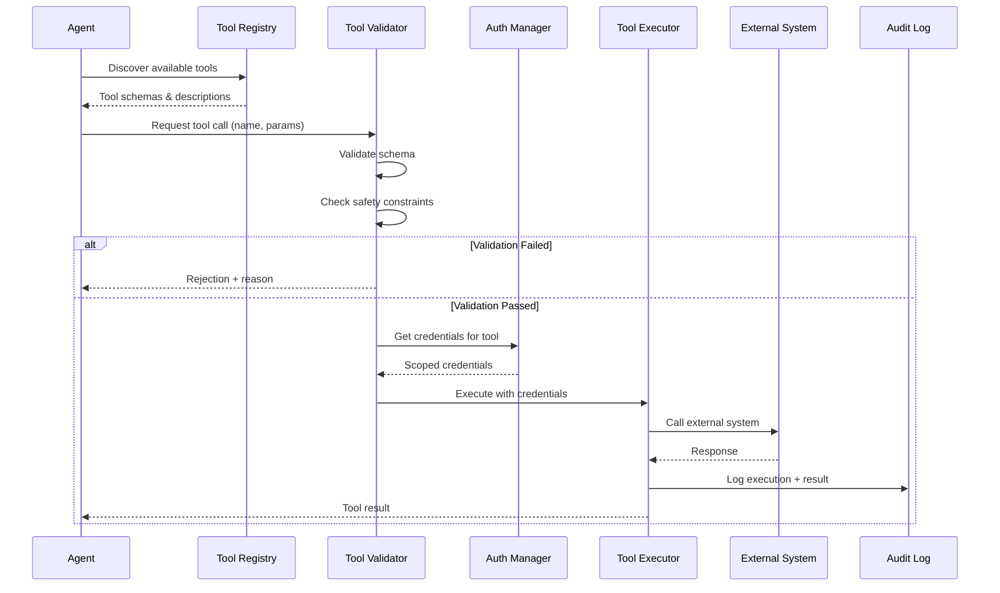

**Key Design Decisions:**

1. **Tool permission model:**
   - Per-agent: Each agent has a defined set of tools it can access
   - Per-user: Tools available depend on the user's permissions
   - Per-action: Read tools freely, write tools require approval
   - Dynamic: Agent can request access, subject to policy evaluation

2. **Execution safety:**
   - Sandboxed execution for code tools (containers, VMs, Firecracker)
   - Parameter validation against schemas
   - Output size limits
   - Timeout enforcement
   - Rate limiting per tool

3. **Idempotency:** Design tools to be safely retryable. If an agent retries a tool call, it shouldn't create duplicate effects.

4. **Async operations:** Long-running tools (> 30s) should use async patterns with status polling or callbacks.

**Technology Options:**
- Tool Framework: OpenAI function calling, Anthropic tool use, custom schemas
- Code Execution: E2B, Modal, AWS Lambda, Docker containers
- API Integration: Custom connectors, Zapier, Make
- Queues: AWS SQS, Azure Service Bus, RabbitMQ, Redis Streams

---

### Layer 7: Model Layer

**Purpose:** Host and serve the AI models that power reasoning, generation, embedding, classification, and specialized tasks.

**Components:**

| Component | Role | Key Considerations |
|-----------|------|-------------------|
| Primary LLM | Main reasoning and generation model | Quality, cost, rate limits, context window |
| Secondary LLM | Cheaper/faster model for simple tasks | Cost savings, latency improvement |
| Specialized Models | Domain-specific fine-tuned models | Training data, evaluation, versioning |
| Embedding Models | Vector representations for RAG | Dimension size, speed, quality |
| Classification Models | Intent detection, routing, moderation | Accuracy, latency, categories |
| Fine-tuned Models | Custom models for specific behaviors | Training pipeline, evaluation, drift |

**Model Selection Matrix:**

| Use Case | Recommended Models | Tradeoff |
|----------|-------------------|----------|
| Complex reasoning | GPT-4o, Claude Opus/Sonnet, Gemini Pro | Highest quality, highest cost |
| Simple Q&A | GPT-4o-mini, Claude Haiku, Gemini Flash | Good quality, low cost |
| Code generation | GPT-4o, Claude Sonnet, DeepSeek Coder | Code-specific optimization |
| Summarization | GPT-4o-mini, Claude Haiku | Speed, cost efficiency |
| Classification | Fine-tuned smaller models, GPT-4o-mini | Latency, consistency |
| Embedding | text-embedding-3-small/large, Cohere | Quality vs. dimension size |
| Vision | GPT-4o, Claude Sonnet, Gemini Pro | Multimodal capability |
| Long context | Gemini (1M), Claude (200K), GPT-4o (128K) | Context window size |

**Key Design Decisions:**

1. **Self-hosted vs. API:** Trade control and cost predictability against operational burden
2. **Model versioning:** Pin to specific versions? Auto-upgrade? A/B test new versions?
3. **Fallback chains:** Primary → Secondary → Tertiary with degradation expectations
4. **Fine-tuning threshold:** When does fine-tuning provide enough value over prompting?
5. **Multi-provider strategy:** Distribute across providers for resilience and leverage

**Technology Options:**
- Commercial APIs: OpenAI, Anthropic, Google, Cohere, Mistral
- Self-hosted: vLLM, TGI, Ollama, NVIDIA NIM
- Fine-tuning: OpenAI fine-tuning, Azure AI Studio, Anyscale
- Evaluation: OpenAI Evals, Braintrust, custom

---

### Layer 8: Evaluation & Observability

**Purpose:** Continuously measure quality, detect issues, and provide visibility into system behavior.

**Components:**

| Component | Role | Key Considerations |
|-----------|------|-------------------|
| Evaluation Engine | Automated quality assessment | Eval dataset management, scoring rubrics |
| Distributed Tracing | End-to-end request tracing through all layers | Trace propagation, sampling, storage |
| Metrics Collector | Quantitative measurements | Latency, throughput, cost, quality scores |
| Structured Logging | Detailed event records | Schema, retention, searchability |
| Alerting System | Proactive issue notification | Threshold tuning, escalation, noise reduction |
| Dashboards | Visual operational awareness | Real-time vs. historical, drill-down capability |
| Quality Scorer | Real-time quality estimation | Online evaluation, confidence scoring |

**Observability Architecture:**

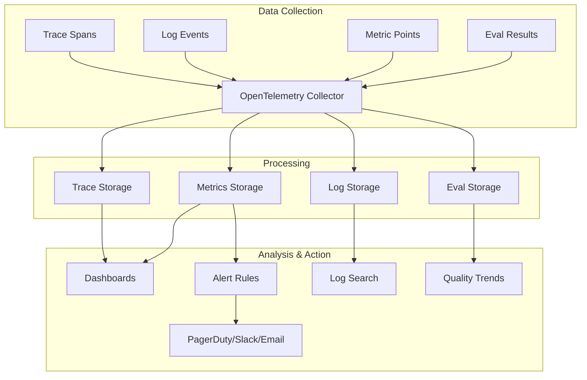

**Key Metrics to Track:**

| Category | Metric | Target |
|----------|--------|--------|
| Latency | Time to first token | < 1s |
| Latency | Total response time | < 5s (simple), < 30s (complex) |
| Quality | Evaluation score | > 0.85 |
| Quality | Hallucination rate | < 2% |
| Quality | User satisfaction (thumbs up/down) | > 80% positive |
| Cost | Cost per interaction | Within budget |
| Cost | Token efficiency (useful output / total tokens) | > 0.4 |
| Reliability | Success rate | > 99.5% |
| Reliability | Circuit breaker activations | < 1/hour |
| Safety | Guardrail trigger rate | Monitor trend |
| Safety | Prompt injection attempts blocked | 100% |

**Evaluation Dimensions:**

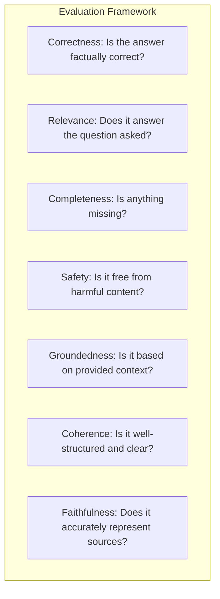

**Technology Options:**
- Tracing: Langfuse, LangSmith, Phoenix (Arize), Helicone, OpenTelemetry
- Metrics: Prometheus, Datadog, Azure Monitor
- Evaluation: Braintrust, Ragas, DeepEval, custom
- Dashboards: Grafana, Datadog, custom
- Alerting: PagerDuty, OpsGenie, custom

---

### Layer 9: Governance & Compliance

**Purpose:** Ensure AI systems operate within legal, ethical, and organizational boundaries with full auditability.

**Components:**

| Component | Role | Key Considerations |
|-----------|------|-------------------|
| Audit Log | Immutable record of all AI decisions and actions | Completeness, tamper-proofing, retention |
| Policy Engine | Enforce organizational AI policies | Policy-as-code, version control, testing |
| PII Detector | Identify and handle personal information | Detection accuracy, handling strategies |
| Consent Manager | Track user consent for AI processing | Granularity, withdrawal, propagation |
| Data Lineage | Track data from source through AI processing | Provenance, transformation tracking |
| Explainability Engine | Generate explanations for AI decisions | Level of detail, audience, format |

**Governance Data Flow:**

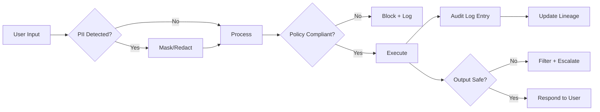

**Key Design Decisions:**

1. **Audit granularity:** Log every LLM call? Every tool call? Every reasoning step?
2. **Retention policy:** How long to keep AI interaction logs? (Regulatory requirements vary)
3. **PII handling:** Mask before sending to LLM? Use data residency controls?
4. **Explainability depth:** User-facing explanations vs. auditor-facing explanations
5. **Policy enforcement:** Block vs. warn vs. log-and-allow

**Technology Options:**
- Audit: Immutable append-only stores, Azure Immutable Blob, AWS QLDB
- Policy: OPA (Open Policy Agent), custom policy engines
- PII: Microsoft Presidio, AWS Comprehend, Azure AI Language
- Lineage: Apache Atlas, custom metadata stores
- Compliance: OneTrust, custom frameworks

---

## Cross-Cutting Concerns

### Security Throughout

```
Layer 1 (Users):       TLS, input sanitization, CSRF protection
Layer 2 (Edge):        WAF, DDoS protection, authentication
Layer 3 (AI Gateway):  Prompt injection detection, output filtering
Layer 4 (Orchestration): Agent isolation, permission boundaries
Layer 5 (RAG):         Access control on documents, query filtering
Layer 6 (Tools):       Least privilege, credential management
Layer 7 (Models):      Data residency, content filtering
Layer 8 (Observability): Sensitive data redaction in logs
Layer 9 (Governance):  Audit trails, compliance evidence
```

### Cost Flow

```
User Request
  → API Gateway:        ~$0.00001 (infrastructure)
  → AI Gateway:         ~$0.0001 (compute for routing/caching)
  → Cache Hit:          ~$0.0001 (embedding for similarity)
  → Cache Miss → LLM:   $0.001 - $0.10 (depending on model/tokens)
  → RAG Retrieval:      ~$0.001 (embedding + vector search)
  → Tool Execution:     $0.00 - $1.00+ (depending on tool)
  → Evaluation:         ~$0.001 (if using LLM-as-judge)
  
  Total per interaction: $0.005 - $0.50 typical
  At 1M requests/day:    $5,000 - $500,000/day
```

### Latency Budget

```
Total budget: 5000ms (typical conversational AI)

Breakdown:
  Network (user → gateway):     50ms
  Auth + Rate Limiting:          20ms
  Input Guardrails:              100ms
  Cache Check:                   30ms
  RAG Retrieval:                 200-500ms
  LLM Generation:                1000-3000ms
  Output Guardrails:             100ms
  Tool Execution (if needed):    500-2000ms
  Network (gateway → user):     50ms

Strategy: Use streaming to return first tokens while generation continues
```

---

## Deployment Topology

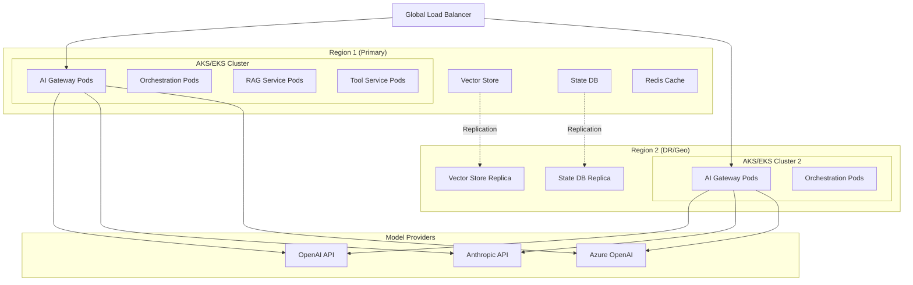

---

## Summary

This reference architecture provides a complete blueprint for production agentic AI systems. Every layer addresses specific concerns:

1. **Users & Channels** — Multi-channel access
2. **Edge & Access** — Security and access control
3. **AI Gateway** — Model management, caching, guardrails, cost control
4. **Agent Orchestration** — Planning, execution, memory, state
5. **RAG & Knowledge** — Context and grounding
6. **Tools & Actions** — External interactions
7. **Models** — AI computation
8. **Evaluation & Observability** — Quality and visibility
9. **Governance & Compliance** — Safety and accountability

The architecture is designed to be **modular** — teams can implement layers independently, **evolvable** — components can be swapped as technology improves, and **scalable** — each layer scales independently based on demand.
