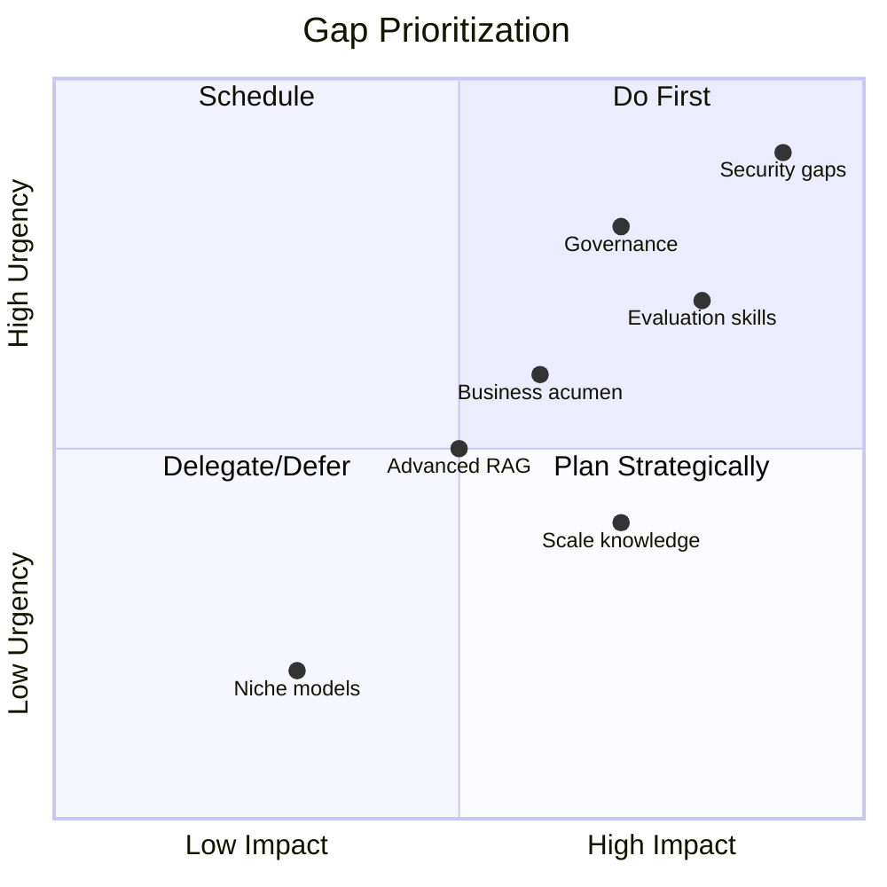

# AI Architect Self-Assessment Framework

## How to Use This Assessment

Rate yourself on each competency using:
- **0 - No knowledge:** Haven't encountered this topic
- **1 - Awareness:** Know it exists, can't apply it
- **2 - Basic understanding:** Can explain concepts, limited practical experience
- **3 - Proficient:** Can apply independently in standard scenarios
- **4 - Advanced:** Can apply in complex scenarios, teach others, make tradeoff decisions
- **5 - Expert:** Can innovate, design novel solutions, influence industry practices

**Target scores by level:**
- Beginner (Junior AI Engineer): Average 1-2 across beginner competencies
- Intermediate (Mid-Level AI Engineer): Average 3+ across intermediate competencies
- Advanced (Senior AI Engineer): Average 3+ across advanced competencies
- Staff/Principal (AI Architect): Average 4+ across all competencies

---

## Level 1: Beginner Competencies

### 1.1 LLM Fundamentals

| # | Competency | Score (0-5) | Evidence/Notes |
|---|-----------|-------------|----------------|
| 1 | Understand transformer architecture at a conceptual level | | |
| 2 | Explain tokens, tokenization, and context windows | | |
| 3 | Understand temperature, top-p, and other generation parameters | | |
| 4 | Know the difference between completion and chat models | | |
| 5 | Call LLM APIs (OpenAI, Anthropic, etc.) programmatically | | |
| 6 | Handle streaming responses | | |
| 7 | Understand model families (GPT, Claude, Gemini, Llama, Mistral) | | |
| 8 | Explain the difference between open and closed models | | |
| 9 | Understand basic cost structure (input/output tokens) | | |
| 10 | Know what fine-tuning is and when it might be useful | | |

### 1.2 Prompt Engineering Basics

| # | Competency | Score (0-5) | Evidence/Notes |
|---|-----------|-------------|----------------|
| 11 | Write effective system prompts | | |
| 12 | Use few-shot examples effectively | | |
| 13 | Apply chain-of-thought prompting | | |
| 14 | Structure prompts with clear instructions and constraints | | |
| 15 | Handle different output formats (JSON, markdown, structured) | | |
| 16 | Debug prompt failures and iterate | | |
| 17 | Understand prompt injection risks at a basic level | | |

### 1.3 Basic RAG

| # | Competency | Score (0-5) | Evidence/Notes |
|---|-----------|-------------|----------------|
| 18 | Explain what RAG is and why it's needed | | |
| 19 | Understand vector embeddings conceptually | | |
| 20 | Use a vector database (Pinecone, Chroma, pgvector, etc.) | | |
| 21 | Implement basic document chunking | | |
| 22 | Build a simple retrieve-then-generate pipeline | | |
| 23 | Understand similarity search (cosine similarity, etc.) | | |
| 24 | Know the difference between vector and keyword search | | |

### 1.4 Basic Agent Concepts

| # | Competency | Score (0-5) | Evidence/Notes |
|---|-----------|-------------|----------------|
| 25 | Understand what an AI agent is vs. a simple LLM call | | |
| 26 | Implement function/tool calling with an LLM | | |
| 27 | Build a basic ReAct loop (Reason + Act) | | |
| 28 | Define tools with proper schemas | | |
| 29 | Handle tool call results and feed back to the model | | |
| 30 | Use a framework (LangChain, LlamaIndex, Semantic Kernel) | | |

**Beginner Total: ___ / 150**

---

## Level 2: Intermediate Competencies

### 2.1 Advanced RAG

| # | Competency | Score (0-5) | Evidence/Notes |
|---|-----------|-------------|----------------|
| 31 | Implement hybrid search (vector + keyword + filters) | | |
| 32 | Apply re-ranking (cross-encoders, Cohere Rerank) | | |
| 33 | Design effective chunking strategies (semantic, recursive, document-aware) | | |
| 34 | Implement query transformation (expansion, decomposition, HyDE) | | |
| 35 | Handle multi-modal documents (tables, images, code) | | |
| 36 | Implement metadata filtering for access control | | |
| 37 | Evaluate RAG quality (precision, recall, faithfulness, relevance) | | |
| 38 | Optimize embedding model selection for use case | | |
| 39 | Design incremental indexing pipelines | | |
| 40 | Implement citation/source tracking | | |

### 2.2 Agent Architecture

| # | Competency | Score (0-5) | Evidence/Notes |
|---|-----------|-------------|----------------|
| 41 | Design multi-step agent workflows with error handling | | |
| 42 | Implement agent memory (conversation, summary, entity) | | |
| 43 | Build multi-agent systems with delegation | | |
| 44 | Design agent routing (classify and dispatch) | | |
| 45 | Implement proper termination conditions (max iterations, budgets) | | |
| 46 | Handle partial failures in agent workflows | | |
| 47 | Design human-in-the-loop approval flows | | |
| 48 | Implement structured output parsing and validation | | |
| 49 | Build stateful workflows that can pause and resume | | |
| 50 | Choose appropriate orchestration patterns for given problems | | |

### 2.3 Model Selection & Management

| # | Competency | Score (0-5) | Evidence/Notes |
|---|-----------|-------------|----------------|
| 51 | Compare models on quality, cost, latency, and context window | | |
| 52 | Implement model routing based on task complexity | | |
| 53 | Design fallback chains across providers | | |
| 54 | Understand when to fine-tune vs. prompt engineer | | |
| 55 | Set up model evaluation benchmarks | | |
| 56 | Manage prompt versions alongside model versions | | |
| 57 | Calculate and optimize token costs | | |

### 2.4 Security Basics for AI

| # | Competency | Score (0-5) | Evidence/Notes |
|---|-----------|-------------|----------------|
| 58 | Implement input validation and sanitization | | |
| 59 | Detect and prevent basic prompt injection | | |
| 60 | Filter sensitive data from model inputs/outputs | | |
| 61 | Implement rate limiting for AI endpoints | | |
| 62 | Understand data residency implications of model API calls | | |
| 63 | Implement proper API key management | | |
| 64 | Design basic audit logging for AI interactions | | |

### 2.5 Evaluation & Testing

| # | Competency | Score (0-5) | Evidence/Notes |
|---|-----------|-------------|----------------|
| 65 | Design evaluation datasets for AI systems | | |
| 66 | Implement automated evaluation (LLM-as-judge, metrics) | | |
| 67 | Run regression tests on prompt/model changes | | |
| 68 | Measure and track quality over time | | |
| 69 | Test edge cases and adversarial inputs | | |
| 70 | Set up CI/CD with evaluation gates | | |

**Intermediate Total: ___ / 200**

---

## Level 3: Advanced Competencies

### 3.1 Production AI Systems

| # | Competency | Score (0-5) | Evidence/Notes |
|---|-----------|-------------|----------------|
| 71 | Design end-to-end AI Gateway architecture | | |
| 72 | Implement semantic caching with appropriate invalidation | | |
| 73 | Design circuit breakers for model provider failures | | |
| 74 | Implement streaming architectures for real-time AI | | |
| 75 | Design token budget management and enforcement | | |
| 76 | Build observability for AI (traces, metrics, quality scores) | | |
| 77 | Implement gradual rollout for model/prompt changes | | |
| 78 | Design for multi-region deployment with data residency | | |
| 79 | Handle model deprecation and migration | | |
| 80 | Design cost attribution and chargeback models | | |

### 3.2 Advanced Security & Safety

| # | Competency | Score (0-5) | Evidence/Notes |
|---|-----------|-------------|----------------|
| 81 | Conduct threat modeling for agentic AI systems | | |
| 82 | Design defense-in-depth for prompt injection | | |
| 83 | Implement output content safety classification | | |
| 84 | Design tool permission models (least privilege for agents) | | |
| 85 | Implement data loss prevention for AI outputs | | |
| 86 | Design red-teaming and adversarial evaluation | | |
| 87 | Implement anomaly detection on AI behavior | | |
| 88 | Design sandboxed execution for agent code/actions | | |
| 89 | Handle indirect prompt injection (from retrieved content) | | |
| 90 | Design explainability and transparency mechanisms | | |

### 3.3 Data Architecture for AI

| # | Competency | Score (0-5) | Evidence/Notes |
|---|-----------|-------------|----------------|
| 91 | Design knowledge graph architectures for AI grounding | | |
| 92 | Implement real-time data ingestion for RAG freshness | | |
| 93 | Design data quality monitoring for knowledge bases | | |
| 94 | Implement data lineage from source to AI output | | |
| 95 | Design context management for long conversations | | |
| 96 | Implement tiered memory systems (working/short/long-term) | | |
| 97 | Design embedding versioning and migration strategies | | |
| 98 | Handle data governance across AI pipelines | | |
| 99 | Implement consent-aware data processing | | |
| 100 | Design for data deletion (right to be forgotten) in vector stores | | |

### 3.4 Scale & Performance

| # | Competency | Score (0-5) | Evidence/Notes |
|---|-----------|-------------|----------------|
| 101 | Design for high-throughput AI serving (1M+ requests/day) | | |
| 102 | Optimize end-to-end latency for conversational AI | | |
| 103 | Design auto-scaling policies for AI workloads | | |
| 104 | Implement load balancing across model providers | | |
| 105 | Design batch processing for non-real-time AI tasks | | |
| 106 | Optimize vector store performance at scale | | |
| 107 | Design capacity planning models for AI systems | | |
| 108 | Implement priority queuing for different request types | | |

### 3.5 Evaluation at Scale

| # | Competency | Score (0-5) | Evidence/Notes |
|---|-----------|-------------|----------------|
| 109 | Design continuous evaluation pipelines (not just dev-time) | | |
| 110 | Implement multi-dimensional quality scoring | | |
| 111 | Design A/B testing frameworks for AI systems | | |
| 112 | Build feedback loops from user signals to improvement | | |
| 113 | Implement automated regression detection and alerting | | |
| 114 | Design evaluation for multi-agent systems | | |
| 115 | Measure business impact of AI quality changes | | |

**Advanced Total: ___ / 225**

---

## Level 4: Staff/Principal Competencies

### 4.1 Architecture & Strategy

| # | Competency | Score (0-5) | Evidence/Notes |
|---|-----------|-------------|----------------|
| 116 | Define organization-wide AI platform architecture | | |
| 117 | Create reference architectures that multiple teams adopt | | |
| 118 | Design AI governance frameworks | | |
| 119 | Make build-vs-buy decisions for AI infrastructure | | |
| 120 | Define multi-year AI technology roadmaps | | |
| 121 | Design for paradigm shifts (new model capabilities, new patterns) | | |
| 122 | Balance innovation velocity with operational stability | | |
| 123 | Define architectural fitness functions for AI systems | | |
| 124 | Design platform APIs and SDKs for internal AI consumers | | |
| 125 | Create architecture decision frameworks for teams | | |

### 4.2 Business & Organizational Leadership

| # | Competency | Score (0-5) | Evidence/Notes |
|---|-----------|-------------|----------------|
| 126 | Translate technical AI capabilities into business value | | |
| 127 | Present architecture decisions to executive leadership | | |
| 128 | Influence vendor strategy and negotiations | | |
| 129 | Define AI ethics and responsible AI policies | | |
| 130 | Navigate regulatory requirements across jurisdictions | | |
| 131 | Drive technical due diligence for AI acquisitions/partnerships | | |
| 132 | Create career frameworks and growth paths for AI engineers | | |
| 133 | Design organizational structures for AI teams | | |
| 134 | Balance centralized platform vs. distributed AI teams | | |
| 135 | Manage technical debt in rapidly evolving AI systems | | |

### 4.3 Advanced Platform Engineering

| # | Competency | Score (0-5) | Evidence/Notes |
|---|-----------|-------------|----------------|
| 136 | Design self-service AI platforms for development teams | | |
| 137 | Implement FinOps for AI (cost visibility, optimization, forecasting) | | |
| 138 | Design multi-tenant AI platforms with isolation | | |
| 139 | Implement AI model marketplaces/registries | | |
| 140 | Design disaster recovery for AI systems | | |
| 141 | Implement blue-green deployments for model updates | | |
| 142 | Design feature flag systems for AI behavior | | |
| 143 | Implement compliance automation (audit evidence generation) | | |
| 144 | Design SLO/SLA frameworks specific to AI systems | | |
| 145 | Build internal developer experience for AI (docs, templates, tools) | | |

### 4.4 Cross-Cutting Expertise

| # | Competency | Score (0-5) | Evidence/Notes |
|---|-----------|-------------|----------------|
| 146 | Apply the 4 Architecture Views framework to any AI system | | |
| 147 | Conduct architecture reviews for AI systems | | |
| 148 | Design migration paths from current to target architecture | | |
| 149 | Evaluate emerging AI technologies for organizational fit | | |
| 150 | Design composable AI architectures (modular, reusable) | | |
| 151 | Apply principles from distributed systems to agentic AI | | |
| 152 | Design for testability in non-deterministic systems | | |
| 153 | Balance safety constraints with user experience | | |
| 154 | Design graceful degradation across the full AI stack | | |
| 155 | Create incident response playbooks for AI-specific failures | | |

**Staff/Principal Total: ___ / 200**

---

## Overall Score Summary

| Level | Your Score | Max Score | Percentage | Target |
|-------|-----------|-----------|------------|--------|
| Beginner | ___ | 150 | ___% | >60% to advance |
| Intermediate | ___ | 200 | ___% | >60% to advance |
| Advanced | ___ | 225 | ___% | >60% to advance |
| Staff/Principal | ___ | 200 | ___% | >80% for staff role |
| **TOTAL** | ___ | **775** | ___% | |

---

## How to Identify and Close Gaps

### Step 1: Score Honestly

Rate yourself based on **demonstrated ability**, not theoretical knowledge. Ask:
- Have I done this in a production system?
- Could I design this from scratch without looking things up?
- Could I teach someone else to do this?
- Could I debate tradeoffs in this area with confidence?

### Step 2: Identify Patterns

Look for clusters of low scores:

| Pattern | Interpretation | Priority |
|---------|---------------|----------|
| Low across one view (e.g., all Data View items) | Missing domain expertise | High - focused study |
| Low on all "design" items but high on "implement" | Developer mindset, need architectural thinking | High - practice design exercises |
| Low on security/governance | Common gap, high risk | Critical - address immediately |
| Low on business items | Technical focus without business context | Medium - seek stakeholder exposure |
| Low on scale/performance | May not have worked at scale | Medium - study + practice |

### Step 3: Create a Learning Plan

For each gap cluster, define:

1. **Learning resources:** What to study (this curriculum covers all areas)
2. **Practice activities:** What to build or design
3. **Validation method:** How to prove competency gained
4. **Timeline:** Realistic deadlines

### Step 4: Prioritize

Use this priority framework:

**Priority order:**
1. Security and safety gaps (highest risk if missing)
2. Evaluation gaps (can't improve what you can't measure)
3. Architecture and design gaps (foundational for the role)
4. Business and governance gaps (needed for influence)
5. Advanced technical gaps (depth after breadth)

### Step 5: Reassess Quarterly

- Retake this assessment every 3 months
- Track score progression over time
- Adjust learning plan based on new gaps or changed priorities
- Celebrate progress and set new stretch goals

---

## Evidence Collection Guide

For each competency where you claim proficiency (3+), document evidence:

| Evidence Type | Example |
|--------------|---------|
| **Built it** | "Designed and deployed semantic caching for our AI gateway, reducing costs 40%" |
| **Documented it** | "Wrote ADR for multi-agent architecture selection" |
| **Taught it** | "Led workshop on RAG evaluation for 20 engineers" |
| **Decided it** | "Selected vector store based on 5-factor evaluation matrix" |
| **Recovered from it** | "Diagnosed and resolved cascading failure in agent orchestration" |
| **Reviewed it** | "Conducted architecture review that identified 3 critical security gaps" |

---

## Recommended Learning Path Through This Curriculum

Based on your self-assessment, follow this path:

| Your Level | Start With | Focus On | Time Estimate |
|-----------|------------|----------|---------------|
| Beginner (0-2 avg) | Module 01-04 | Fundamentals, basic RAG, basic agents | 4-6 weeks |
| Intermediate (2-3 avg) | Module 05-08 | Production patterns, security, evaluation | 4-6 weeks |
| Advanced (3-4 avg) | Module 09-12 | Scale, governance, platform design | 4-6 weeks |
| Staff-track (4+ avg) | Module 13-15 | Strategy, leadership, reference architectures | Ongoing |

---

## Final Note

This assessment is a **tool for growth**, not a judgment. The field of AI architecture is new and evolving rapidly. Nobody scores 5 on everything. The goal is to:

1. Know where you are
2. Know where you need to be
3. Have a plan to get there
4. Execute consistently

The best AI architects are perpetual learners who combine deep technical expertise with business acumen, security mindset, and operational discipline.
