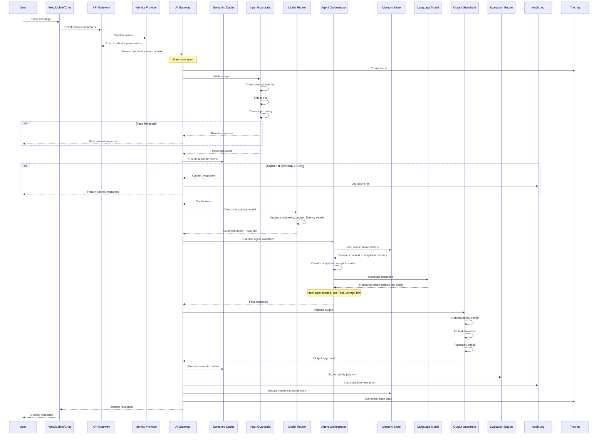
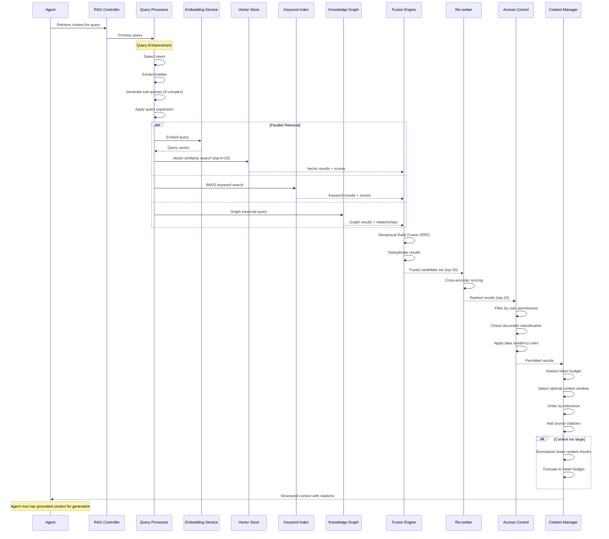
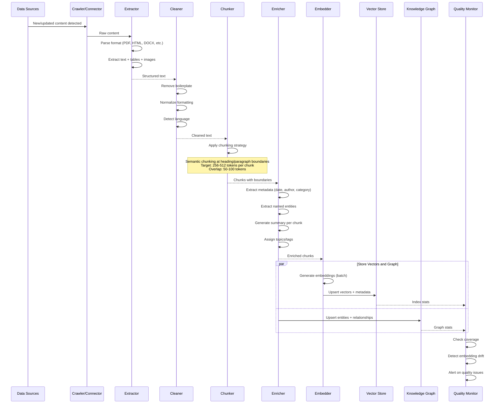
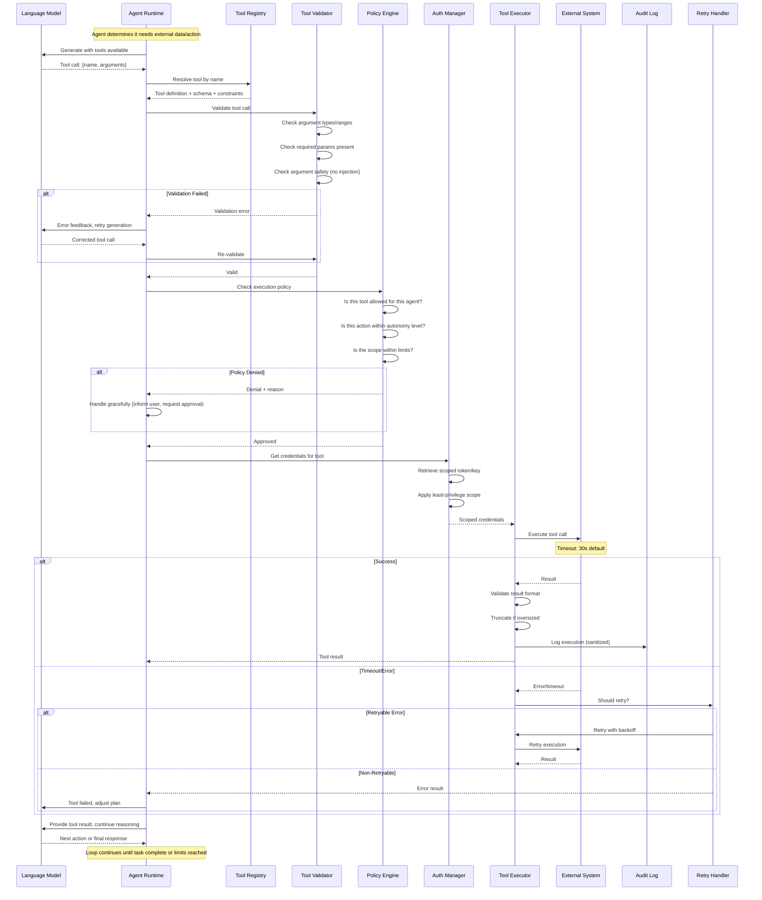
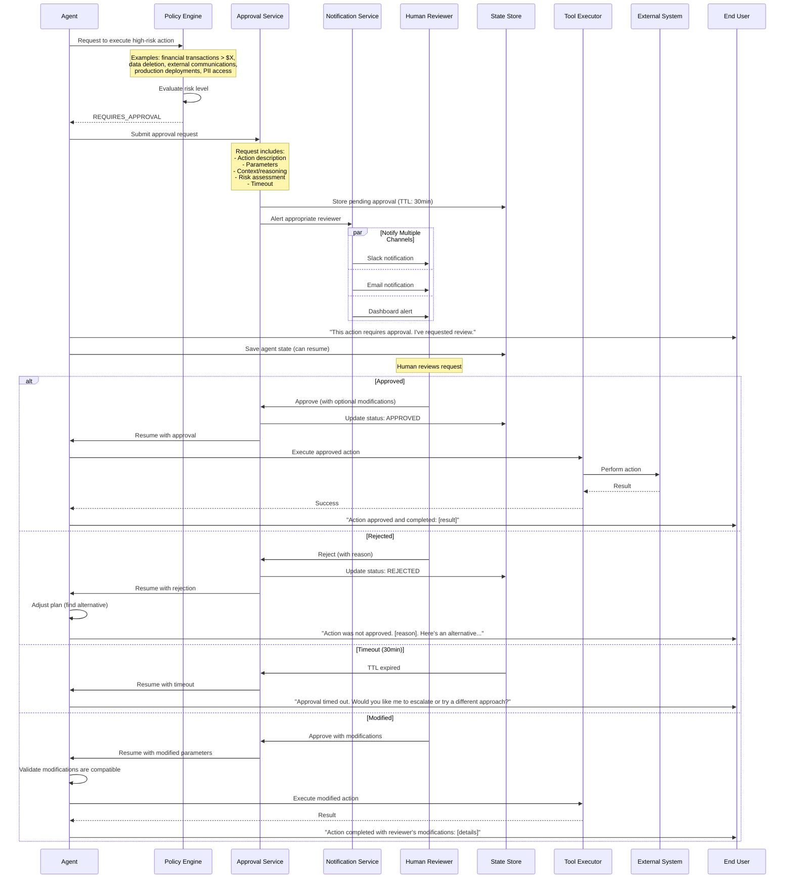
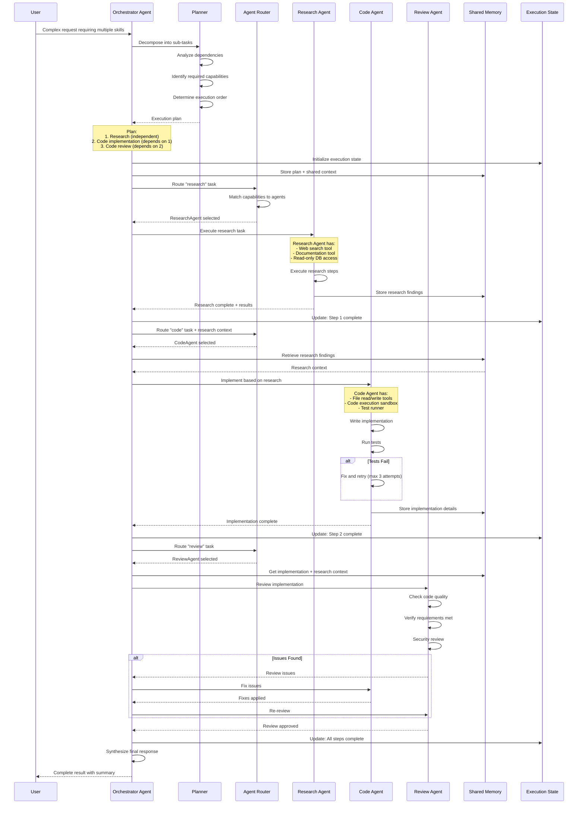
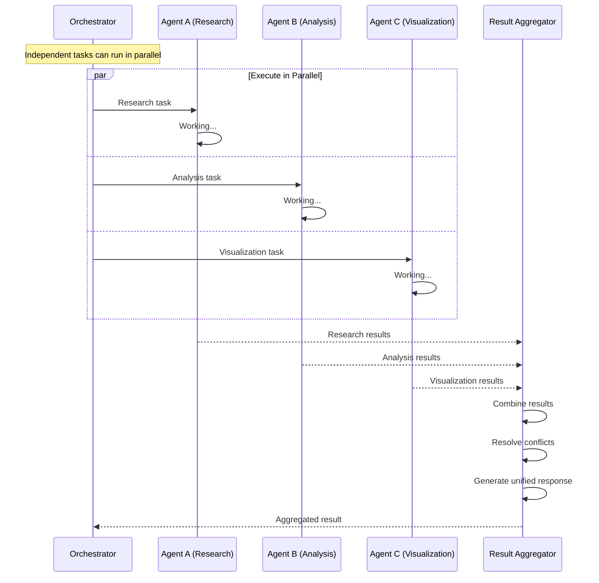
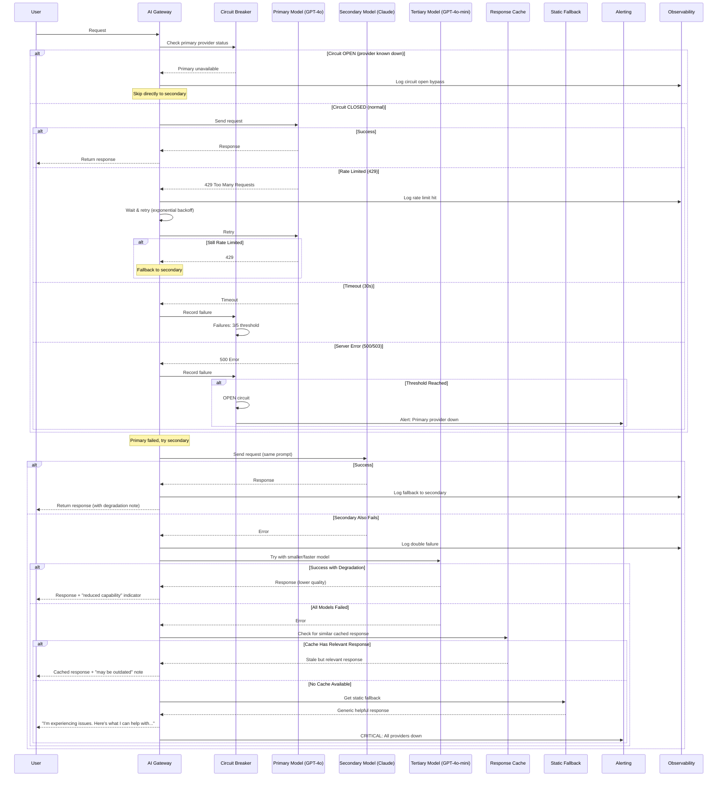
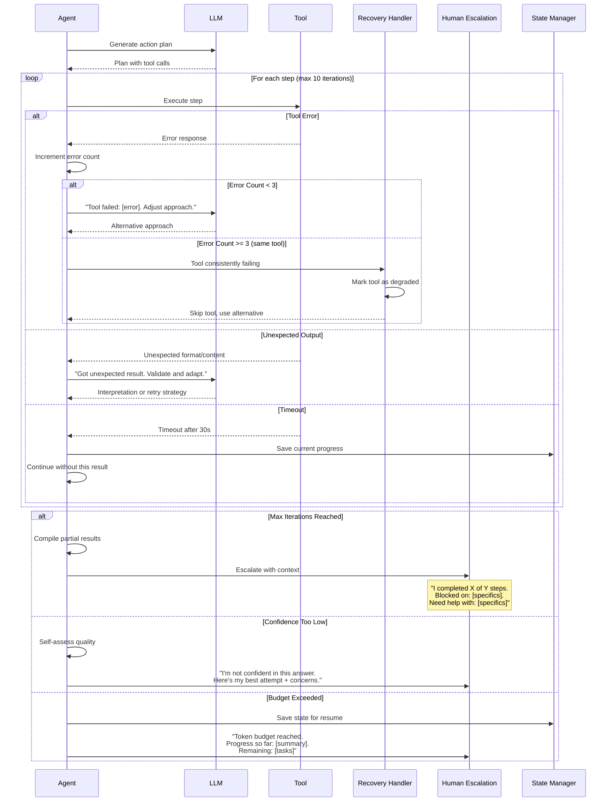
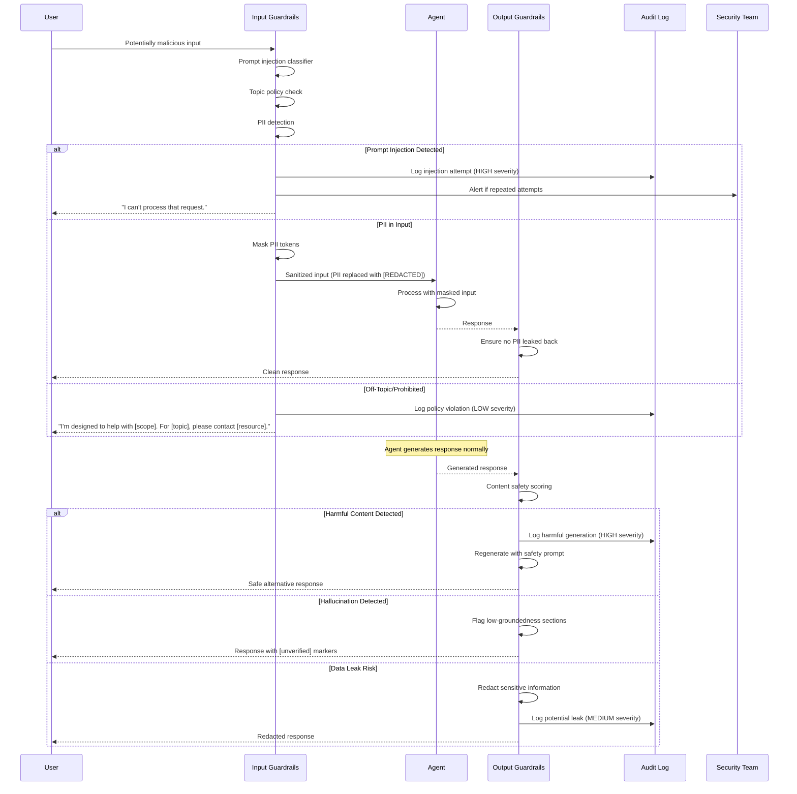

# Sequence Diagrams: Agentic AI System Flows

## 1. End-to-End Request Flow (User → Response)

This diagram shows the complete lifecycle of a user request through all architectural layers.

---

## 2. RAG Retrieval Flow

Detailed flow of how context is retrieved from knowledge bases to ground agent responses.

### RAG Ingestion Flow (Offline)

---

## 3. Agent Tool-Calling Flow

How an agent discovers, validates, and executes tools during task completion.

---

## 4. Human-in-the-Loop Approval Flow

How the system handles high-risk actions that require human approval before execution.

---

## 5. Multi-Agent Delegation Flow

How a supervisor/orchestrator agent decomposes tasks and delegates to specialized sub-agents.

### Parallel Multi-Agent Execution

---

## 6. Error & Fallback Flow

How the system handles various failure modes gracefully.

### Agent-Level Error Recovery

### Guardrail Violation Flow

---

## Summary of Key Patterns

| Flow | Key Architectural Insight |
|------|--------------------------|
| End-to-End | Every request passes through multiple validation and control points |
| RAG | Retrieval is a multi-strategy pipeline, not a single vector search |
| Tool Calling | Every tool call goes through validation, policy, auth, and audit |
| Human-in-the-Loop | The system can pause, persist state, and resume after approval |
| Multi-Agent | Orchestration manages dependencies, parallelism, and aggregation |
| Error/Fallback | Multiple fallback levels ensure graceful degradation, never silent failure |
