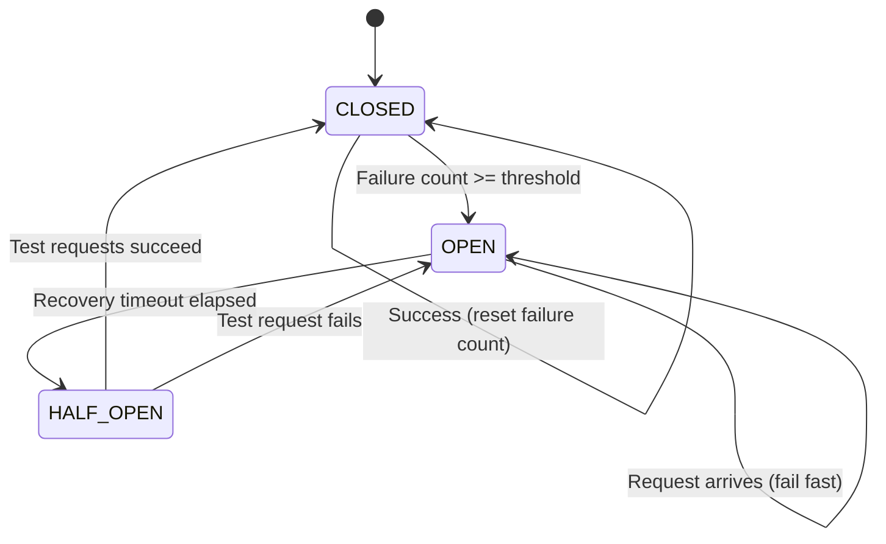
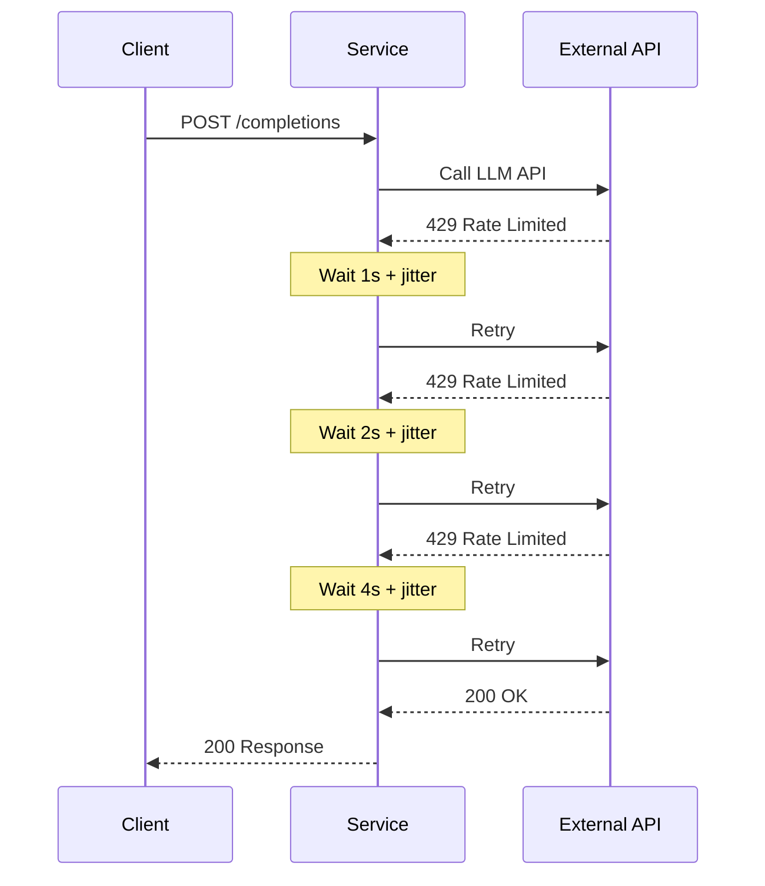
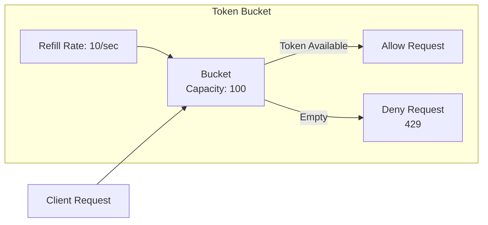
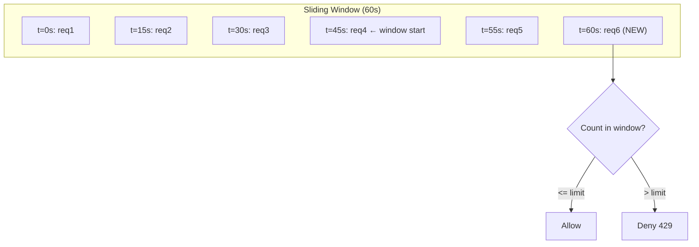
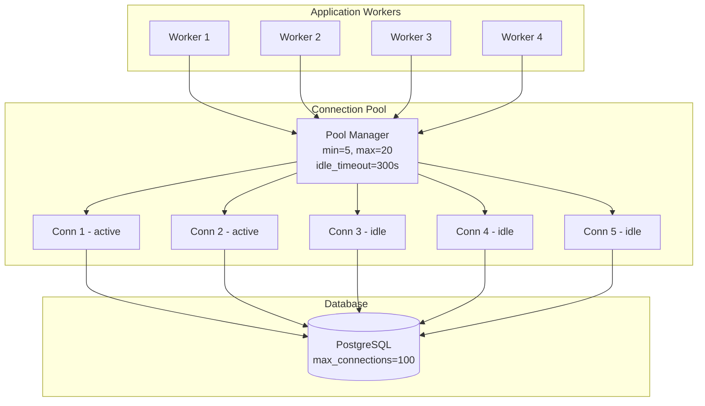
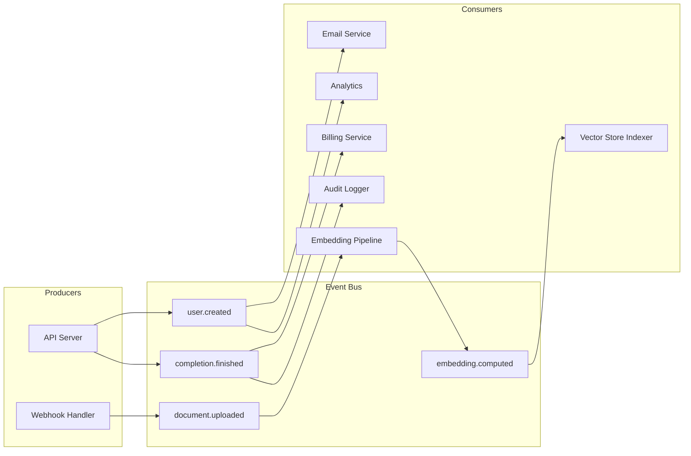
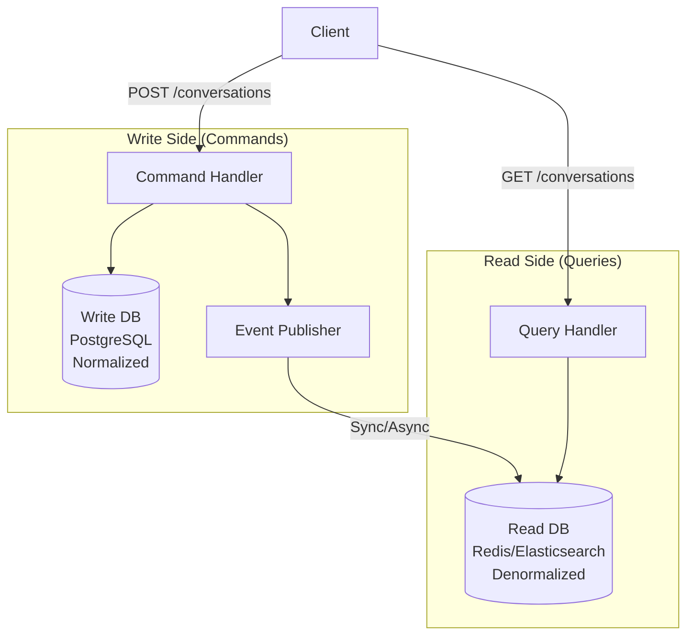
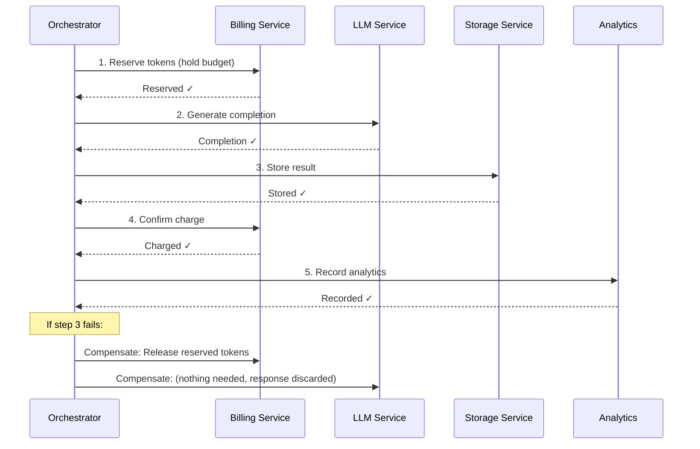

# Architecture Patterns for AI Systems

## 1. Circuit Breaker Pattern

Prevents cascading failures when external services (LLM APIs, vector DBs) are down.



**When to use in AI systems:**
- Wrapping OpenAI/Anthropic API calls
- Wrapping vector database queries (Pinecone, Weaviate)
- Wrapping embedding service calls
- Any external dependency with variable availability

**Implementation considerations:**
- Per-service breakers (separate breaker for each LLM provider)
- Fallback strategies: return cached response, use cheaper model, return graceful error
- Monitor breaker state as a metric (alert when breakers open)

---

## 2. Retry with Exponential Backoff



**Algorithm:**

```python
delay = min(base_delay * (2 ** attempt), max_delay)
actual_delay = random.uniform(0, delay)  # Full jitter
```

**Retry decision matrix:**

| Error | Retry? | Notes |
|-------|--------|-------|
| 429 Rate Limited | Yes | With exponential backoff |
| 500 Server Error | Yes | Limited attempts |
| 502/503/504 | Yes | Service temporarily down |
| 400 Bad Request | No | Client error, won't fix itself |
| 401 Unauthorized | No | Auth issue |
| 408 Timeout | Yes | Might work next time |
| Network Error | Yes | Transient connectivity |

---

## 3. Rate Limiting Algorithms

### Token Bucket



**Characteristics:**
- Allows bursts up to bucket capacity
- Smooth long-term rate
- Simple to implement
- Used by: AWS API Gateway, Stripe

### Sliding Window Log



**Characteristics:**
- Most accurate (no boundary issues)
- Memory intensive (stores each request timestamp)
- Uses Redis sorted sets
- Used by: Our implementation

### Sliding Window Counter (Hybrid)

Approximates sliding window with fixed window counters:

```
Rate = (previous_window_count * overlap_percentage) + current_window_count

Example (limit=100/min, at t=75s into current minute):
- Previous minute: 80 requests
- Current minute so far: 30 requests  
- Overlap: 25% of previous minute still in window
- Effective count: (80 * 0.25) + 30 = 50 → ALLOW
```

---

## 4. Connection Pooling



**Key parameters:**

| Parameter | Guideline | Why |
|-----------|-----------|-----|
| `pool_size` | 2*CPU + spindles | PostgreSQL recommendation |
| `max_overflow` | 2x pool_size | Handle burst traffic |
| `pool_pre_ping` | True | Detect stale connections |
| `pool_recycle` | 3600s | Prevent connection aging issues |
| `pool_timeout` | 30s | Don't wait forever for a connection |

---

## 5. Event-Driven Architecture



**Why event-driven for AI systems:**
- Document upload → embedding generation → vector indexing (async pipeline)
- Completion finished → billing calculation → usage tracking (decoupled)
- Model deployed → warm cache → update routing (orchestration)

**Implementation options:**

| Technology | Use Case | Latency |
|-----------|----------|---------|
| Redis Streams | Simple, single-node | < 1ms |
| Apache Kafka | High volume, replay needed | ~5ms |
| RabbitMQ | Complex routing, acknowledgment | ~2ms |
| AWS SQS/SNS | Serverless, managed | ~20ms |

---

## 6. CQRS Pattern (Command Query Responsibility Segregation)



**When to use for AI systems:**
- Write: Store conversation messages (normalized, consistent)
- Read: Query conversation history with search (denormalized, fast)
- Write: Record token usage (accurate billing)
- Read: Dashboard showing usage analytics (pre-computed aggregates)

**Benefits:**
- Scale reads and writes independently
- Optimize read model for specific query patterns
- Use different storage engines per side (Postgres for writes, Redis/ES for reads)

---

## 7. Saga Pattern for Distributed Transactions

For operations spanning multiple services where you need all-or-nothing semantics.



**Saga for AI completion flow:**

1. **Reserve budget** → Ensure user has enough token budget
2. **Call LLM** → Generate the actual completion
3. **Store result** → Persist to database
4. **Charge budget** → Deduct actual token cost
5. **Update analytics** → Record usage metrics

**Compensation actions (if any step fails):**
- Step 2 fails → Release budget reservation
- Step 3 fails → Release budget reservation (LLM response is lost, acceptable)
- Step 4 fails → Delete stored result, release reservation

**Implementation pattern:**

```python
class CompletionSaga:
    def __init__(self):
        self.compensations: list[Callable] = []
    
    async def execute(self, request):
        try:
            # Step 1
            reservation = await self.reserve_budget(request)
            self.compensations.append(lambda: self.release_budget(reservation))
            
            # Step 2
            result = await self.call_llm(request)
            
            # Step 3
            stored = await self.store_result(result)
            self.compensations.append(lambda: self.delete_result(stored))
            
            # Step 4
            await self.confirm_charge(reservation, result.token_count)
            self.compensations.clear()  # Success - no compensation needed
            
            return stored
            
        except Exception as e:
            # Execute compensations in reverse order
            for compensate in reversed(self.compensations):
                await compensate()
            raise
```

---

## Pattern Selection Guide

| Scenario | Pattern | Why |
|----------|---------|-----|
| LLM API might be down | Circuit Breaker | Fail fast, don't waste resources |
| Transient LLM errors | Retry + Backoff | Many errors are temporary |
| User sending too many requests | Rate Limiting | Protect budget and infrastructure |
| Slow queries on conversation history | CQRS | Optimize read and write separately |
| Document → embed → index pipeline | Event-Driven | Decouple async processing stages |
| Completion with billing | Saga | Distributed transaction consistency |
| DB connection exhaustion | Connection Pooling | Reuse expensive connections |
| Multiple LLM providers | Bulkhead | Isolate failures between providers |

---

## Anti-Patterns to Avoid

1. **Distributed monolith**: Microservices that must deploy together defeat the purpose
2. **Chatty services**: 10 HTTP calls per user request = high latency
3. **Shared database**: Multiple services writing to same tables = coupling
4. **No timeout on external calls**: One slow LLM call blocks everything
5. **Retry without backoff**: Hammering a failing service makes it worse
6. **Circuit breaker without fallback**: Opening the circuit and returning 503 is not graceful degradation
7. **Event sourcing everywhere**: Not every domain needs event sourcing; CRUD is fine for most
