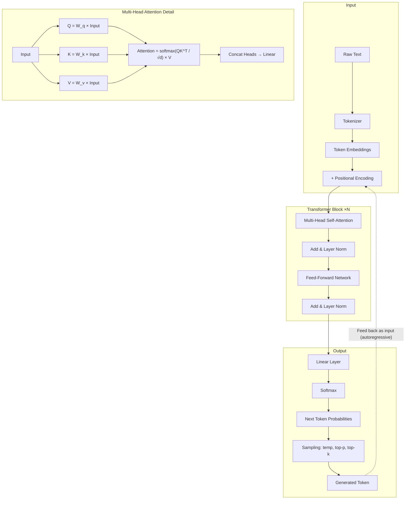
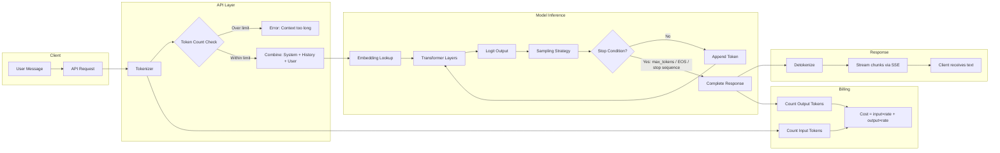
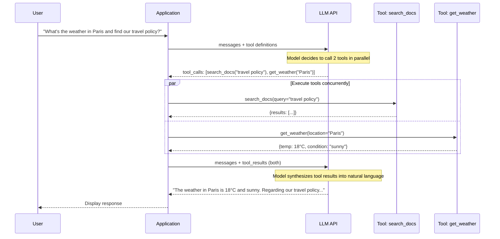
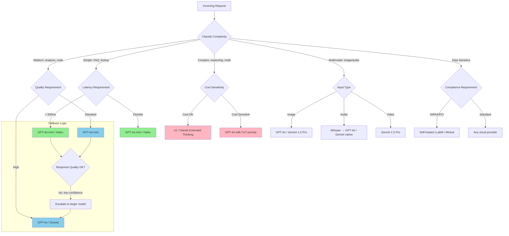
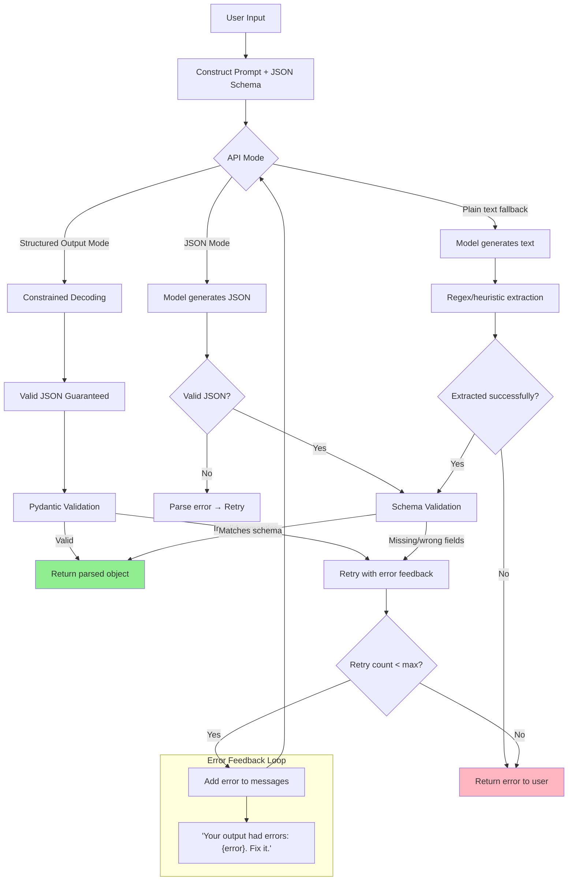
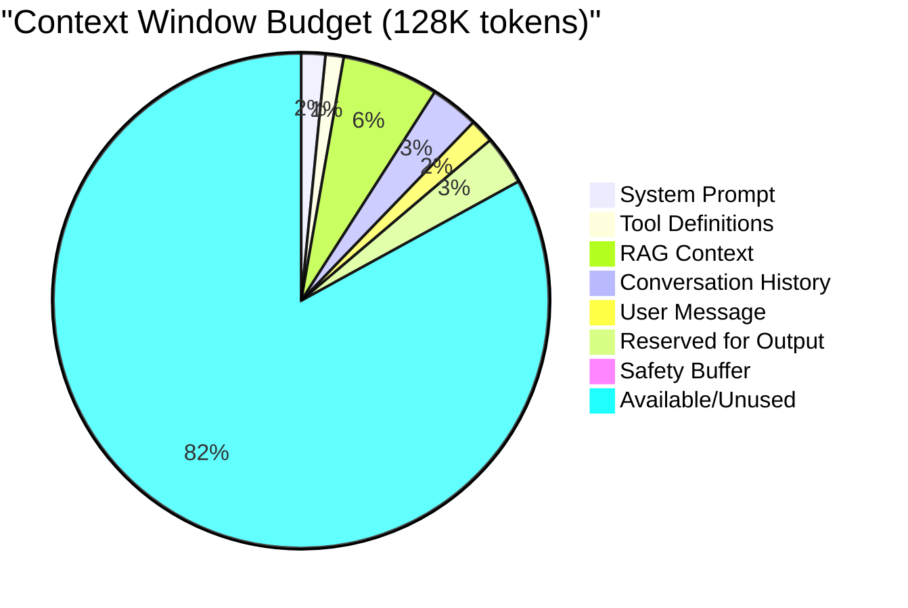
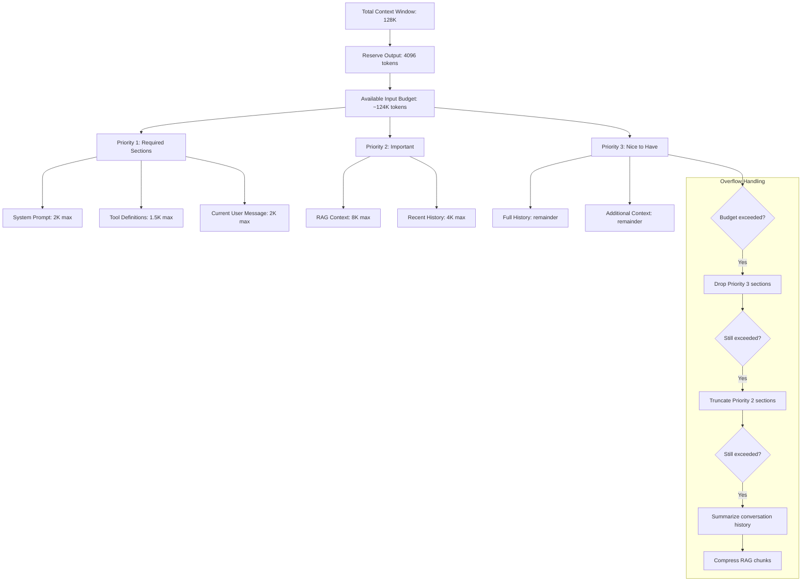

# LLM Fundamentals — Architecture Diagrams

## 1. Transformer Architecture (Simplified)

## 2. Token Flow Through the System

## 3. Tool Calling Sequence Diagram

## 4. Model Routing Decision Tree

## 5. Structured Output Validation Flow

## 6. Context Window Budget Allocation

