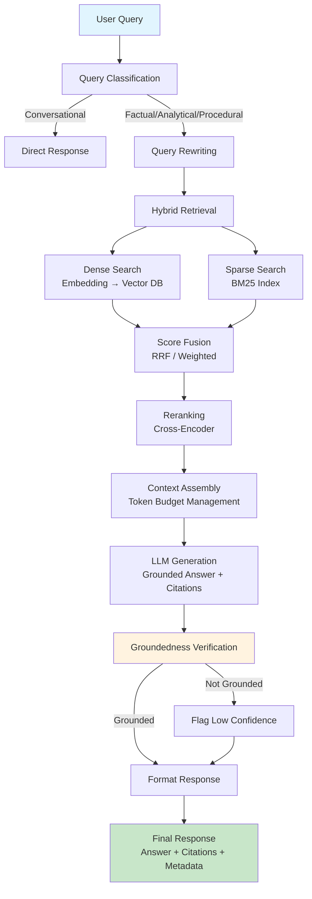
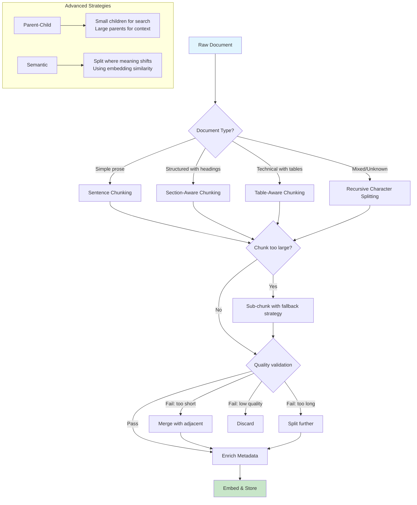
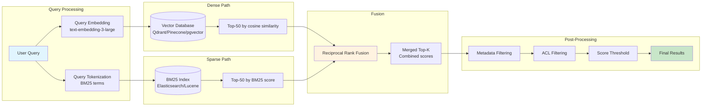
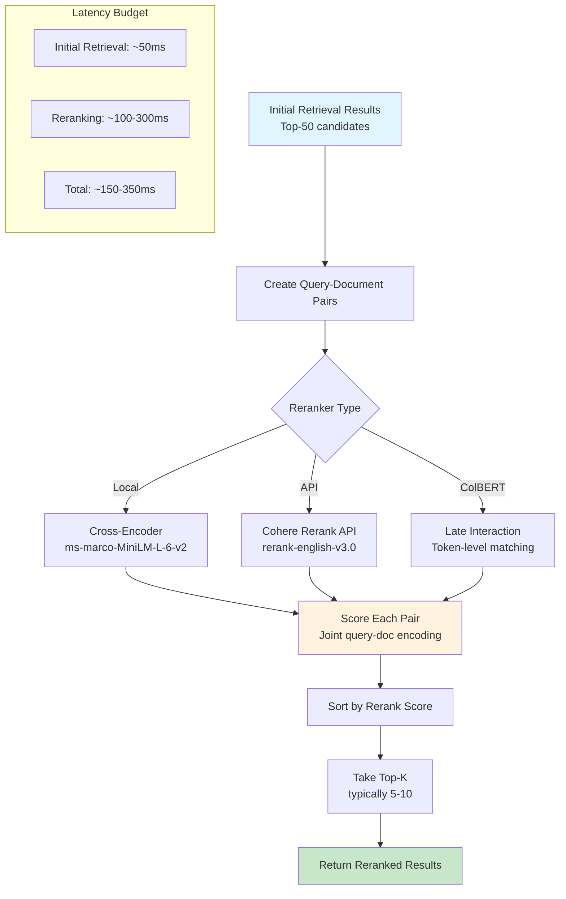
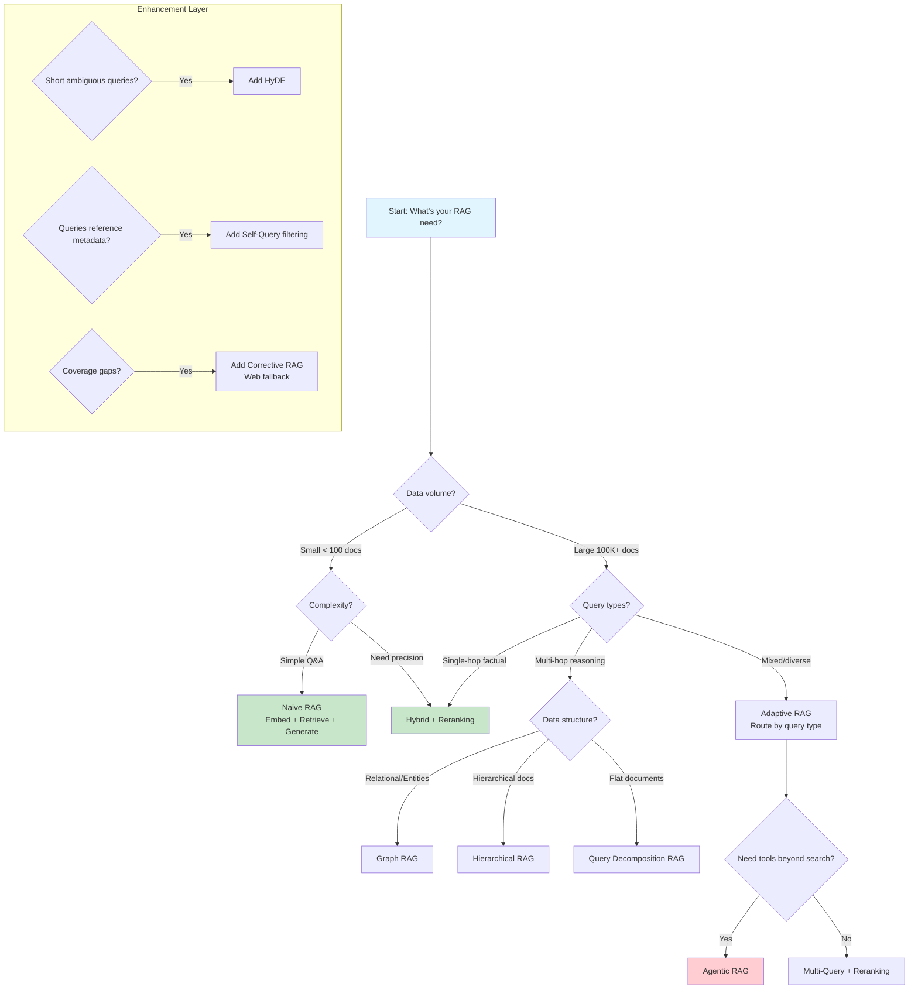
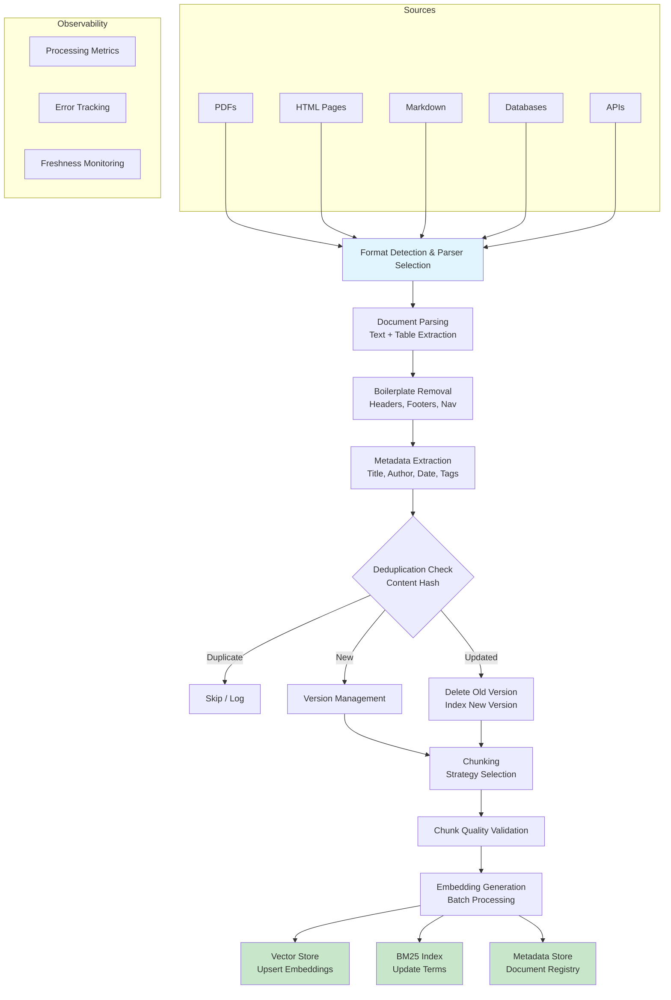
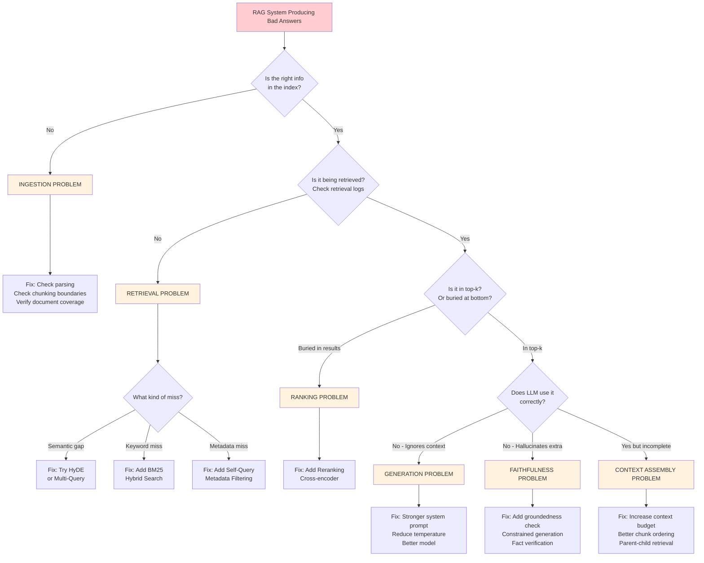

# RAG System Diagrams

## 1. End-to-End RAG Pipeline Flow

## 2. Chunking Strategy Comparison

## 3. Hybrid Retrieval Architecture

## 4. Reranking Pipeline

## 5. RAG Pattern Decision Tree

## 6. Ingestion Pipeline Architecture

## 7. RAG Failure Diagnosis Flowchart

---

## How to Render These Diagrams

1. **VS Code**: Install "Markdown Preview Mermaid Support" extension
2. **GitHub**: Mermaid is natively supported in `.md` files
3. **CLI**: `npx @mermaid-js/mermaid-cli mmdc -i DIAGRAMS.md -o output.png`
4. **Online**: Paste into [mermaid.live](https://mermaid.live)
