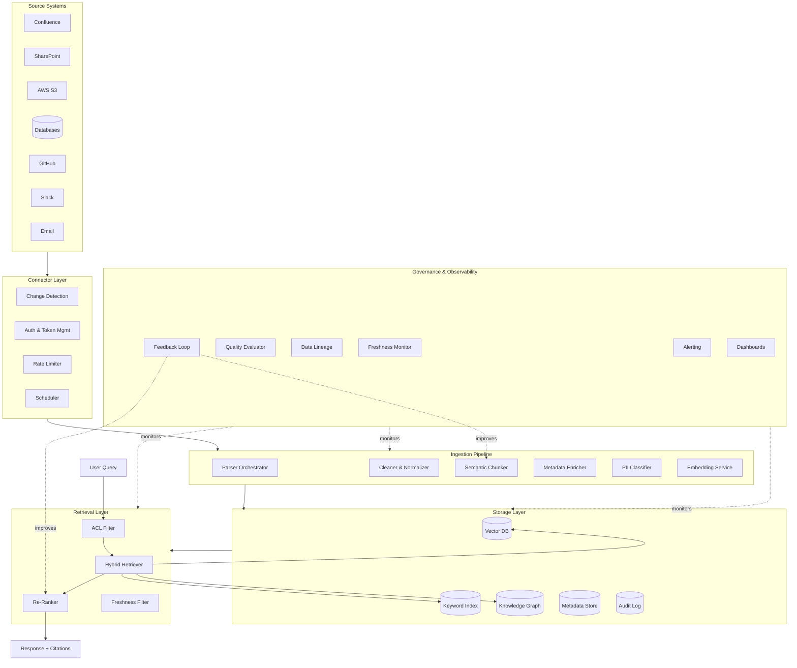
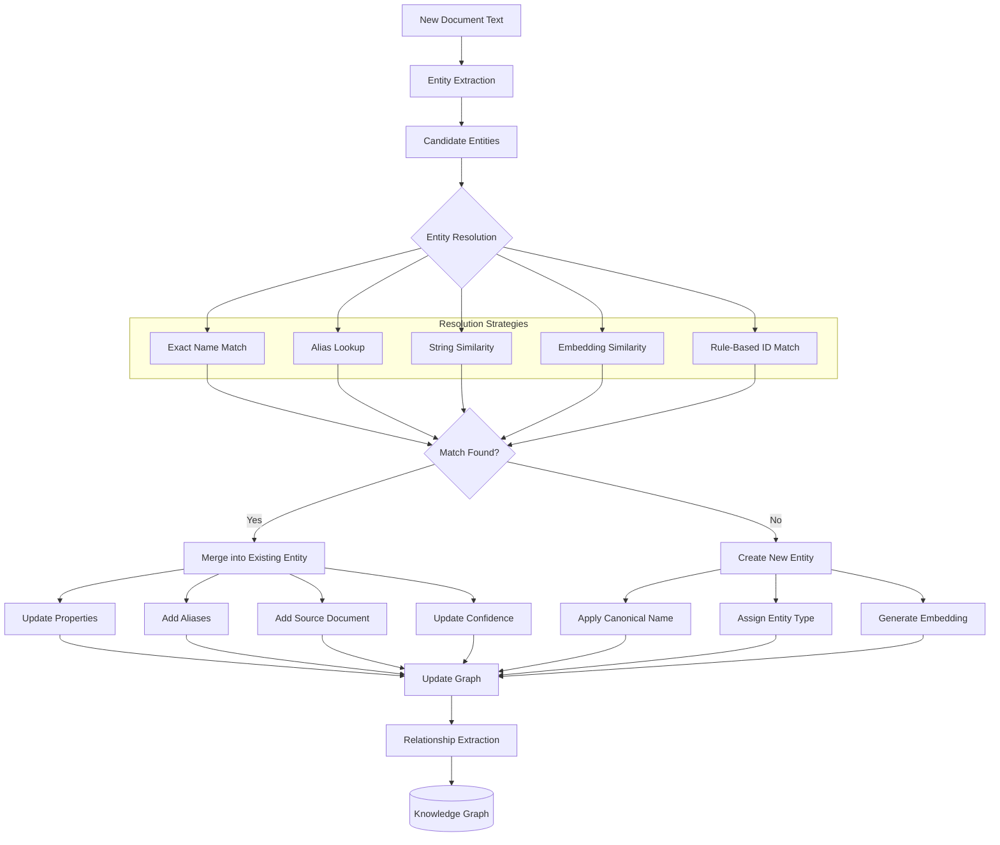
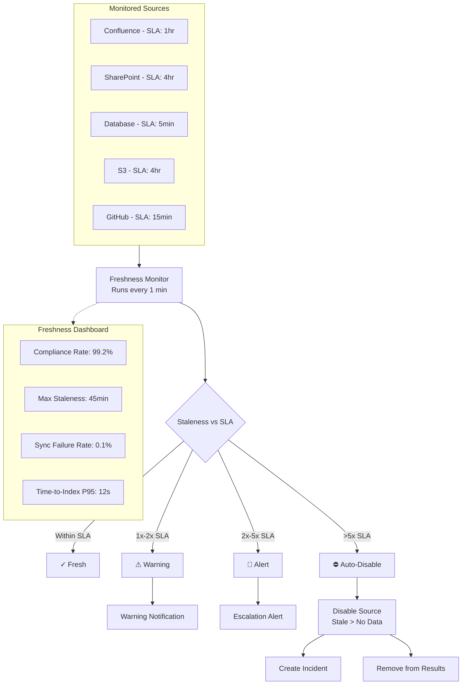
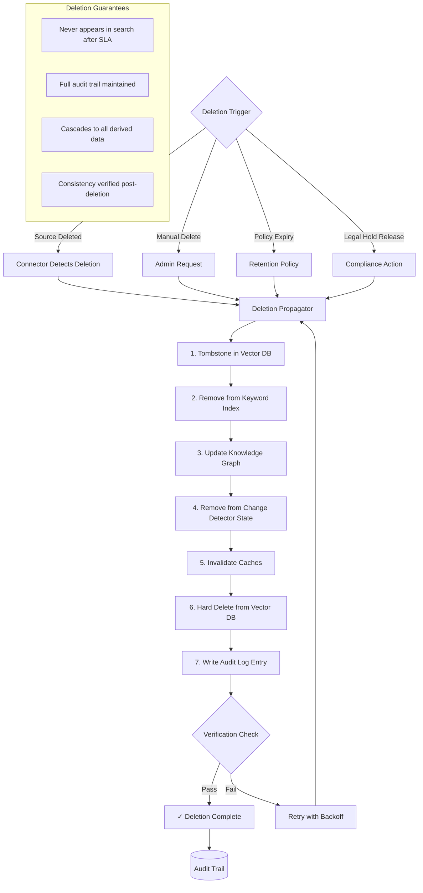
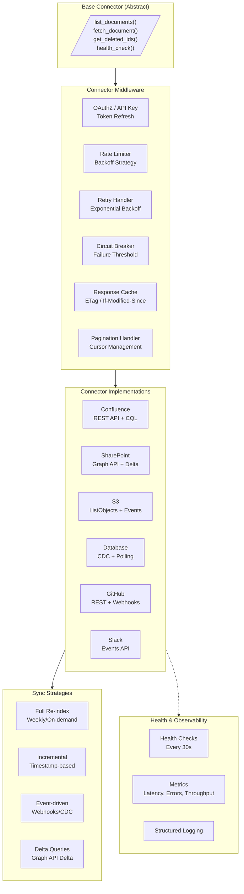
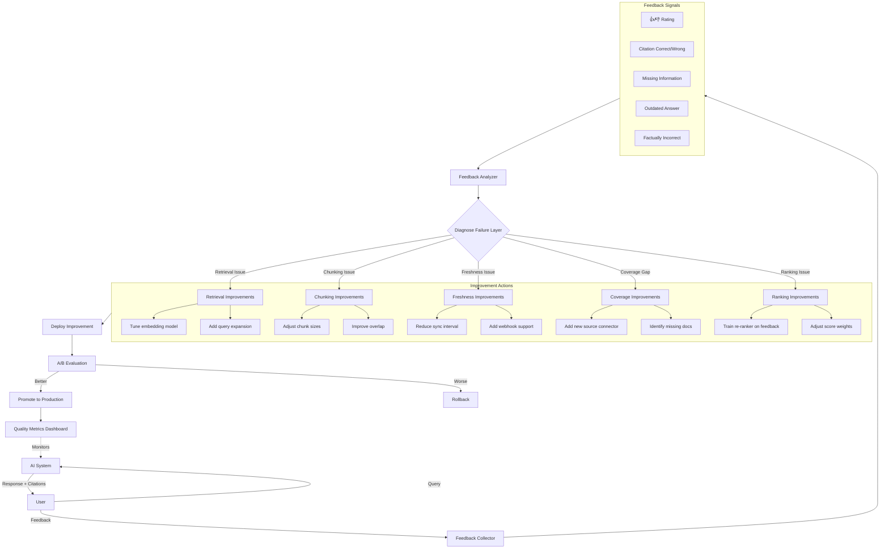

# Knowledge Architecture Diagrams

## 1. Complete Knowledge Architecture (End-to-End)

## 2. Ingestion Pipeline with All Stages

```mermaid
flowchart LR
    subgraph Fetch
        F1[Connector Fetch]
        F2[Change Detection]
        F3{Changed?}
    end

    subgraph Parse
        P1[Format Detection]
        P2[PDF Parser]
        P3[HTML Parser]
        P4[DOCX Parser]
        P5[Email Parser]
    end

    subgraph Process
        C1[Boilerplate Removal]
        C2[Unicode Normalization]
        C3[Deduplication]
        C4[Semantic Chunking]
        C5[Overlap Generation]
        C6[Table Preservation]
    end

    subgraph Enrich
        E1[Entity Extraction]
        E2[Topic Classification]
        E3[Content Type Detection]
        E4[Quality Scoring]
        E5[PII Detection]
        E6[Sensitivity Classification]
        E7[ACL Mapping]
    end

    subgraph Index
        I1[Embedding Generation]
        I2[Vector DB Upsert]
        I3[Keyword Indexing]
        I4[Graph Update]
        I5[Metadata Store]
    end

    F1 --> F2 --> F3
    F3 -->|Yes| P1
    F3 -->|No| SKIP[Skip]

    P1 --> P2 & P3 & P4 & P5
    P2 & P3 & P4 & P5 --> C1

    C1 --> C2 --> C3 --> C4 --> C5 --> C6

    C6 --> E1 --> E2 --> E3 --> E4 --> E5 --> E6 --> E7

    E7 --> I1 --> I2 & I3 & I4 & I5

    I2 & I3 & I4 & I5 --> DONE[✓ Indexed]
```

## 3. Knowledge Graph Entity Resolution Flow

## 4. Freshness Monitoring and Alerting

## 5. Deletion Propagation Flow

## 6. Source Connector Architecture

## 7. Knowledge Quality Feedback Loop

