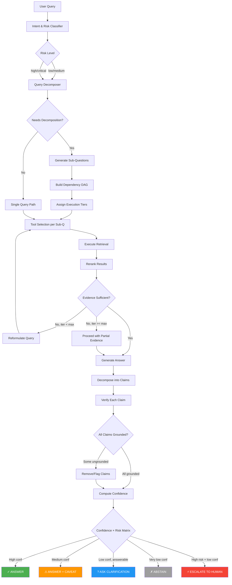
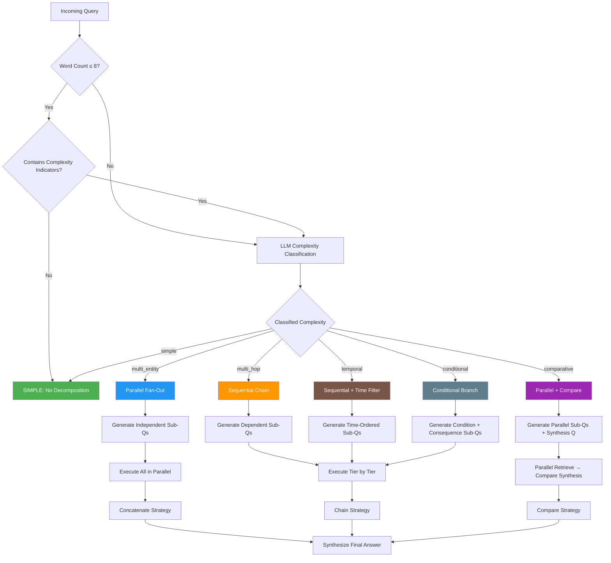
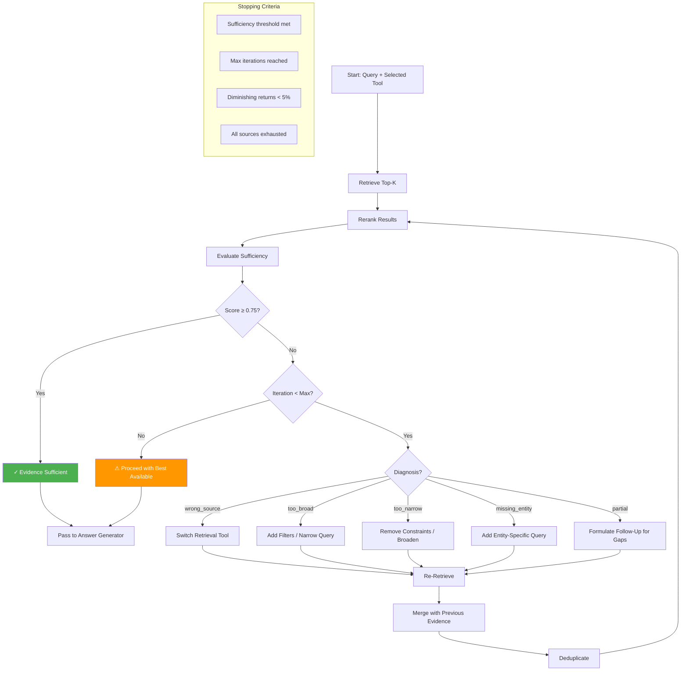
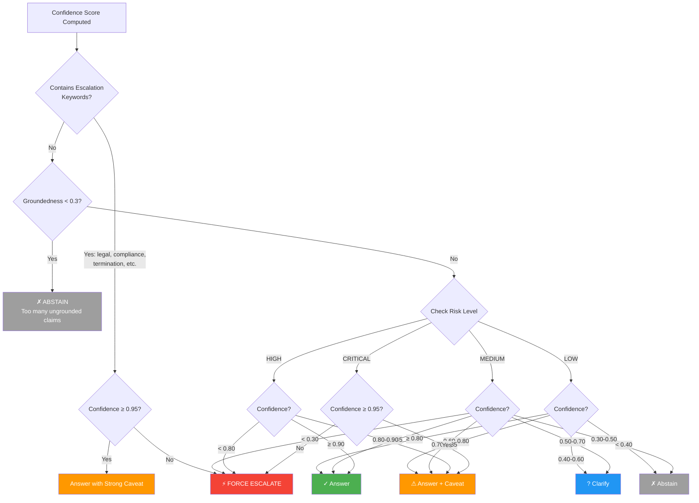
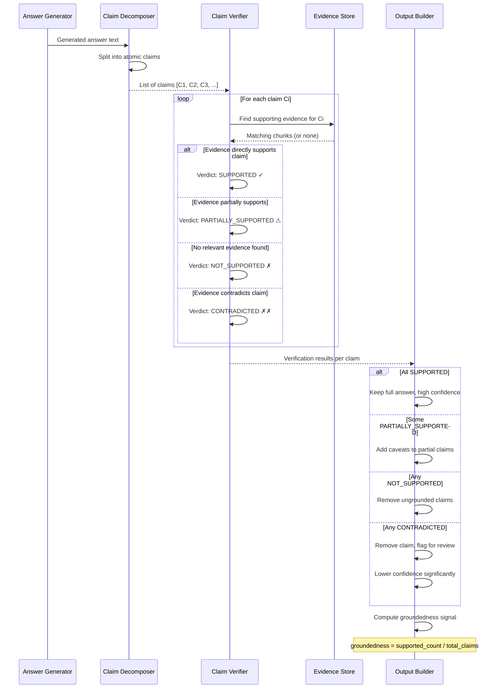

# Agentic RAG — System Diagrams

## 1. Agentic RAG Complete Flow



## 2. Query Decomposition Decision Tree



## 3. Iterative Retrieval Loop



## 4. Confidence Scoring Pipeline

```mermaid
flowchart LR
    subgraph Signals
        S1[Retrieval Quality<br/>weight: 0.15]
        S2[Reranker Agreement<br/>weight: 0.10]
        S3[Source Freshness<br/>weight: 0.10]
        S4[Source Authority<br/>weight: 0.15]
        S5[Context Coverage<br/>weight: 0.15]
        S6[Groundedness<br/>weight: 0.20]
        S7[Citation Support<br/>weight: 0.05]
        S8[Answer Consistency<br/>weight: 0.10]
    end
    
    subgraph Computation
        S1 --> |score × weight| AGG[Weighted Sum]
        S2 --> |score × weight| AGG
        S3 --> |score × weight| AGG
        S4 --> |score × weight| AGG
        S5 --> |score × weight| AGG
        S6 --> |score × weight| AGG
        S7 --> |score × weight| AGG
        S8 --> |score × weight| AGG
    end
    
    AGG --> CAL{Calibration<br/>Available?}
    CAL -->|Yes| PLATT[Platt Scaling<br/>σ(a·x + b)]
    CAL -->|No| RAW[Raw Score]
    
    PLATT --> FINAL[Calibrated<br/>Confidence Score]
    RAW --> FINAL
    
    FINAL --> MATRIX[Risk × Confidence<br/>Decision Matrix]
    
    style S6 fill:#FF5722,color:white
    style FINAL fill:#2196F3,color:white
```

## 5. Abstention / Escalation Decision Flow



## 6. Multi-Source Retrieval Architecture

```mermaid
flowchart TD
    A[Sub-Question] --> B[Tool Selector]
    
    B --> C{Query Characteristics}
    
    C -->|Conceptual / How / Why| D[Vector Search]
    C -->|Numeric / Aggregation| E[SQL Query]
    C -->|Entity Relations| F[Knowledge Graph]
    C -->|Real-time Data| G[API Call]
    C -->|Recent/External| H[Web Search]
    
    D --> D1[(Vector DB<br/>Pinecone/Qdrant)]
    E --> E1[(Relational DB<br/>PostgreSQL)]
    F --> F1[(Graph DB<br/>Neo4j)]
    G --> G1[External APIs]
    H --> H1[Search Engine]
    
    D1 --> I[Retrieved Chunks]
    E1 --> I
    F1 --> I
    G1 --> I
    H1 --> I
    
    I --> J[Unified Reranker]
    
    J --> K[Authority Weighting]
    K --> L[Freshness Scoring]
    L --> M[Cross-Encoder Rerank]
    M --> N[Top-K Final Evidence]
    
    subgraph Source Authority
        T1[Tier 1: Official Docs]
        T2[Tier 2: Internal Wiki]
        T3[Tier 3: Slack/Notes]
        T4[Tier 4: External]
    end
    
    K -.->|weight by tier| Source Authority
    
    style D fill:#4CAF50,color:white
    style E fill:#2196F3,color:white
    style F fill:#9C27B0,color:white
    style G fill:#FF9800,color:white
    style H fill:#795548,color:white
```

## 7. Claim Verification Sequence


