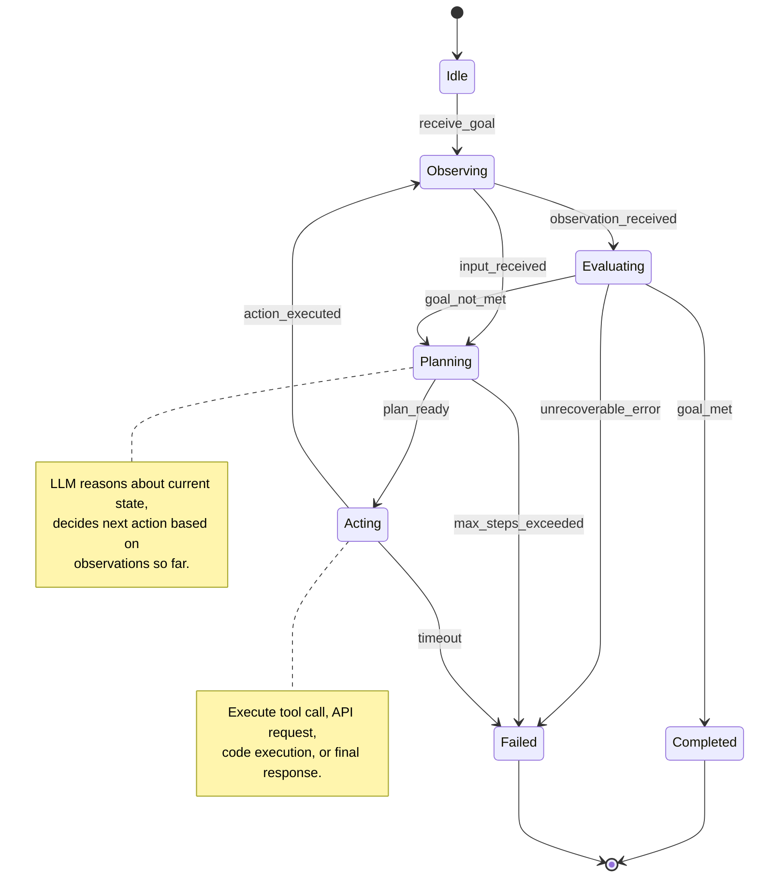
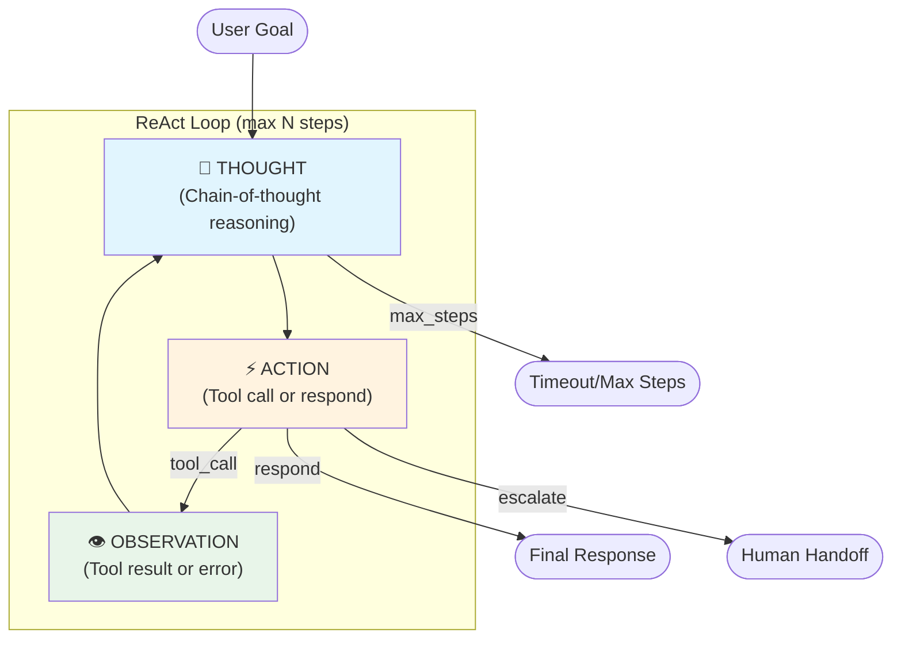
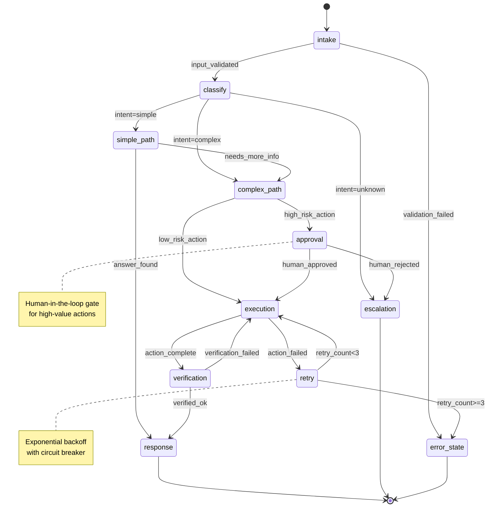
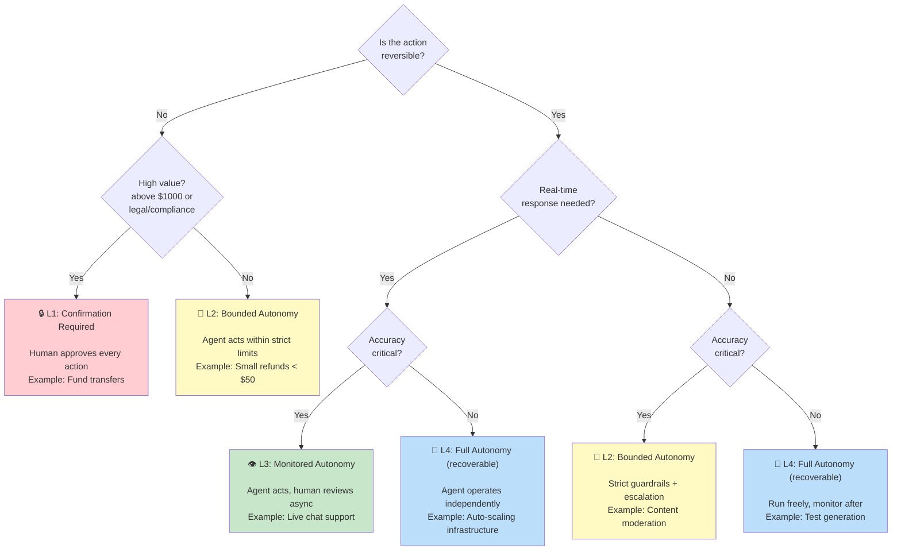
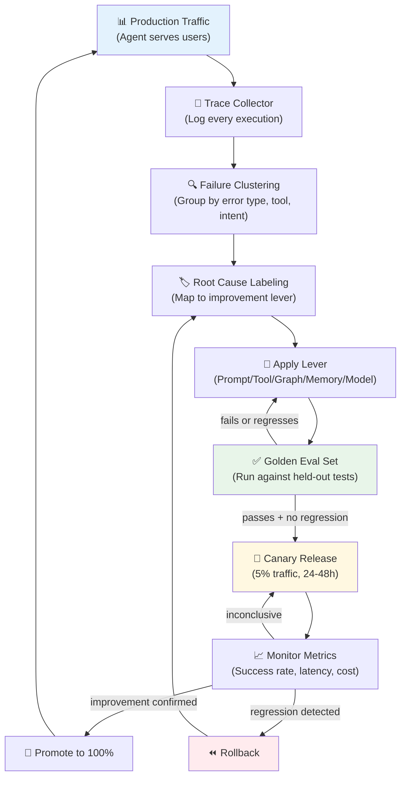
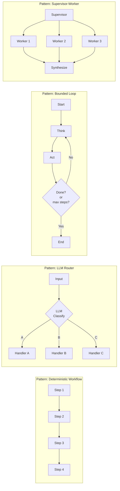
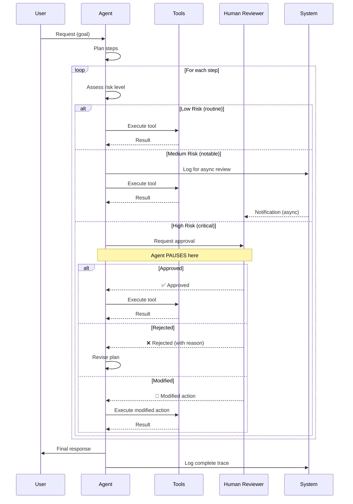
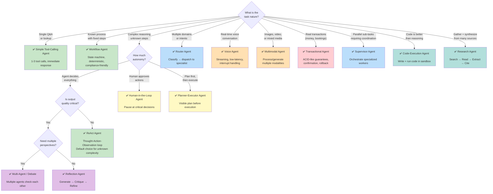

# Agent Fundamentals — Diagrams

## 1. Basic Agent Loop (State Diagram)

## 2. ReAct Agent Flow

## 3. State Machine Agent with Transitions

## 4. Autonomy Levels Decision Tree

## 5. Agent Improvement Loop

## 6. Agent Control Patterns Comparison

## 7. Human-in-the-Loop Approval Flow

## 8. Agent Types Selection Flowchart

