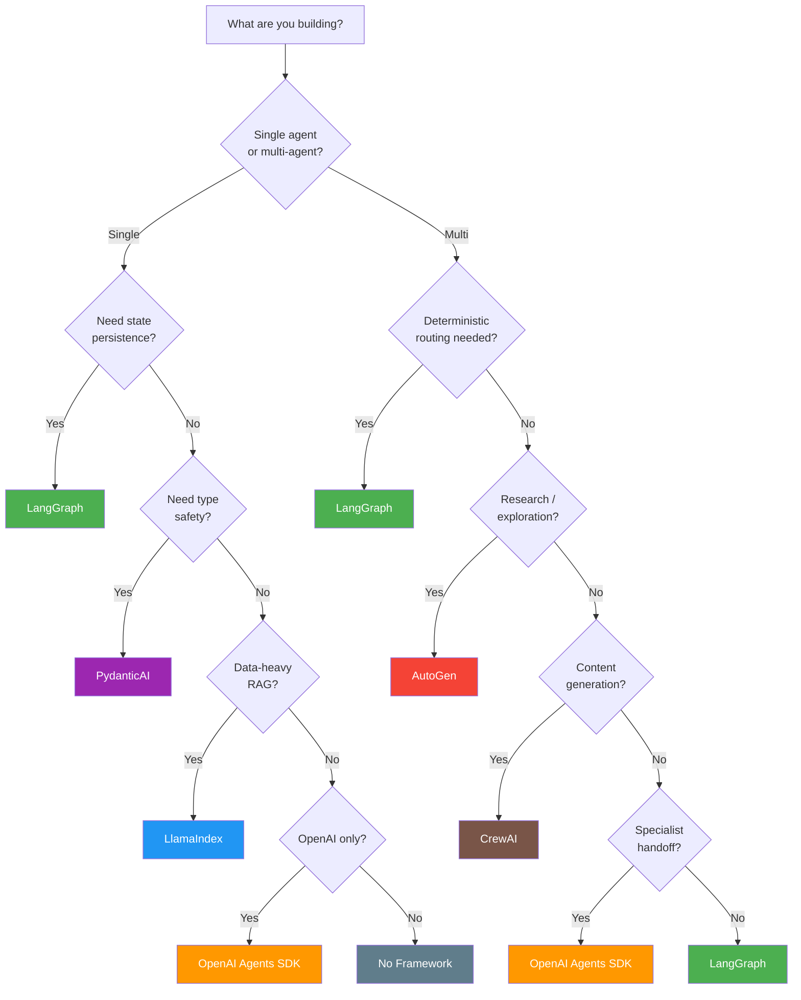
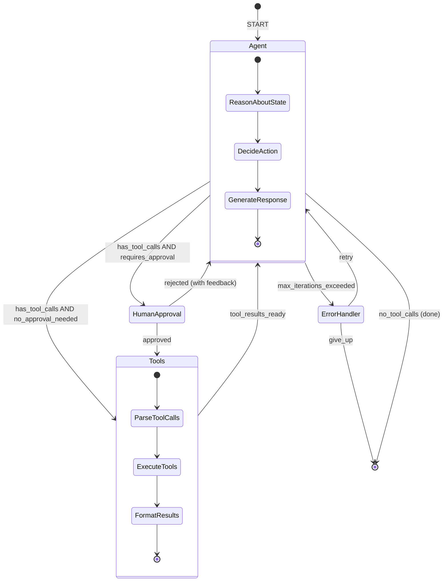
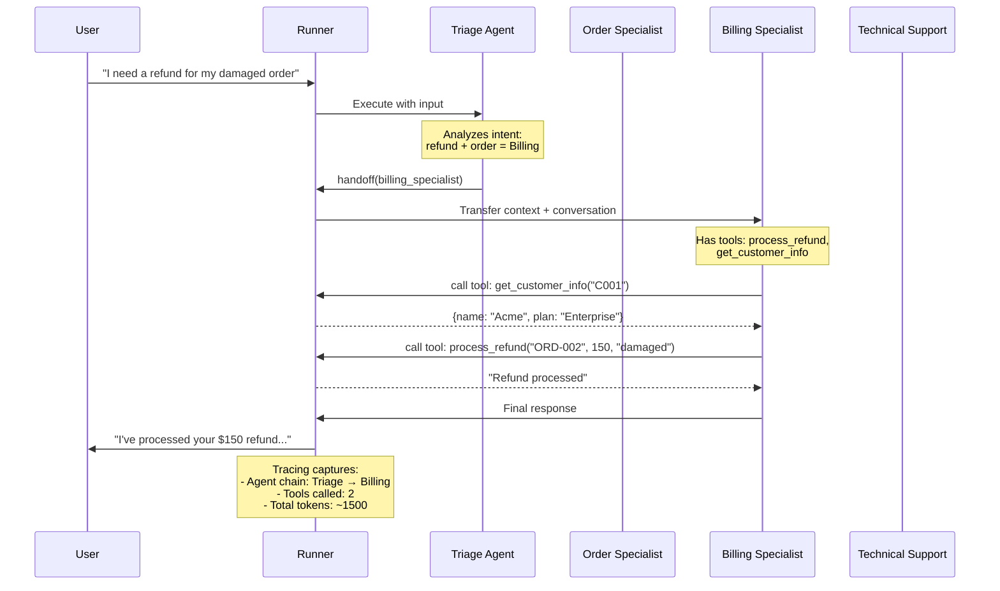
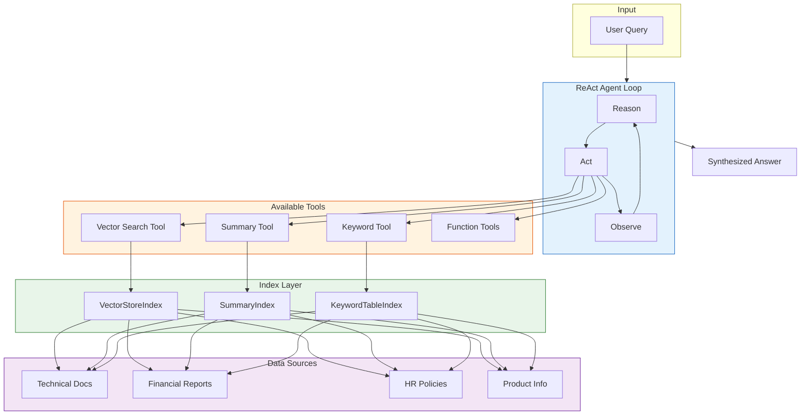
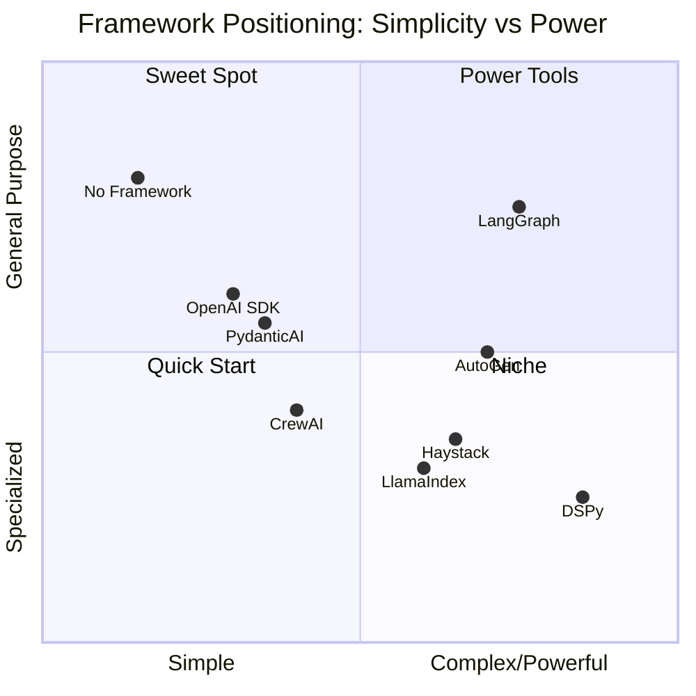
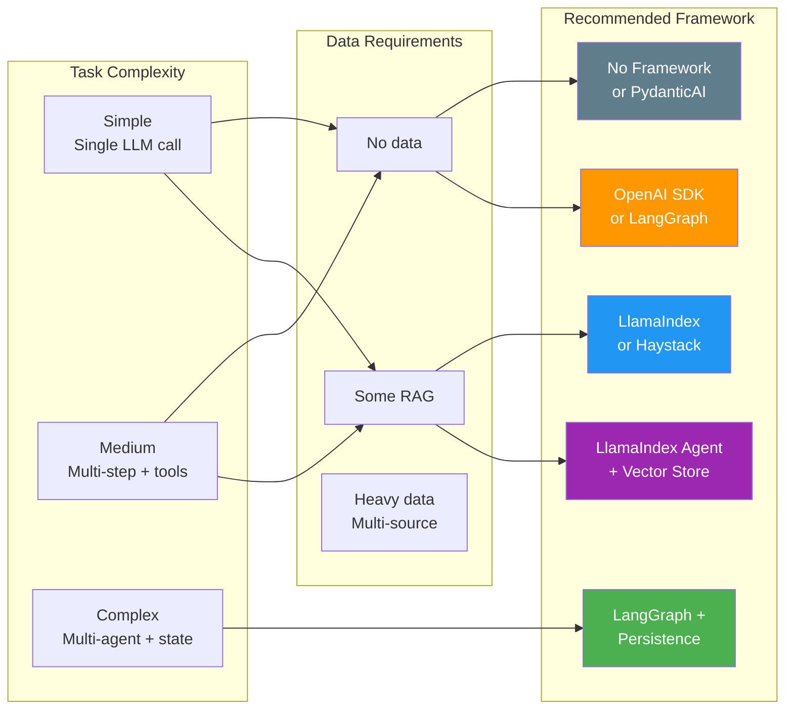
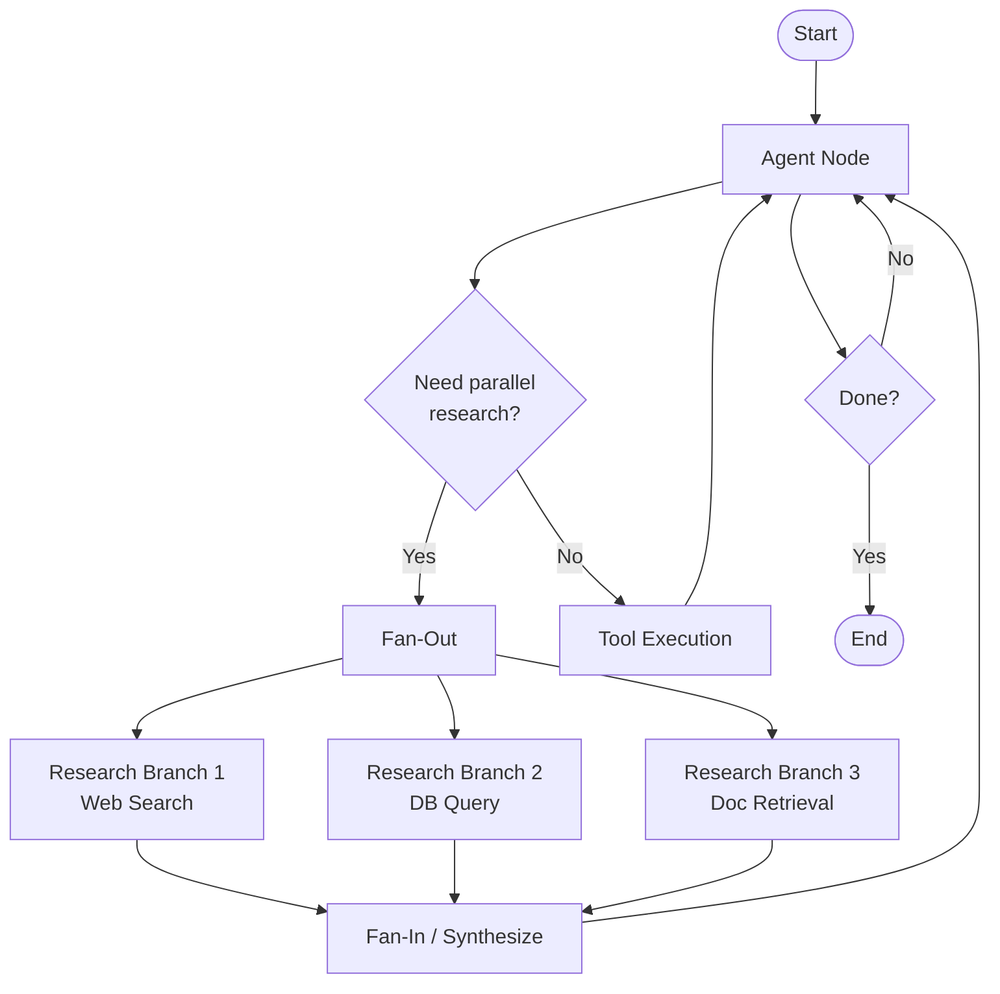
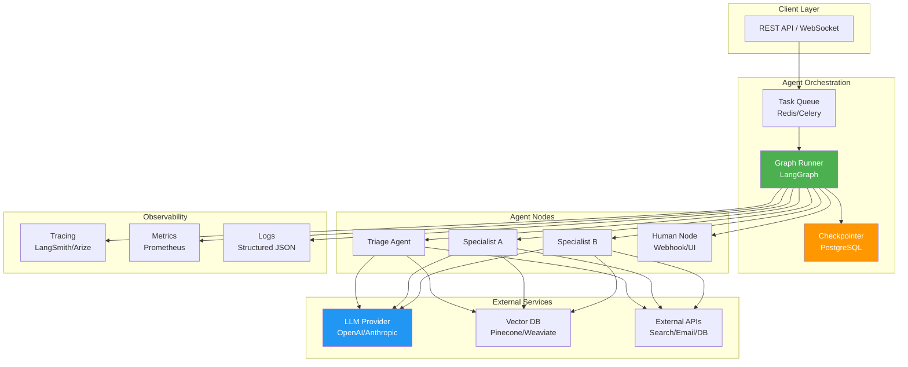

# Agent Frameworks - Diagrams

## 1. Framework Selection Decision Tree

## 2. LangGraph State Machine Example

## 3. OpenAI Agents SDK - Handoff Pattern

## 4. LlamaIndex Data Flow

## 5. Framework Comparison Matrix

## 6. When to Use Which Framework - Flowchart

## 7. LangGraph Parallel Execution Pattern

## 8. Production Deployment Architecture

