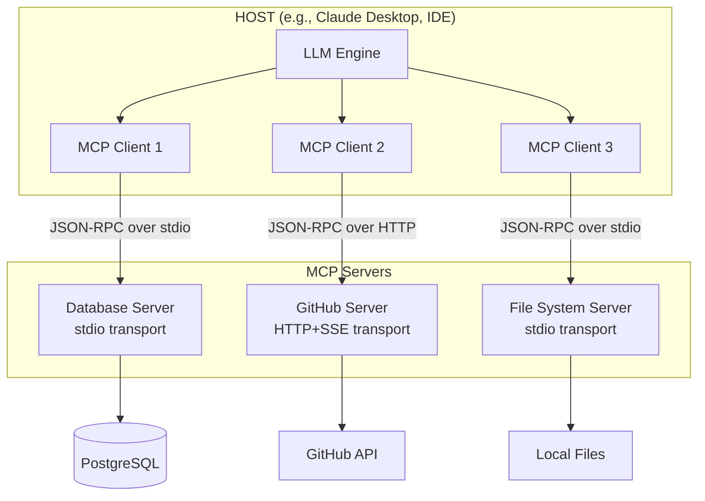
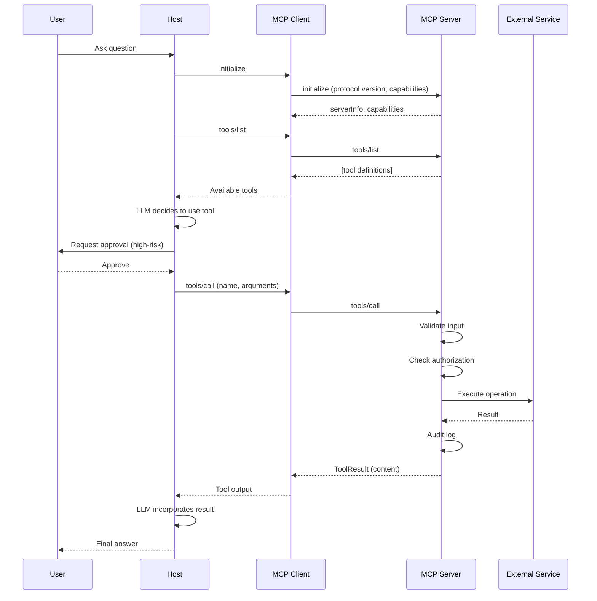
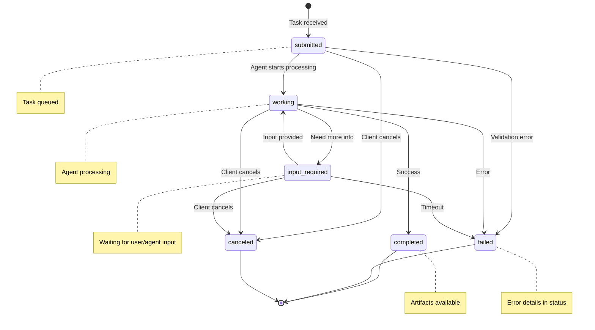
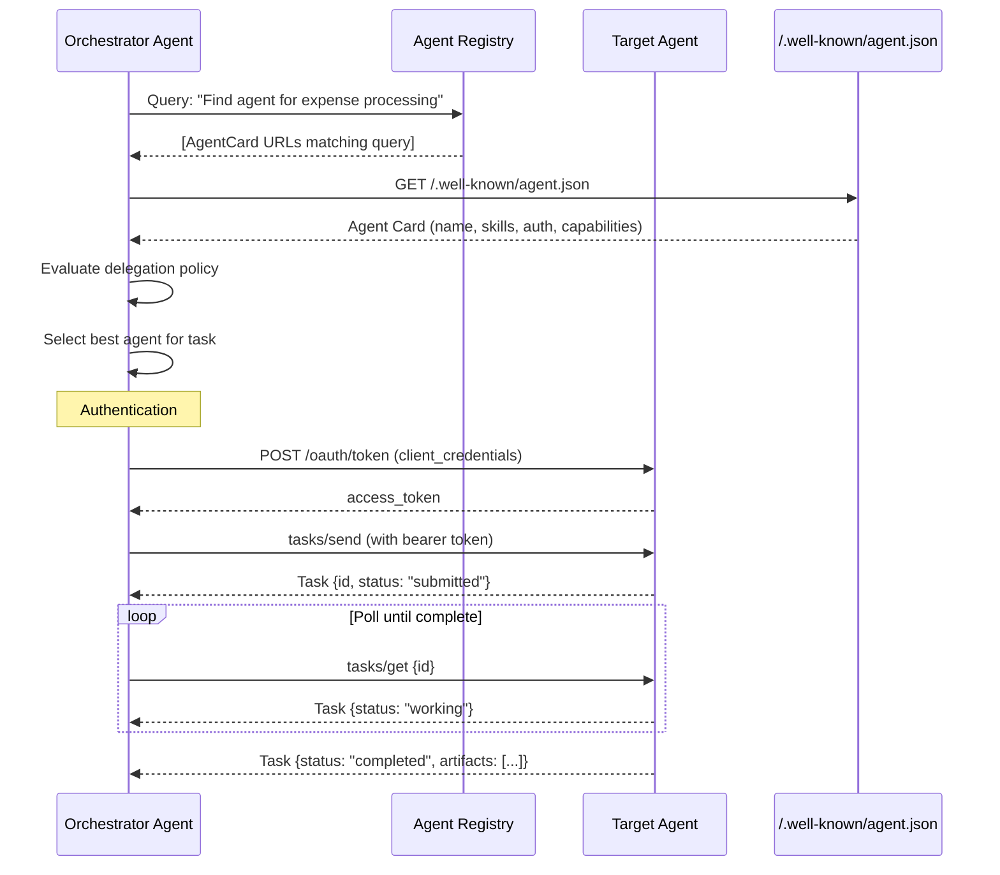
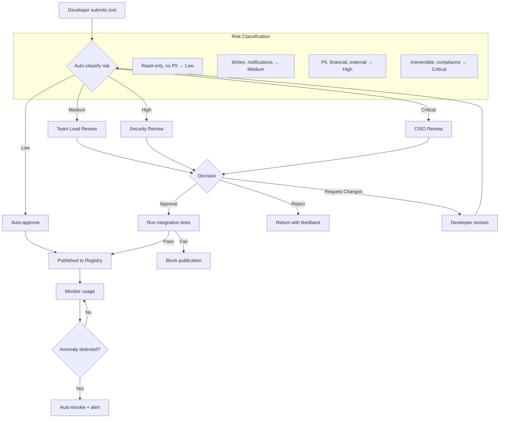
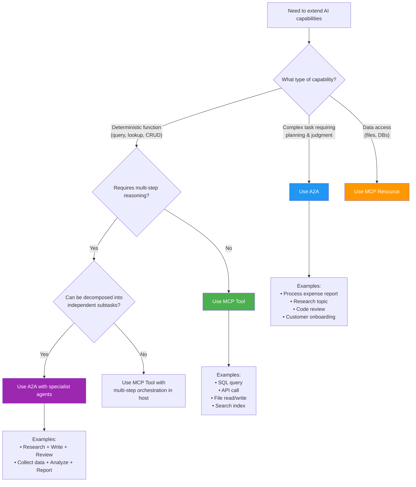
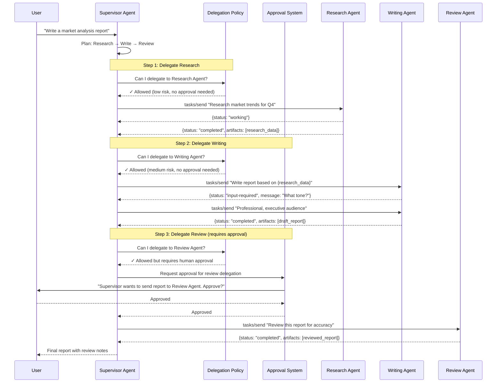
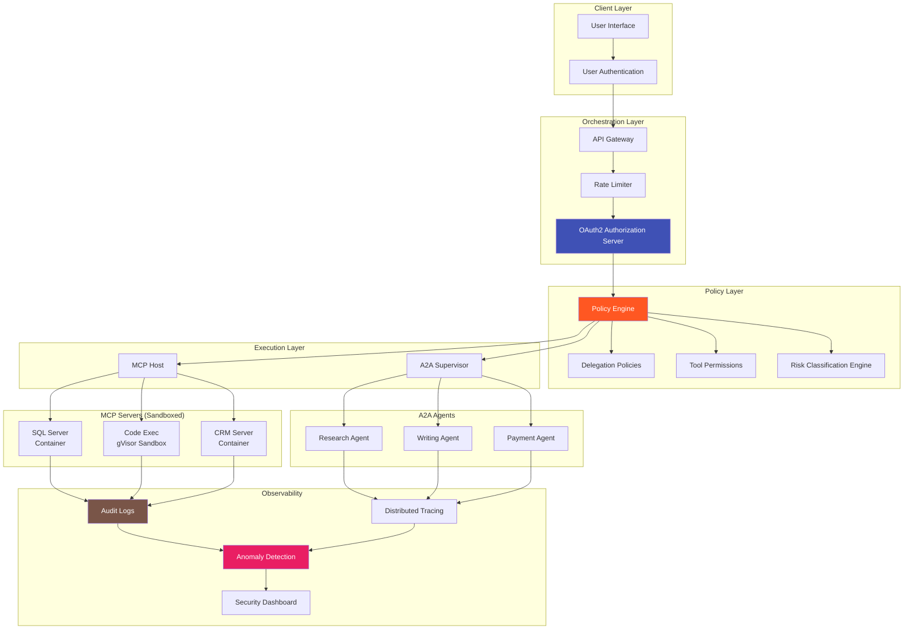
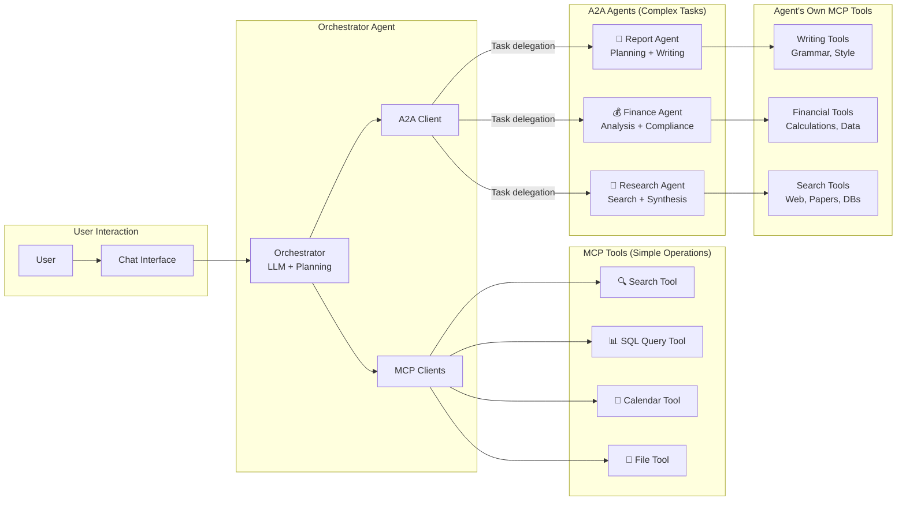

# MCP & A2A Protocol Diagrams

## 1. MCP Architecture (Host / Client / Server)

## 2. MCP Request/Response Flow

## 3. A2A Task Lifecycle State Machine

## 4. Agent Card Discovery Flow

## 5. Tool Registry Approval Workflow

## 6. MCP vs A2A Decision Tree

## 7. Multi-Agent Delegation Sequence

## 8. Security Layer Architecture

## 9. Combined MCP + A2A System Architecture

