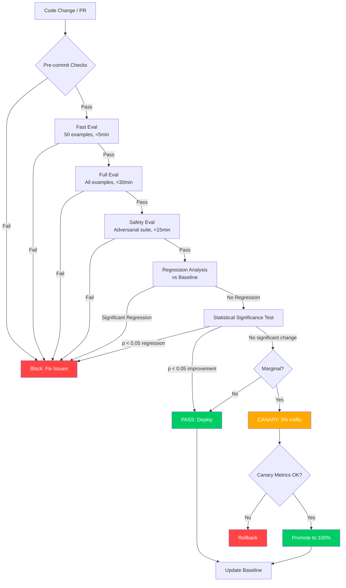
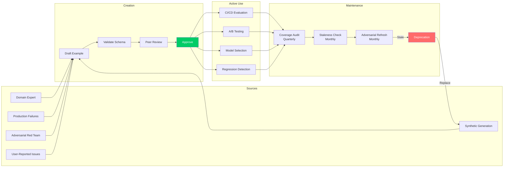
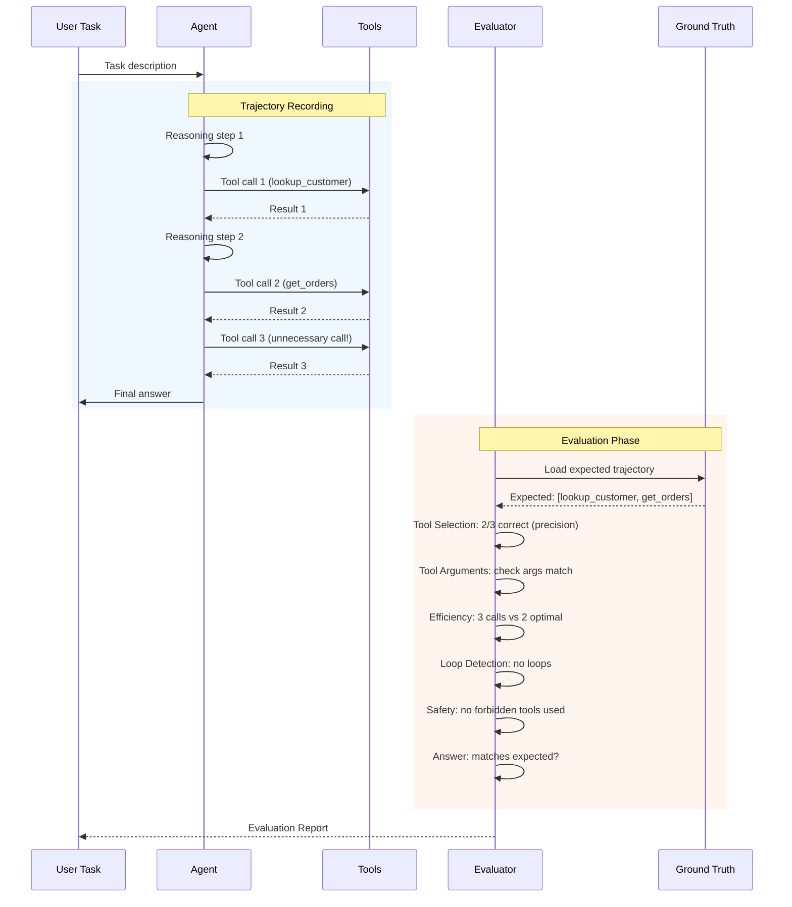
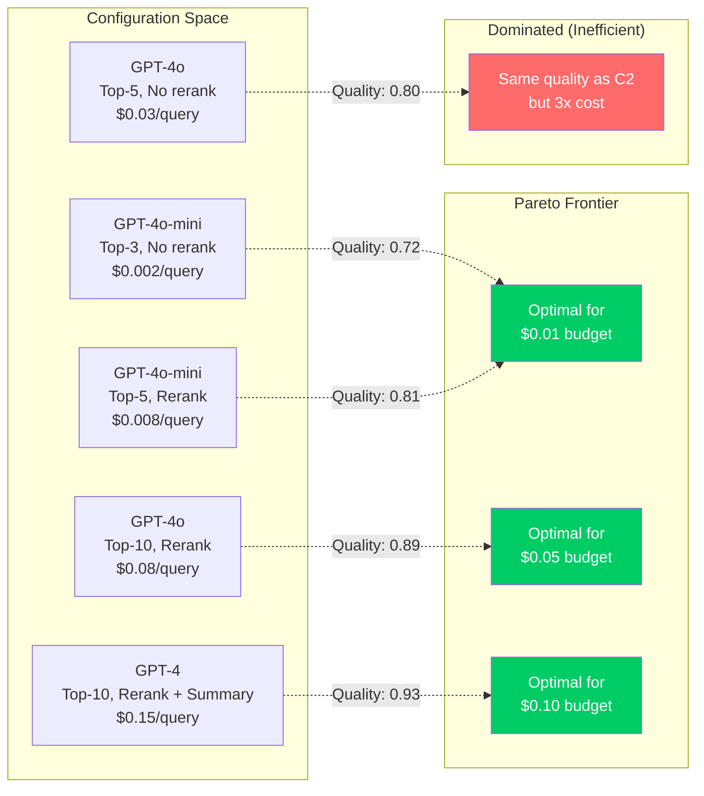
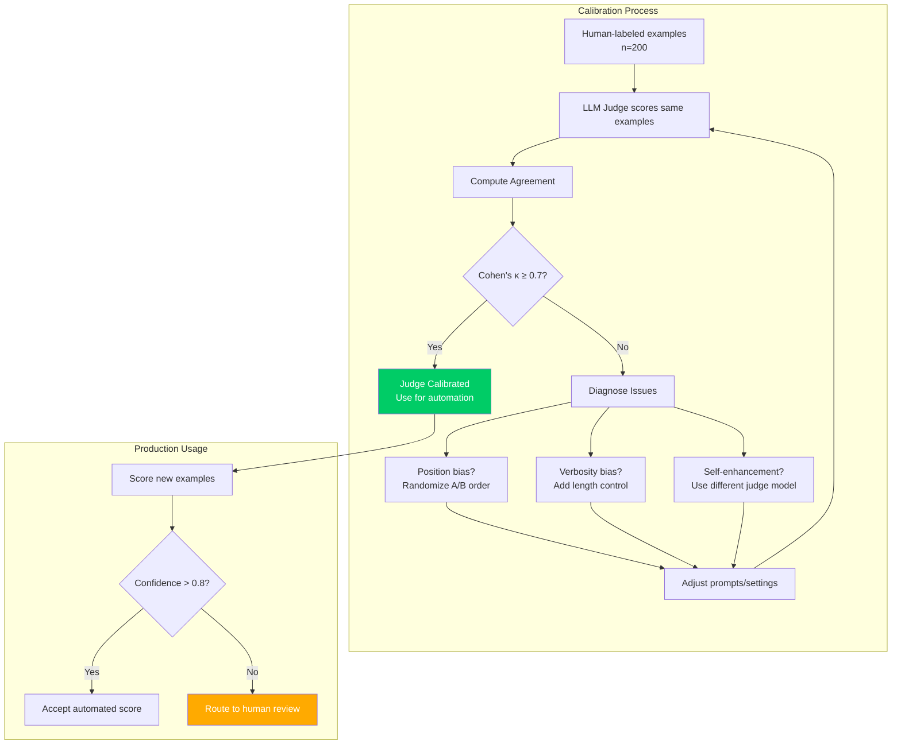

# Evaluation Mastery - Diagrams

## 1. Evaluation Layers Pyramid

```mermaid
graph TB
    subgraph "Evaluation Layers (Bottom = Foundation)"
        L1[Layer 1: Model Evaluation]
        L2[Layer 2: Prompt Evaluation]
        L3[Layer 3: Retrieval Evaluation]
        L4[Layer 4: RAG Evaluation]
        L5[Layer 5: Agent Evaluation]
        L6[Layer 6: Tool Evaluation]
        L7[Layer 7: Safety Evaluation]
        L8[Layer 8: Business Evaluation]
        L9[Layer 9: System Evaluation]
        L10[Layer 10: Human Evaluation]
    end

    L1 --> L2
    L2 --> L3
    L3 --> L4
    L4 --> L5
    L5 --> L6
    L6 --> L7
    L7 --> L8
    L8 --> L9
    L9 --> L10

    style L7 fill:#ff6b6b,color:#fff
    style L10 fill:#4ecdc4,color:#fff
    style L4 fill:#45b7d1,color:#fff
    style L5 fill:#96ceb4,color:#fff
```



## 2. CI/CD Evaluation Pipeline Flow



## 3. Golden Dataset Lifecycle



## 4. RAG Evaluation Metrics Flow

```mermaid
flowchart TD
    Q[Query] --> R[Retriever]
    R --> D[Retrieved Documents]
    D --> G[Generator/LLM]
    G --> A[Generated Answer]
    
    subgraph "Retrieval Metrics"
        RM1[Recall@k]
        RM2[Precision@k]
        RM3[MRR]
        RM4[nDCG@k]
    end
    
    subgraph "Context Metrics"
        CM1[Context Precision]
        CM2[Context Recall]
        CM3[Context Relevance]
    end
    
    subgraph "Answer Metrics"
        AM1[Faithfulness]
        AM2[Groundedness]
        AM3[Answer Relevance]
        AM4[Answer Correctness]
        AM5[Abstention Accuracy]
    end
    
    subgraph "Citation Metrics"
        CT1[Citation Precision]
        CT2[Citation Recall]
    end
    
    D --> RM1 & RM2 & RM3 & RM4
    D --> CM1 & CM2 & CM3
    A --> AM1 & AM2 & AM3 & AM4 & AM5
    A --> CT1 & CT2
    
    style AM1 fill:#ff6b6b,color:#fff
    style AM5 fill:#ff6b6b,color:#fff
    style RM1 fill:#45b7d1,color:#fff
```

## 5. Agent Trajectory Evaluation



## 6. Quality-Cost Frontier Analysis



## 7. LLM-as-Judge Calibration



## 8. Evaluation Decision Gates

```mermaid
flowchart TD
    subgraph "Hard Gates (Binary)"
        HG1{Faithfulness ≥ 0.90?}
        HG2{Safety Score ≥ 0.95?}
        HG3{Abstention Accuracy ≥ 0.85?}
    end
    
    subgraph "Soft Gates (Statistical)"
        SG1{Recall@5 regressed<br/>significantly?<br/>p < 0.05}
        SG2{Answer relevance<br/>regressed?<br/>p < 0.05}
        SG3{Citation F1<br/>regressed?<br/>p < 0.05}
    end
    
    subgraph "Decisions"
        PASS[✅ PASS<br/>Deploy to production]
        CANARY[🐤 CANARY<br/>Deploy to 5%]
        BLOCK[❌ BLOCK<br/>Fix required]
        REVIEW[👀 MANUAL REVIEW<br/>Human decision needed]
    end
    
    START[Evaluation Results] --> HG1
    HG1 -->|No| BLOCK
    HG1 -->|Yes| HG2
    HG2 -->|No| BLOCK
    HG2 -->|Yes| HG3
    HG3 -->|No| BLOCK
    HG3 -->|Yes| SG1
    
    SG1 -->|Yes, significant| BLOCK
    SG1 -->|No| SG2
    SG2 -->|Yes, significant| CANARY
    SG2 -->|No| SG3
    SG3 -->|Yes, marginal| REVIEW
    SG3 -->|No| PASS
    
    style PASS fill:#00cc66,color:#fff
    style BLOCK fill:#ff4444,color:#fff
    style CANARY fill:#ffaa00,color:#000
    style REVIEW fill:#9b59b6,color:#fff
```
