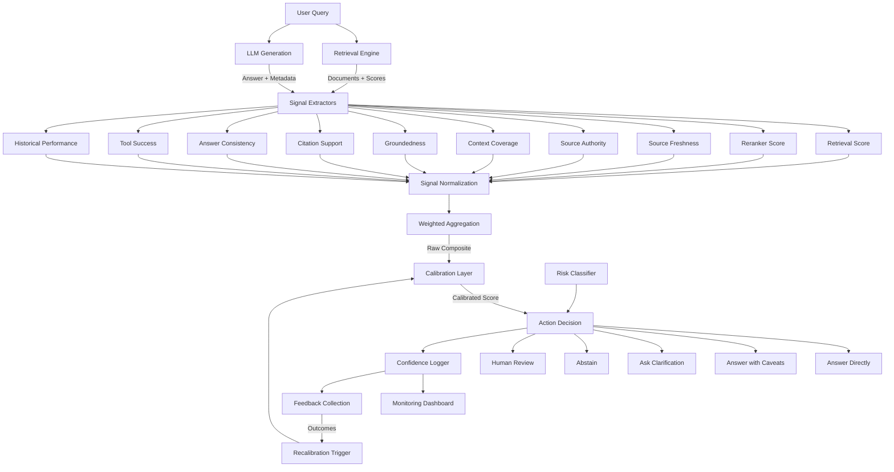
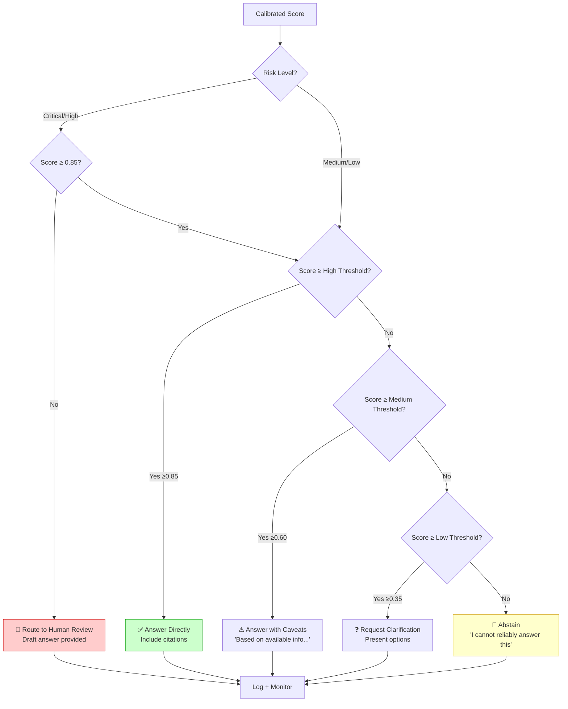
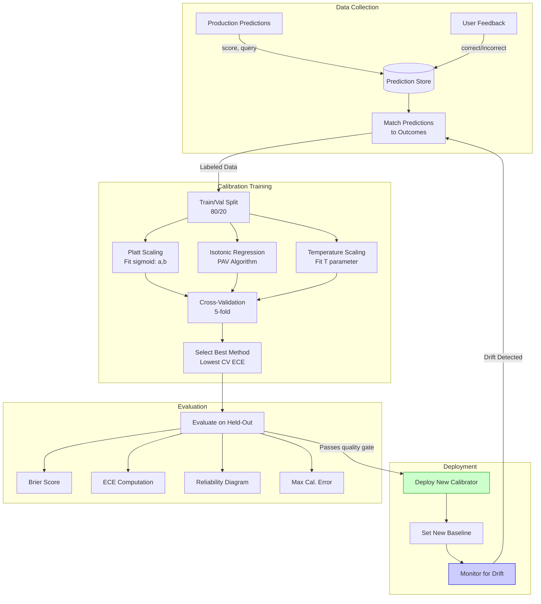
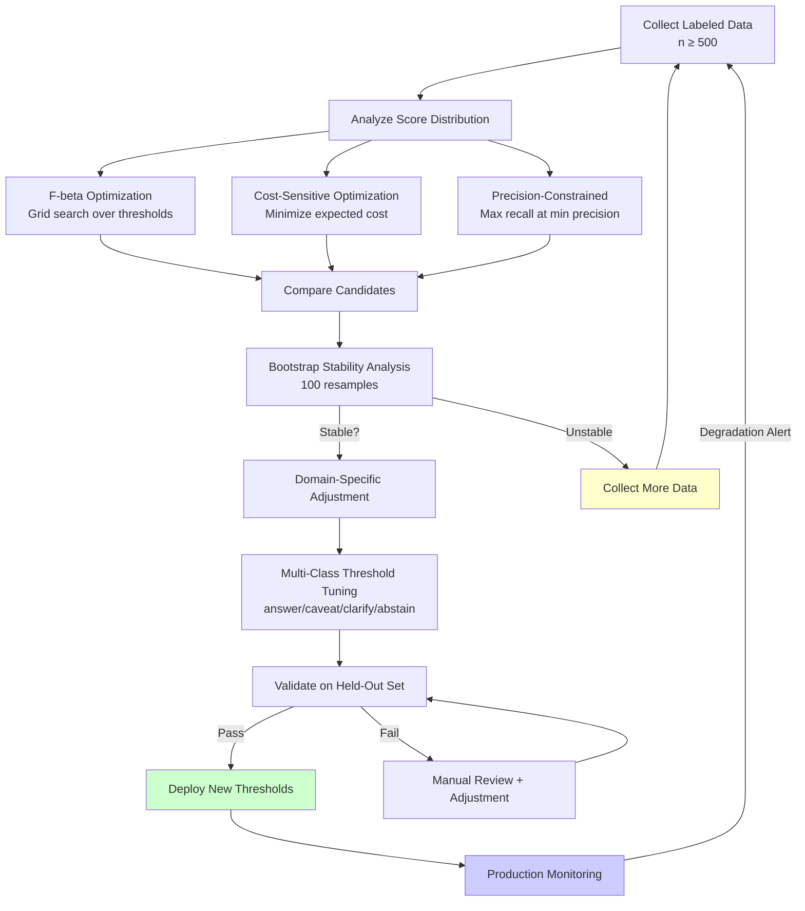
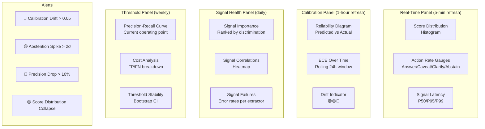
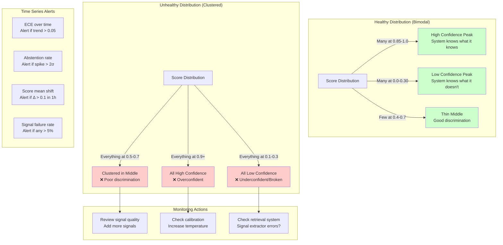

# Confidence Scoring - Diagrams

## 1. Confidence Scoring Pipeline



## 2. Signal Aggregation Architecture

```mermaid
flowchart LR
    subgraph "Retrieval Signals"
        RS[Retrieval Score<br/>weight=1.0]
        RR[Reranker Score<br/>weight=1.2]
    end
    
    subgraph "Source Quality Signals"
        SF[Source Freshness<br/>weight=0.8]
        SA[Source Authority<br/>weight=0.7]
    end
    
    subgraph "Answer Quality Signals"
        CC[Context Coverage<br/>weight=1.0]
        GR[Groundedness<br/>weight=1.5]
        CS[Citation Support<br/>weight=0.9]
        AC[Answer Consistency<br/>weight=1.0]
    end
    
    subgraph "Operational Signals"
        TS[Tool Success<br/>weight=1.1]
        HP[Historical Perf<br/>weight=0.6]
    end
    
    RS & RR --> N1[Normalize 0-1]
    SF & SA --> N2[Normalize 0-1]
    CC & GR & CS & AC --> N3[Normalize 0-1]
    TS & HP --> N4[Normalize 0-1]
    
    N1 & N2 & N3 & N4 --> WA[Weighted Average<br/>Σ(score_i × weight_i) / Σ(weight_i)]
    WA --> |0.72| OUT[Composite Score]
    
    style GR fill:#ff9999,stroke:#cc0000
    style RR fill:#99ccff,stroke:#0066cc
```

## 3. Confidence-to-Action Decision Flow



## 4. Calibration Workflow



## 5. Threshold Tuning Loop



## 6. Confidence Monitoring Dashboard Layout



## 7. Multi-Signal Fusion Diagram

```mermaid
flowchart TD
    subgraph "Layer 1: Raw Extraction"
        direction LR
        E1[Cosine Sim<br/>0.89]
        E2[Cross-Encoder<br/>0.93]
        E3[Exp Decay<br/>0.75]
        E4[Authority Tier<br/>0.95]
        E5[Keyword Coverage<br/>0.82]
        E6[NLI Entailment<br/>0.71]
        E7[Citation F1<br/>0.65]
        E8[Pairwise Sim<br/>0.88]
        E9[HTTP Success<br/>1.00]
        E10[Cluster Acc<br/>0.73]
    end
    
    subgraph "Layer 2: Normalization"
        direction LR
        N_MINMAX[Min-Max Scaling]
        N_CLIP[Clip to 0,1]
        N_ZSCORE[Z-Score + Sigmoid]
    end
    
    E1 & E2 --> N_CLIP
    E3 & E4 & E5 --> N_MINMAX
    E6 & E7 & E8 --> N_CLIP
    E9 & E10 --> N_ZSCORE
    
    subgraph "Layer 3: Weighted Combination"
        WC[Σ(w_i × s_i) / Σ(w_i)<br/>= 0.817]
    end
    
    N_MINMAX & N_CLIP & N_ZSCORE --> WC
    
    subgraph "Layer 4: Calibration"
        PLATT[Platt: σ(2.1×0.817 - 0.85)<br/>= 0.763]
    end
    
    WC --> PLATT
    
    subgraph "Layer 5: Decision"
        DEC[0.763 → ANSWER_WITH_CAVEATS<br/>Medium band: 0.60-0.85]
    end
    
    PLATT --> DEC
```

## 8. Production Confidence Distribution Monitoring



## 9. Confidence Aggregation for Multi-Step Agents

```mermaid
flowchart TD
    subgraph "Step 1: Query Understanding"
        S1[Confidence: 0.92]
    end
    
    subgraph "Step 2: Tool Selection"
        S2[Confidence: 0.85]
    end
    
    subgraph "Step 3: API Call"
        S3[Confidence: 0.78<br/>API returned partial results]
    end
    
    subgraph "Step 4: Result Synthesis"
        S4[Confidence: 0.81]
    end
    
    S1 --> S2 --> S3 --> S4
    
    subgraph "Aggregation Strategies"
        MIN[Bottleneck: min(0.92, 0.85, 0.78, 0.81)<br/>= 0.78]
        MULT[Multiplicative: 0.92 × 0.85 × 0.78 × 0.81<br/>= 0.494]
        DECAY[Bottleneck + Decay: 0.78 × 0.95³<br/>= 0.669]
        WMEAN[Weighted Mean: later steps weighted more<br/>= 0.82]
    end
    
    S4 --> MIN
    S4 --> MULT
    S4 --> DECAY
    S4 --> WMEAN
    
    DECAY --> |Recommended| FINAL[Final Chain Confidence: 0.669<br/>Action: ANSWER_WITH_CAVEATS]
    
    style DECAY fill:#ccffcc,stroke:#009900
    style MULT fill:#ffcccc,stroke:#cc0000
```
