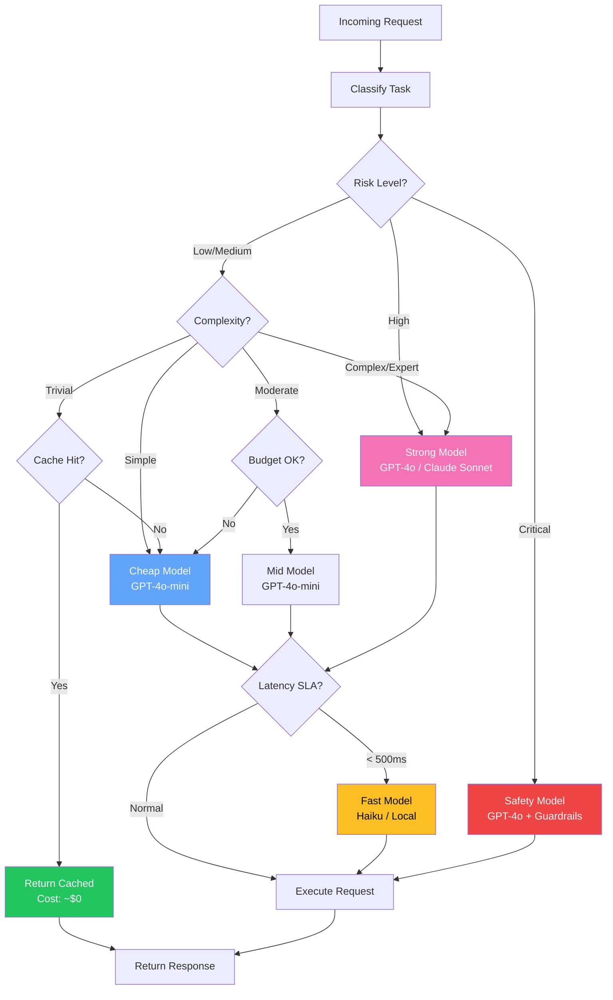
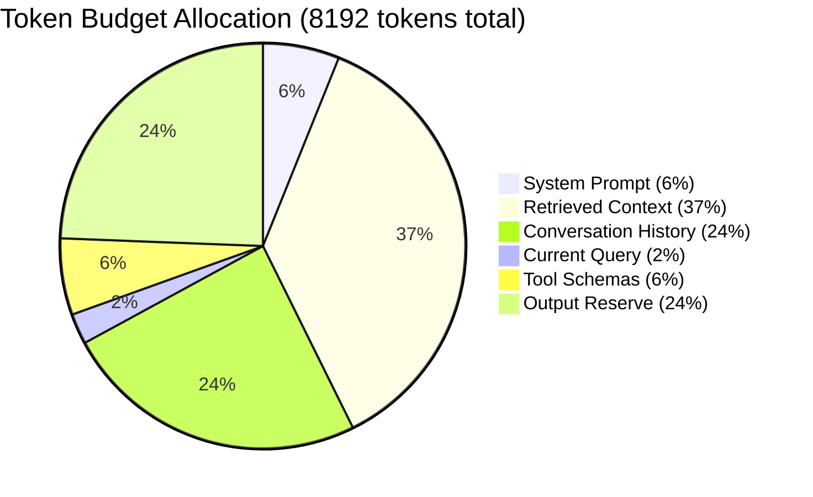
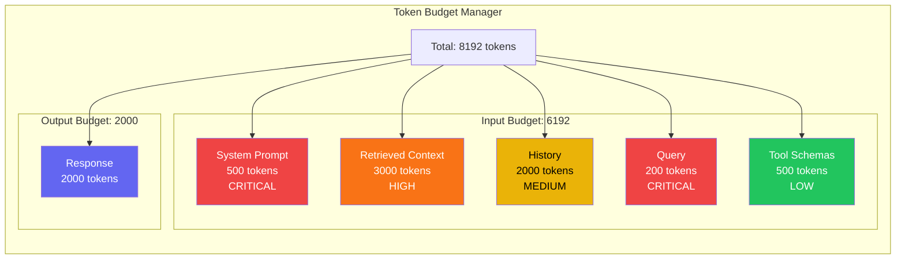
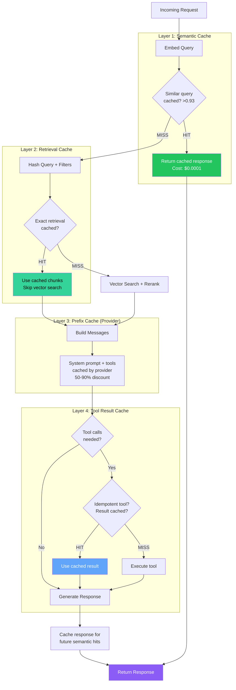
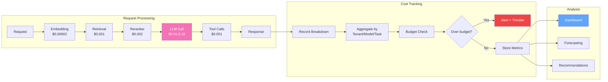
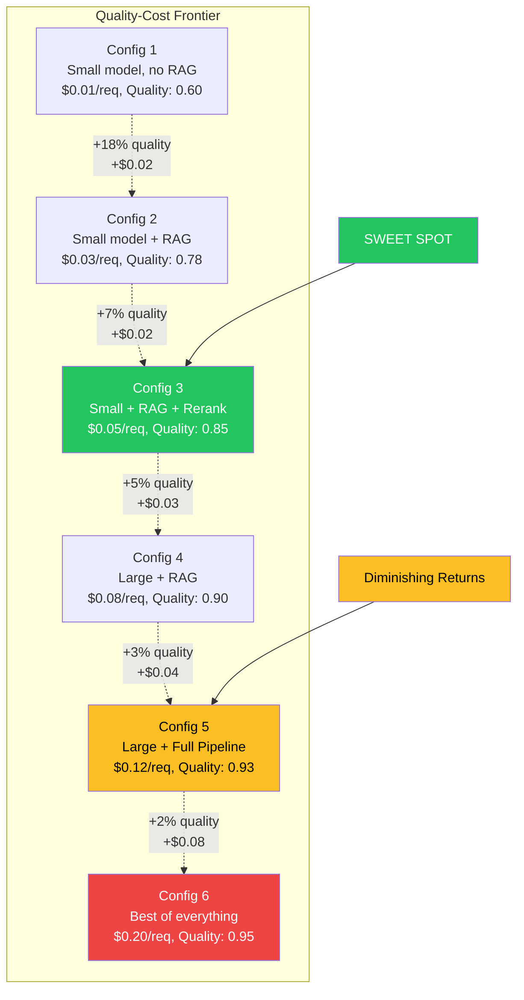
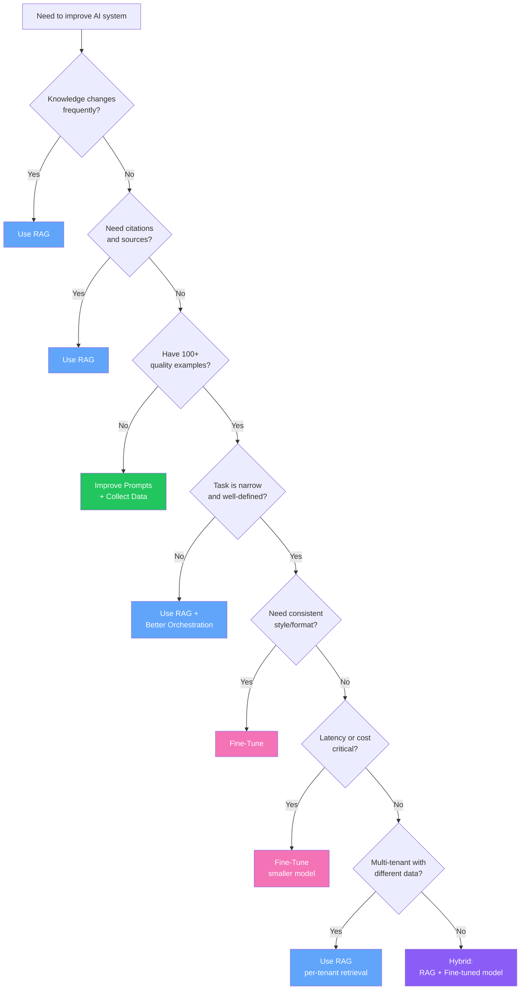
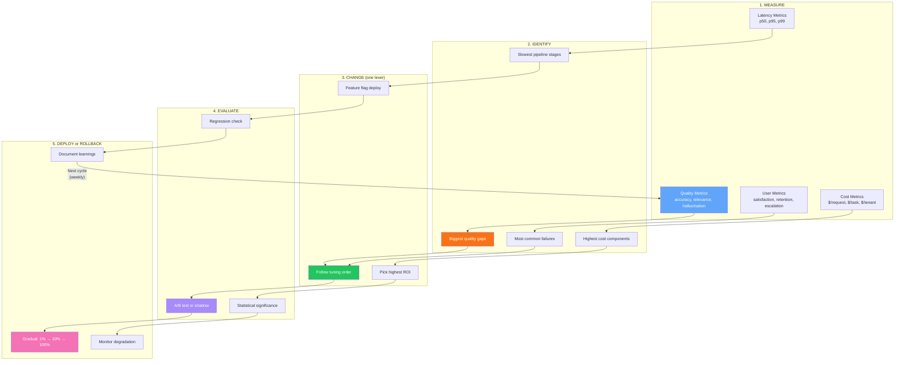
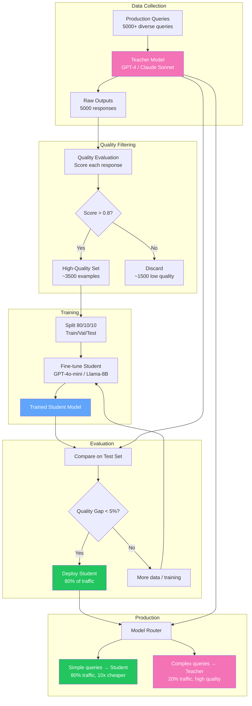

# Tuning and Optimization - Diagrams

## 1. Tuning Order Pyramid

```mermaid
graph TB
    subgraph "Tuning Order (Start from Bottom)"
        P[🏗️ PLATFORM<br/>Caching, batching, routing<br/>Cost: High | Impact: Medium]
        M[🤖 MODEL<br/>Fine-tuning, distillation<br/>Cost: High | Impact: Medium]
        A[🔧 AGENT<br/>Tool use, planning, orchestration<br/>Cost: Medium | Impact: Medium-High]
        PR[📝 PROMPT<br/>Instructions, examples, format<br/>Cost: Low | Impact: High]
        R[🔍 RETRIEVAL<br/>Chunking, indexing, reranking<br/>Cost: Medium | Impact: High]
        D[📊 DATA<br/>Clean, deduplicate, enrich<br/>Cost: Medium | Impact: Very High]
        PROD[🎯 PRODUCT<br/>Scope, UX, constraints<br/>Cost: Low | Impact: Massive]
    end

    PROD --> D --> R --> PR --> A --> M --> P

    style PROD fill:#22c55e,color:#fff
    style D fill:#34d399,color:#000
    style R fill:#60a5fa,color:#fff
    style PR fill:#818cf8,color:#fff
    style A fill:#a78bfa,color:#fff
    style M fill:#f472b6,color:#fff
    style P fill:#fb923c,color:#fff
```

## 2. Model Routing Decision Tree



## 3. Token Budget Allocation





## 4. Caching Architecture Layers



## 5. Cost Tracking Pipeline



## 6. Quality-Cost Frontier



## 7. Fine-Tuning vs RAG Decision Flowchart



## 8. Optimization Loop



## 9. Distillation Pipeline


