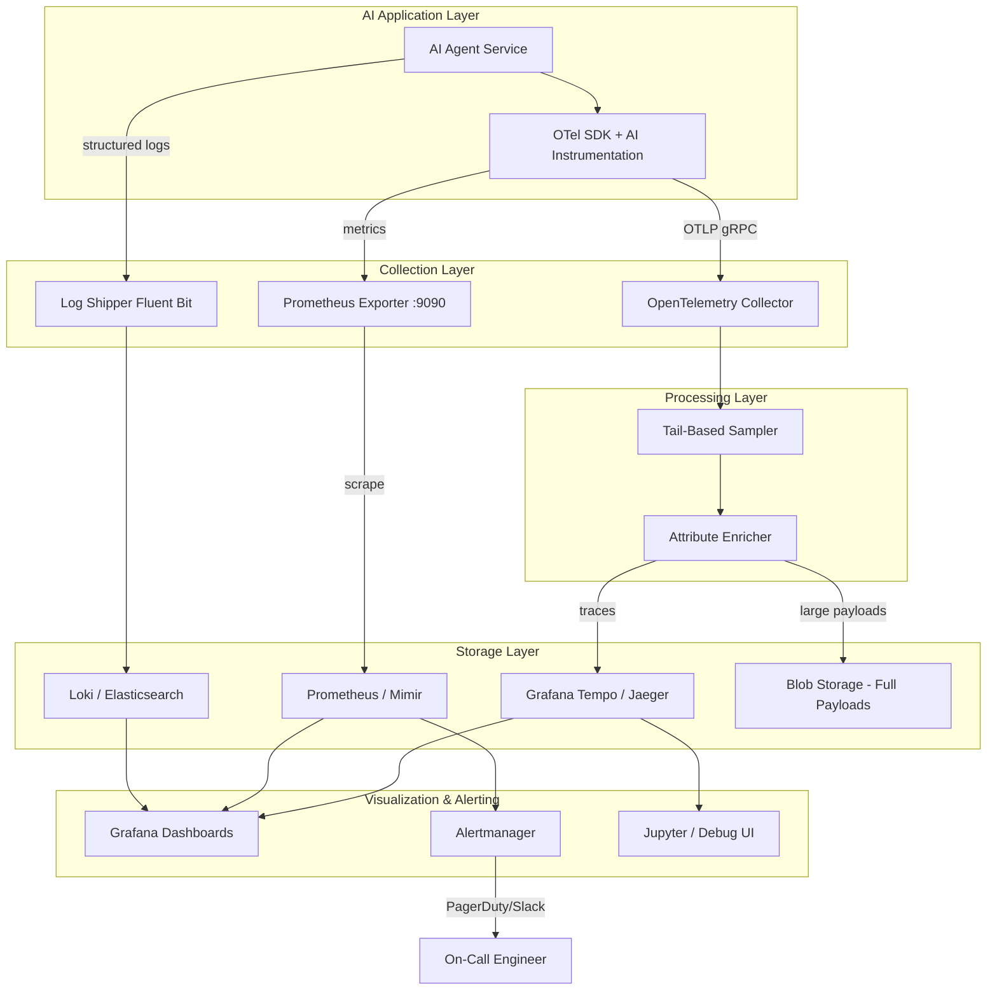
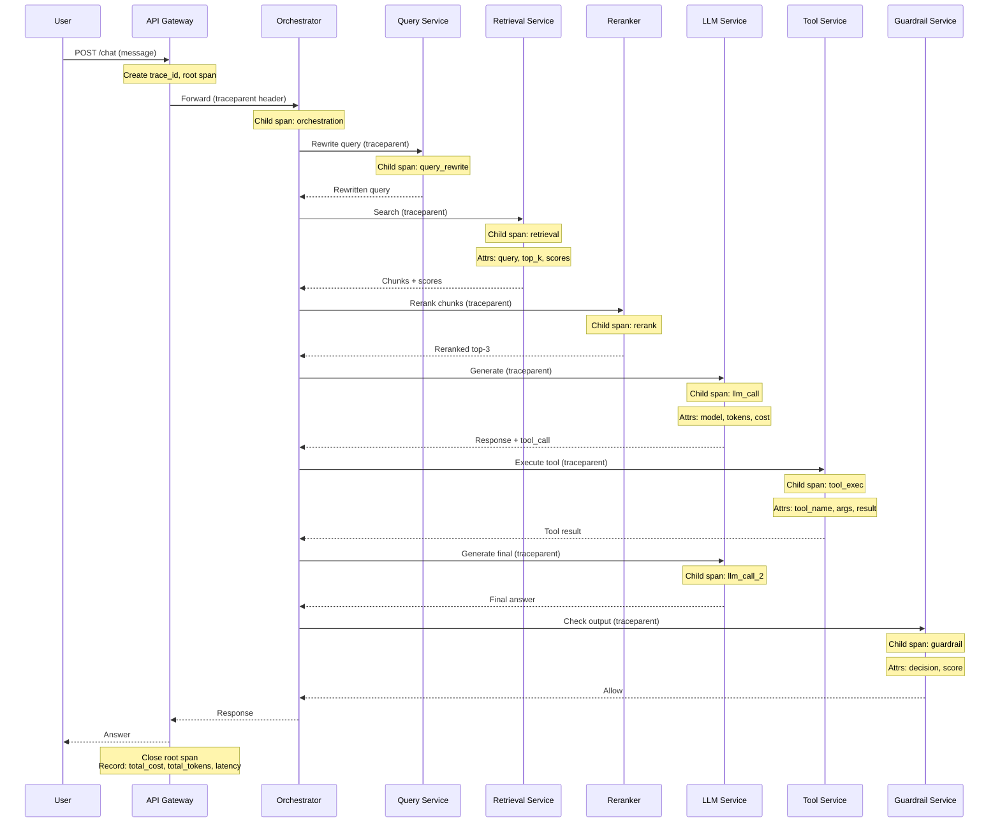
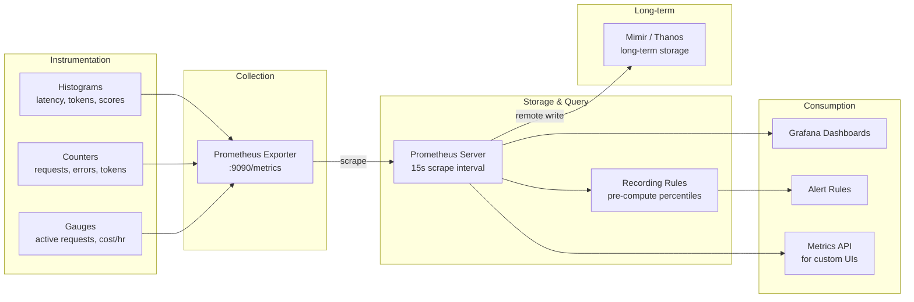
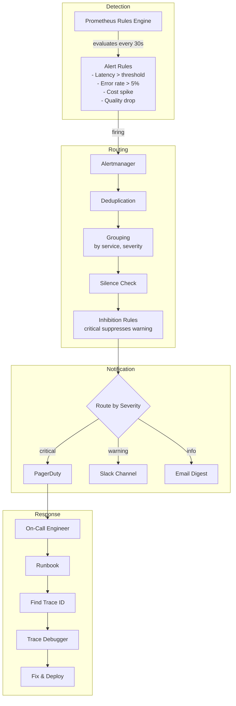
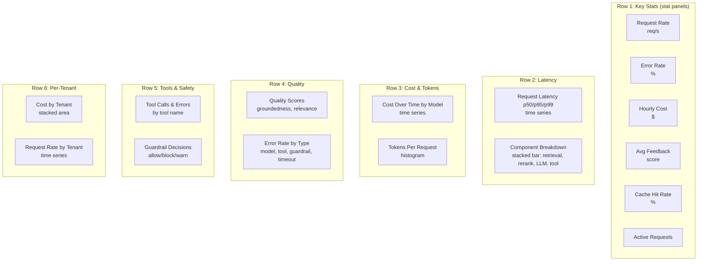
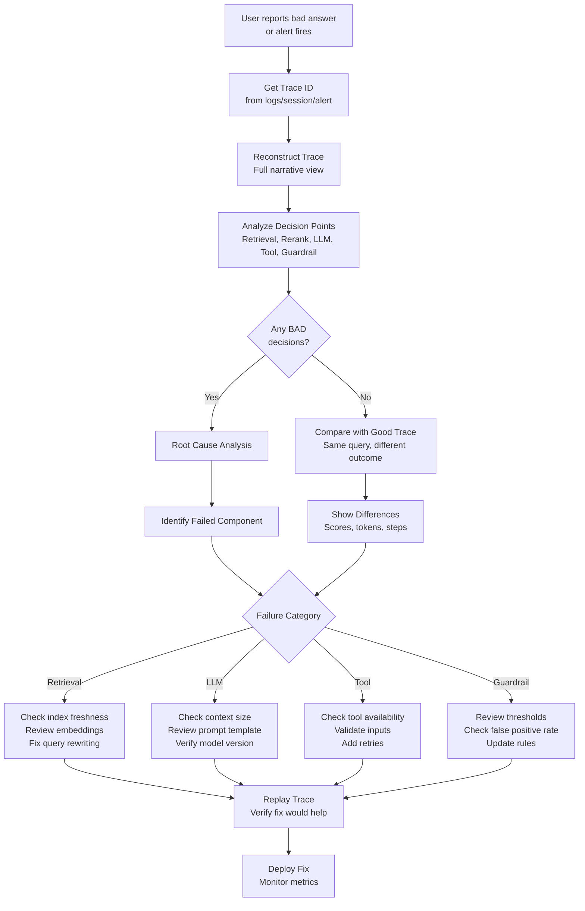
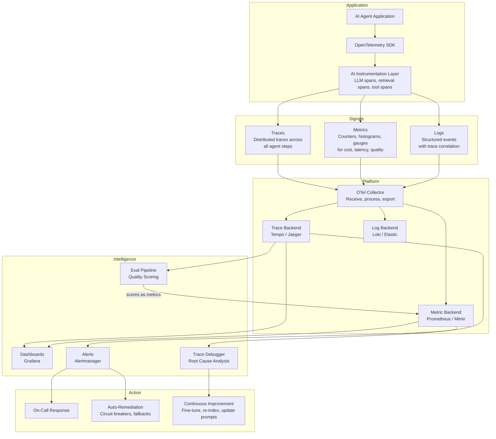

# Module 12: Observability Diagrams

## 1. Observability Architecture (Collection → Storage → Visualization)

## 2. Distributed Trace Through Agent System

## 3. Metrics Pipeline

## 4. Alert Flow

## 5. Dashboard Layout Design

## 6. Trace Debugging Workflow

## 7. AI Observability Stack

