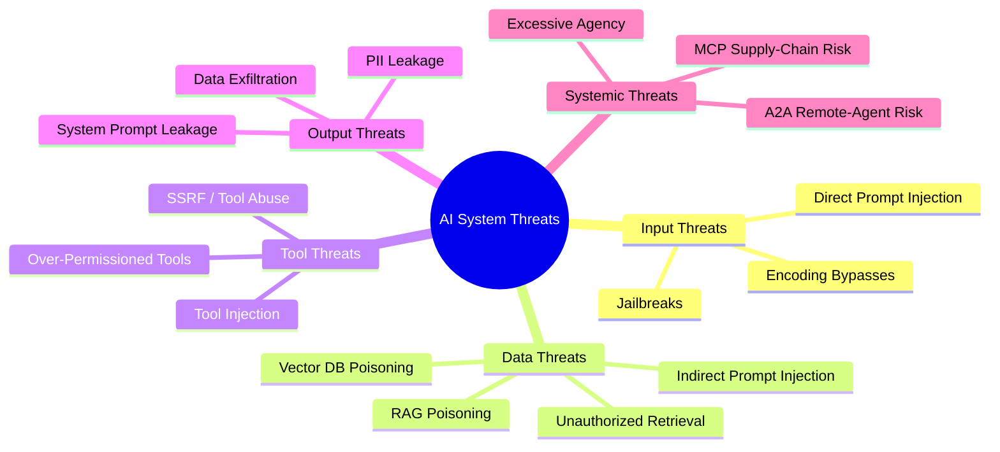
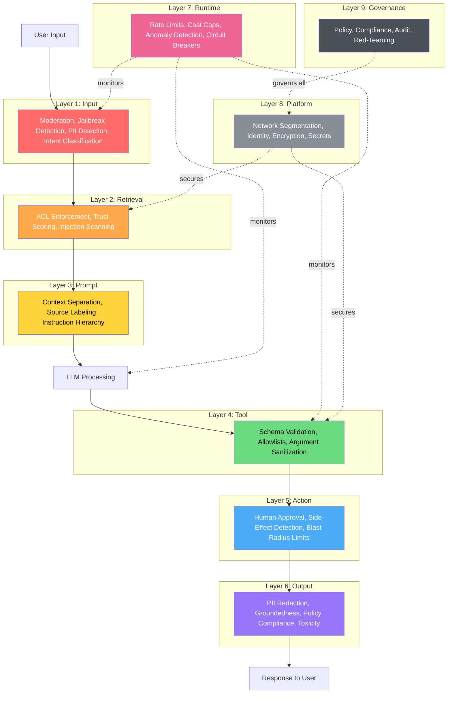
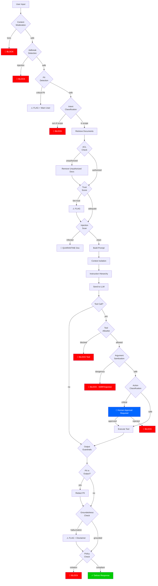
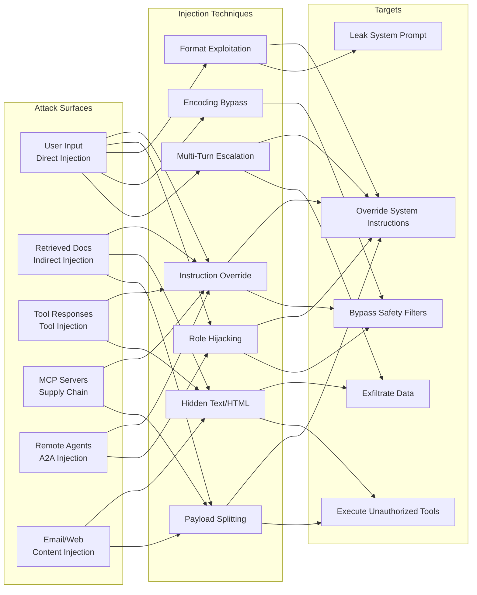
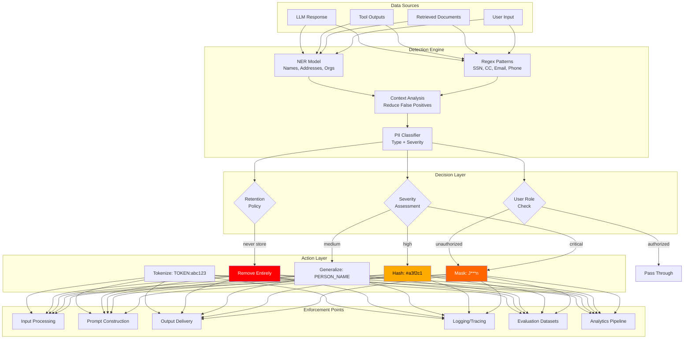
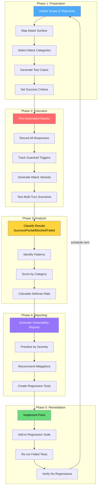
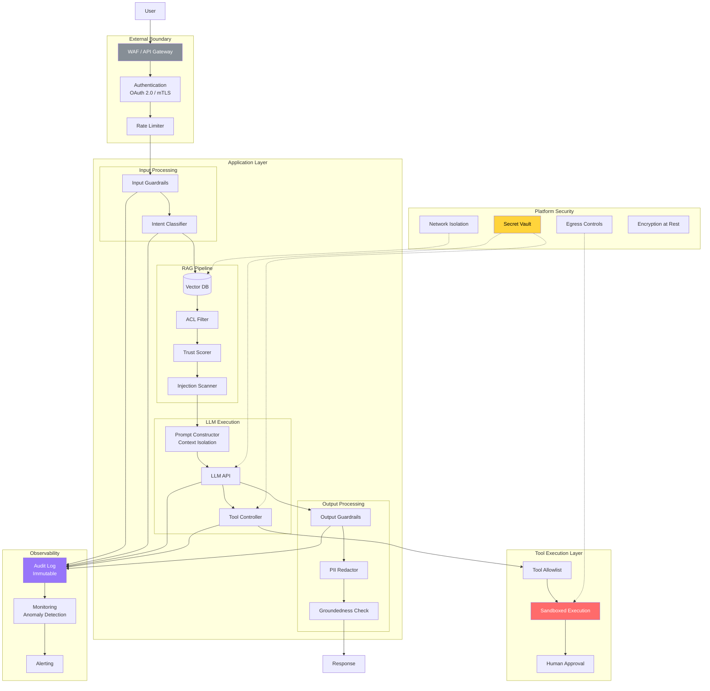
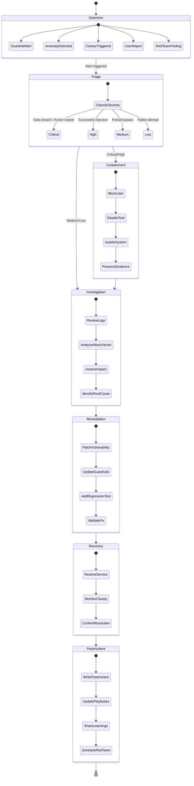

# Security & Guardrails - Architecture Diagrams

## 1. Threat Landscape Overview

## 2. Defense in Depth Layers

## 3. Guardrail Pipeline Flow

## 4. Prompt Injection Attack Vectors

## 5. PII Protection Architecture

## 6. Red Team Workflow

## 7. Security Architecture for AI Systems

## 8. Incident Response Flow for AI Security Events

## 9. Trust Boundary Model

```mermaid
flowchart TD
    subgraph "TRUSTED (Developer-Controlled)"
        SYS[System Prompt]
        CODE[Application Code]
        SCHEMA[Tool Schemas]
        POLICY[Security Policies]
    end
    
    subgraph "SEMI-TRUSTED (Verified Sources)"
        INTERNAL_DOCS[Internal Documents<br/>ACL-Controlled]
        VERIFIED_TOOLS[Verified MCP Servers<br/>Pinned Versions]
        AUTHED_USERS[Authenticated Users<br/>Role-Based]
    end
    
    subgraph "UNTRUSTED (External)"
        USER_INPUT[User Input]
        WEB[Web Content]
        EMAIL[Email Content]
        UPLOADED[User-Uploaded Docs]
        THIRD_PARTY[3rd Party Tools]
        REMOTE_AGENTS[Remote A2A Agents]
    end
    
    SYS -->|immutable context| LLM[LLM]
    CODE -->|controls flow| LLM
    SCHEMA -->|constrains tools| LLM
    
    INTERNAL_DOCS -->|ACL filtered| LLM
    VERIFIED_TOOLS -->|sandboxed| LLM
    AUTHED_USERS -->|rate limited| LLM
    
    USER_INPUT -->|validated + classified| LLM
    WEB -->|injection scanned| LLM
    EMAIL -->|injection scanned| LLM
    UPLOADED -->|quarantined + scanned| LLM
    THIRD_PARTY -->|sandboxed + monitored| LLM
    REMOTE_AGENTS -->|validated + isolated| LLM

    style SYS fill:#00cc00,color:#fff
    style CODE fill:#00cc00,color:#fff
    style SCHEMA fill:#00cc00,color:#fff
    style POLICY fill:#00cc00,color:#fff
    style INTERNAL_DOCS fill:#ffaa00,color:#000
    style VERIFIED_TOOLS fill:#ffaa00,color:#000
    style AUTHED_USERS fill:#ffaa00,color:#000
    style USER_INPUT fill:#ff0000,color:#fff
    style WEB fill:#ff0000,color:#fff
    style EMAIL fill:#ff0000,color:#fff
    style UPLOADED fill:#ff0000,color:#fff
    style THIRD_PARTY fill:#ff0000,color:#fff
    style REMOTE_AGENTS fill:#ff0000,color:#fff
```

