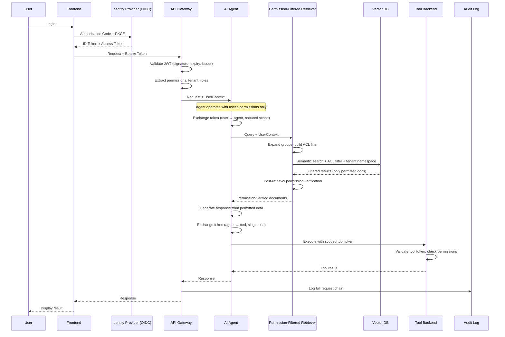
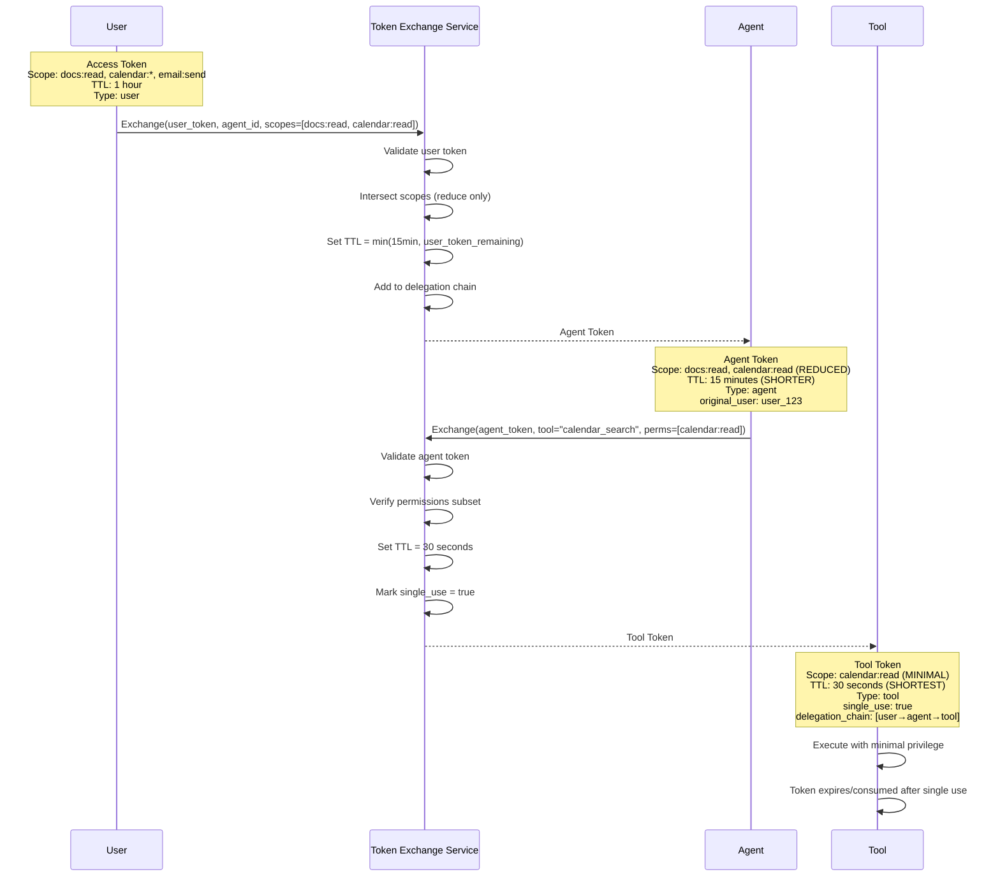
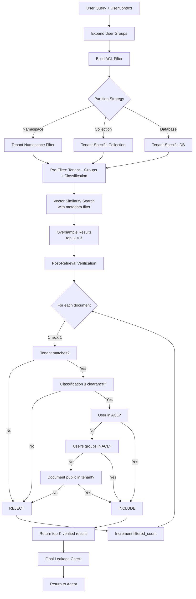
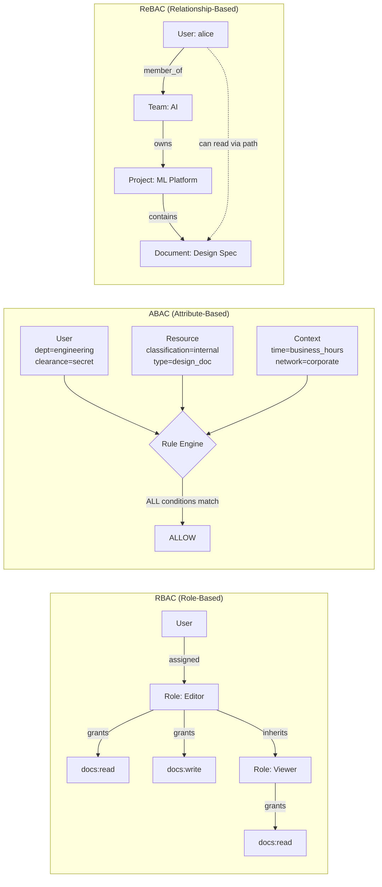
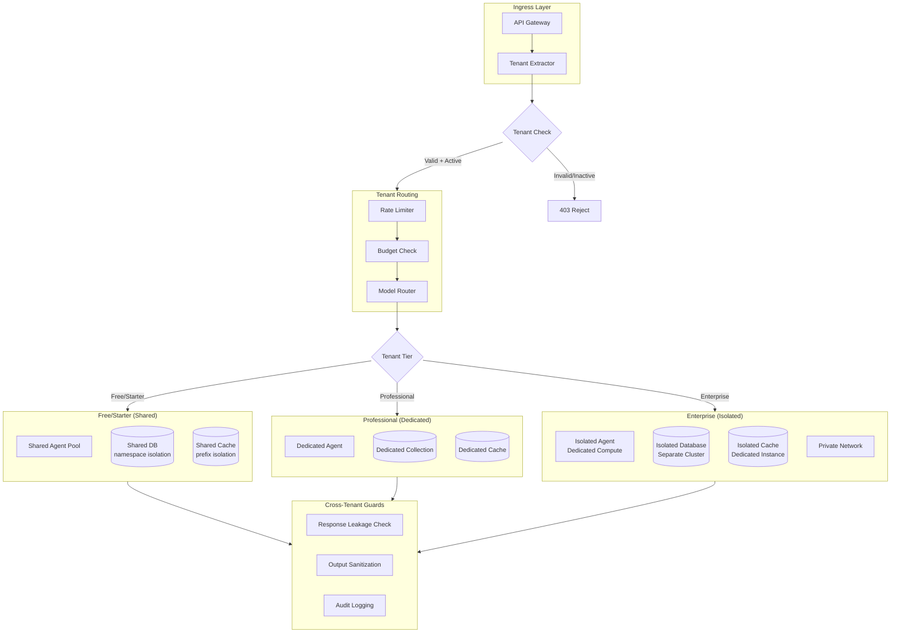
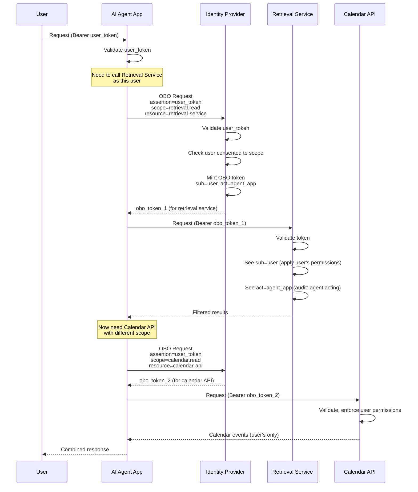
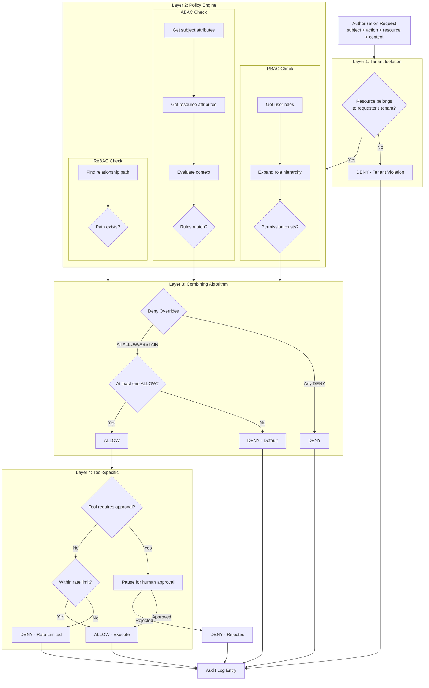
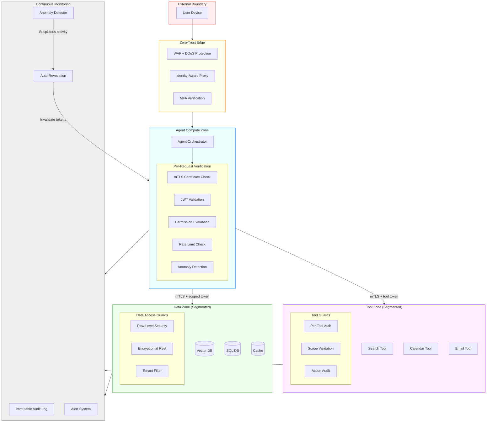

# Authentication & Authorization Diagrams

## 1. End-to-End Auth Flow in AI Systems

## 2. Token Exchange Flow (User → Agent → Tool)

## 3. Permission-Filtered Retrieval

## 4. RBAC / ABAC / ReBAC Comparison

## 5. Multi-Tenant Isolation Architecture

## 6. On-Behalf-Of Flow Sequence

## 7. Authorization Decision Flow

## 8. Zero-Trust Architecture for AI Agents

## Key Design Principles Summary

| Principle | Implementation |
|-----------|---------------|
| Never trust, always verify | Every hop validates identity + permissions |
| Least privilege | Each token has minimum scope for its task |
| Defense in depth | Multiple layers: tenant → policy → tool → data |
| Assume breach | Short-lived tokens, single-use where possible |
| Identity propagation | Original user identity flows through all layers |
| Audit everything | Every decision logged with full delegation chain |
| Fail closed | Default deny, explicit allow only |
| Separation of concerns | Auth decisions separated from business logic |
