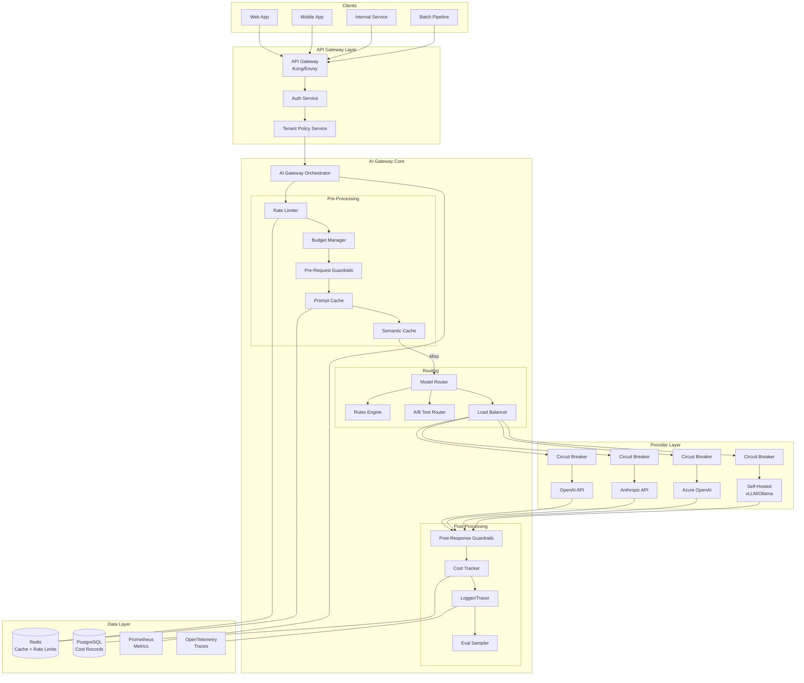
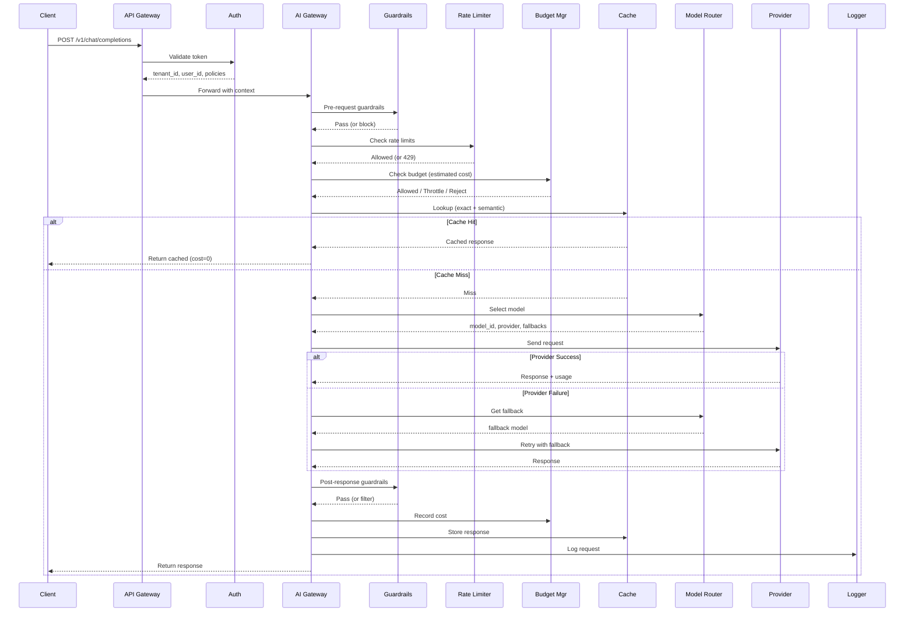
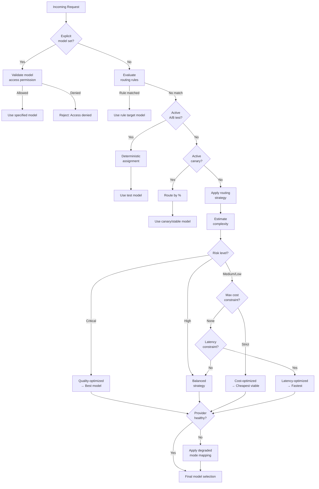
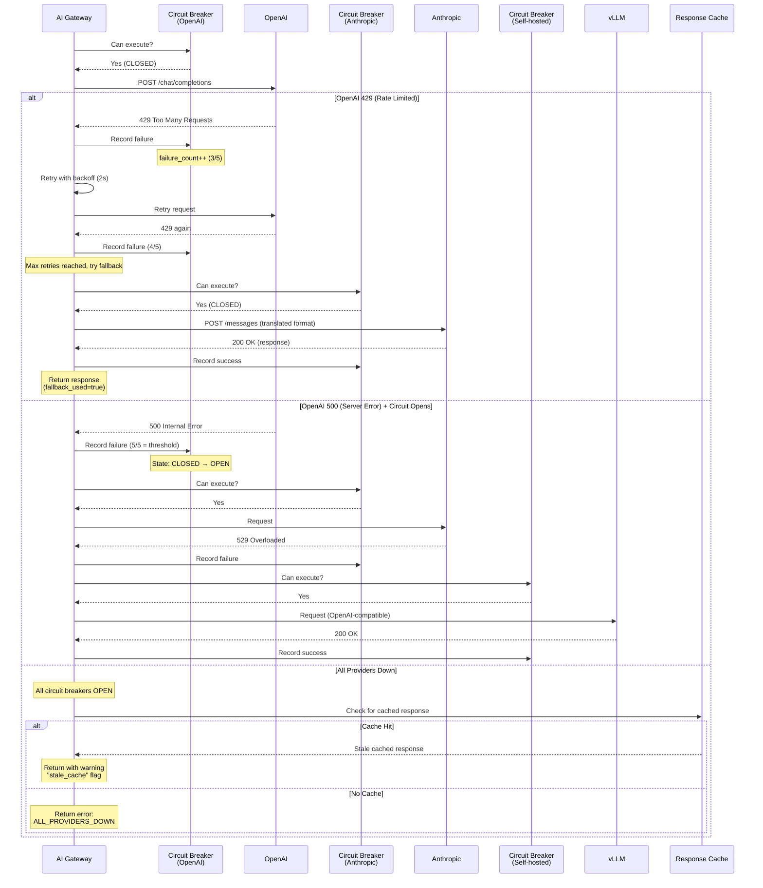
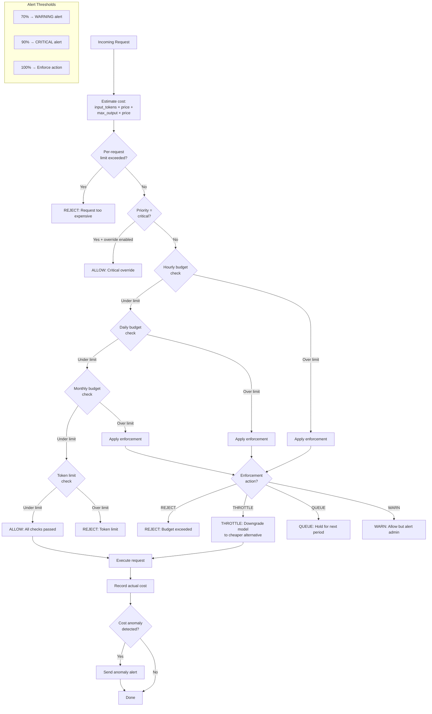
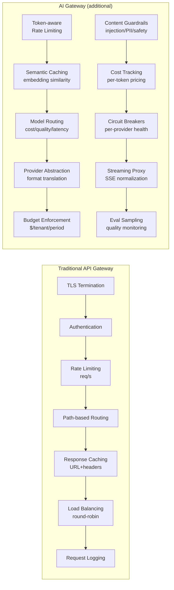
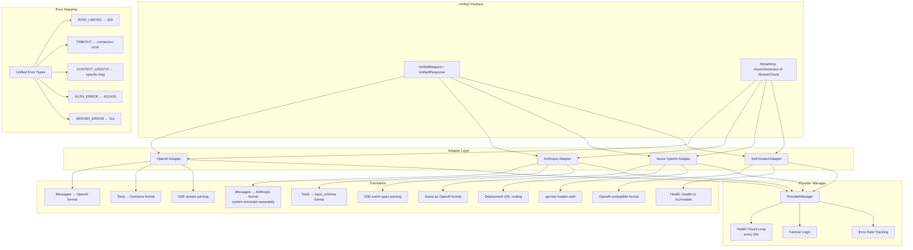

# AI Gateway - Architecture Diagrams

## 1. Full AI Gateway Architecture

## 2. Request Flow Through Gateway

## 3. Model Routing Decision Tree

## 4. Provider Fallback Sequence

## 5. Budget Enforcement Flow

## 6. AI Gateway vs API Gateway Comparison

## 7. Provider Abstraction Layer

## 8. Cost Tracking Pipeline

```mermaid
graph LR
    subgraph "Request Phase"
        R1[Incoming Request]
        R2[Estimate Tokens<br/>~4 chars = 1 token]
        R3[Lookup Model Pricing]
        R4[Pre-compute Max Cost<br/>input×price + max_output×price]
        R5[Budget Pre-check]
    end
    
    subgraph "Execution Phase"
        E1[Send to Provider]
        E2[Provider Response<br/>with actual usage]
        E3[Extract Token Counts<br/>prompt_tokens + completion_tokens]
    end
    
    subgraph "Cost Computation"
        C1[Actual Cost Calculation]
        C2[Apply Cache Discounts]
        C3[Input Cost = input_tokens/1K × input_price]
        C4[Output Cost = output_tokens/1K × output_price]
        C5[Total = Input + Output]
    end
    
    subgraph "Recording & Analytics"
        A1[Record to Cost Store]
        A2[Update Tenant Spend<br/>hourly/daily/monthly]
        A3[Anomaly Detection<br/>z-score check]
        A4[Emit Metrics<br/>Prometheus counters]
        A5[Attribution<br/>tenant/user/project/feature]
    end
    
    subgraph "Reporting"
        RP1[Real-time Dashboard]
        RP2[Cost Allocation Report]
        RP3[Forecast & Projections]
        RP4[Optimization Recommendations]
    end
    
    R1 --> R2 --> R3 --> R4 --> R5
    R5 -->|Allowed| E1 --> E2 --> E3
    E3 --> C1 --> C2 --> C3 & C4 --> C5
    C5 --> A1 --> A2 --> A3 --> A4 --> A5
    A5 --> RP1 & RP2 & RP3 & RP4
```

