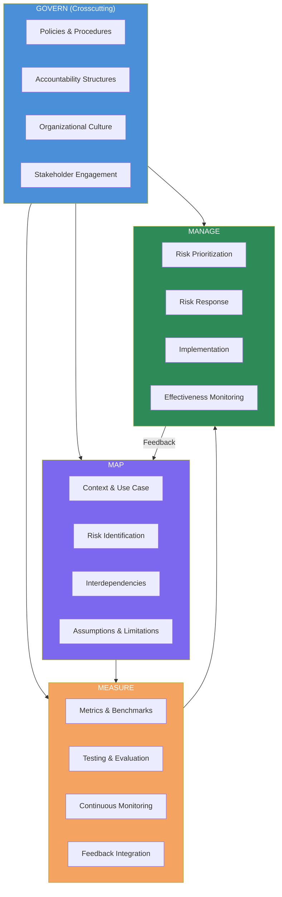
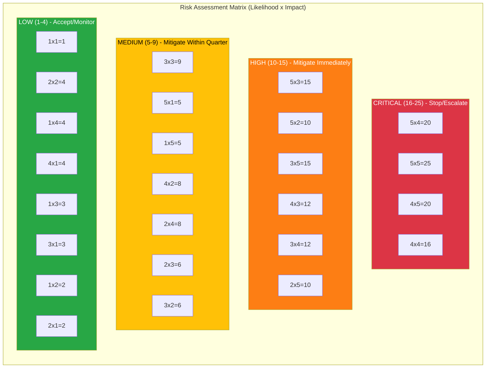
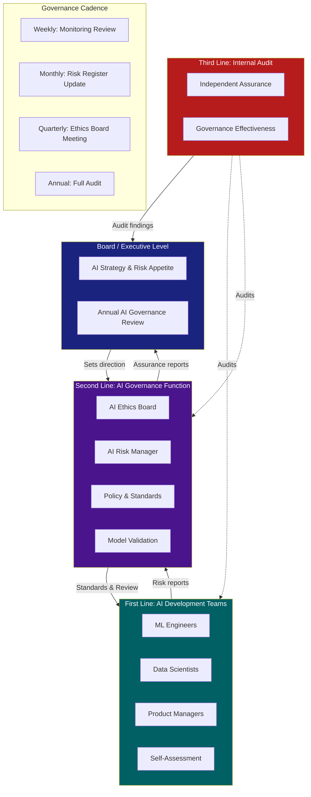
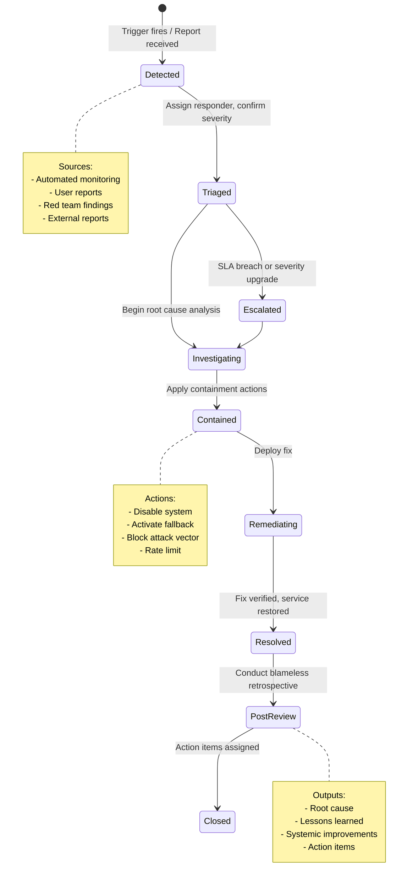
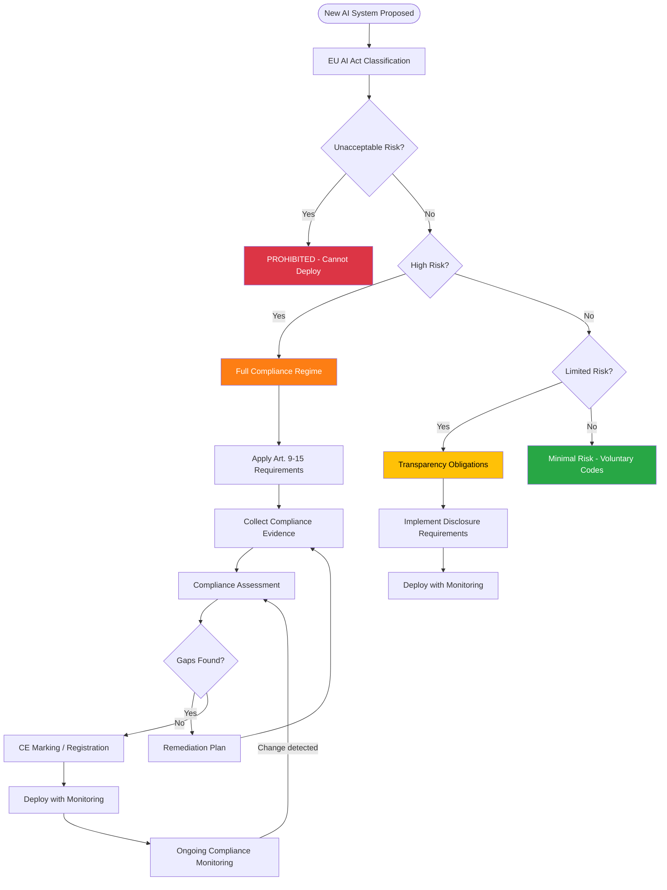
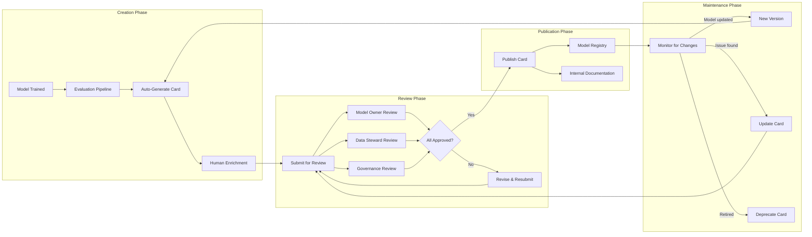
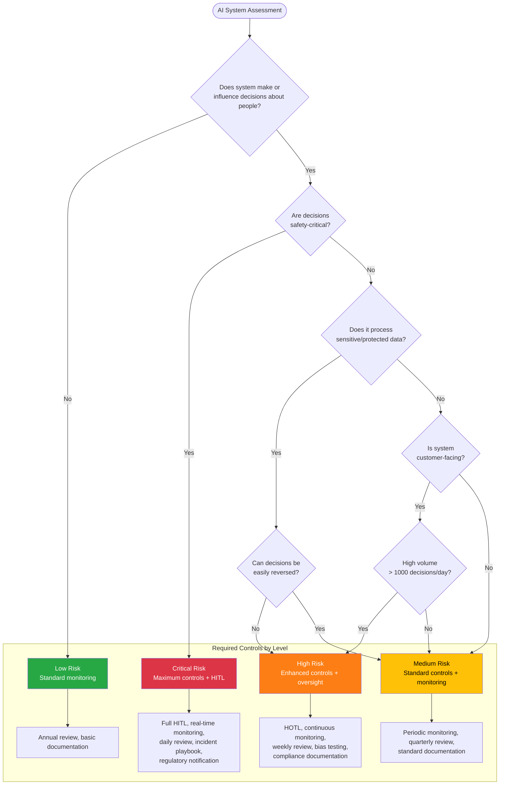
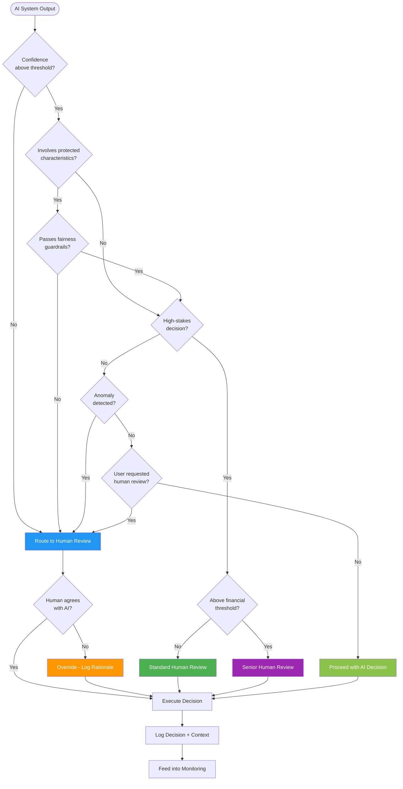

# Governance and Responsible AI - Diagrams

## 1. NIST AI Risk Management Framework Overview

## 2. Risk Assessment Matrix

## 3. Governance Operating Model

## 4. Incident Response Flow

## 5. Compliance Workflow

## 6. Model Card Lifecycle

## 7. AI Risk Classification Decision Tree

## 8. Human Oversight Decision Framework

