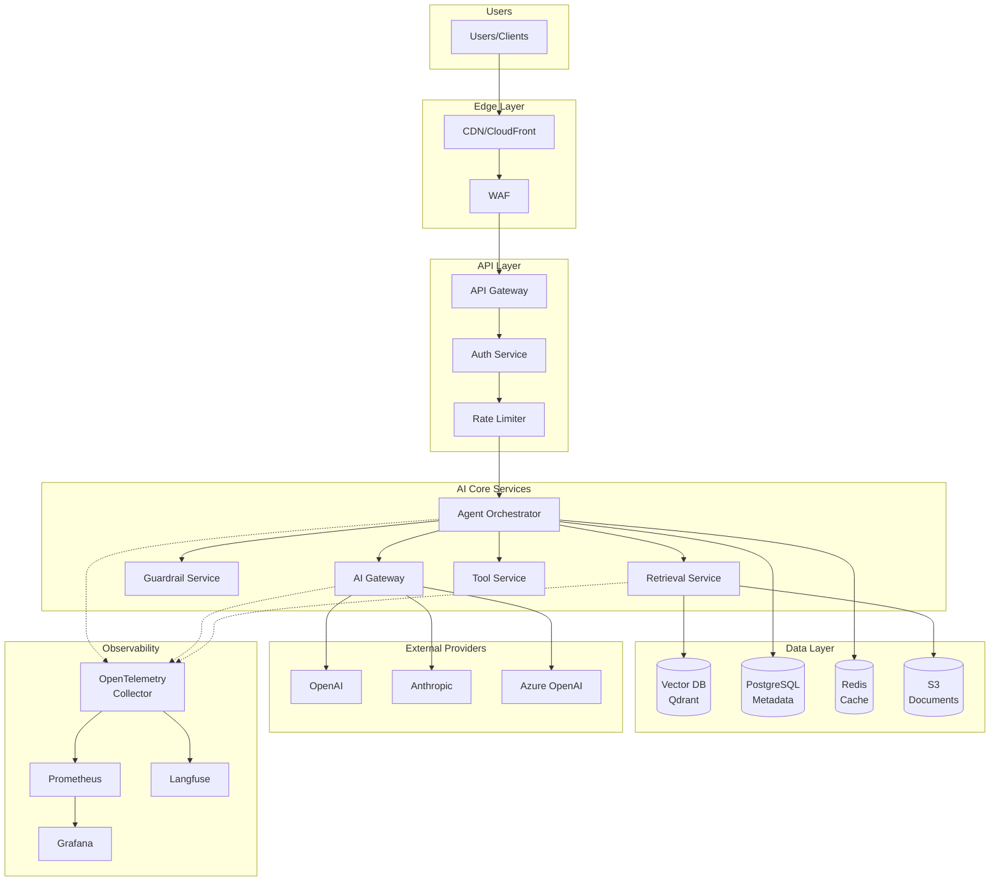
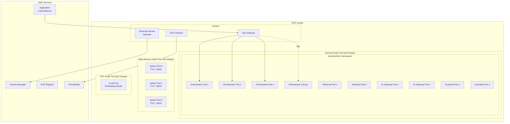
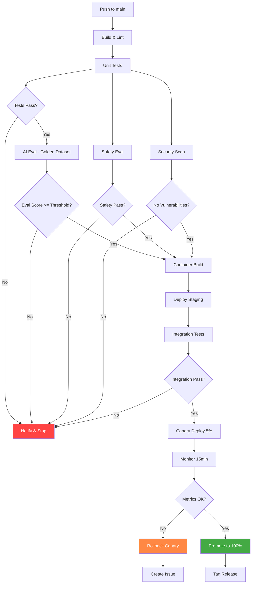
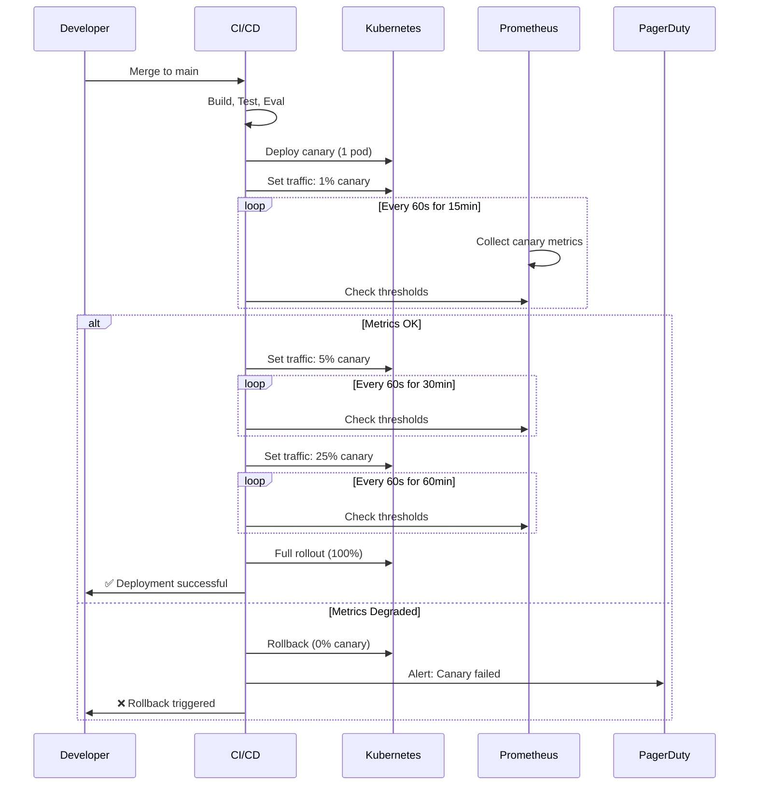
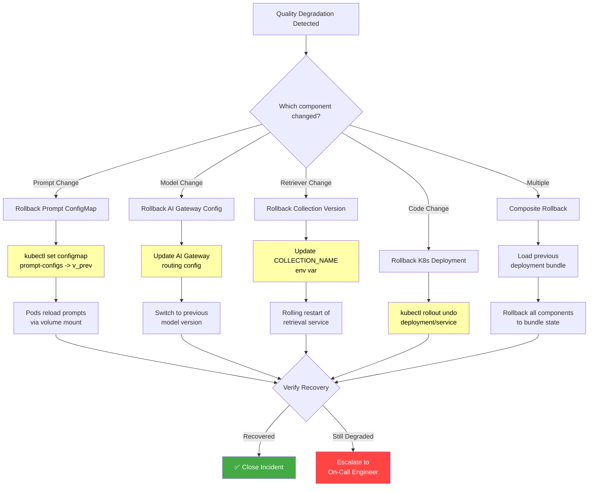
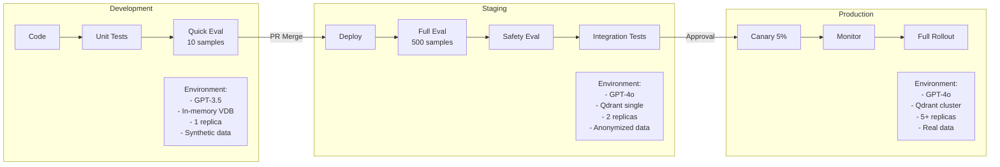
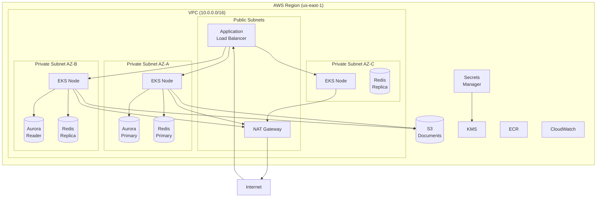
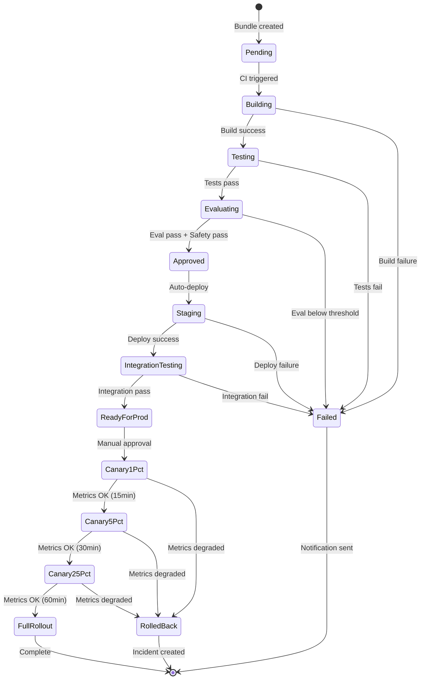

# Production Deployment Diagrams

## 1. Production System Architecture

## 2. Kubernetes Deployment Topology

## 3. CI/CD Pipeline Flow

## 4. Canary Deployment Progression

## 5. Rollback Decision Tree

## 6. Multi-Environment Strategy

## 7. Infrastructure Architecture

## 8. Deployment Lifecycle State Machine

