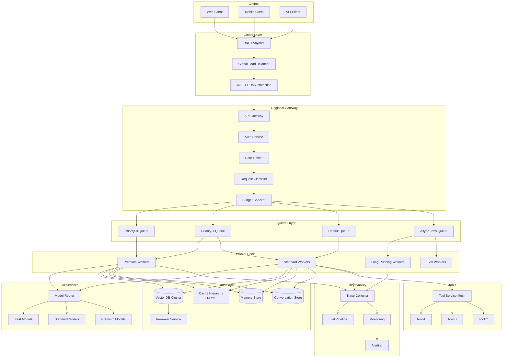
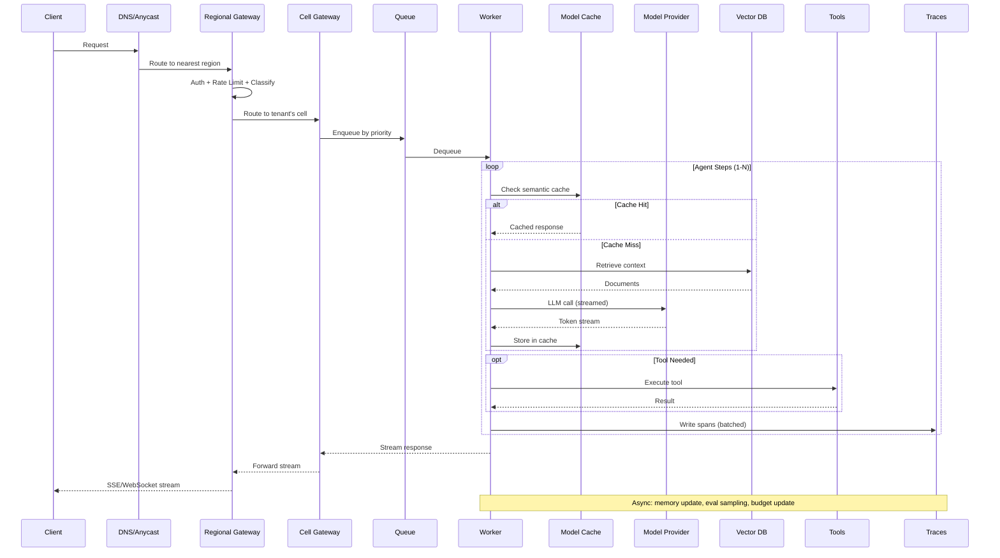
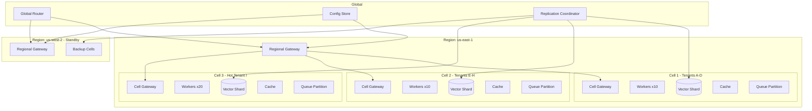
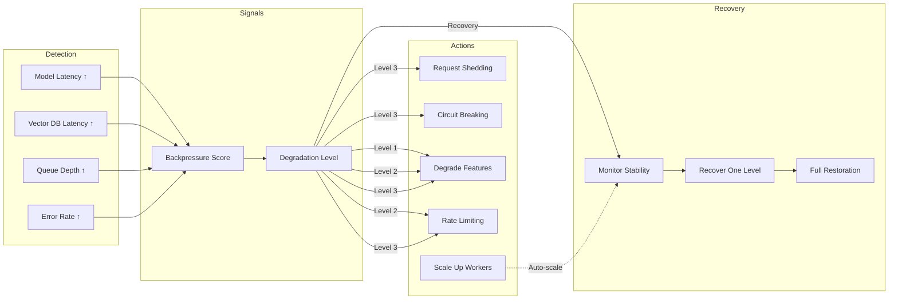
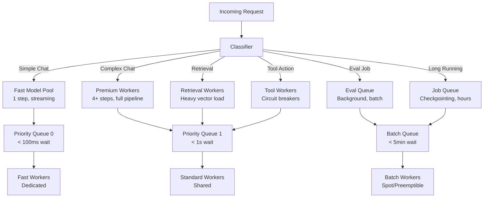
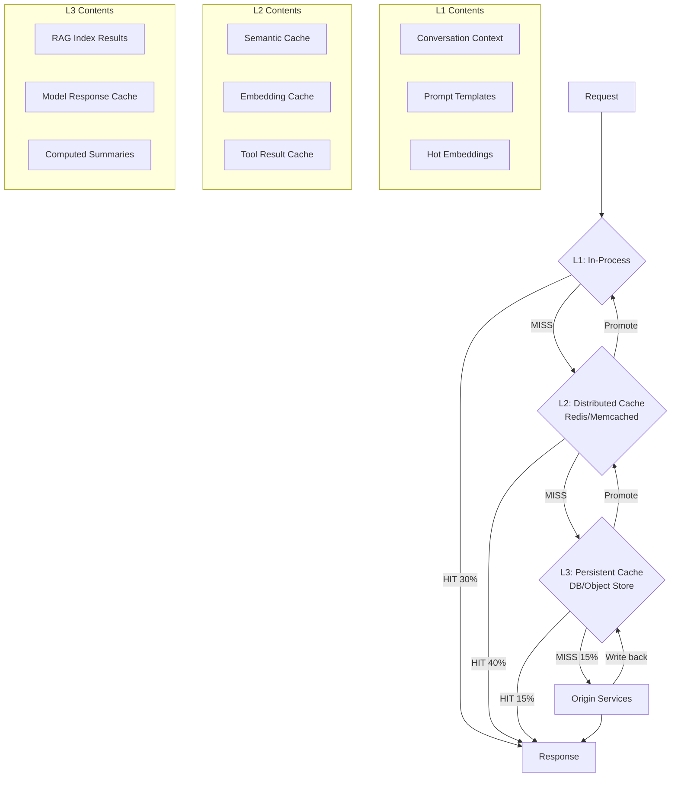
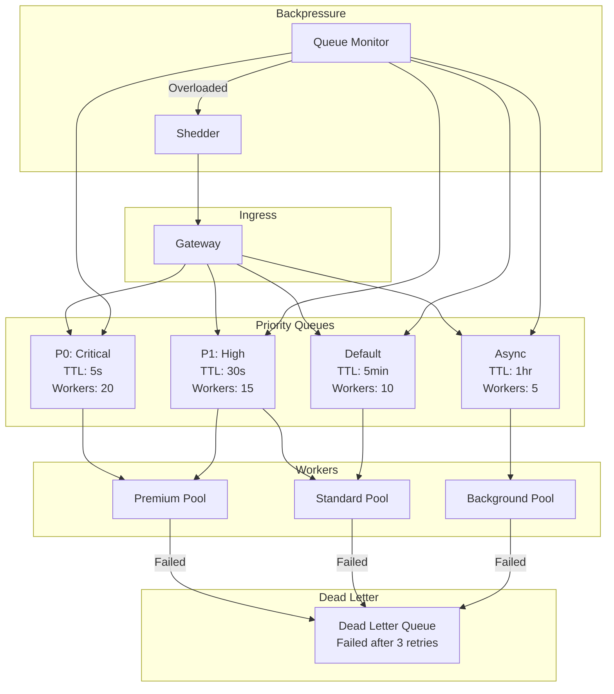
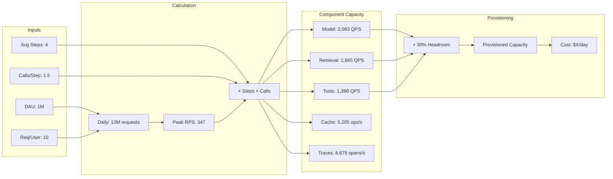
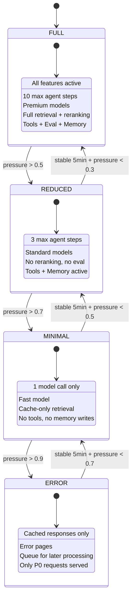

# Scaling Architecture Diagrams

## Million-User Architecture

## Billion-Request Flow Path

## Cell-Based Architecture

## Backpressure Cascading

## Request Classification Routing

## Cache Hierarchy

## Queue Architecture

## Capacity Planning Model

## Degraded Mode Levels

