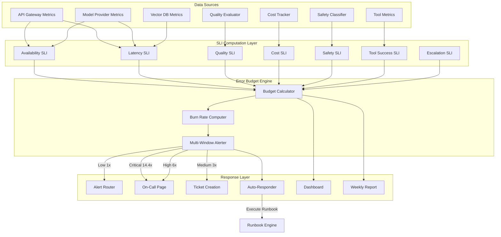
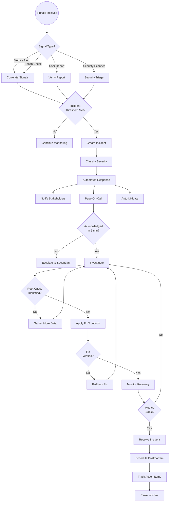
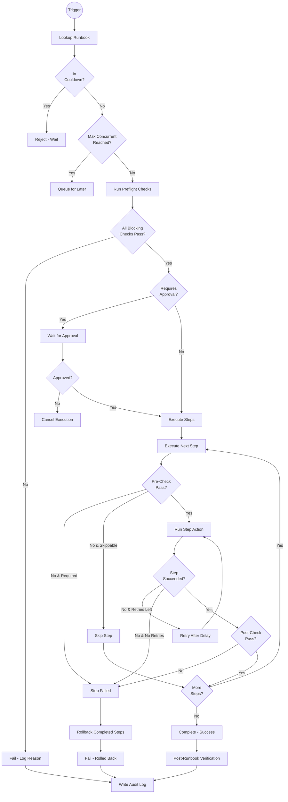
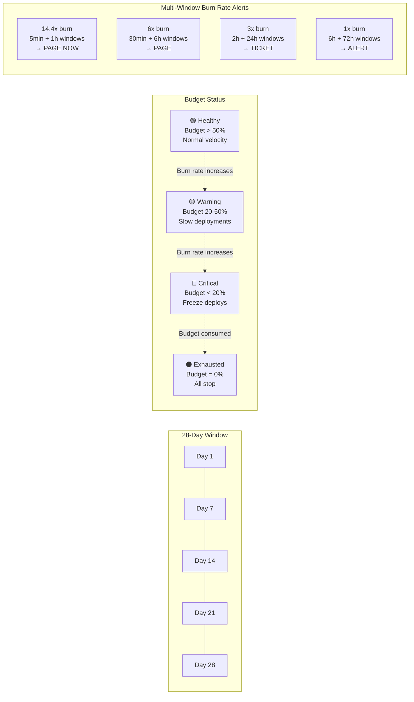
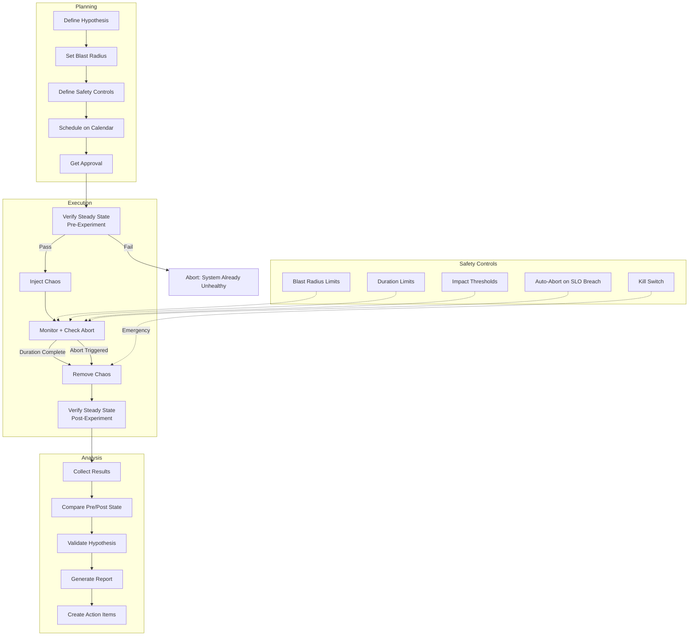
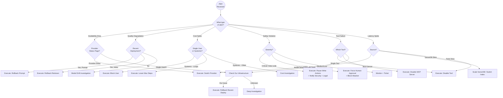
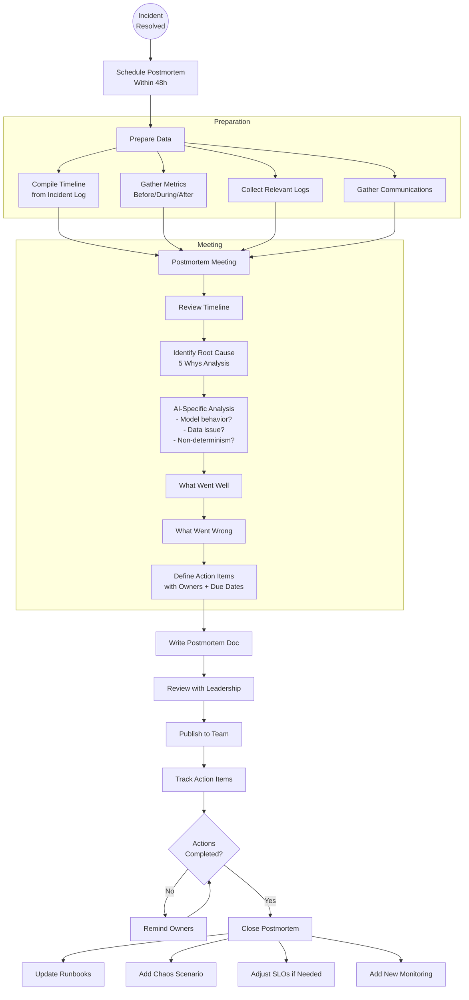

# AI SRE - Diagrams

## 1. SLO Monitoring Architecture

## 2. Incident Response Flow

## 3. Runbook Execution Flow

## 4. Error Budget Burn Rate Visualization

## 5. Chaos Engineering Process

## 6. On-Call Decision Tree

## 7. AI System Failure Modes

```mermaid
graph TB
    subgraph "Infrastructure Failures"
        IF1[Model Provider Outage]
        IF2[Vector DB Outage]
        IF3[Embedding Service Down]
        IF4[Network Partition]
        IF5[Rate Limit Exhaustion]
    end

    subgraph "Data/Quality Failures"
        DF1[Bad Prompt Deployment]
        DF2[Index Corruption]
        DF3[Embedding Mismatch]
        DF4[Poisoned Documents]
        DF5[Stale Cache]
    end

    subgraph "Behavioral Failures"
        BF1[Runaway Agent Loop]
        BF2[Hallucination Spike]
        BF3[Tool Misuse]
        BF4[Incorrect Escalation]
        BF5[Context Window Overflow]
    end

    subgraph "Security Failures"
        SF1[Prompt Injection]
        SF2[Data Leakage]
        SF3[Tool Permission Exploit]
        SF4[PII Exposure]
        SF5[Cross-Tenant Access]
    end

    subgraph "Impact"
        UNAVAIL[Unavailability]
        DEGRADED[Quality Degradation]
        COST_IMP[Cost Spike]
        SAFETY_IMP[Safety Violation]
        TRUST[Trust Erosion]
    end

    IF1 --> UNAVAIL
    IF2 --> DEGRADED
    IF3 --> DEGRADED
    IF5 --> UNAVAIL

    DF1 --> DEGRADED
    DF2 --> DEGRADED
    DF4 --> SAFETY_IMP

    BF1 --> COST_IMP
    BF2 --> TRUST
    BF3 --> SAFETY_IMP

    SF1 --> SAFETY_IMP
    SF2 --> SAFETY_IMP
    SF2 --> TRUST
    SF5 --> SAFETY_IMP
```

## 8. Postmortem Workflow

