# Inference Economics - Diagrams

## 1. KV Cache Memory Management (PagedAttention)

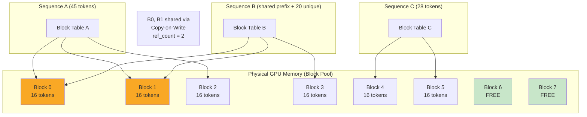

## 2. Continuous Batching Timeline

```mermaid
gantt
    title Continuous Batching - Iteration-Level Scheduling
    dateFormat X
    axisFormat %s

    section Request A
    Prefill (500 tok)    :a1, 0, 1
    Decode (50 tok)      :a2, 1, 3
    Complete ✓           :milestone, 3, 0

    section Request B
    Prefill (200 tok)    :b1, 0, 1
    Decode (200 tok)     :b2, 1, 7
    Complete ✓           :milestone, 7, 0

    section Request C
    Queue (waiting)      :c0, 0, 3
    Prefill (300 tok)    :c1, 3, 4
    Decode (80 tok)      :c2, 4, 6
    Complete ✓           :milestone, 6, 0

    section Request D
    Queue (waiting)      :d0, 0, 6
    Prefill (100 tok)    :d1, 6, 7
    Decode (30 tok)      :d2, 7, 8
    Complete ✓           :milestone, 8, 0

    section GPU Batch
    [A,B] batch=2        :g1, 0, 3
    [B,C] batch=2        :g2, 3, 6
    [B,D] batch=2        :g3, 6, 7
    [D] batch=1          :g4, 7, 8
```

## 3. Tensor Parallelism vs Pipeline Parallelism

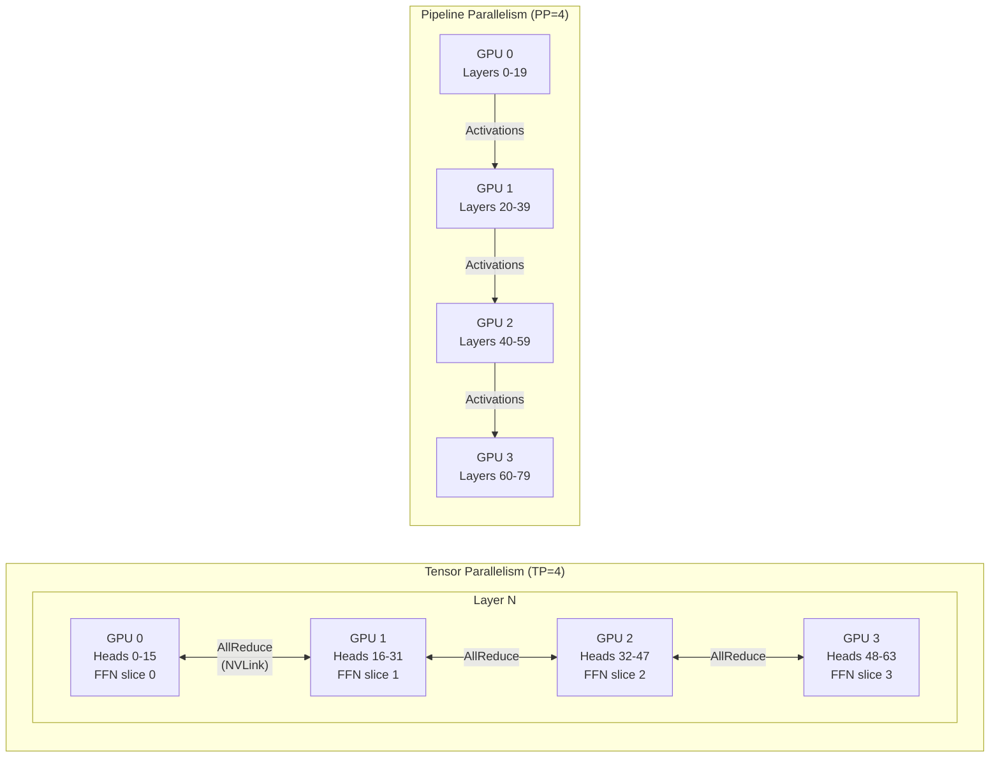

## 4. GPU Serving Architecture

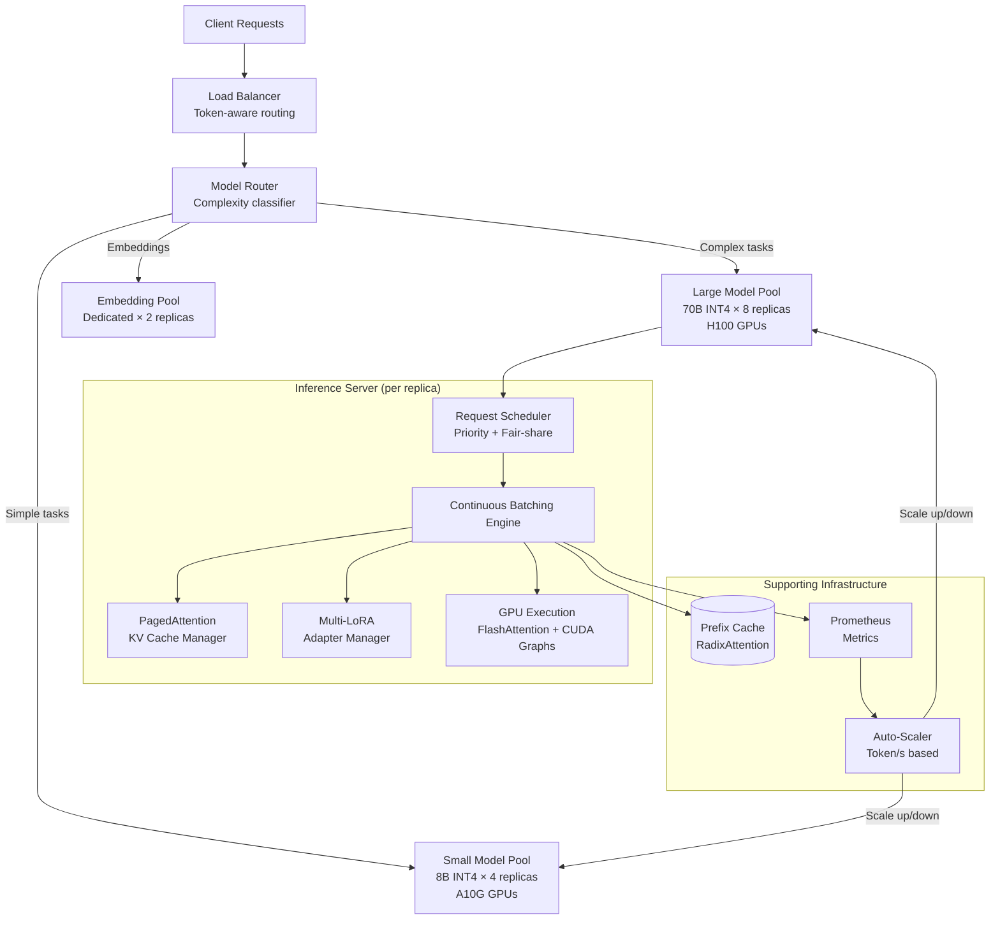

## 5. Cost Breakdown Waterfall

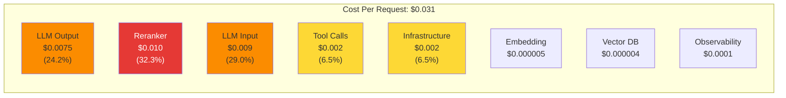

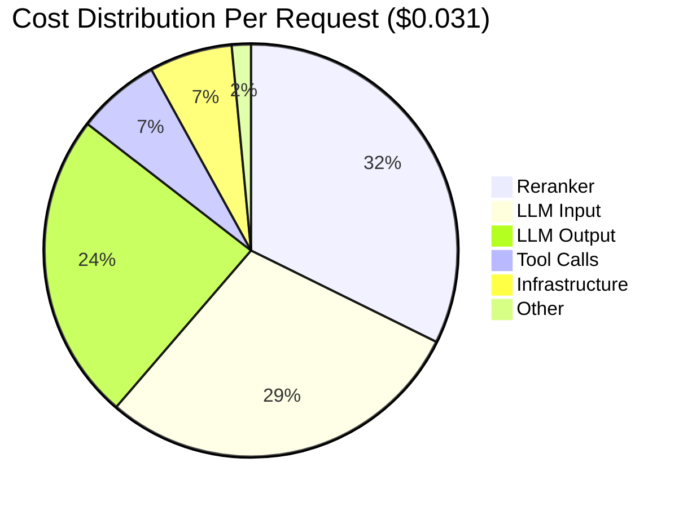

## 6. Self-Hosted vs Managed Decision Tree

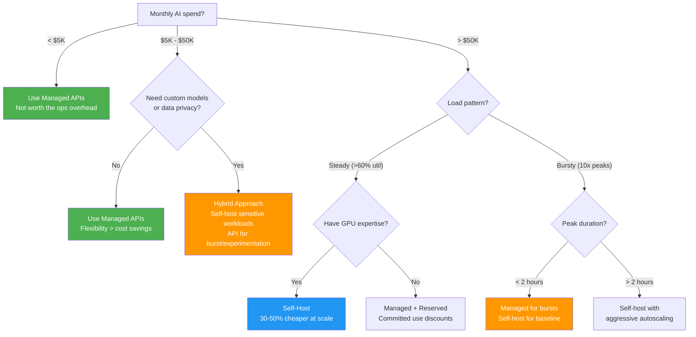

## 7. Inference Optimization Loop

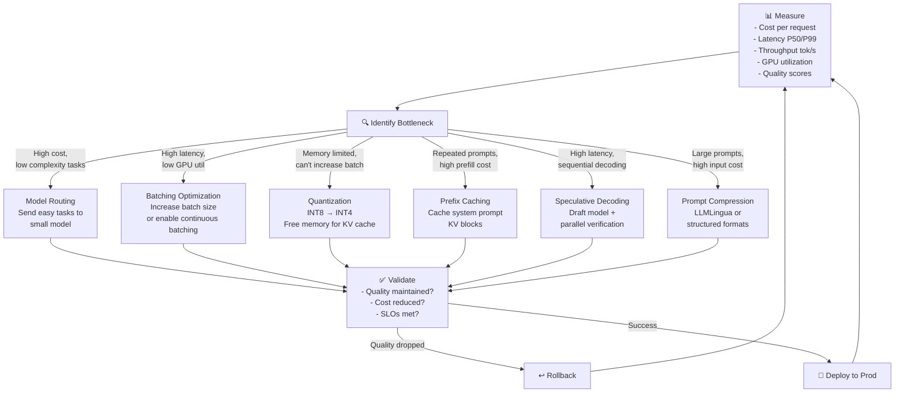

## 8. Auto-Scaling Architecture

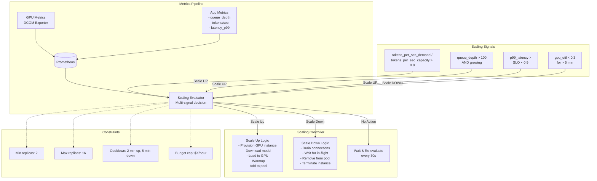

## 9. Multi-Model Serving Topology

```mermaid
graph TB
    subgraph "Request Ingress"
        API[API Gateway] --> Classifier[Task Complexity<br/>Classifier<br/>(lightweight rules/model)]
    end
    
    subgraph "GPU Node 1 (8× H100)"
        direction TB
        N1_M1["GPU 0-3: LLaMA-70B INT4<br/>+ 15 LoRA adapters<br/>TP=4"]
        N1_M2["GPU 4-5: LLaMA-70B INT4<br/>Replica 2, TP=2"]
        N1_M3["GPU 6: Embedding Model<br/>+ Reranker"]
        N1_M4["GPU 7: Draft Model (7B)<br/>for speculative decoding"]
    end
    
    subgraph "GPU Node 2 (8× A100)"
        direction TB
        N2_M1["GPU 0-3: Mixtral-8x7B<br/>TP=4 (medium tasks)"]
        N2_M2["GPU 4-7: LLaMA-8B × 4<br/>One per GPU (simple tasks)"]
    end
    
    subgraph "Fallback (API)"
        F1[OpenAI GPT-4o<br/>Primary fallback]
        F2[Anthropic Claude<br/>Secondary fallback]
    end
    
    Classifier -->|"Complex"| N1_M1
    Classifier -->|"Complex (overflow)"| N1_M2
    Classifier -->|"Medium"| N2_M1
    Classifier -->|"Simple"| N2_M2
    Classifier -->|"Embedding/Rerank"| N1_M3
    
    N1_M1 -->|"Timeout/Error"| F1
    N1_M2 -->|"Timeout/Error"| F1
    F1 -->|"Rate limited"| F2
    
    N1_M4 -.->|"Speculative<br/>drafts"| N1_M1
```

## 10. Speculative Decoding Flow

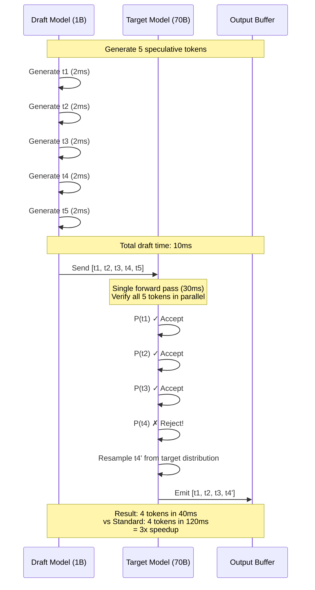

## 11. GPU Memory Layout

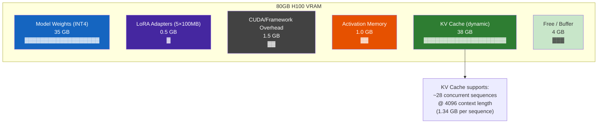
