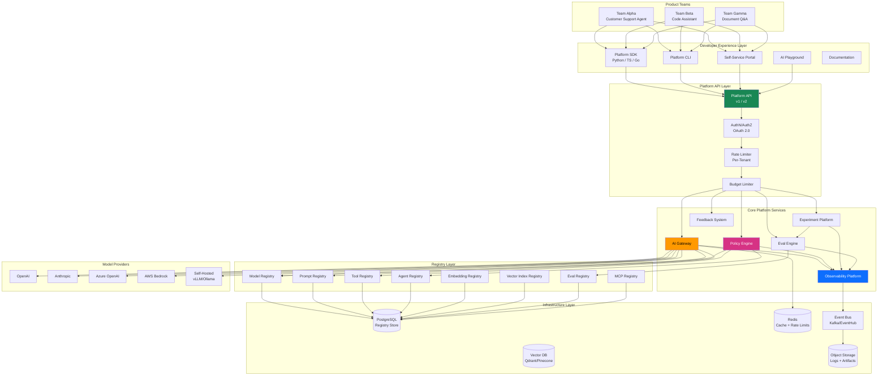
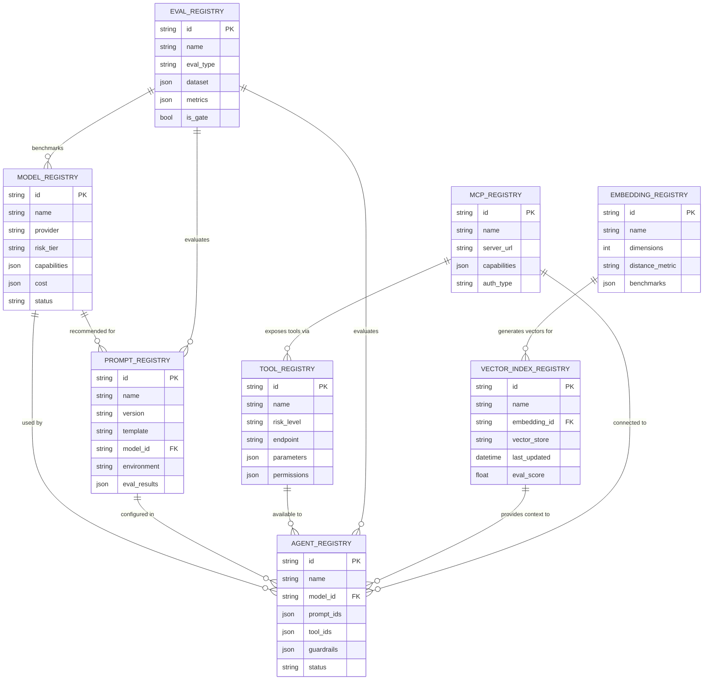
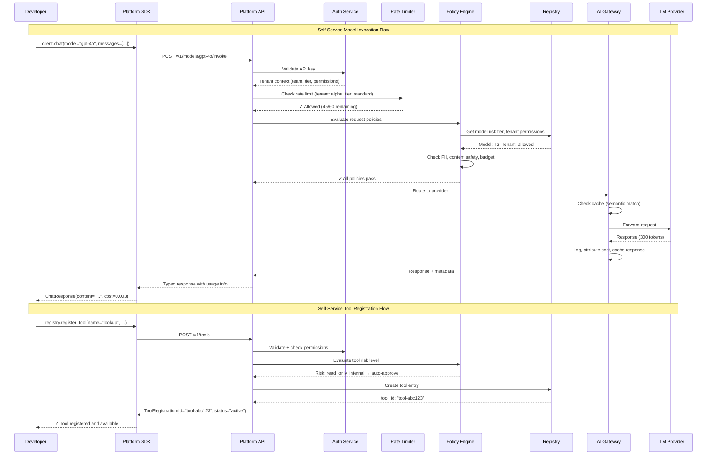
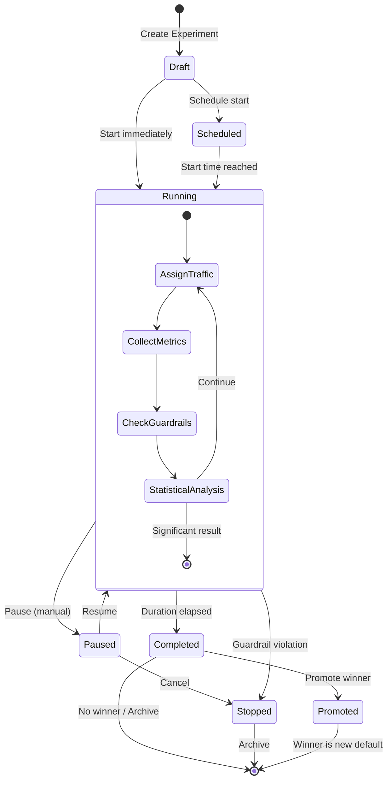
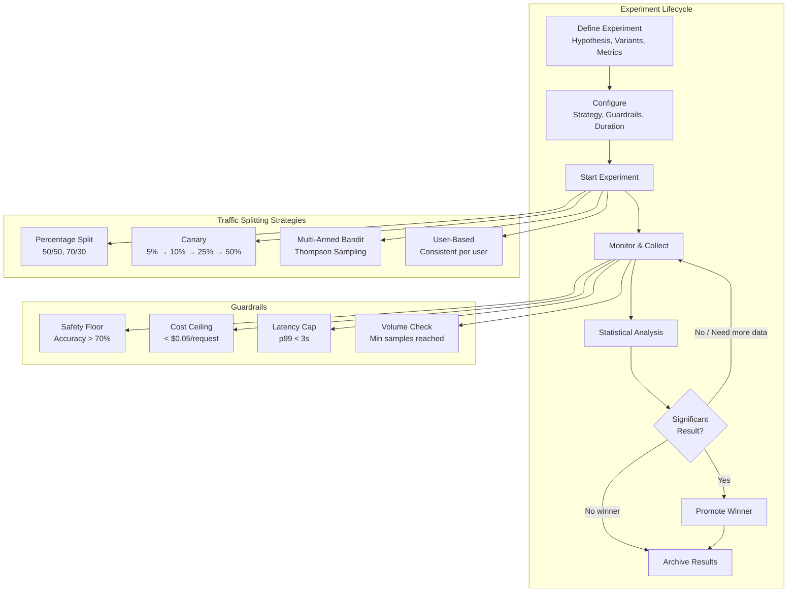
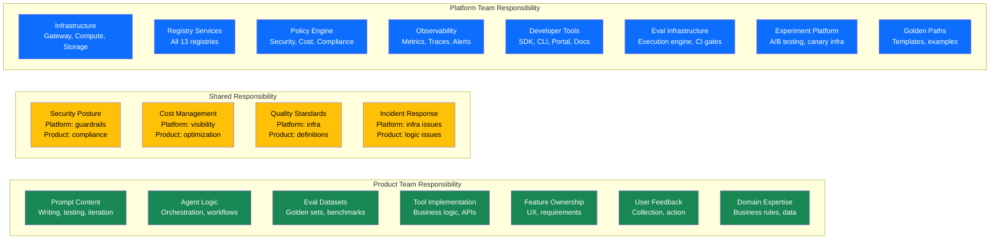
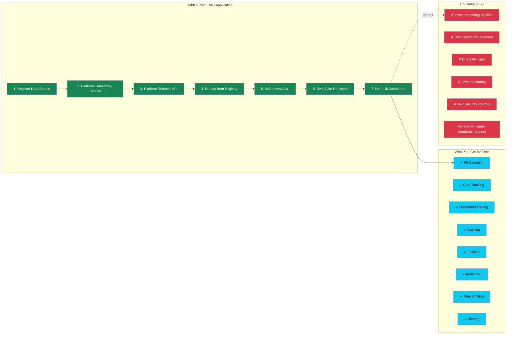
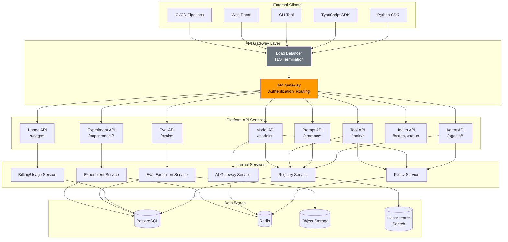

# Enterprise AI Platform - Architecture Diagrams

## 1. Enterprise AI Platform Architecture

## 2. Registry Relationships

## 3. Platform Maturity Levels

```mermaid
graph LR
    subgraph "L0: Ad Hoc"
        L0[No coordination<br/>Individual API keys<br/>No visibility]
    end

    subgraph "L1: Reactive"
        L1[Central key mgmt<br/>Basic dashboards<br/>Manual approvals]
    end

    subgraph "L2: Managed"
        L2[Gateway mandated<br/>Registries operational<br/>Basic policies<br/>SDK available]
    end

    subgraph "L3: Optimized"
        L3[Full 13 components<br/>Self-service 80%+<br/>Eval gates enforced<br/>Golden paths]
    end

    subgraph "L4: Proactive"
        L4[ML-driven optimization<br/>Predictive planning<br/>Auto-remediation<br/>Cross-team sharing]
    end

    subgraph "L5: Adaptive"
        L5[Self-optimizing<br/>Autonomous policies<br/>Self-healing<br/>AI-powered DX]
    end

    L0 -->|"Establish basics"| L1
    L1 -->|"Build platform"| L2
    L2 -->|"Optimize & enforce"| L3
    L3 -->|"Add intelligence"| L4
    L4 -->|"Full autonomy"| L5

    style L0 fill:#dc3545,color:#fff
    style L1 fill:#fd7e14,color:#000
    style L2 fill:#ffc107,color:#000
    style L3 fill:#20c997,color:#000
    style L4 fill:#0dcaf0,color:#000
    style L5 fill:#6f42c1,color:#fff
```

## 4. Self-Service Workflows

## 5. Experiment Platform Flow

## 6. Platform Team vs Product Team Boundary

## 7. Golden Path Architecture

## 8. Platform API Topology

