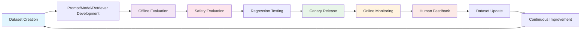
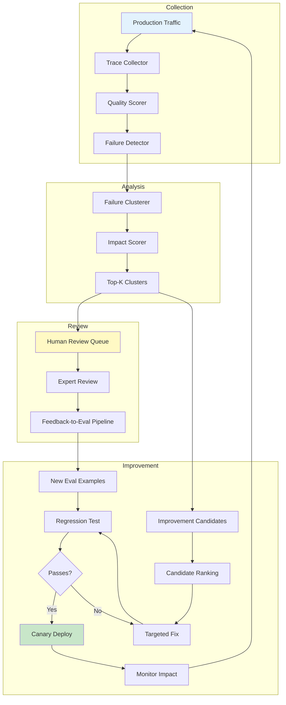
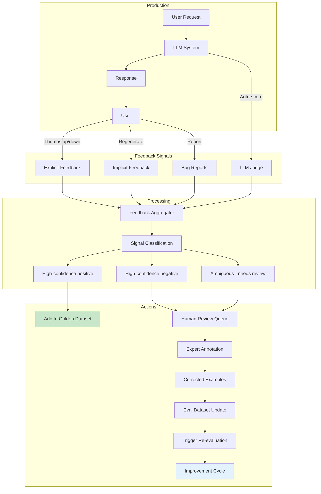
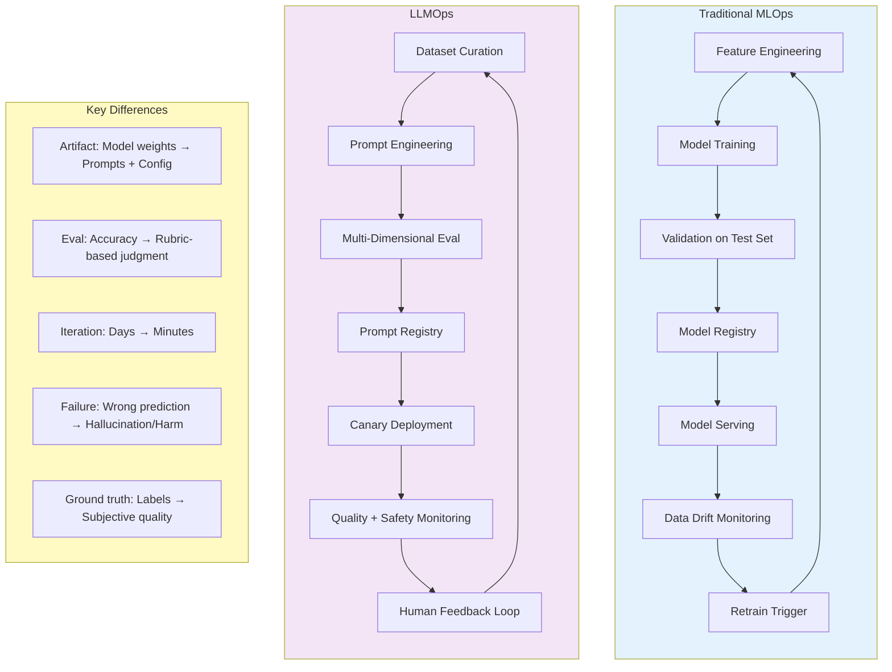
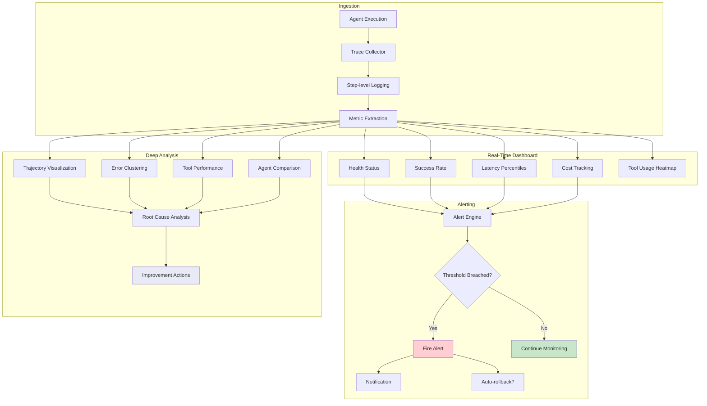
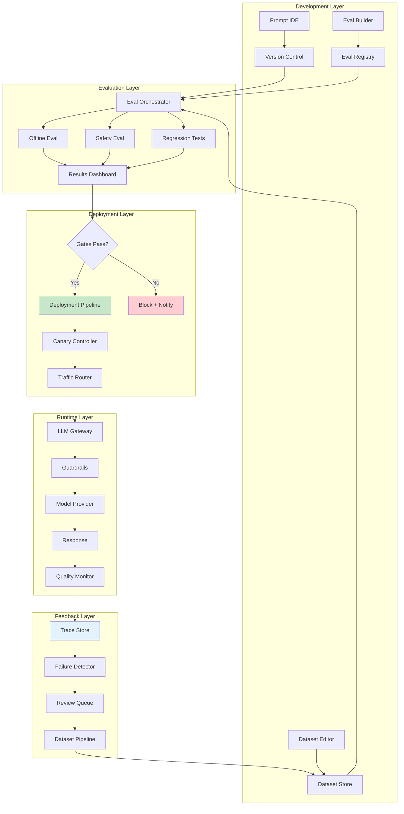

# LLMOps & AgentOps: Architecture Diagrams

## 1. LLMOps Lifecycle Loop



## 2. AgentOps Lifecycle Loop

```mermaid
graph LR
    A[Agent Design] --> B[Tool Design]
    B --> C[Permission Design]
    C --> D[Trajectory Testing]
    D --> E[Tool-Call Evaluation]
    E --> F[Safety Red-Team]
    F --> G[Deployment]
    G --> H[Trace Monitoring]
    H --> I[Failure Clustering]
    I --> J[Policy/Prompt/Tool Update]
    J --> A

    style A fill:#e8eaf6
    style D fill:#f3e5f5
    style F fill:#fce4ec
    style G fill:#e8f5e9
    style H fill:#fff3e0
    style I fill:#ffebee
```



## 3. Prompt Versioning Workflow

```mermaid
flowchart TD
    subgraph Development
        A[Author writes prompt] --> B[Create version v(n+1)]
        B --> C[Compute content hash]
        C --> D[Run offline eval]
    end

    subgraph Review
        D --> E{Eval passes?}
        E -->|No| A
        E -->|Yes| F[Deploy to DEV]
        F --> G[Integration testing]
        G --> H{Tests pass?}
        H -->|No| A
        H -->|Yes| I[Promote to STAGING]
    end

    subgraph Production
        I --> J[Staging validation]
        J --> K{Validation passes?}
        K -->|No| L[Rollback to v(n)]
        K -->|Yes| M[Canary to PROD 1%]
        M --> N{Canary healthy?}
        N -->|No| L
        N -->|Yes| O[Ramp to 100%]
        O --> P[Monitor production]
        P --> Q{Quality degraded?}
        Q -->|Yes| L
        Q -->|No| R[Version stable ✓]
    end

    style L fill:#ffcdd2
    style R fill:#c8e6c9
```

## 4. Continuous Improvement Pipeline



## 5. Dataset Management Flow

```mermaid
flowchart TD
    subgraph Sources
        A[Manual Curation] --> E[Dataset Builder]
        B[Production Mining] --> E
        C[Synthetic Generation] --> E
        D[Feedback Pipeline] --> E
    end

    subgraph Versioning
        E --> F[Schema Validation]
        F --> G{Valid?}
        G -->|No| H[Fix Errors]
        H --> F
        G -->|Yes| I[Quality Gates]
        I --> J[Compute Hash]
        J --> K[Create Version v(n)]
    end

    subgraph Quality Gates
        I --> L[Schema Compliance]
        I --> M[Diversity Check]
        I --> N[Size Check]
        I --> O[Deduplication]
        L & M & N & O --> P{All Pass?}
        P -->|No| Q[Report Issues]
        P -->|Yes| K
    end

    subgraph Usage
        K --> R[Split Management]
        R --> S[Train/Val/Test/Golden]
        S --> T[Eval Runs]
        T --> U[Results Tracking]
    end

    style K fill:#c8e6c9
    style Q fill:#ffcdd2
```

## 6. Production Feedback Loop



## 7. LLMOps vs MLOps Comparison



## 8. Agent Performance Monitoring



## 9. End-to-End LLMOps Platform Architecture


