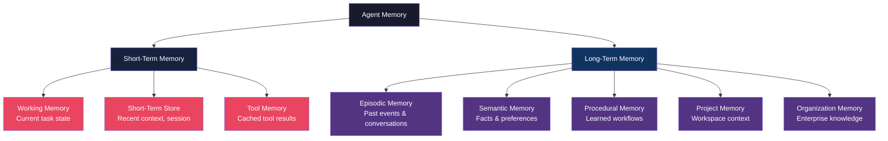
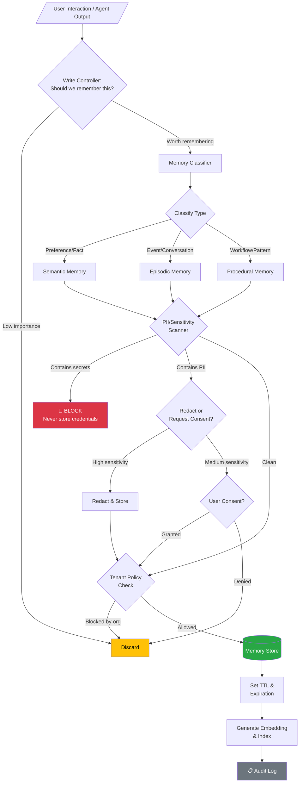
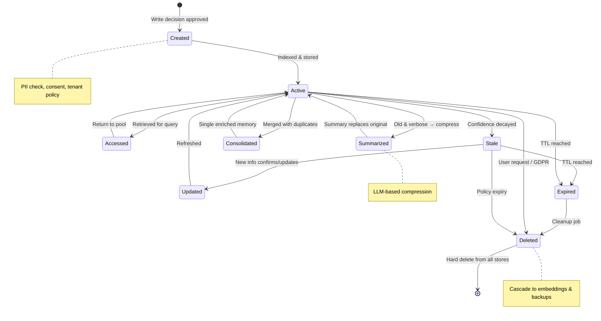
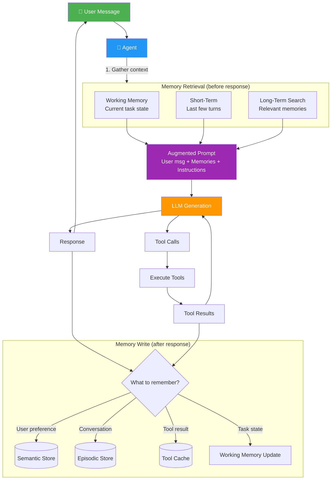
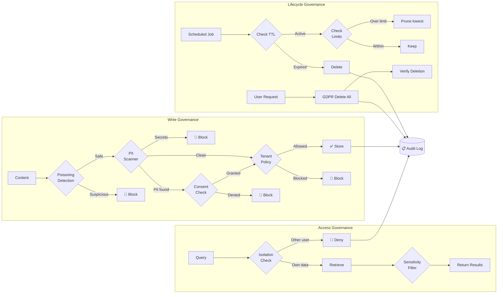
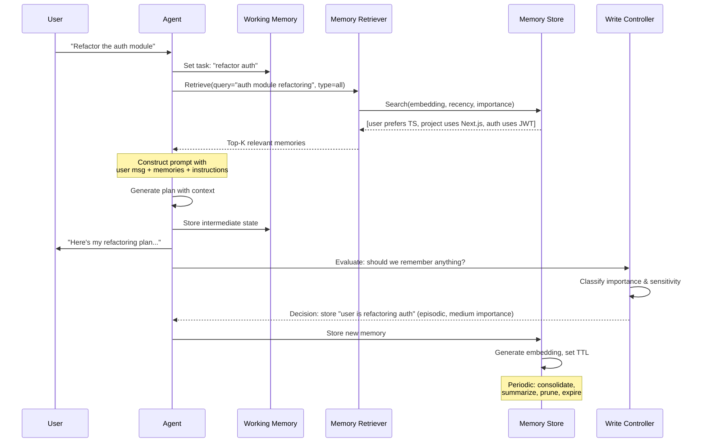
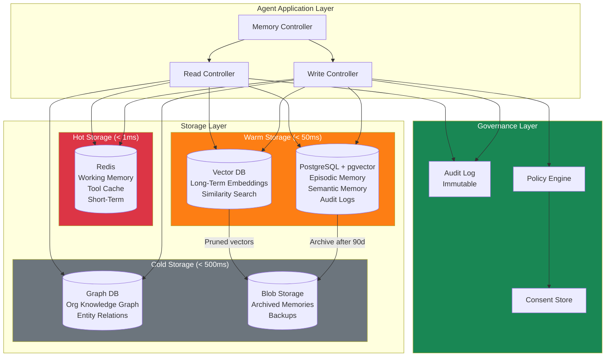

# Memory Architecture - Diagrams

## 1. Memory Types Hierarchy



## 2. Memory Write Flow with Policy Checks



## 3. Memory Retrieval Strategy Comparison

```mermaid
graph LR
    subgraph Strategies
        R[Recency<br/>score = e^(-λt)]
        REL[Relevance<br/>score = cosine_sim]
        I[Importance<br/>score = base × freq × access]
    end
    
    subgraph Hybrid["Hybrid Scoring"]
        H[final = w₁×recency + w₂×relevance + w₃×importance + context_bonus]
    end
    
    subgraph ContextProfiles["Context-Aware Weights"]
        NEW["New Conversation<br/>recency=0.5, rel=0.3, imp=0.2"]
        QA["Question Answering<br/>recency=0.1, rel=0.7, imp=0.2"]
        CODE["Code Generation<br/>recency=0.2, rel=0.4, imp=0.4"]
        DEBUG["Debugging<br/>recency=0.4, rel=0.4, imp=0.2"]
    end
    
    R --> H
    REL --> H
    I --> H
    
    H --> NEW
    H --> QA
    H --> CODE
    H --> DEBUG
```

## 4. Memory Lifecycle



## 5. Memory Architecture for Multi-Turn Agent



## 6. Memory Governance Flow



## 7. Memory-Augmented Agent Loop



## 8. Memory Storage Topology



---

## Key Relationships

| Diagram | Shows |
|---------|-------|
| Types Hierarchy | What kinds of memory exist and how they relate |
| Write Flow | Every check a memory passes before storage |
| Retrieval Comparison | How different strategies score memories |
| Lifecycle | States a memory goes through from birth to deletion |
| Multi-Turn Agent | How memory integrates into the agent loop |
| Governance | Full governance pipeline (write + access + lifecycle) |
| Agent Loop | Sequence of operations in a memory-augmented turn |
| Storage Topology | Physical storage architecture with hot/warm/cold tiers |
