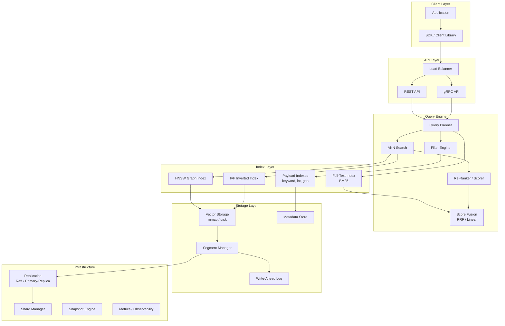
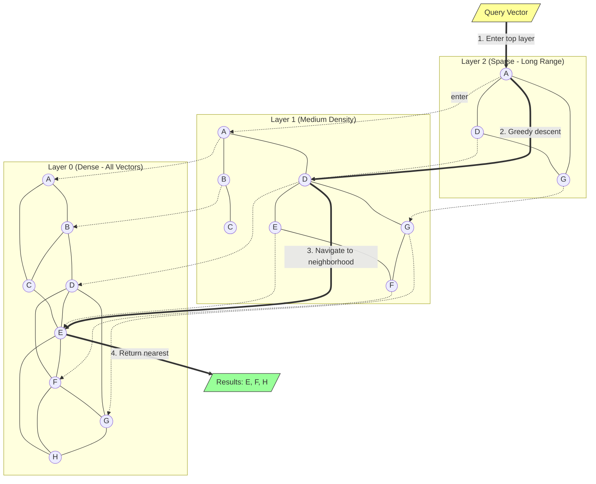
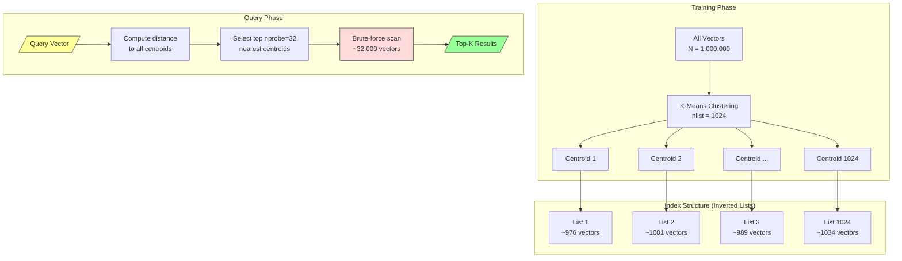
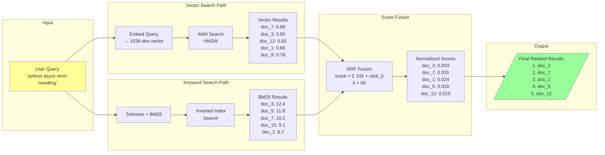
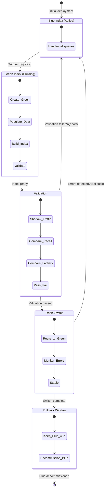
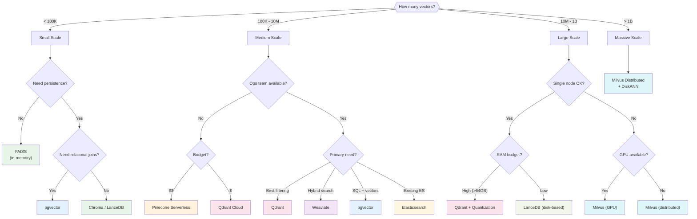
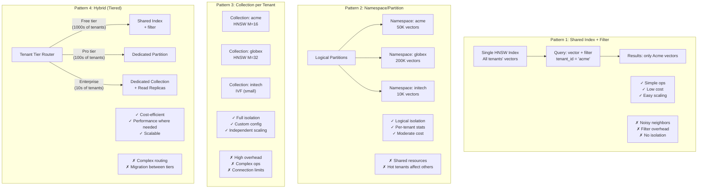
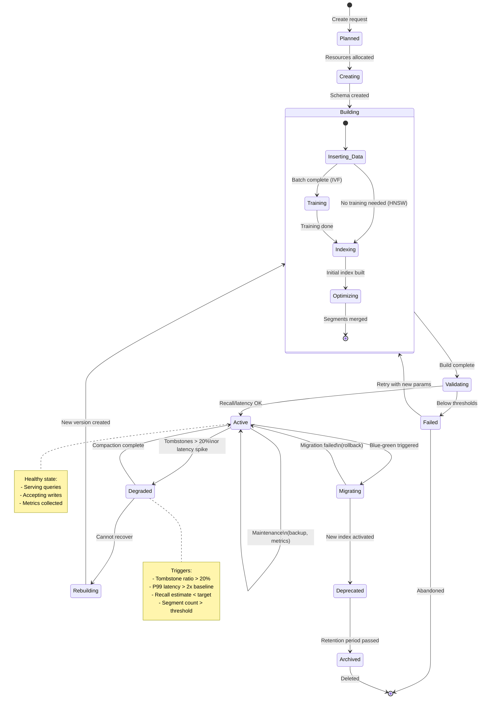

# Vector Databases - Architecture Diagrams

## 1. Vector DB Architecture

## 2. HNSW Graph Structure

## 3. IVF Clustering Approach

## 4. Hybrid Search Merging

## 5. Blue-Green Index Migration

## 6. Vector DB Selection Decision Tree

## 7. Multi-Tenant Index Patterns

## 8. Index Lifecycle State Machine

