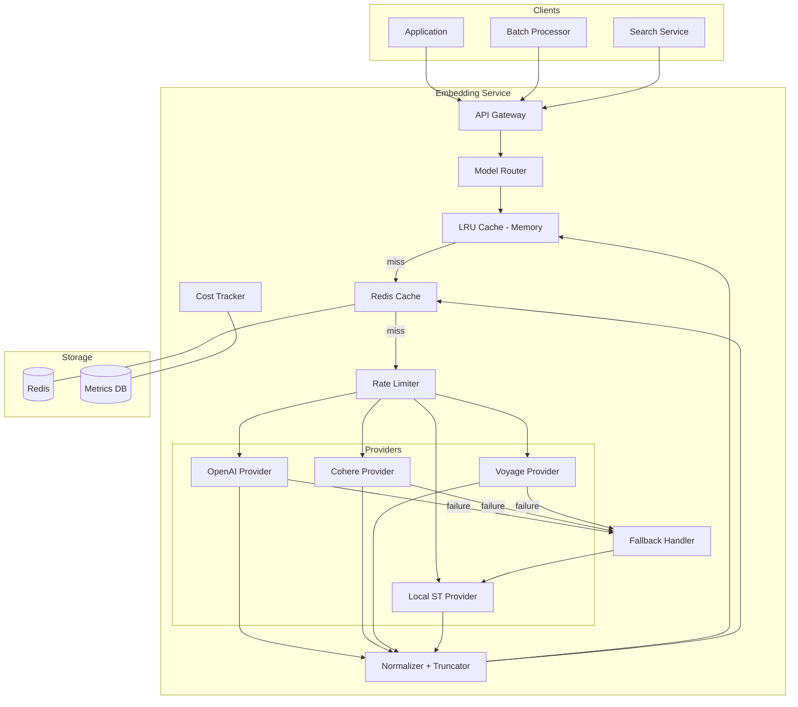
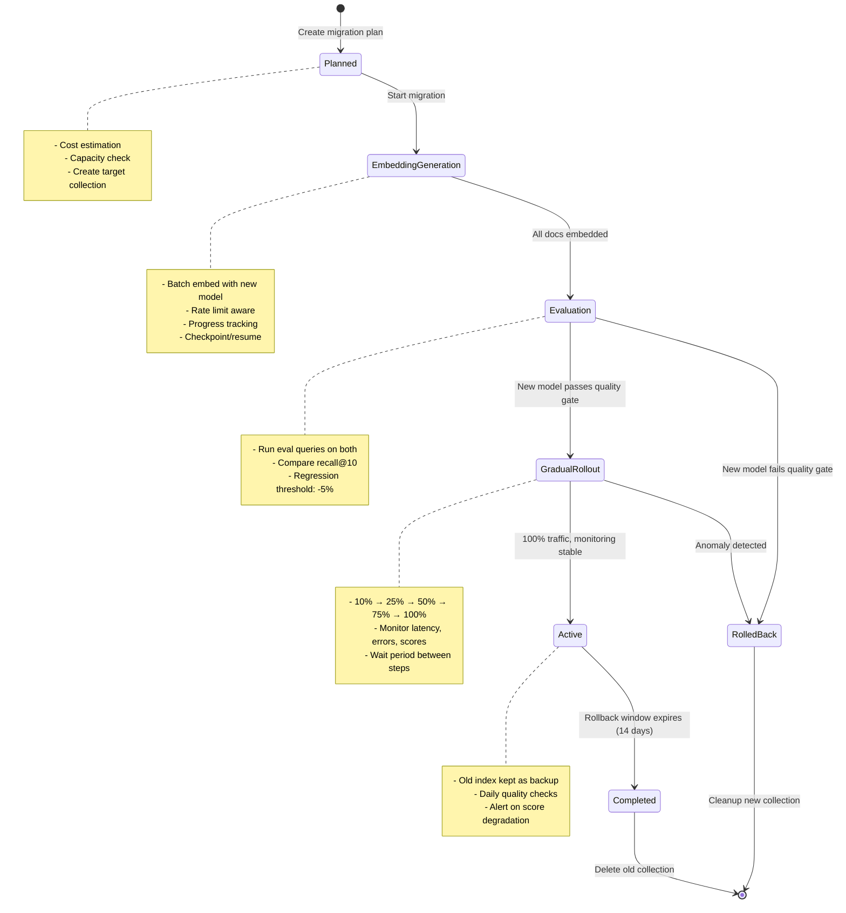
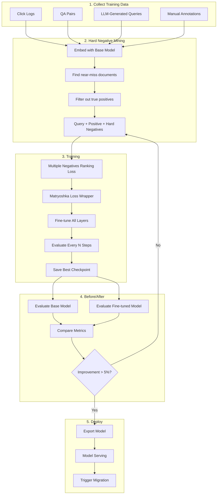
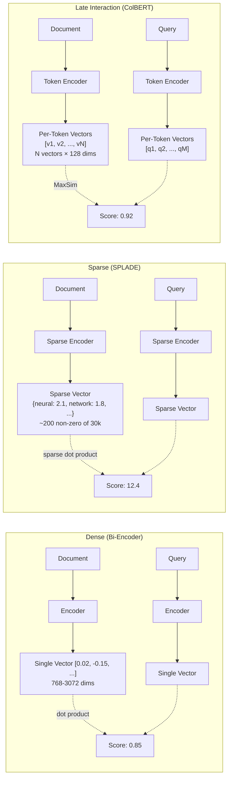
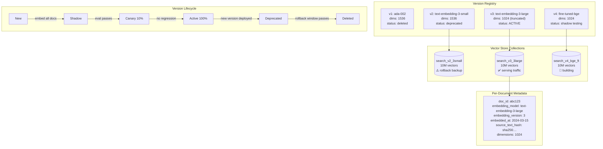

# Embeddings - Architecture Diagrams

## 1. Embedding Model Selection Flowchart

```mermaid
flowchart TD
    Start([Need Embeddings]) --> Q1{What modality?}

    Q1 -->|Text only| Q2{Language?}
    Q1 -->|Text + Images| MM[Multimodal: CLIP/SigLIP]
    Q1 -->|Code| CODE[Voyage Code-2 / CodeBERT]

    Q2 -->|English only| Q3{Domain?}
    Q2 -->|Multilingual| MULTI[Cohere Multilingual v3 / mE5]

    Q3 -->|General| Q4{Budget?}
    Q3 -->|Medical/Legal/Finance| DOMAIN[Domain-specific model or Fine-tune]

    Q4 -->|API OK, quality priority| Q5{Corpus size?}
    Q4 -->|Self-hosted required| SELF[BGE-large / GTE-large / Nomic]
    Q4 -->|Minimum cost| CHEAP[all-MiniLM-L6-v2]

    Q5 -->|< 1M docs| LARGE[OpenAI 3-large / Voyage large-2]
    Q5 -->|> 10M docs| Q6{Need exact matching?}

    Q6 -->|Yes| HYBRID[Dense + SPLADE hybrid]
    Q6 -->|No| BALANCED[OpenAI 3-small / Cohere v3]

    MM --> EVAL[Evaluate on YOUR data]
    CODE --> EVAL
    MULTI --> EVAL
    DOMAIN --> EVAL
    SELF --> EVAL
    CHEAP --> EVAL
    LARGE --> EVAL
    HYBRID --> EVAL
    BALANCED --> EVAL

    EVAL --> GOOD{Recall@10 > 85%?}
    GOOD -->|Yes| DEPLOY[Deploy to Production]
    GOOD -->|No| FINETUNE[Fine-tune or try different model]
    FINETUNE --> EVAL
```

## 2. Embedding Service Architecture



## 3. Embedding Evaluation Pipeline

```mermaid
flowchart LR
    subgraph DataPrep["1. Data Preparation"]
        QD[Query-Doc Pairs]
        CAT[Categorize: exact/paraphrase/adversarial/...]
        SPLIT[Train/Eval Split]
    end

    subgraph Embedding["2. Embed"]
        M1[Model A]
        M2[Model B]
        M3[Model C]
        DOCS[Embed All Documents]
        QUERIES[Embed All Queries]
    end

    subgraph Retrieval["3. Retrieve"]
        SIM[Cosine Similarity]
        RANK[Rank Documents]
        TOPK[Get Top-K per Query]
    end

    subgraph Metrics["4. Measure"]
        R1[Recall@1,5,10,20]
        MRR[MRR]
        NDCG[nDCG@10]
        CAT_M[Per-Category Metrics]
    end

    subgraph Analysis["5. Analyze"]
        STAT[Statistical Significance]
        COMP[Comparison Table]
        REPORT[Generate Report]
        REC[Recommendation]
    end

    QD --> CAT --> SPLIT
    SPLIT --> M1 & M2 & M3
    M1 & M2 & M3 --> DOCS & QUERIES
    DOCS & QUERIES --> SIM --> RANK --> TOPK
    TOPK --> R1 & MRR & NDCG & CAT_M
    R1 & MRR & NDCG & CAT_M --> STAT --> COMP --> REPORT --> REC
```

## 4. Blue-Green Migration Workflow



## 5. Embedding Fine-Tuning Pipeline



## 6. Dense vs Sparse vs Late-Interaction Comparison



## 7. Embedding Versioning Strategy



## 8. Embedding Cost Optimization

```mermaid
flowchart TD
    subgraph Problem["Cost Drivers"]
        RE_EMBED[Re-embedding unchanged docs]
        DUPLICATE[Duplicate query embeddings]
        OVER_DIM[Over-dimensioned vectors]
        WRONG_MODEL[Using expensive model for simple tasks]
    end

    subgraph Solutions["Optimization Strategies"]
        subgraph Caching["Layer 1: Caching"]
            MEM_CACHE[In-Memory LRU<br/>10K entries, <1ms]
            REDIS_CACHE[Redis<br/>1M entries, 1-5ms]
            HASH_CHECK[Source text hash check<br/>Skip if unchanged]
        end

        subgraph Dimension["Layer 2: Dimension Optimization"]
            MATRY[Matryoshka truncation<br/>3072 → 1024 or 256]
            PQ[Product Quantization<br/>4x compression]
            BINARY[Binary quantization<br/>32x compression + rerank]
        end

        subgraph Routing["Layer 3: Model Routing"]
            SIMPLE_Q[Simple queries → Small model<br/>$0.02/1M tokens]
            COMPLEX_Q[Complex queries → Large model<br/>$0.13/1M tokens]
            BATCH_Q[Batch jobs → Self-hosted<br/>$0/token, GPU cost only]
        end

        subgraph Architecture["Layer 4: Architecture"]
            HYBRID_S[Hybrid: BM25 + Dense<br/>Fewer dense lookups needed]
            RERANK[Retrieve 100 → Rerank 10<br/>Cheaper than more dims]
            INCREMENTAL[Incremental indexing<br/>Only embed new/changed docs]
        end
    end

    subgraph Impact["Cost Reduction"]
        I1["Caching: 40-70% savings"]
        I2["Dimensions: 50-75% storage savings"]
        I3["Routing: 30-50% API cost savings"]
        I4["Architecture: 20-40% overall savings"]
    end

    RE_EMBED --> HASH_CHECK & INCREMENTAL
    DUPLICATE --> MEM_CACHE & REDIS_CACHE
    OVER_DIM --> MATRY & PQ & BINARY
    WRONG_MODEL --> SIMPLE_Q & COMPLEX_Q & BATCH_Q

    Caching --> I1
    Dimension --> I2
    Routing --> I3
    Architecture --> I4
```


