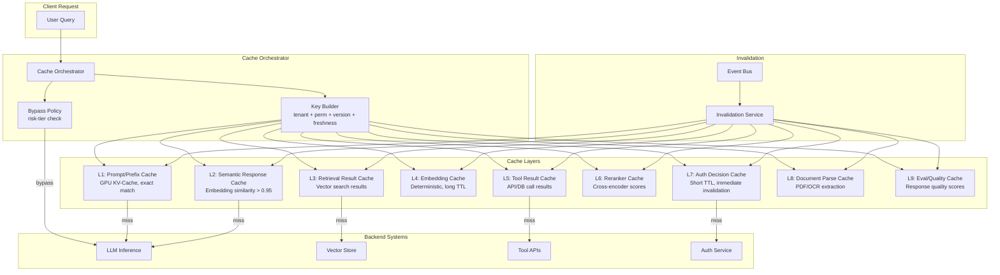
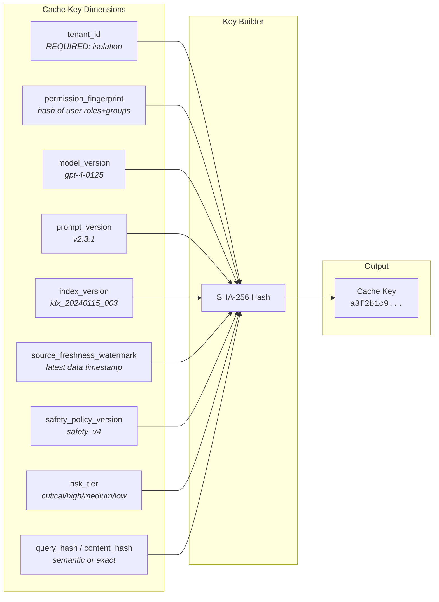
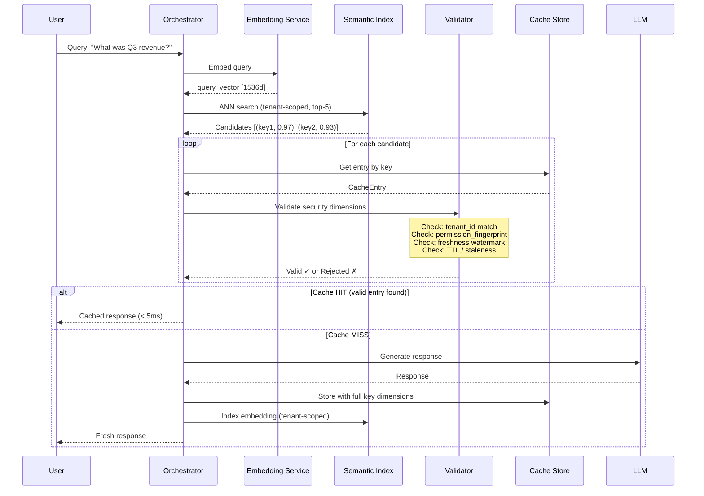
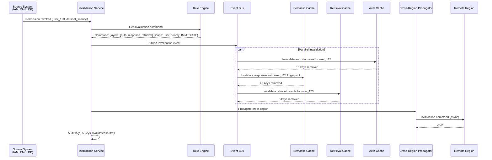
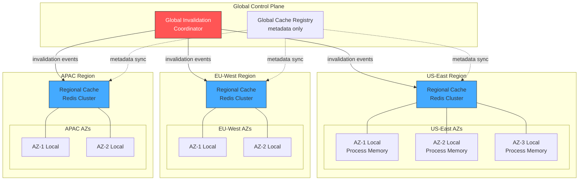
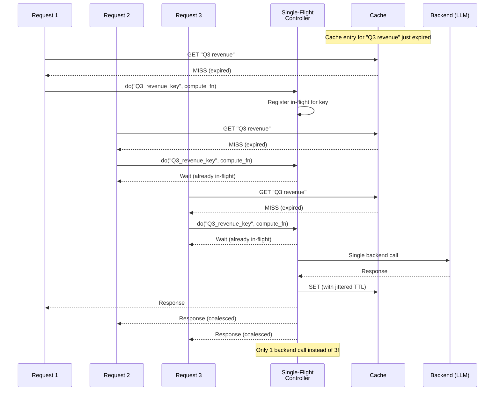
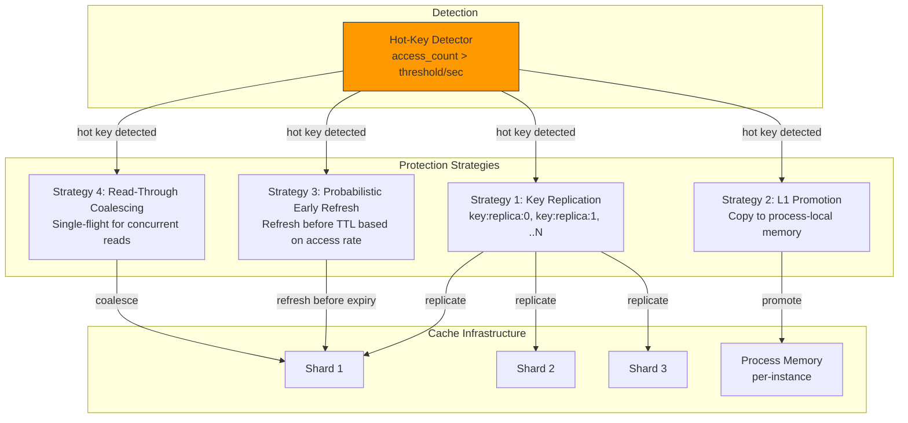
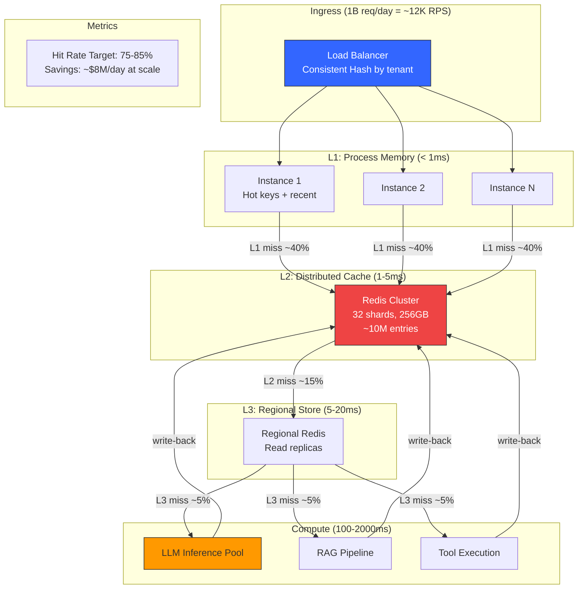

# Caching at Scale — Architecture Diagrams

## 1. Multi-Layer Cache Architecture

## 2. Cache Key Composition

## 3. Semantic Cache Flow

## 4. Invalidation Event Flow

## 5. Regional Cache Hierarchy

**Data Residency Rule**: Tenant cache data NEVER leaves designated region. Only invalidation metadata crosses boundaries.

## 6. Cache Stampede Protection

## 7. Hot-Key Protection

## 8. Cache Safety Verification Flow

```mermaid
flowchart TD
    START[Cache Read Request] --> ISO{Tenant<br/>Isolation<br/>Check}
    ISO -->|entry.tenant ≠ request.tenant| BLOCK[BLOCK + Alert Security]
    ISO -->|tenant match| PERM{Permission<br/>Fingerprint<br/>Match?}
    PERM -->|mismatch| MISS1[Cache MISS<br/>permissions changed]
    PERM -->|match| FRESH{Freshness<br/>Watermark<br/>Valid?}
    FRESH -->|source updated since cache| MISS2[Cache MISS<br/>data stale]
    FRESH -->|within freshness| TTL{TTL<br/>Expired?}
    TTL -->|expired| STALE{Risk Tier<br/>Allows Stale?}
    STALE -->|critical: NEVER| MISS3[Cache MISS<br/>must recompute]
    STALE -->|within tolerance| SWR[Serve Stale +<br/>Background Refresh]
    STALE -->|beyond tolerance| MISS3
    TTL -->|valid| VERSION{Version<br/>Checks OK?}
    VERSION -->|model/prompt/policy changed| MISS4[Cache MISS<br/>version mismatch]
    VERSION -->|all versions match| HIT[Cache HIT ✓]

    style BLOCK fill:#f00,stroke:#333,color:#fff
    style HIT fill:#0a0,stroke:#333,color:#fff
    style MISS1 fill:#fa0,stroke:#333
    style MISS2 fill:#fa0,stroke:#333
    style MISS3 fill:#fa0,stroke:#333
    style MISS4 fill:#fa0,stroke:#333
```

## 9. Billion-Request Cache Path

**Path probability at 1B requests/day:**
- L1 hit: 60% → 600M requests served in < 1ms
- L2 hit: 25% → 250M requests served in 1-5ms  
- L3 hit: 10% → 100M requests served in 5-20ms
- Full compute: 5% → 50M requests hit backend (still 50M inference calls/day)

**Cost impact:**
- Without cache: 1B × $0.01 = $10M/day
- With cache (95% hit): 50M × $0.01 + infra = $550K/day
- **Net savings: ~$9.5M/day**
