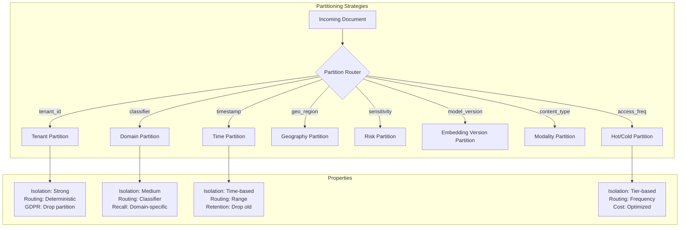
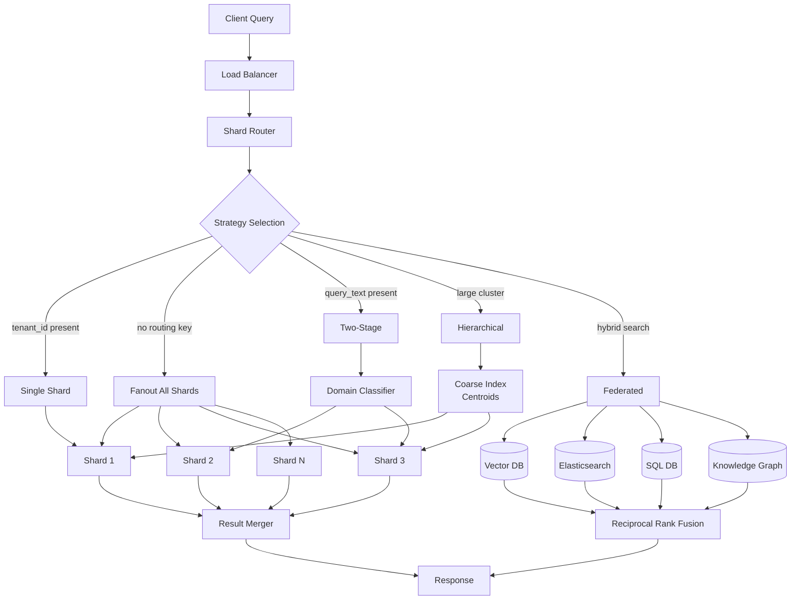
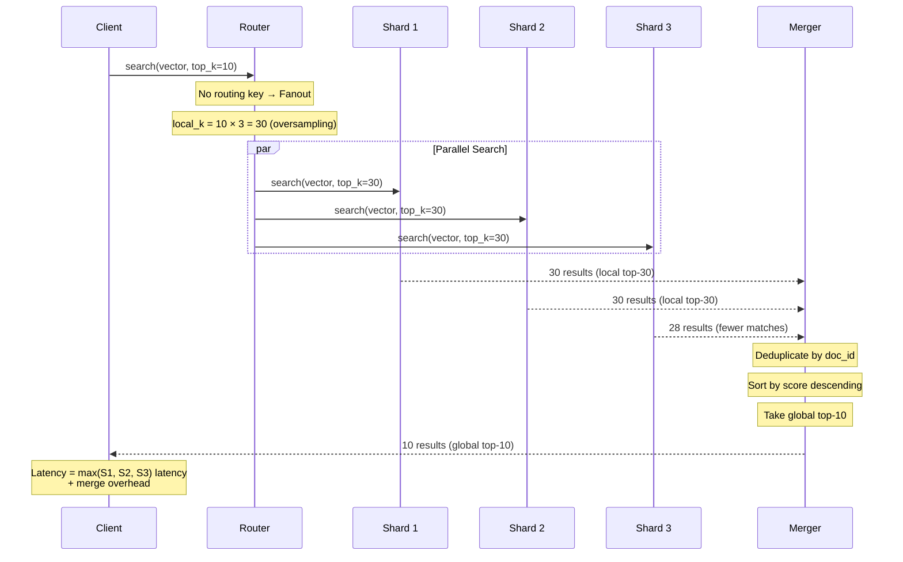
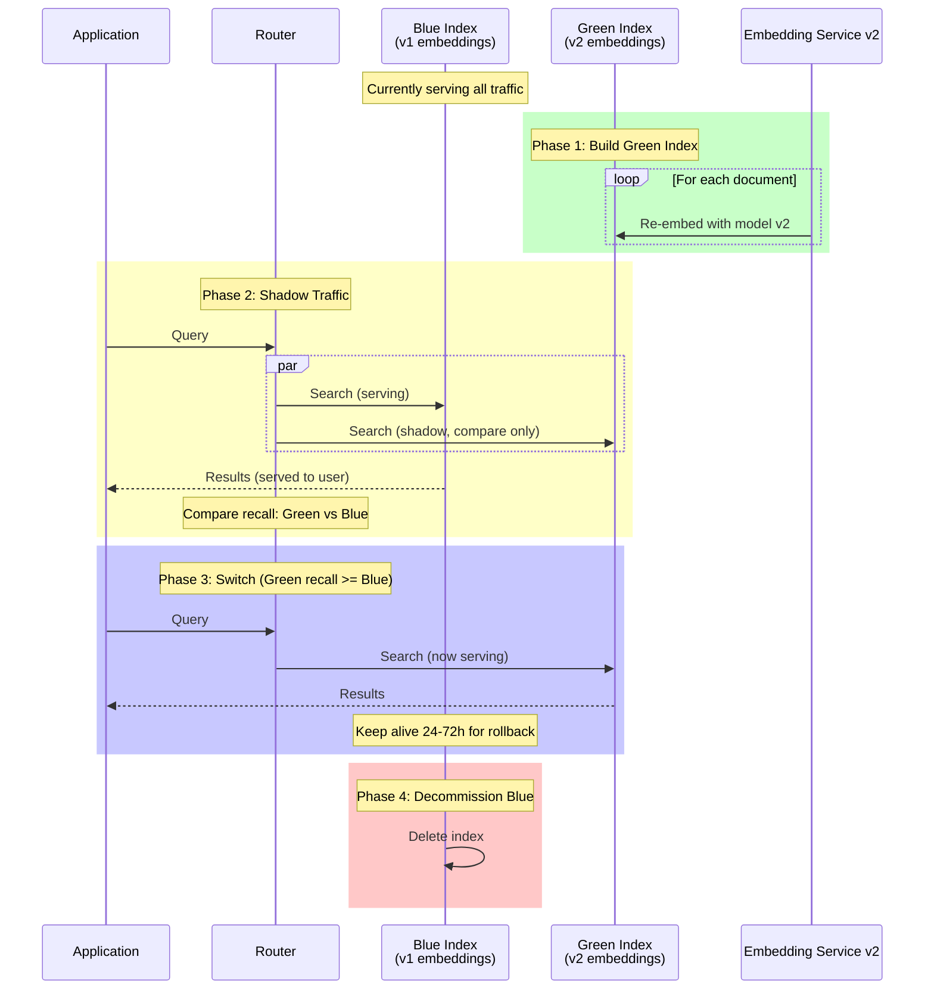
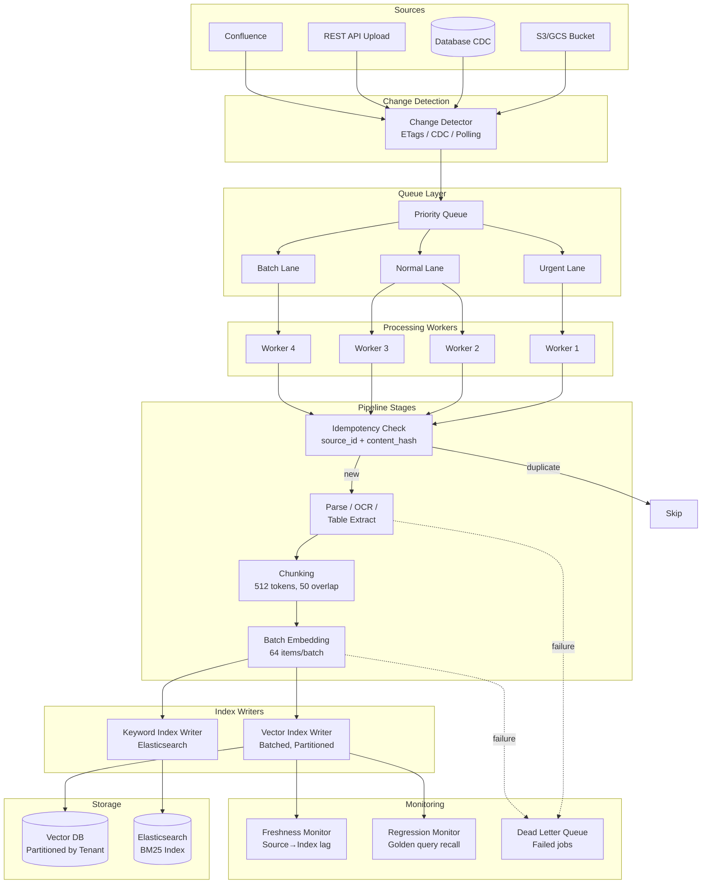
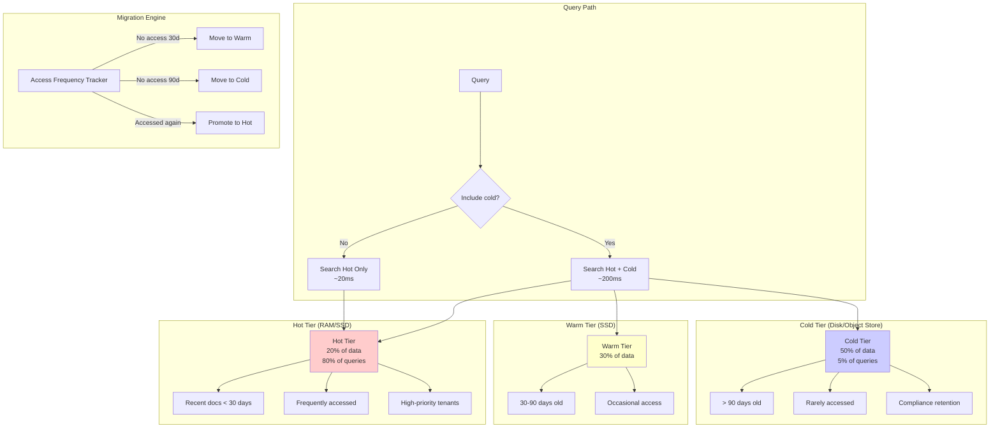
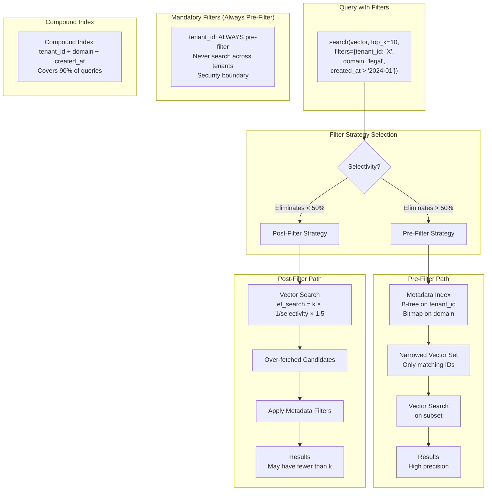
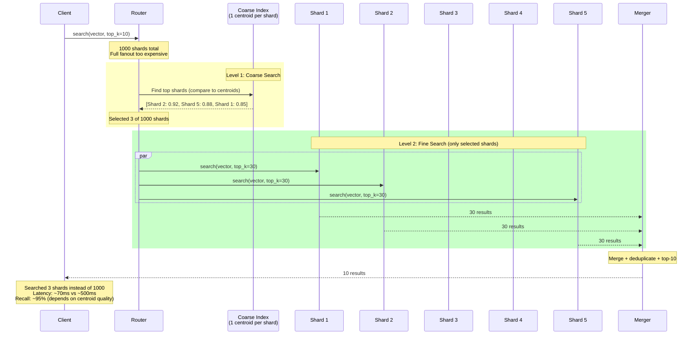

# Diagrams: Sharding & Partitioning for Vector Databases

## 1. Partition Strategy Comparison

## 2. Shard Routing Architecture

## 3. Fanout Query Flow

## 4. Multi-Tenant Index Patterns

```mermaid
graph TB
    subgraph "Pattern 1: Shared Index"
        SI[Single HNSW Index]
        T1A[Tenant A vectors] --> SI
        T1B[Tenant B vectors] --> SI
        T1C[Tenant C vectors] --> SI
        SI --> F1[Mandatory Filter:<br/>tenant_id = X]
        F1 --> R1[Results]
        style SI fill:#ffcccc
        note1[Risk: Noisy neighbor<br/>ef_search must be 2-3x higher]
    end

    subgraph "Pattern 2: Namespace"
        NS_A[Namespace A<br/>10K vectors]
        NS_B[Namespace B<br/>50K vectors]
        NS_C[Namespace C<br/>100K vectors]
        NS_A --> PHY[Shared Physical Infra]
        NS_B --> PHY
        NS_C --> PHY
        style PHY fill:#ffffcc
    end

    subgraph "Pattern 3: Dedicated Index"
        IDX_A[Index A<br/>HNSW M=16<br/>dim=1536]
        IDX_B[Index B<br/>HNSW M=32<br/>dim=768]
        IDX_C[Index C<br/>IVF<br/>dim=1536]
        style IDX_A fill:#ccffcc
        style IDX_B fill:#ccffcc
        style IDX_C fill:#ccffcc
    end

    subgraph "Pattern 4: Cell-Based"
        Cell1[Cell 1<br/>Small tenants A-F]
        Cell2[Cell 2<br/>Medium tenants G-J]
        Cell3[Cell 3<br/>Large tenant K]
        Cell1 --> Cluster1[K8s Cluster 1]
        Cell2 --> Cluster2[K8s Cluster 2]
        Cell3 --> Cluster3[K8s Cluster 3]
    end

    subgraph "Tenant Assignment Logic"
        TA{Vector Count?}
        TA -->|"< 10K"| P1[Pattern 1: Shared]
        TA -->|"10K - 1M"| P2[Pattern 2: Namespace]
        TA -->|"1M - 10M"| P3[Pattern 3: Dedicated]
        TA -->|"> 10M"| P4[Pattern 4: Cell]
    end
```

## 5. Blue-Green Reindexing

## 6. Ingestion Pipeline Architecture

## 7. Hot/Cold Partitioning

## 8. Metadata Filtering Architecture

## 9. Hierarchical Retrieval Flow

