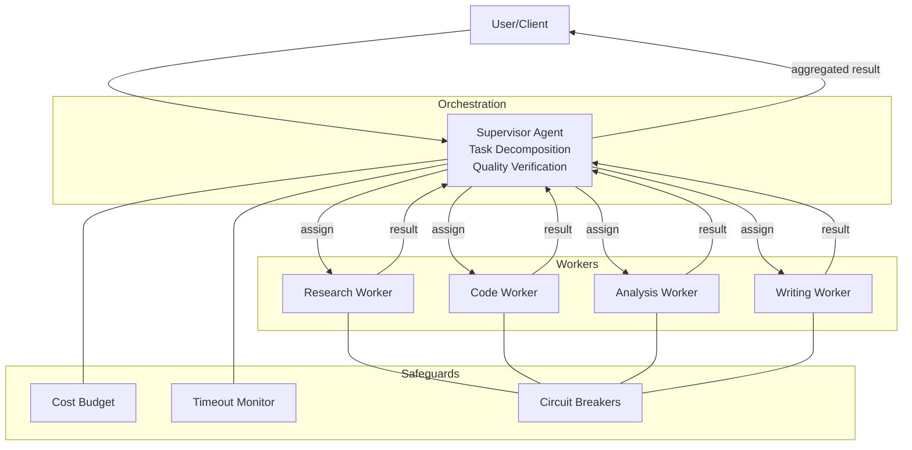
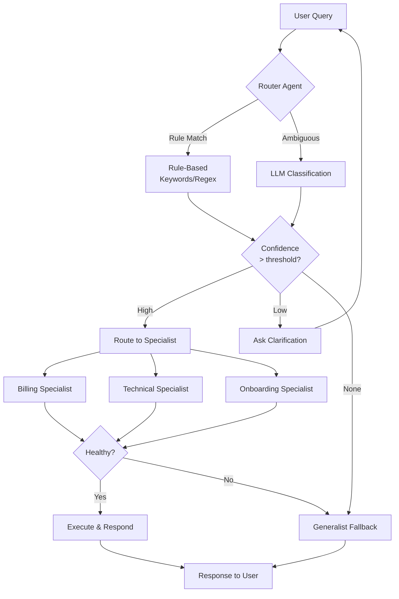
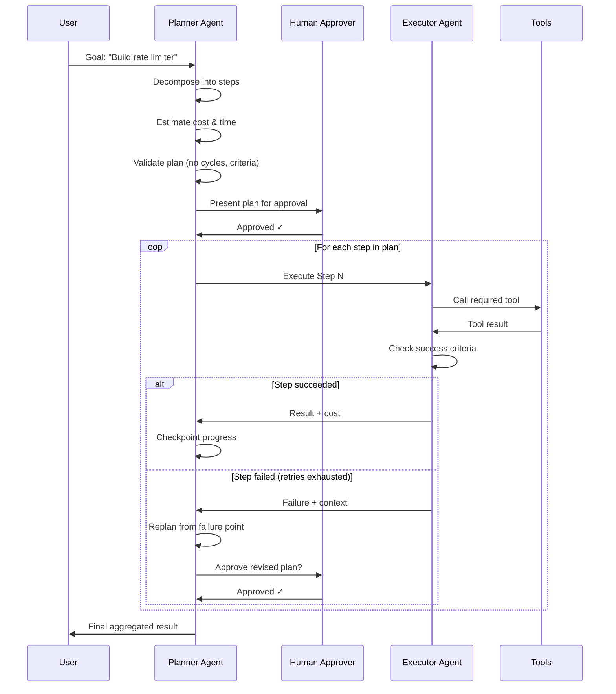
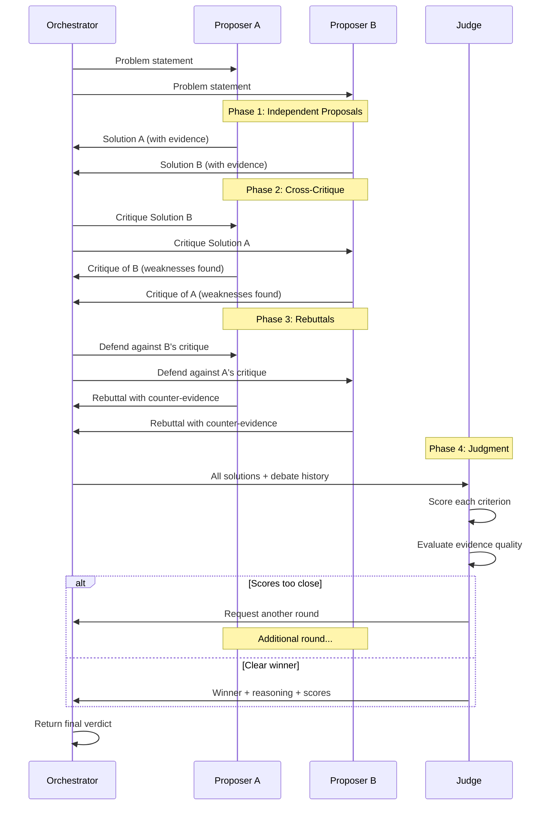
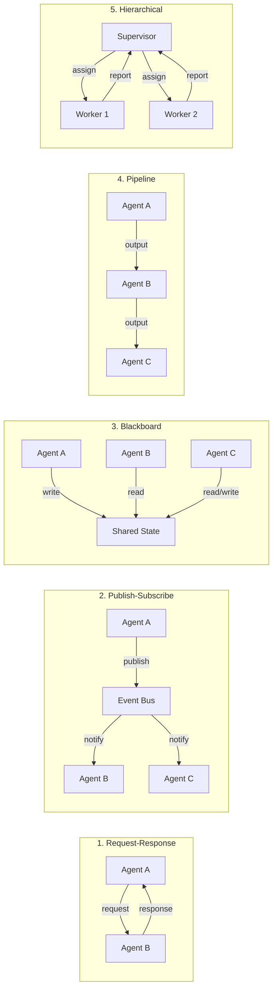
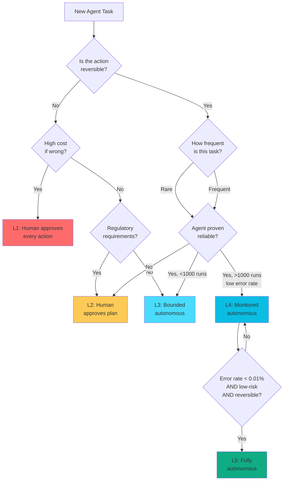
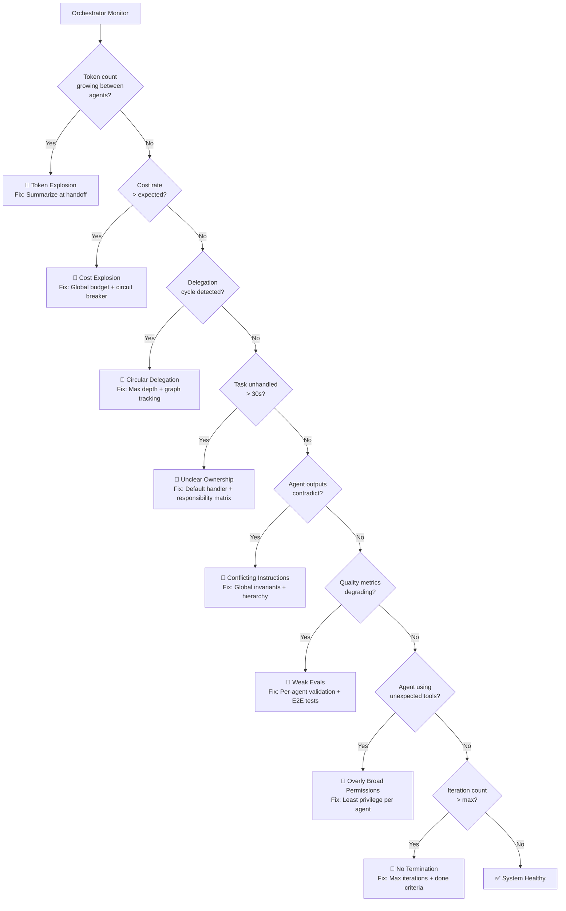
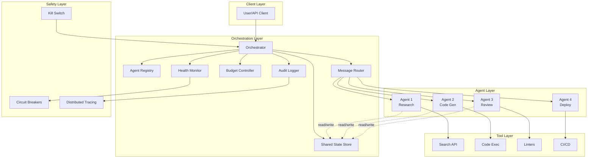
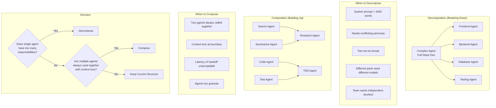

# Multi-Agent Systems — Diagrams

## 1. Supervisor-Worker Architecture

## 2. Router-Specialist Flow

## 3. Planner-Executor Sequence

## 4. Debate-Judge Protocol

## 5. Multi-Agent Communication Patterns

## 6. Autonomy Levels Decision Tree

## 7. Failure Mode Detection

## 8. Multi-Agent Orchestration Architecture

## 9. Agent Composition Strategies

