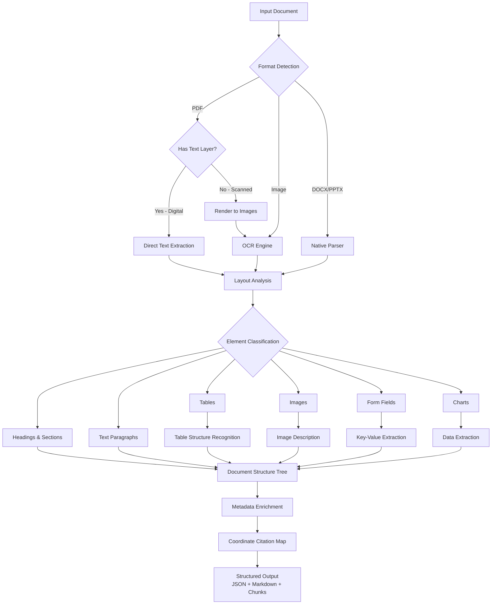
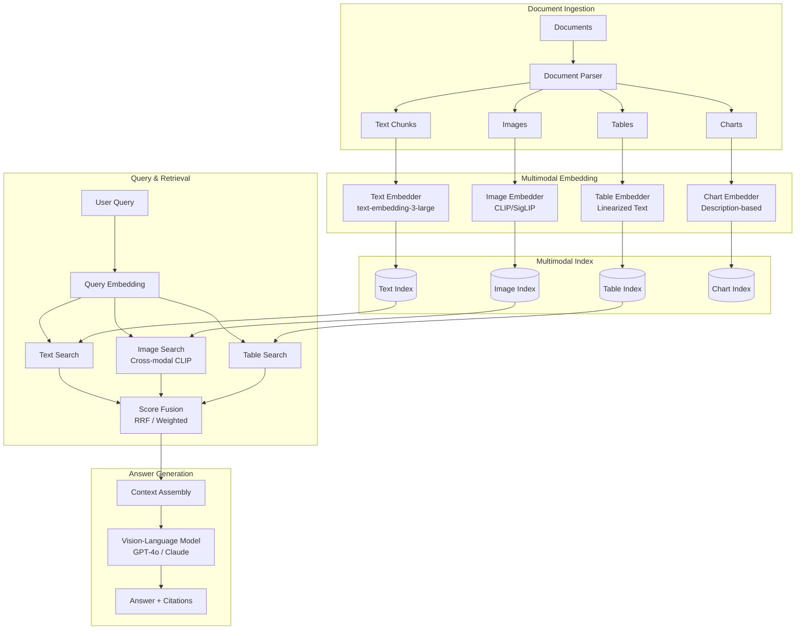
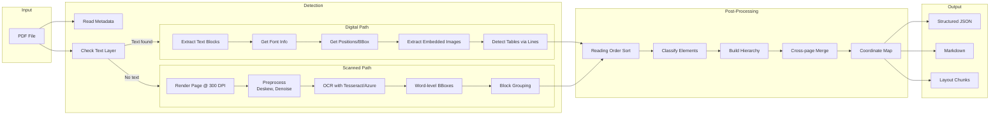
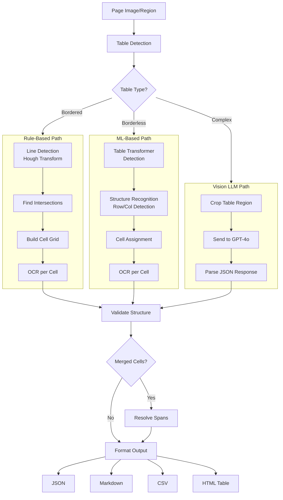
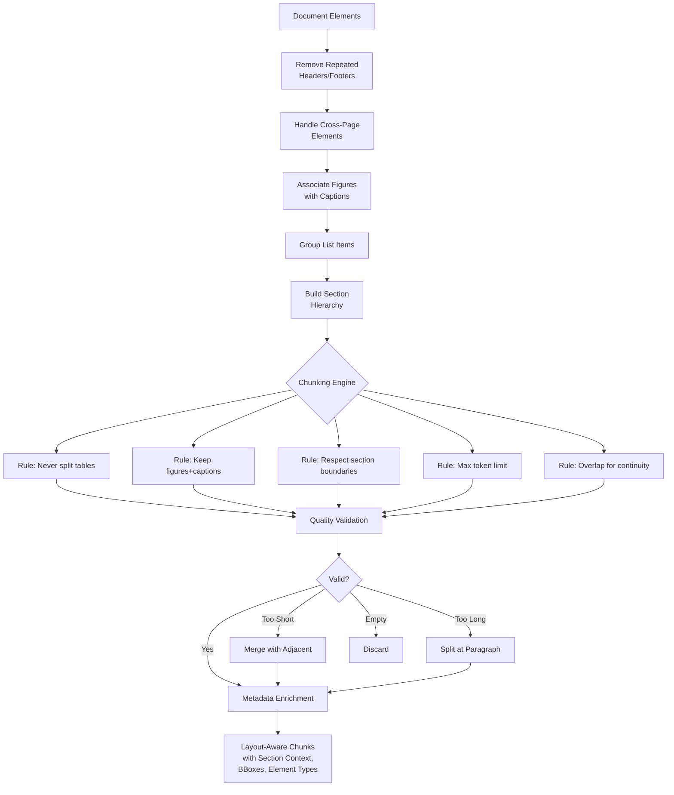
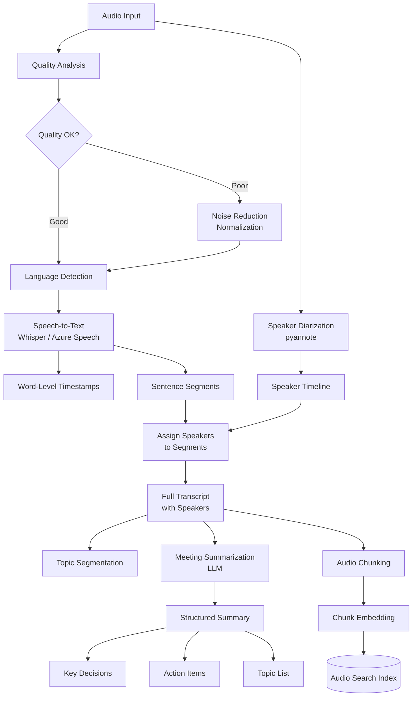
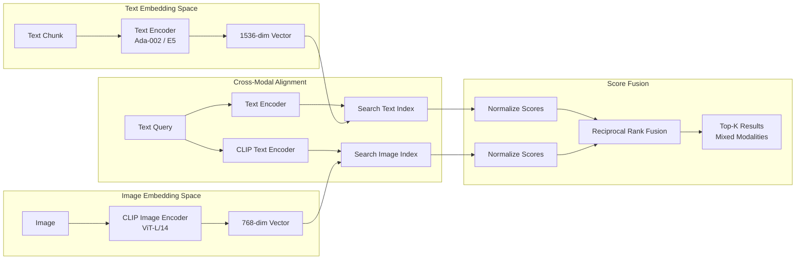
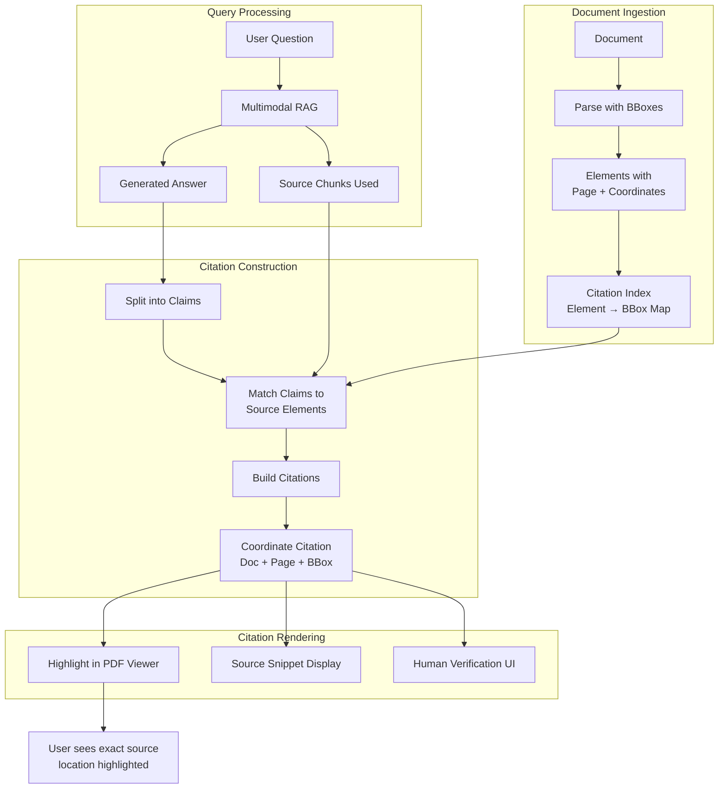
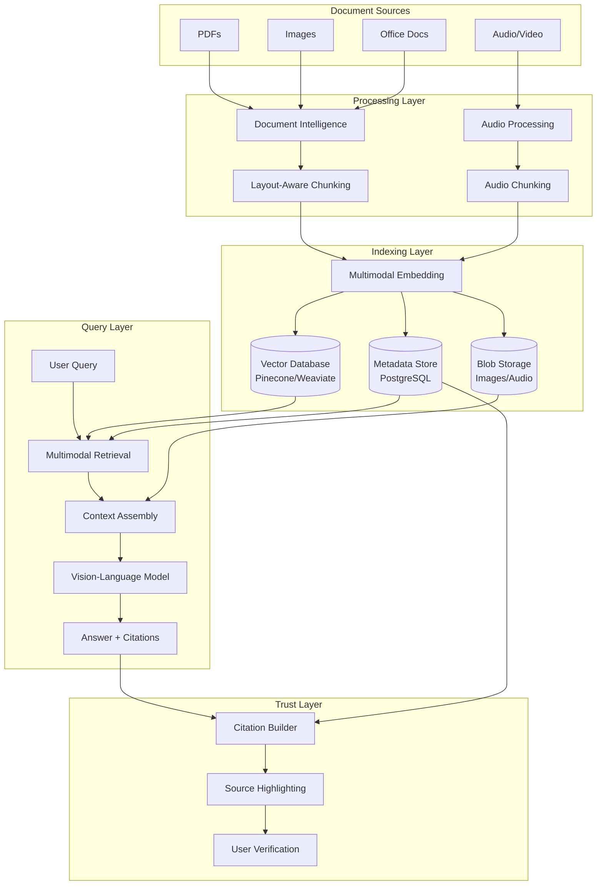

# Multimodal AI - Architecture Diagrams

## 1. Document Intelligence Pipeline

## 2. Multimodal RAG Architecture

## 3. PDF Parsing Flow

## 4. Table Extraction Process

## 5. Layout-Aware Chunking

## 6. Audio Processing Pipeline

## 7. Multimodal Embedding and Retrieval

## 8. Coordinate-Level Citation Flow

## 9. End-to-End System Architecture

