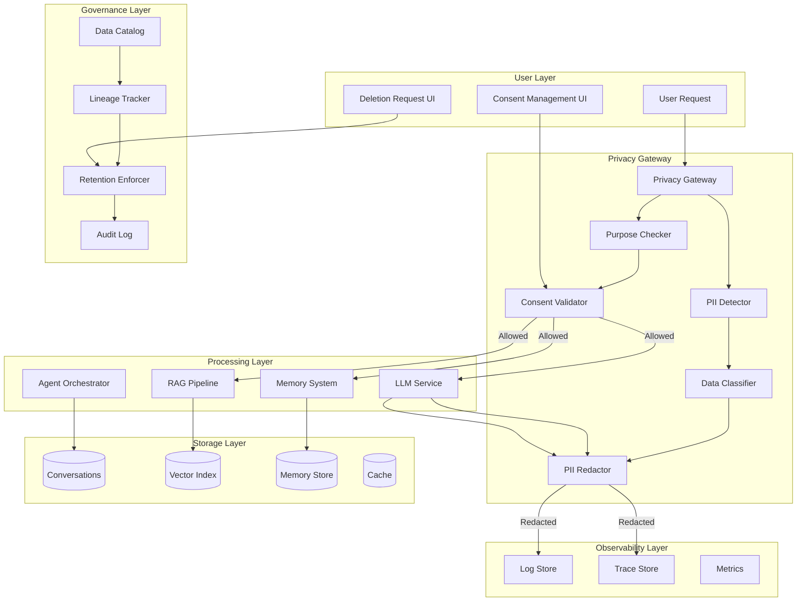
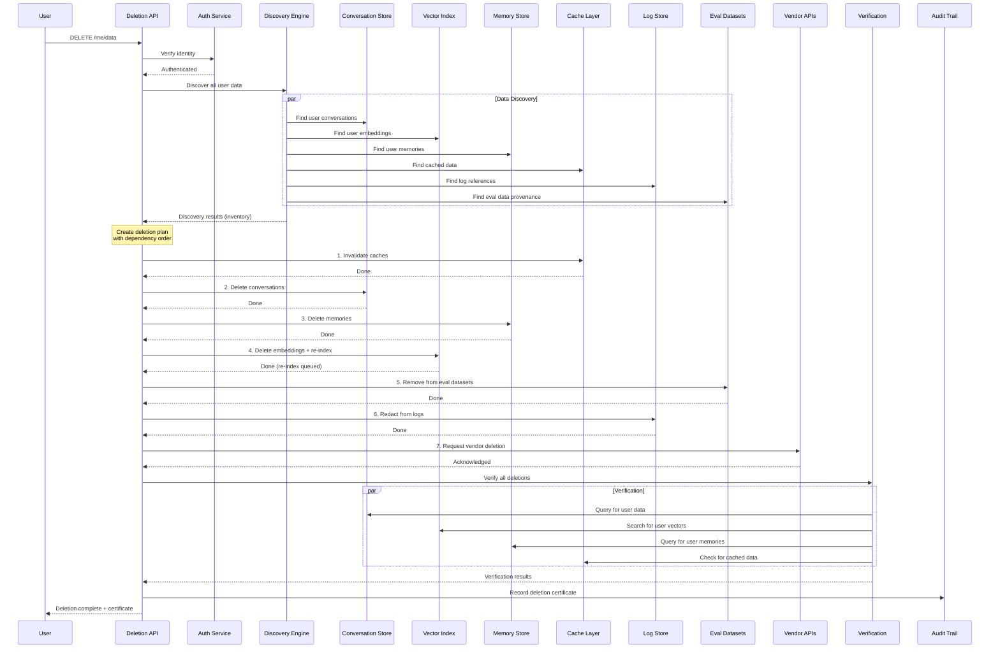
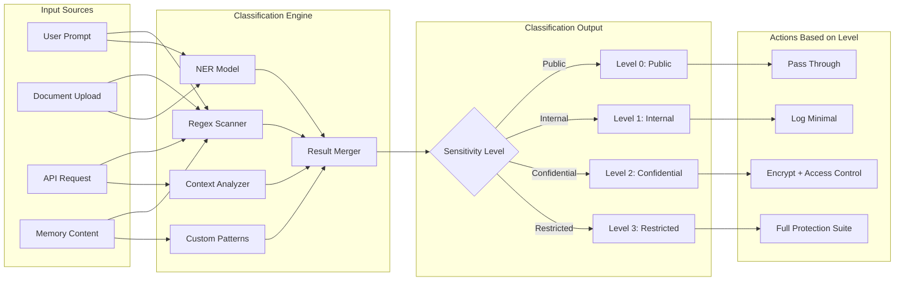
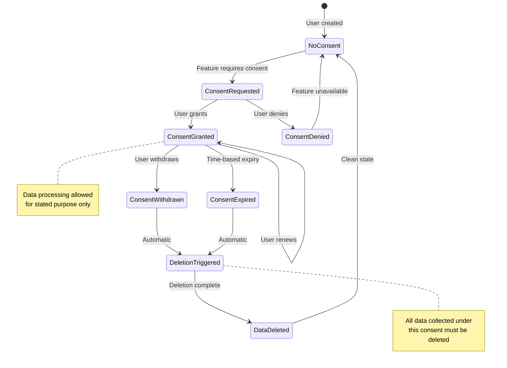
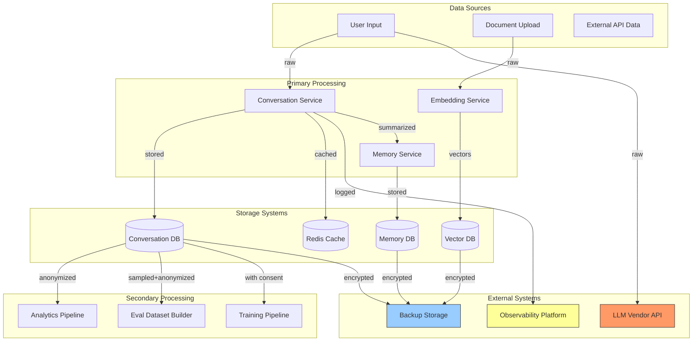
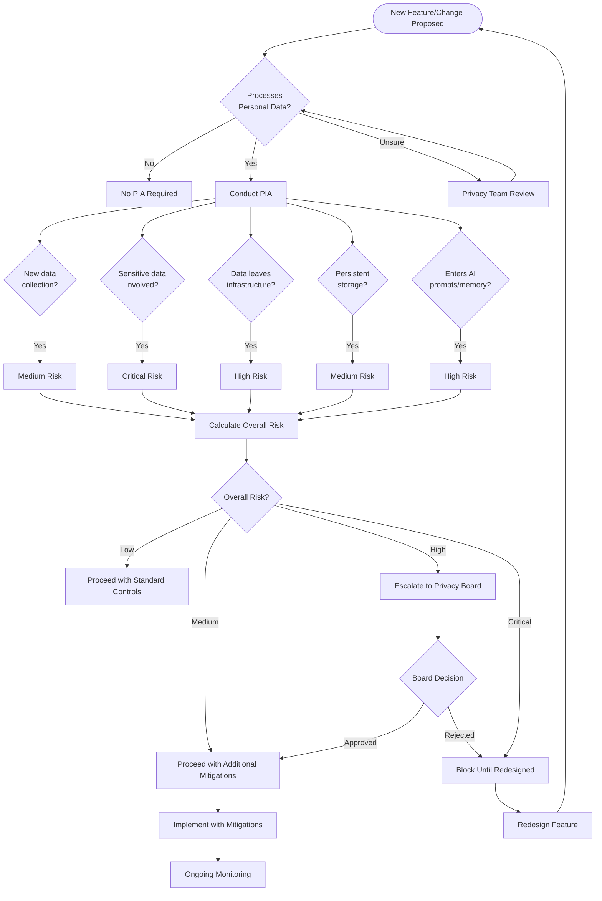
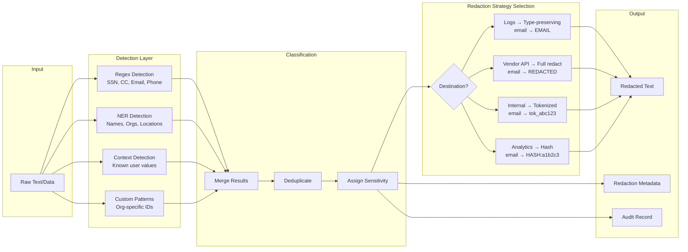
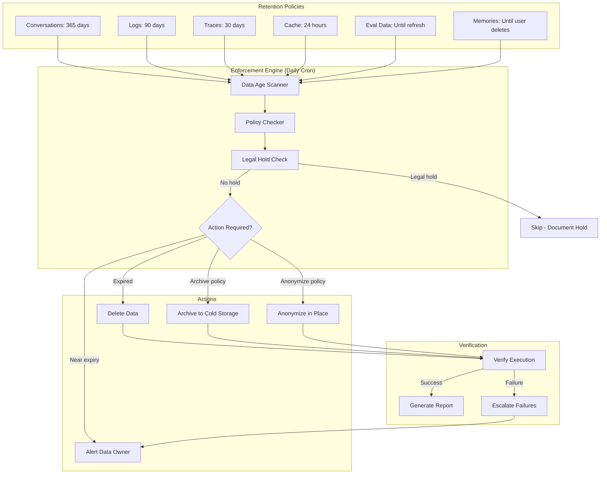

# Privacy and Data Governance - Architecture Diagrams

## 1. Privacy Architecture Pattern

## 2. Right-to-Delete Flow (Across All Components)

## 3. Data Classification Pipeline

## 4. Consent Management Flow

## 5. Data Lineage Mapping

## 6. Privacy Impact Assessment Process

## 7. PII Detection and Redaction Pipeline

## 8. Retention Policy Enforcement

