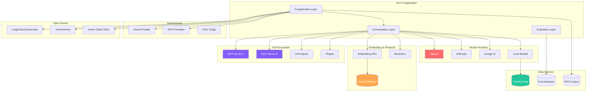
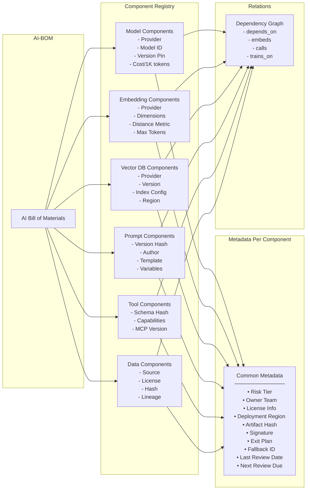
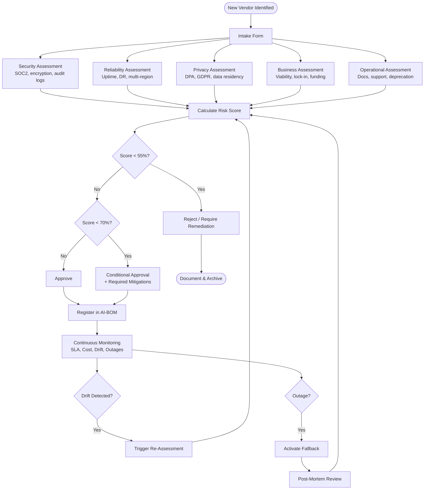
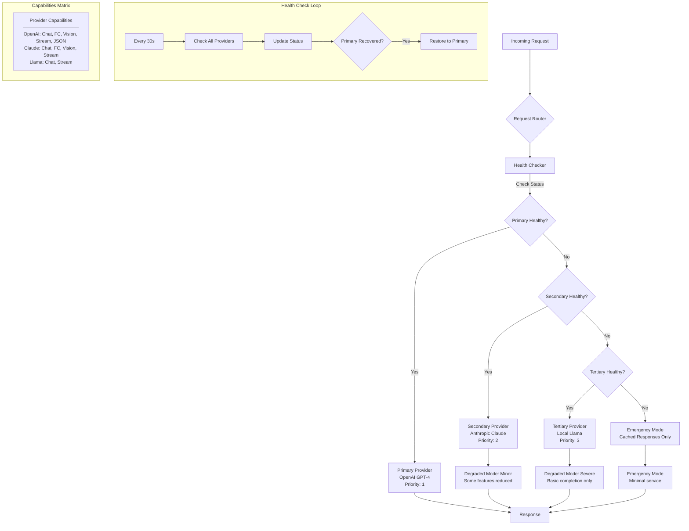
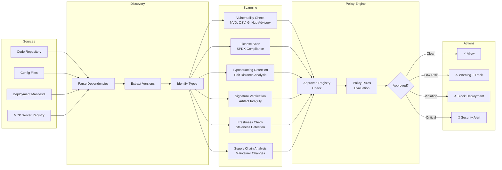
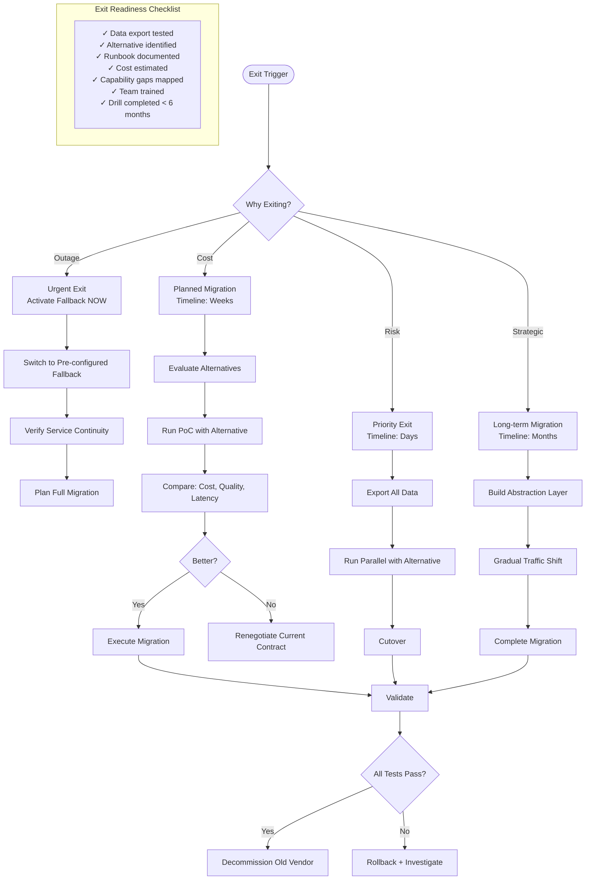
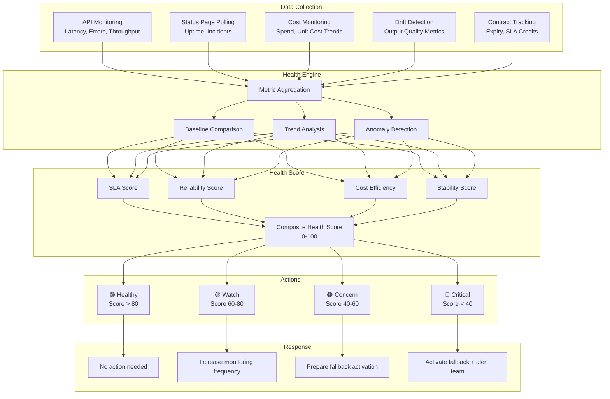
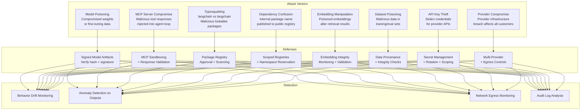

# Supply Chain and Vendor Risk - Diagrams

## 1. AI Supply Chain Overview

## 2. AI Bill of Materials Structure

## 3. Vendor Risk Assessment Flow

## 4. Provider Fallback Architecture

## 5. Dependency Scanning Pipeline

## 6. Exit Strategy Decision Tree

## 7. Vendor Health Monitoring

## 8. Supply Chain Attack Vectors

