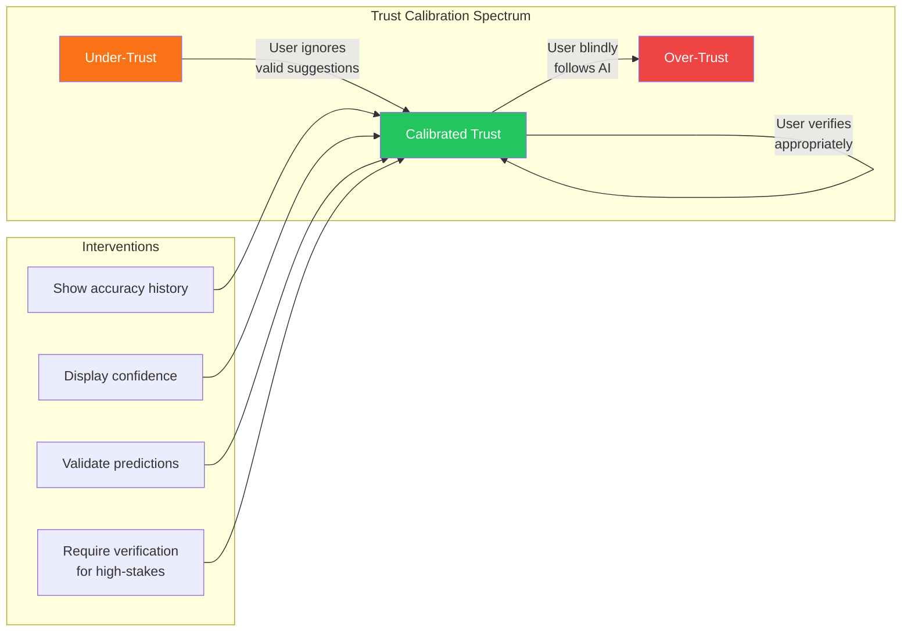
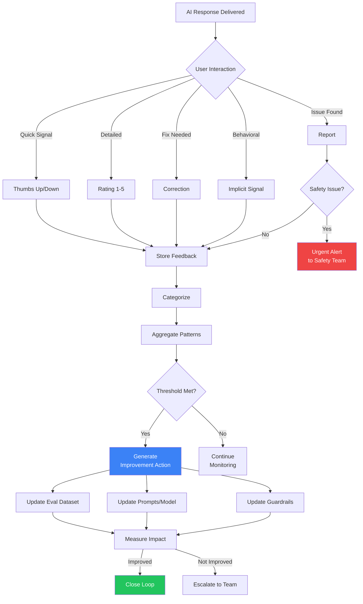
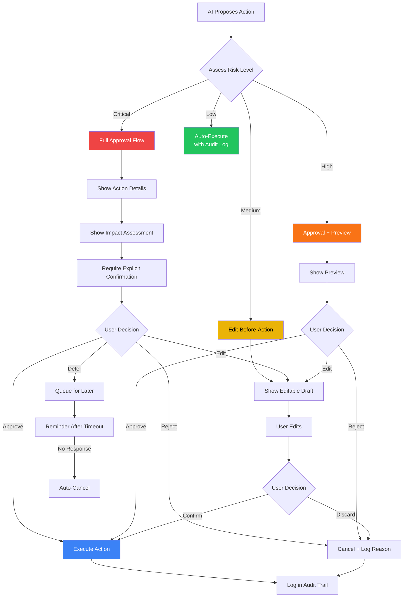
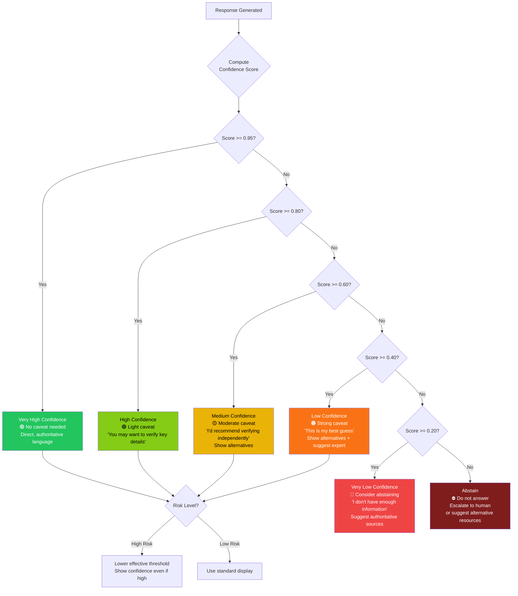
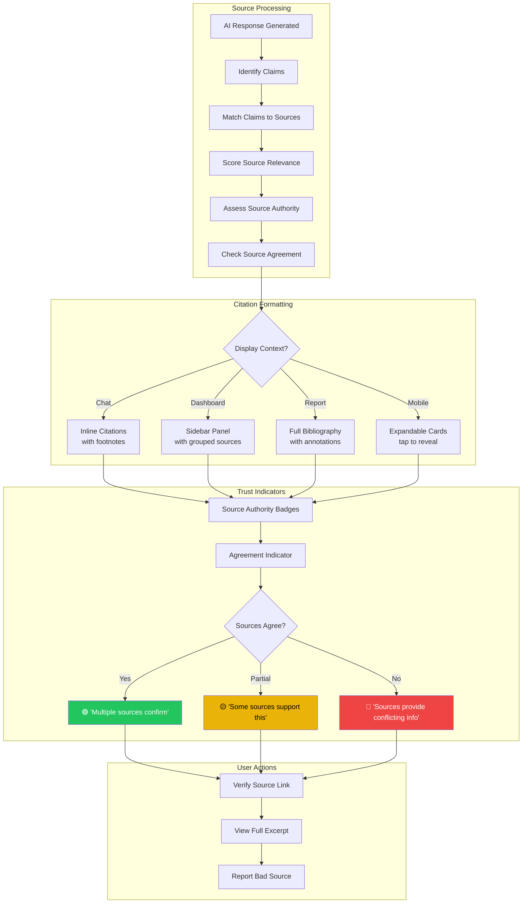
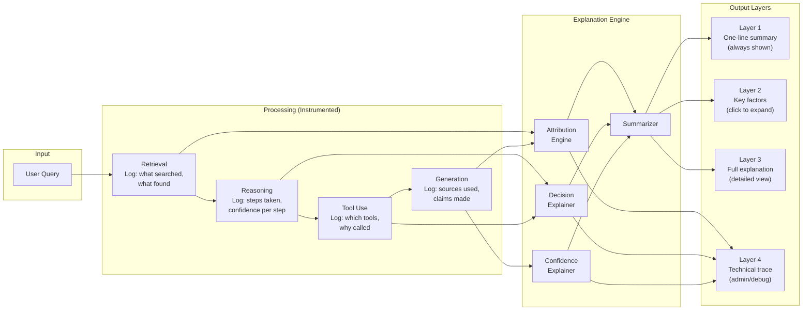
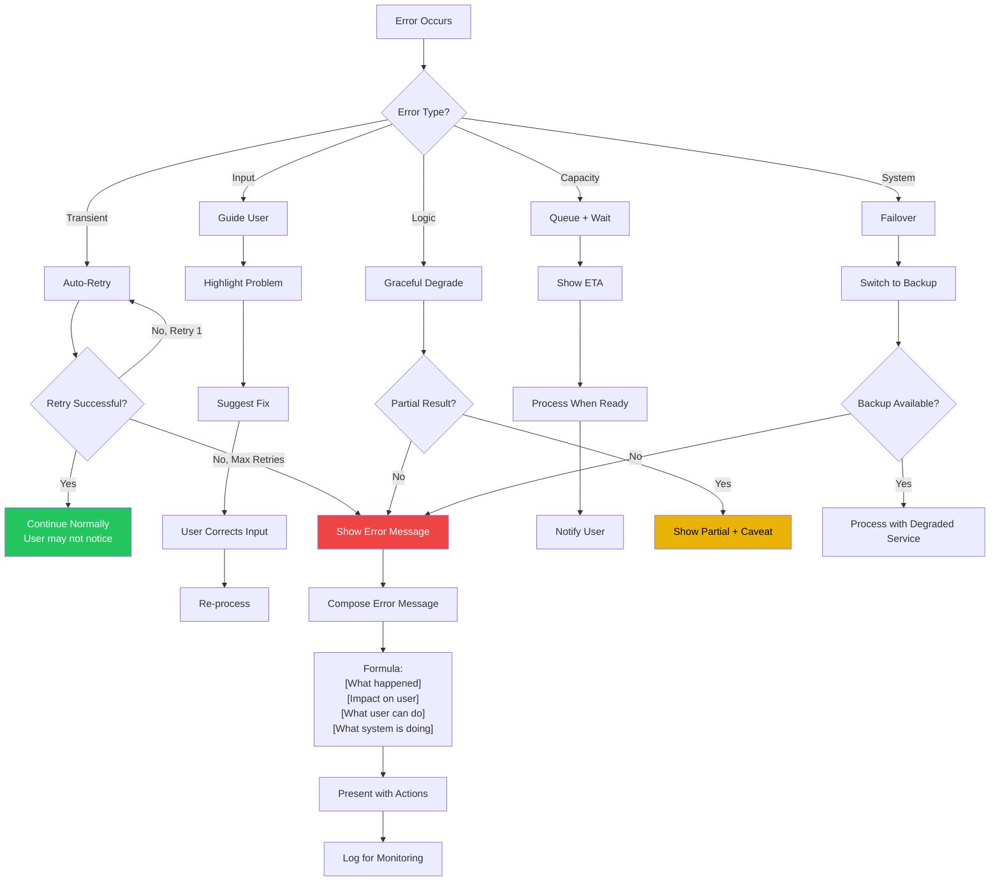
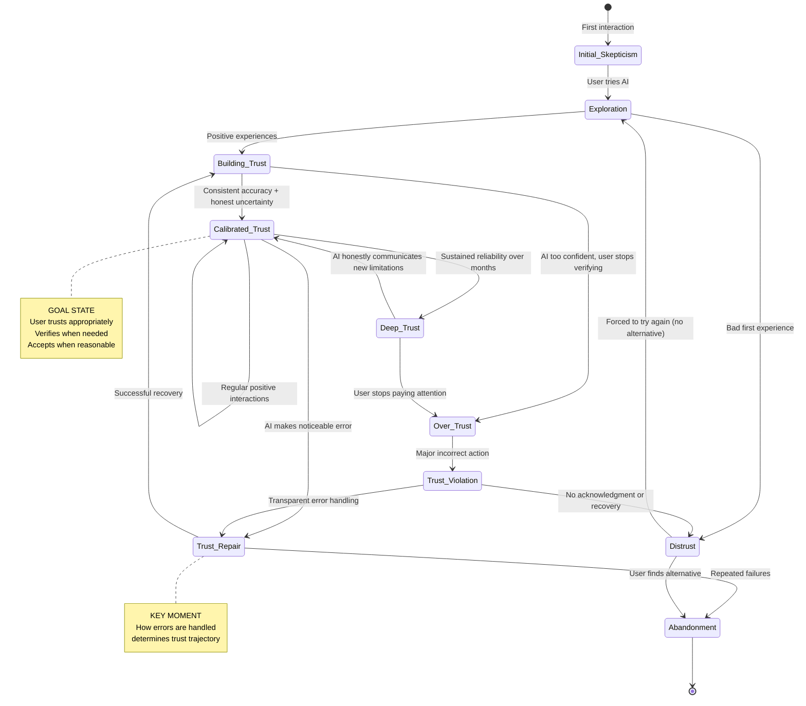
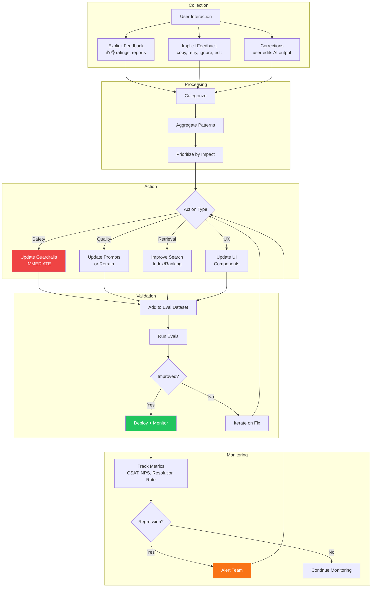

# AI UX and Human Trust - Diagrams

## 1. Trust Calibration Spectrum

## 2. Feedback Collection Flow

## 3. Human Approval UX Flow

## 4. Confidence Display Decision Tree

## 5. Citation UX Architecture

## 6. Explainability Pipeline

## 7. Error Recovery Flow

## 8. User Trust Lifecycle

## 9. Feedback-to-Improvement Closed Loop

