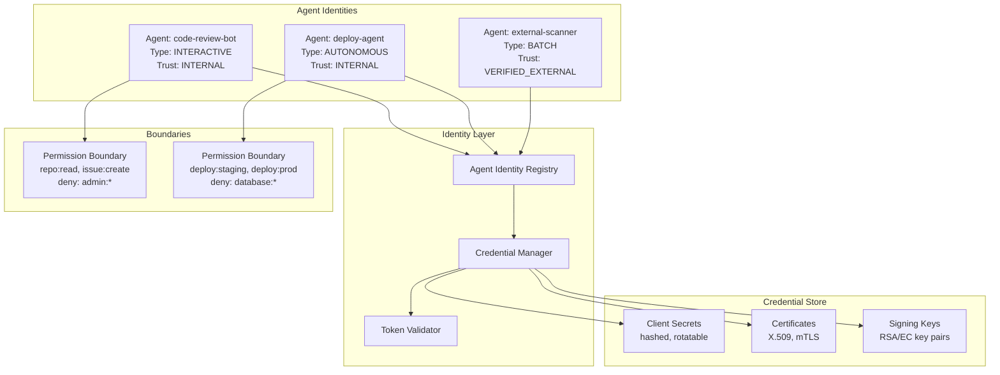
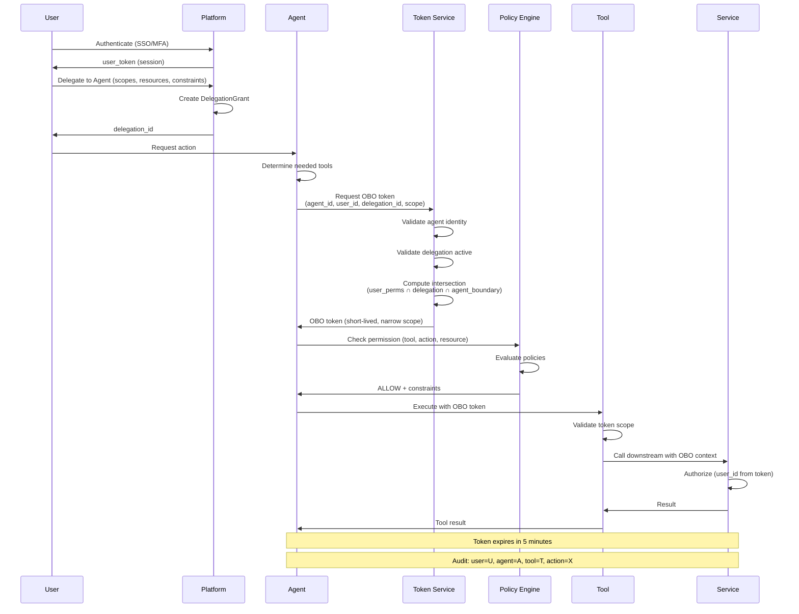
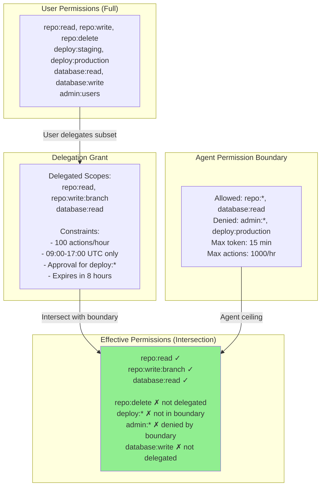
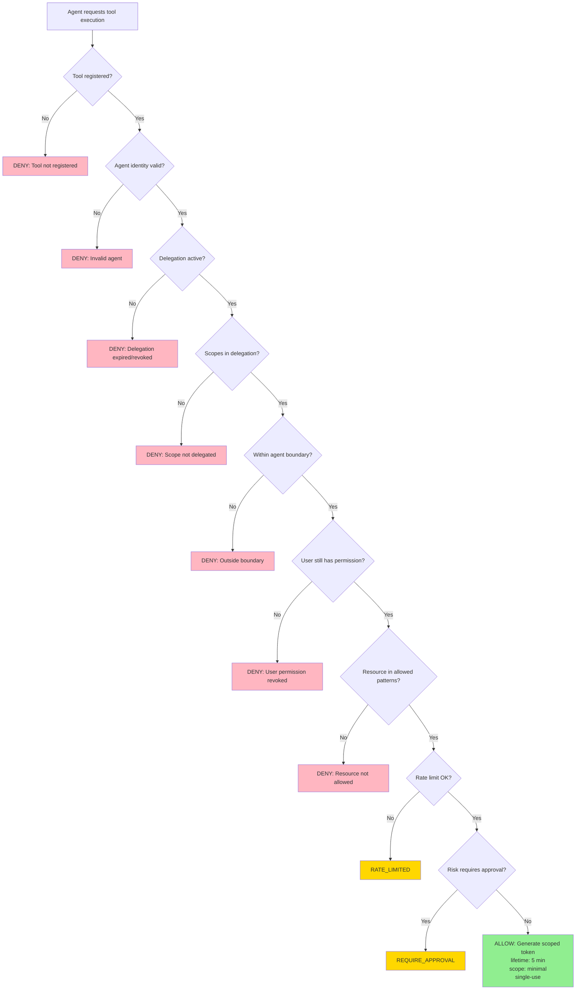
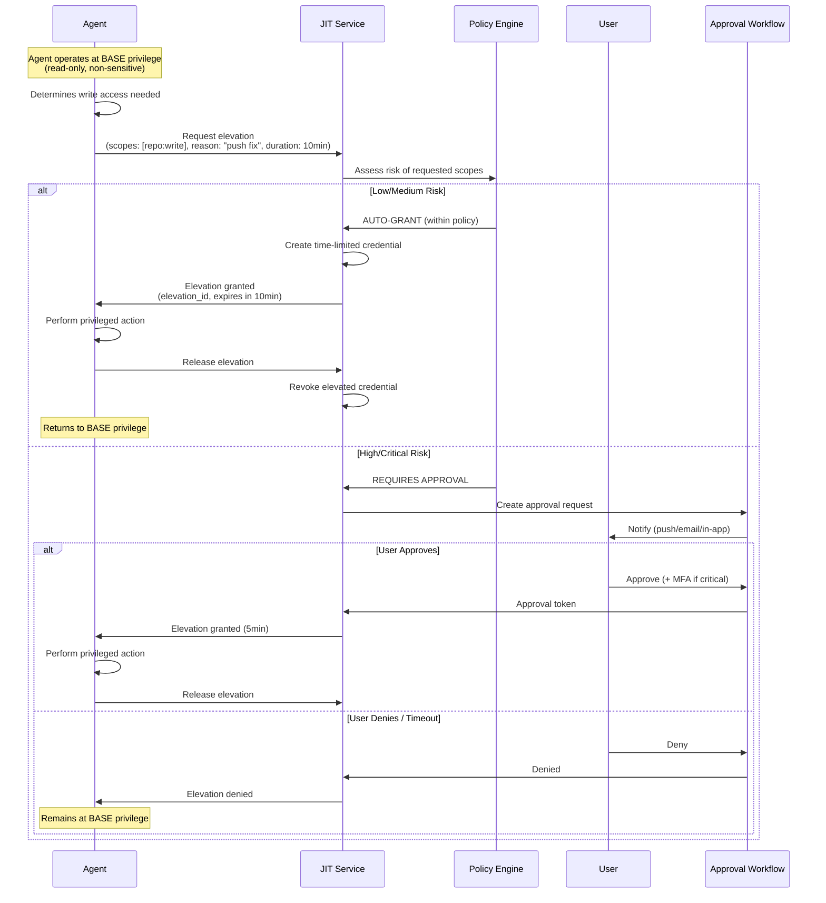
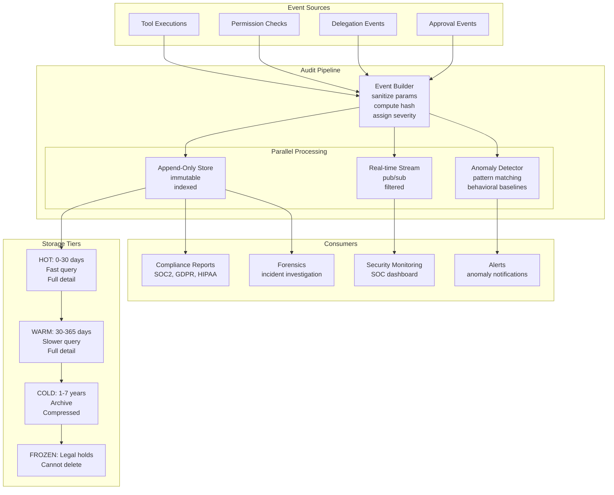
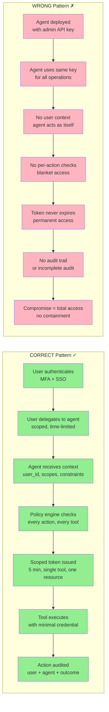
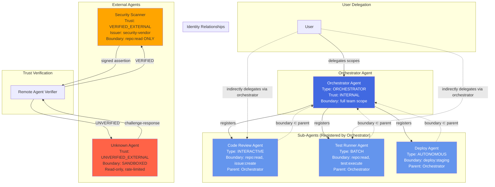
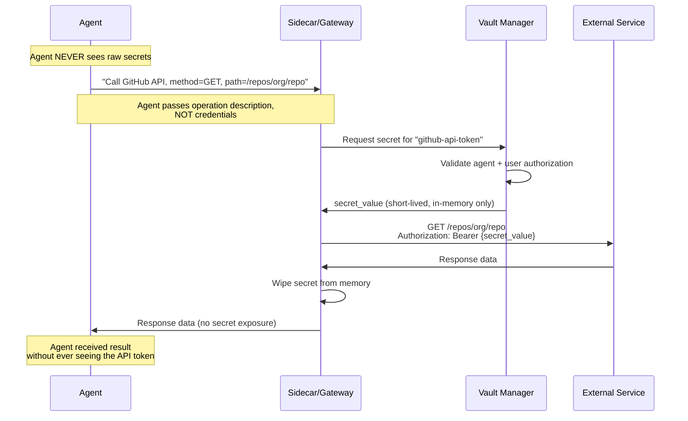
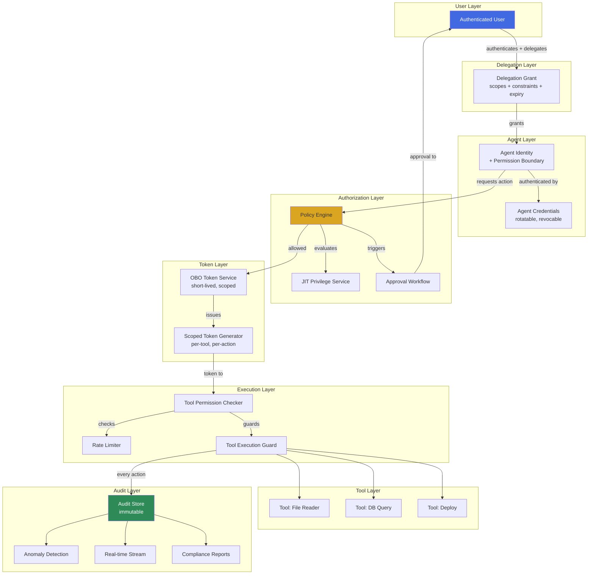

# Agent Identity and Permissions - Diagrams

## 1. Agent Identity Architecture

## 2. On-Behalf-Of Flow Sequence

## 3. Delegated Authorization Model

## 4. Tool Permission Check Flow

## 5. Just-in-Time Privilege Sequence

## 6. Audit Trail Architecture

## 7. Correct vs Wrong Pattern Comparison

## 8. Multi-Agent Identity Relationships

## 9. Secret Isolation Architecture

## 10. Complete System Integration

