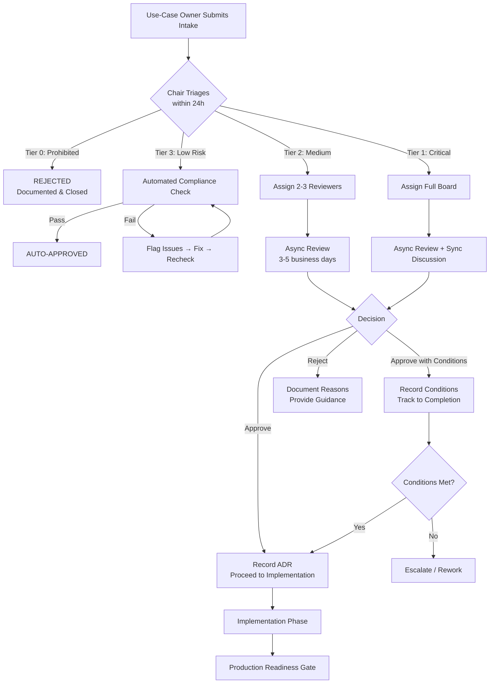
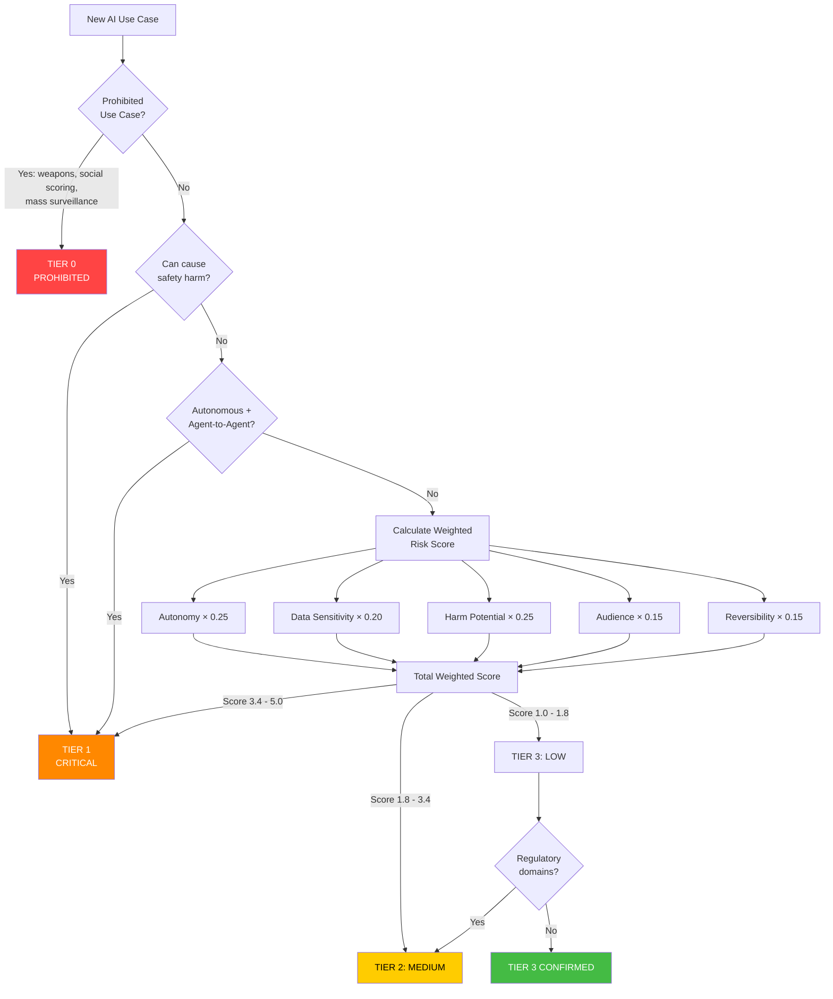
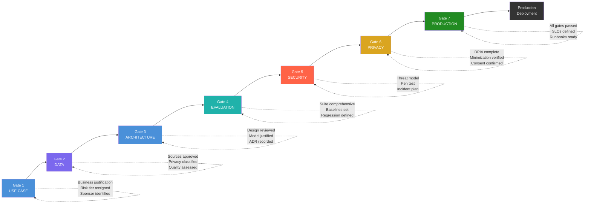
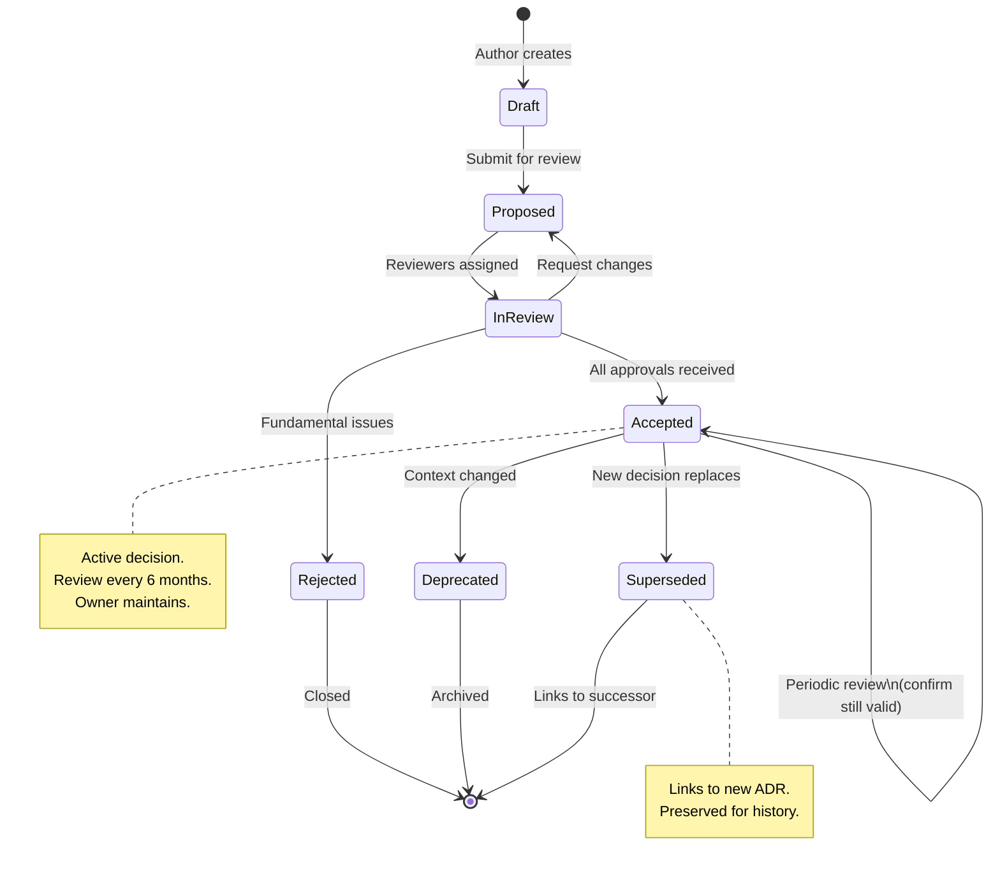
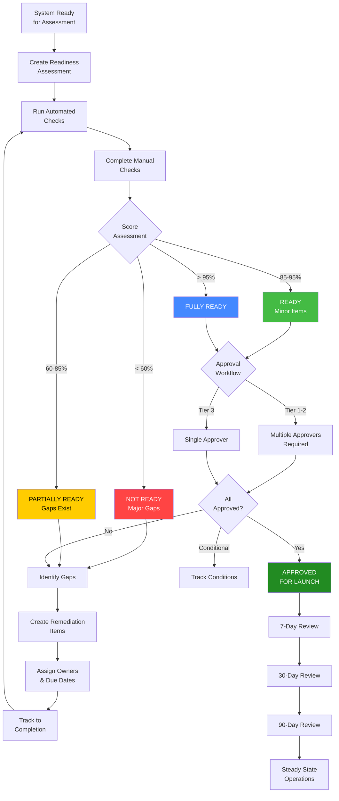
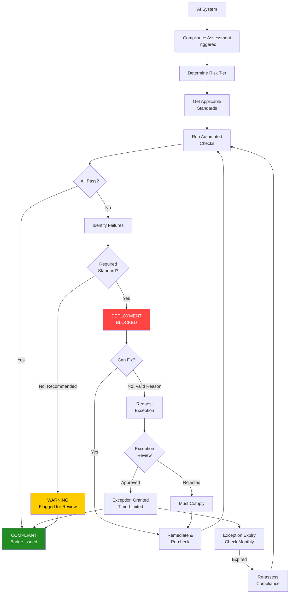
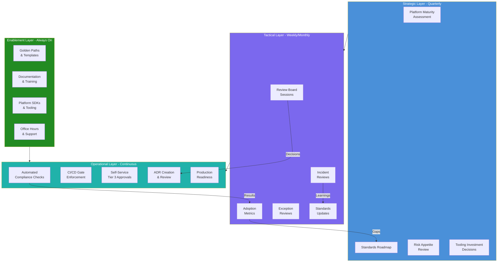

# Architecture Governance Diagrams

## 1. Architecture Review Board Workflow

## 2. Risk Tiering Decision Tree

## 3. Review Gates Pipeline

## 4. ADR Lifecycle

## 5. Production Readiness Flow

## 6. Platform Maturity Assessment

```mermaid
flowchart TD
    subgraph L0[L0: Ad Hoc]
        L0A[Individual experimentation]
        L0B[No shared infrastructure]
        L0C[No governance]
    end

    subgraph L1[L1: App-Specific]
        L1A[Purpose-built AI features]
        L1B[Some shared libraries]
        L1C[Basic monitoring]
    end

    subgraph L2[L2: Reusable Basics]
        L2A[Shared AI platform]
        L2B[Basic standards documented]
        L2C[Centralized model registry]
    end

    subgraph L3[L3: Governed Enterprise]
        L3A[Review board operational]
        L3B[All 7 gates enforced]
        L3C[ADR process active]
        L3D[Secure path = easy path]
    end

    subgraph L4[L4: Optimized]
        L4A[Metrics-driven improvement]
        L4B[Automated cost optimization]
        L4C[Golden paths for patterns]
    end

    subgraph L5[L5: Adaptive]
        L5A[Self-adjusting platform]
        L5B[Governance invisible]
        L5C[Competitive advantage]
    end

    L0 -->|Recognize need<br/>for sharing| L1
    L1 -->|Invest in<br/>platform| L2
    L2 -->|Implement<br/>governance| L3
    L3 -->|Optimize via<br/>metrics| L4
    L4 -->|ML-driven<br/>adaptation| L5

    style L0 fill:#ff6666,color:#000
    style L1 fill:#ff9944,color:#000
    style L2 fill:#ffcc44,color:#000
    style L3 fill:#88cc44,color:#000
    style L4 fill:#44aacc,color:#000
    style L5 fill:#8844cc,color:#fff
```

## 7. Standards Compliance Flow

## 8. Governance Operating Model

---

## Diagram Summary

| Diagram | Purpose | Key Insight |
|---------|---------|-------------|
| Review Board Workflow | Shows the full intake-to-decision process | Different paths per tier reduce overhead for low-risk |
| Risk Tiering | Decision tree for classifying risk | Automatic escalation rules override scoring |
| Review Gates | The 7 sequential gates to production | Each gate has specific criteria per tier |
| ADR Lifecycle | States and transitions for decisions | Periodic review prevents stale decisions |
| Production Readiness | Assessment to launch flow | Gaps drive remediation before approval |
| Platform Maturity | L0-L5 progression | L3 is the key milestone (governance = enablement) |
| Standards Compliance | How standards are enforced | Exception process provides escape valve |
| Operating Model | Layered governance structure | Enablement makes operational governance work |
