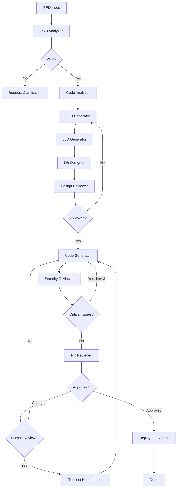

# Quick Start: Creating Custom Autonomous Agents with Claude in GitHub Copilot

This guide shows you how to create custom autonomous agents that handle complete software development workflows.

---

## 🎯 What We Built

A **complete SDLC automation agent** that takes you from PRD to deployed code:

```
PRD → Architecture Analysis → Design (HLD/LLD/DB) → Code Generation → 
Security Review → PR Review → Deployment Configuration
```

---

## 🚀 Quick Start (5 minutes)

### 1. Navigate to Project

```bash
cd /Users/harsh.kumar01/Documents/learning/learning-conv/System-Design/AI-ML/system-design-agent
```

### 2. Set Up Environment

```bash
# Create .env file
cat > .env << EOF
ANTHROPIC_API_KEY=your_api_key_here
LLM_PROVIDER=anthropic
ANTHROPIC_MODEL=claude-3-5-sonnet-20241022
EOF

# Install dependencies
pip install -e .
```

### 3. Run Your First Agent Pipeline

```bash
# Generate complete system design and code from PRD
python -m src.main \
  --prd-file sample-prd.md \
  --output-dir output/my-feature \
  --phases design,implementation
```

### 4. Import Custom Agents into GitHub Copilot

**Option A: Automatic (Workspace Settings Already Configured)**

The custom agents are already configured! Just:

1. Open VS Code in this directory
2. Reload window (⌘+Shift+P → "Reload Window")
3. Open Copilot Chat
4. Click the "Agent" dropdown → You'll see custom agents!

**Option B: Manual Configuration**

Add to your user settings (⌘+, → Search "GitHub Copilot"):

```json
{
  "github.copilot.advanced": {
    "customAgents": {
      "configPath": "/Users/harsh.kumar01/Documents/learning/learning-conv/System-Design/AI-ML/system-design-agent/.github/copilot/agents.json"
    }
  }
}
```

**Option C: Import via UI**

1. Open Copilot Chat
2. Click "Agent" dropdown
3. Select "Configure Custom Agents..."
4. Click "Import from file"
5. Select `.github/copilot/agents.json`

Then use in Copilot:
```
@sdlc-architect Analyze this PRD and generate complete implementation

@code-architect Generate a payment service following our patterns

@security-reviewer Review this code for vulnerabilities
```

---

## 📚 Key Files Created

### Architecture & Documentation

| File | Purpose |
|------|---------|
| [EXTENDED_AUTONOMOUS_AGENT.md](./EXTENDED_AUTONOMOUS_AGENT.md) | Complete architecture documentation |
| [IMPLEMENTATION_GUIDE.md](./IMPLEMENTATION_GUIDE.md) | Step-by-step implementation guide |
| This file | Quick reference guide |

### Agent Modules

| Agent | File | What It Does |
|-------|------|--------------|
| **Code Analyzer** | `src/agents/code_analyzer.py` | Analyzes existing codebase, extracts patterns and tech stack |
| **Code Generator** | `src/agents/code_generator.py` | Generates production code in Python/TypeScript/Go |
| **Security Reviewer** | `src/agents/security_review_agent.py` | SAST, dependency scanning, auto-fixes |
| **PR Reviewer** | `src/agents/pr_review_agent.py` | Code quality, architecture compliance, NFR validation |
| **Deployment Agent** | `src/agents/deployment_agent.py` | CI/CD, Kubernetes, Terraform, monitoring |

### Orchestration

| File | Purpose |
|------|---------|
| `src/orchestration/extended_state.py` | State management for all phases |
| `src/orchestration/extended_graph.py` | LangGraph workflow orchestration |

---

## 🎨 Usage Patterns

### Pattern 1: Complete Feature Development

**In GitHub Copilot Chat:**

```
@sdlc-architect Create a payment processing service with:

Requirements:
- Stripe integration
- PostgreSQL for transactions
- Redis for caching
- Handle 1000 transactions/minute
- 99.9% availability
- PCI-DSS compliant

Generate:
1. System architecture (HLD/LLD)
2. Database schema
3. Production Python code (FastAPI)
4. Unit and integration tests
5. Kubernetes deployment
6. CI/CD pipeline (GitHub Actions)
7. Monitoring setup
```

**Output**: Complete implementation with all artifacts

### Pattern 2: Extend Existing Codebase

```
@code-architect Analyze our codebase in src/services/ and generate a new NotificationService.

Our stack:
- Python 3.11 + FastAPI
- PostgreSQL + SQLAlchemy
- Repository pattern

New service should:
- Send emails (SendGrid)
- Send SMS (Twilio)
- Store notification history
- Follow our existing patterns
```

### Pattern 3: Security Audit

```
@security-reviewer Perform comprehensive security review:

[paste code or specify file path]

Check for:
- OWASP Top 10 vulnerabilities
- SQL injection, XSS, CSRF
- Authentication/authorization issues
- Sensitive data exposure
- Dependency vulnerabilities
```

### Pattern 4: Deployment Configuration

```
@deployment-engineer Create complete deployment setup:

Services:
- API Gateway (Node.js)
- Order Service (Python)
- Payment Service (Python)

Deploy to AWS EKS with:
- Blue/green deployment strategy
- GitHub Actions CI/CD
- Prometheus + Grafana monitoring
- Auto-scaling (min 3, max 20 pods)
```

### Pattern 5: Test Generation

```
@test-engineer Generate comprehensive tests for OrderService:

[paste service code]

Generate:
- Unit tests (80%+ coverage)
- Integration tests (DB operations)
- E2E tests (complete order flow)
- Load tests (1000 req/s target)
```

### Pattern 6: Code Review

```
@pr-reviewer Review this pull request:

Changes:
- Added payment refund functionality
- Implemented webhook handling
- Updated status tracking

[paste PR diff]

Validate:
- Code quality
- Security
- Performance
- Test coverage
- Documentation
```

---

## 🔧 Customization Examples

### Add a New Custom Agent

Edit `.github/copilot/agents.json`:

```json
{
  "version": "1.0",
  "agents": [
    {
      "id": "data-engineer",
      "name": "Data Engineer",
      "description": "Designs data pipelines and ETL workflows",
      "prompt": "You are a data engineering expert. You design:\n\n1. ETL/ELT pipelines (Airflow, Prefect, Dagster)\n2. Data warehouses (Snowflake, BigQuery, Redshift)\n3. Stream processing (Kafka, Flink, Spark Streaming)\n4. Data quality checks and validation\n5. Data governance and lineage\n\nYou provide:\n- Complete pipeline code\n- Data models and schemas\n- Monitoring and alerting\n- Data quality tests\n- Documentation and runbooks",
      "tools": [],
      "conversationStarters": [
        "Design an ETL pipeline for user events",
        "Create a data warehouse schema",
        "Build a real-time streaming pipeline"
      ]
    }
  ]
}
```

Then use:
```
@data-engineer Design a real-time data pipeline for processing user clickstream events
```

### Customize Existing Agent

Modify an agent's prompt in `agents.json`:

```json
{
  "id": "sdlc-architect",
  "name": "SDLC Architect",
  "prompt": "You are an expert software architect specializing in [YOUR DOMAIN]...\n\n[Add your company-specific guidelines]\n\nTechnology preferences:\n- Cloud: AWS\n- Languages: Python, TypeScript\n- Databases: PostgreSQL, DynamoDB\n- Message Queue: SQS\n\n[Your coding standards]..."
}
```

### Add Domain-Specific Knowledge

```json
{
  "id": "fintech-architect",
  "name": "FinTech Architect",
  "prompt": "You are a FinTech architect expert in:\n\n1. Payment processing (Stripe, Adyen, PayPal)\n2. Banking integrations (Plaid, Yodlee)\n3. Compliance (PCI-DSS, PSD2, SOC2, GDPR)\n4. Financial calculations (interest, amortization)\n5. Fraud detection and risk management\n\nYou ensure:\n- Double-entry accounting\n- Idempotency for financial operations\n- Audit trails and logging\n- Strong consistency for transactions\n- Regulatory compliance"
}
```

Then:
```
@fintech-architect Design a lending platform with loan origination and servicing
```

---

## 🎭 Available Custom Agents

```
┌───────────────────────────────────────────────────────────────┐
│  @sdlc-architect       │ Complete SDLC: PRD → Deployment     │
│                        │ (HLD, LLD, Code, Tests, Security,   │
│                        │  Deploy configs)                     │
├───────────────────────────────────────────────────────────────┤
│  @code-architect       │ Codebase analysis & code generation  │
│                        │ (Follows existing patterns)          │
├───────────────────────────────────────────────────────────────┤
│  @security-reviewer    │ Security analysis & vulnerability    │
│                        │ fixing (SAST, deps, compliance)      │
├───────────────────────────────────────────────────────────────┤
│  @deployment-engineer  │ Deployment configurations            │
│                        │ (CI/CD, K8s, Terraform, Monitoring)  │
├───────────────────────────────────────────────────────────────┤
│  @test-engineer        │ Test generation                      │
│                        │ (Unit, Integration, E2E, Load tests) │
├───────────────────────────────────────────────────────────────┤
│  @pr-reviewer          │ Code review & quality assessment     │
│                        │ (Quality score, NFR validation)      │
└───────────────────────────────────────────────────────────────┘
```

Each agent uses **Claude 3.5 Sonnet** and is specialized for its domain.

---

## 🔄 Workflow Control Flow



---

## 💡 Pro Tips

### 1. Cost Optimization

```python
# Use cheaper models for simple tasks
CODE_FORMATTING_MODEL = "gpt-4o-mini"  # $0.15/1M tokens
ARCHITECTURE_MODEL = "claude-3-5-sonnet"  # $3/1M tokens
```

### 2. Caching for Faster Iterations

```python
# Cache vector embeddings
vector_store = ChromaDB(
    persist_directory="./vector_store",
    cache_embeddings=True
)
```

### 3. Batch Operations

```python
# Process multiple files in parallel
import asyncio

tasks = [
    generate_component_code(comp) 
    for comp in components
]
results = await asyncio.gather(*tasks)
```

### 4. Human Checkpoints

```python
# config/agent_config.yaml
human_review_required_for:
  - critical_security_issues
  - architecture_deviations
  - compliance_sensitive_code
  - production_deployments
```

---

## 📊 Monitoring Agent Performance

```python
# Track metrics
metrics = {
    "design_quality_score": 9.2,
    "code_coverage": 87,
    "security_issues_auto_fixed": 5,
    "deployment_success_rate": 95,
    "cost_per_run": "$12.50",
    "total_runtime": "18 minutes"
}
```

---

## 🐛 Common Issues & Solutions

| Issue | Solution |
|-------|----------|
| Rate limits | Add retry with exponential backoff |
| Memory errors | Process in batches, limit file sampling |
| Invalid syntax | Add validation step after code gen |
| Missing tools | Install: `pip install bandit semgrep safety` |
| Vector store errors | Clear and rebuild: `rm -rf ./vector_store` |

---

## 📖 Learning Path

1. **Start Here**: [EXTENDED_AUTONOMOUS_AGENT.md](./EXTENDED_AUTONOMOUS_AGENT.md)
   - Complete architecture overview
   - Agent responsibilities
   - Technology stack

2. **Then**: [IMPLEMENTATION_GUIDE.md](./IMPLEMENTATION_GUIDE.md)
   - Step-by-step setup
   - Customization examples
   - Integration with Copilot

3. **Explore**: Generated Examples
   - `output/order-tracking/` - Complete example
   - Study the generated code, tests, configs

4. **Customize**: Add Your Tech Stack
   - Add your programming languages
   - Integrate your deployment tools
   - Add company-specific compliance checks

5. **Scale**: Production Deployment
   - Set up MCP server
   - Integrate with CI/CD
   - Monitor agent performance

---

## 🎯 Success Metrics

**What Success Looks Like:**

- ✅ 80%+ test coverage on generated code
- ✅ 0 critical security issues
- ✅ Architecture matches approved designs
- ✅ Code passes all quality gates
- ✅ Deployment configs work out-of-the-box
- ✅ < 30 min end-to-end pipeline runtime
- ✅ < $20 LLM API cost per feature

---

## 🚦 Next Actions

**Your custom agents are ready to use!** 🎉

### 1. Reload VS Code

```bash
# Open VS Code in the project directory
code /Users/harsh.kumar01/Documents/learning/learning-conv/System-Design/AI-ML/system-design-agent

# Reload window: ⌘+Shift+P → "Developer: Reload Window"
```

### 2. Open Copilot Chat

- **Keyboard**: ⌘+Command+I (Mac) or Ctrl+Alt+I (Windows)
- **UI**: Click the Copilot icon in the sidebar

### 3. Test Your First Agent

In Copilot Chat, try:

```
@sdlc-architect Create a payment processing service with:
- Stripe integration
- Transaction history storage (PostgreSQL)
- Webhook handling for payment confirmations
- Retry logic for failed payments
- Include complete HLD, API design, code, tests, and K8s deployment
```

### 4. Test Agent Chaining (Advanced)

```
Step 1: @sdlc-architect Generate architecture for user authentication
Step 2: @code-architect Implement the JWT service
Step 3: @test-engineer Create comprehensive test suite
Step 4: @security-reviewer Audit the implementation
Step 5: @deployment-engineer Create K8s and CI/CD configs
Step 6: @pr-reviewer Final quality check
```

### 5. Verify All Agents Work

Test each agent:

```
✅ @sdlc-architect → "Design a URL shortener service"
✅ @code-architect → "Analyze src/agents/ and suggest improvements"
✅ @security-reviewer → "Review this code: [paste code]"
✅ @test-engineer → "Generate tests for the OrderService"
✅ @deployment-engineer → "Create AWS EKS deployment config"
✅ @pr-reviewer → "Review this PR: [paste diff]"
```

### 6. Customize Agents (Optional)

Edit `.github/copilot/agents.json` to:
- Add new domain-specific agents
- Modify system prompts
- Add company-specific guidelines
- Include your tech stack preferences

See the **🔧 Customization Examples** section above.

---

## 📞 Support & Resources

- **Agent Configuration**: `.github/copilot/agents.json`
- **Detailed Guide**: `.github/copilot/README.md`
- **Troubleshooting**: Check the README for common issues and solutions

---

**Your custom agents are ready! Open Copilot Chat and start with `@sdlc-architect`** 🚀

The agents will reference your workspace files, understand your codebase structure, and generate contextually relevant code that follows your existing patterns.
