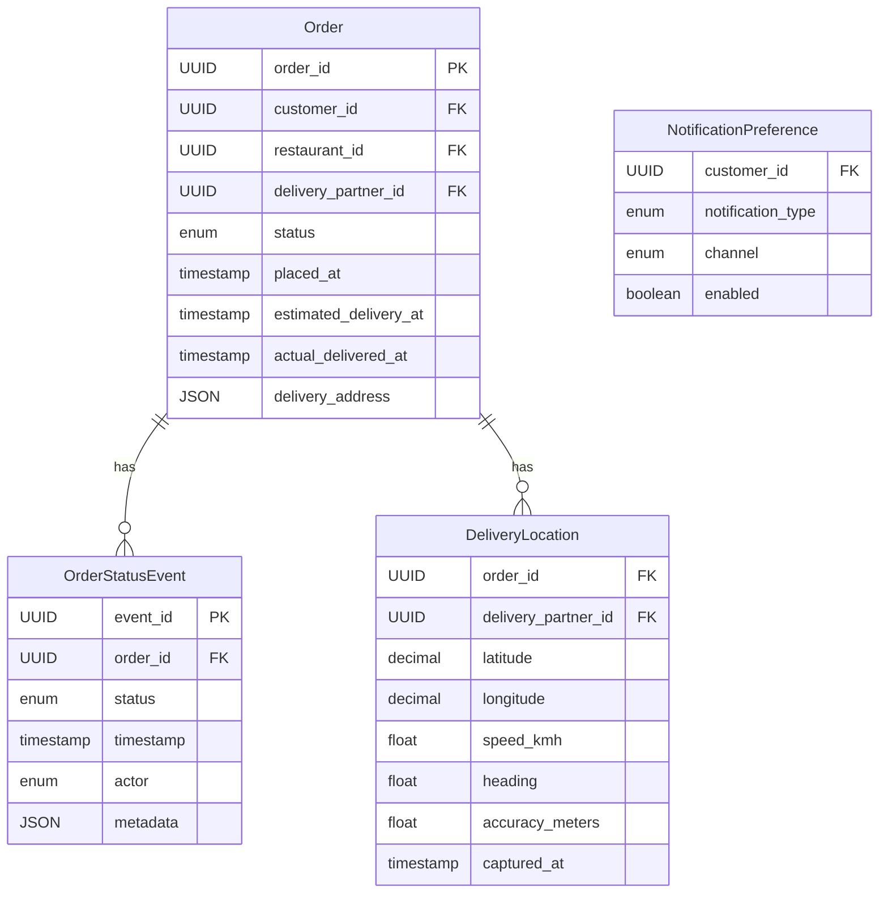

# Database Design Document

## Overview

### Database Choice Justification
PostgreSQL has been chosen for this project due to its robust support for complex queries, ACID compliance, and extensive indexing capabilities. It is well-suited for handling high write and read throughput, as required by the scale requirements. PostgreSQL's ability to handle JSON data types is beneficial for storing complex data structures like delivery addresses and metadata.

## Entity-Relationship Diagram



## Table Schemas

### Order
```sql
CREATE TABLE Order (
    order_id UUID PRIMARY KEY,
    customer_id UUID NOT NULL,
    restaurant_id UUID NOT NULL,
    delivery_partner_id UUID,
    status ENUM('placed', 'confirmed', 'delivered', 'cancelled') NOT NULL,
    placed_at TIMESTAMP NOT NULL,
    estimated_delivery_at TIMESTAMP NOT NULL,
    actual_delivered_at TIMESTAMP,
    delivery_address JSON NOT NULL
);
```

### OrderStatusEvent
```sql
CREATE TABLE OrderStatusEvent (
    event_id UUID PRIMARY KEY,
    order_id UUID NOT NULL REFERENCES Order(order_id),
    status ENUM('placed', 'confirmed', 'delivered', 'cancelled') NOT NULL,
    timestamp TIMESTAMP NOT NULL,
    actor ENUM('customer', 'restaurant', 'delivery_partner') NOT NULL,
    metadata JSON
);
```

### DeliveryLocation
```sql
CREATE TABLE DeliveryLocation (
    order_id UUID NOT NULL REFERENCES Order(order_id),
    delivery_partner_id UUID NOT NULL,
    latitude DECIMAL NOT NULL,
    longitude DECIMAL NOT NULL,
    speed_kmh FLOAT,
    heading FLOAT,
    accuracy_meters FLOAT,
    captured_at TIMESTAMP NOT NULL
);
```

### NotificationPreference
```sql
CREATE TABLE NotificationPreference (
    customer_id UUID NOT NULL,
    notification_type ENUM('order_updates', 'promotions', 'reminders') NOT NULL,
    channel ENUM('email', 'sms', 'push') NOT NULL,
    enabled BOOLEAN NOT NULL
);
```

## Index Strategy

### Order
- **Index on `customer_id`:** B-tree index to optimize queries fetching order history by customer.
- **Index on `restaurant_id`:** B-tree index for restaurant-specific order queries.
- **Index on `placed_at`:** B-tree index to optimize queries sorting or filtering by order date.

### OrderStatusEvent
- **Index on `order_id`:** B-tree index to optimize fetching order status events by order ID.
- **Index on `timestamp`:** B-tree index for efficient retrieval of events within a time range.

### DeliveryLocation
- **Index on `order_id`:** B-tree index to optimize fetching live location by order ID.
- **Index on `captured_at`:** B-tree index for efficient retrieval of location updates within a time range.

## Partitioning Strategy

### Order
- **Partition by `placed_at`:** Range partitioning by month to improve query performance for time-based queries and facilitate efficient data archiving.

### OrderStatusEvent
- **Partition by `timestamp`:** Range partitioning by month to optimize historical event queries and manage data retention.

### DeliveryLocation
- **Partition by `captured_at`:** Range partitioning by day to handle high write throughput and optimize location tracking queries.

## Denormalization Decisions
- **Delivery Address in Order:** Stored as JSON to avoid complex joins and allow flexible address formats.
- **Metadata in OrderStatusEvent:** Stored as JSON to accommodate varying data structures without schema changes.

## Key Queries

### Get Order History by Customer ID
```sql
SELECT * FROM Order WHERE customer_id = $1 ORDER BY placed_at DESC;
```
- **Access Pattern:** Frequent reads, sorted by date.
- **Execution Plan:** Utilizes index on `customer_id` and `placed_at`.

### Get Live Location by Order ID
```sql
SELECT * FROM DeliveryLocation WHERE order_id = $1 ORDER BY captured_at DESC LIMIT 1;
```
- **Access Pattern:** Frequent reads, sorted by timestamp.
- **Execution Plan:** Utilizes index on `order_id` and `captured_at`.

## Data Migration Plan

### Migration Steps
1. **Schema Creation:** Deploy new schema with partitioning.
2. **Data Transfer:** Use ETL processes to migrate existing data.
3. **Verification:** Validate data integrity post-migration.

### Rollback Plan
- **Backup:** Create backups before migration.
- **Revert:** Restore from backup if issues arise.

### Zero-Downtime Approach
- **Blue-Green Deployment:** Deploy new schema in parallel, switch traffic gradually.

## Capacity Planning

### Row Size Estimates
- **Order:** ~1 KB per row
- **OrderStatusEvent:** ~0.5 KB per row
- **DeliveryLocation:** ~0.5 KB per row

### Storage Projection
- **6 Months:** ~9 TB
- **1 Year:** ~18 TB
- **3 Years:** ~54 TB

### IOPS Estimates
- **Read IOPS:** 50,000
- **Write IOPS:** 175,000

### Connection Pool Sizing
- **Concurrent Users:** 500,000
- **Connection Pool:** 5,000 connections

## Backup & Recovery
- **Daily Backups:** Automated daily backups with point-in-time recovery.
- **Retention Policy:** 30 days of backups retained.

## DDL Scripts

### Create Table Statements
```sql
-- Order Table
CREATE TABLE Order (
    order_id UUID PRIMARY KEY,
    customer_id UUID NOT NULL,
    restaurant_id UUID NOT NULL,
    delivery_partner_id UUID,
    status ENUM('placed', 'confirmed', 'delivered', 'cancelled') NOT NULL,
    placed_at TIMESTAMP NOT NULL,
    estimated_delivery_at TIMESTAMP NOT NULL,
    actual_delivered_at TIMESTAMP,
    delivery_address JSON NOT NULL
);

-- OrderStatusEvent Table
CREATE TABLE OrderStatusEvent (
    event_id UUID PRIMARY KEY,
    order_id UUID NOT NULL REFERENCES Order(order_id),
    status ENUM('placed', 'confirmed', 'delivered', 'cancelled') NOT NULL,
    timestamp TIMESTAMP NOT NULL,
    actor ENUM('customer', 'restaurant', 'delivery_partner') NOT NULL,
    metadata JSON
);

-- DeliveryLocation Table
CREATE TABLE DeliveryLocation (
    order_id UUID NOT NULL REFERENCES Order(order_id),
    delivery_partner_id UUID NOT NULL,
    latitude DECIMAL NOT NULL,
    longitude DECIMAL NOT NULL,
    speed_kmh FLOAT,
    heading FLOAT,
    accuracy_meters FLOAT,
    captured_at TIMESTAMP NOT NULL
);

-- NotificationPreference Table
CREATE TABLE NotificationPreference (
    customer_id UUID NOT NULL,
    notification_type ENUM('order_updates', 'promotions', 'reminders') NOT NULL,
    channel ENUM('email', 'sms', 'push') NOT NULL,
    enabled BOOLEAN NOT NULL
);
```

### Create Index Statements
```sql
-- Order Indexes
CREATE INDEX idx_order_customer_id ON Order(customer_id);
CREATE INDEX idx_order_restaurant_id ON Order(restaurant_id);
CREATE INDEX idx_order_placed_at ON Order(placed_at);

-- OrderStatusEvent Indexes
CREATE INDEX idx_event_order_id ON OrderStatusEvent(order_id);
CREATE INDEX idx_event_timestamp ON OrderStatusEvent(timestamp);

-- DeliveryLocation Indexes
CREATE INDEX idx_location_order_id ON DeliveryLocation(order_id);
CREATE INDEX idx_location_captured_at ON DeliveryLocation(captured_at);
```

### Migration Scripts
- **ETL Scripts:** Custom scripts for data migration and validation.

This document provides a comprehensive design for the database schema, ensuring scalability, performance, and maintainability.