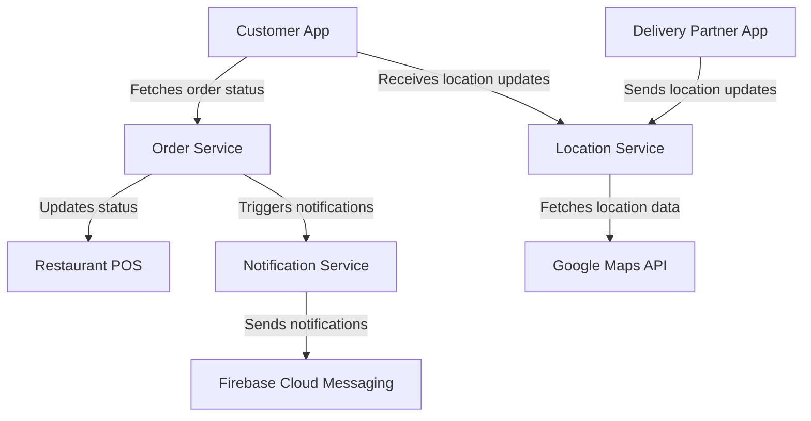
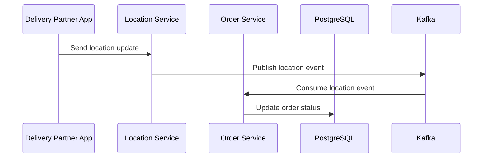
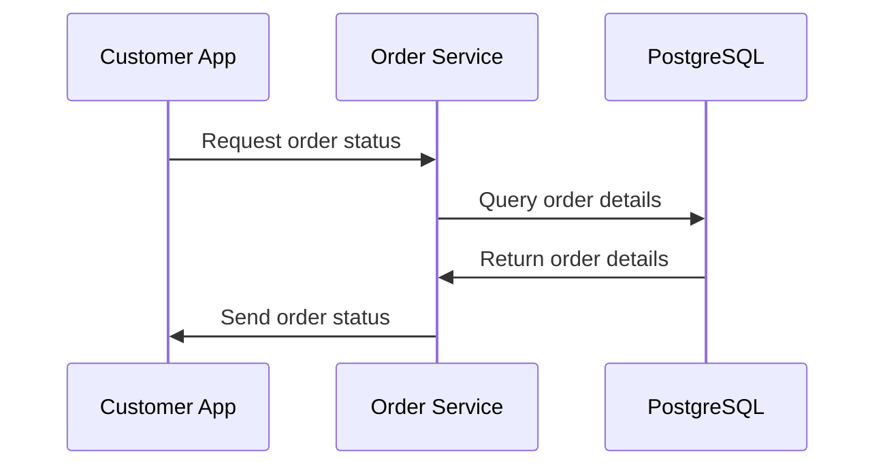

# High-Level Design Document: Real-Time Order Tracking System

## 1. Executive Summary

The Real-Time Order Tracking System is designed to enhance customer satisfaction by providing live tracking of food delivery orders. This system will offer real-time updates on the location of delivery partners and dynamically calculate estimated times of arrival (ETA). By integrating with existing restaurant POS systems and delivery partner applications, the system aims to reduce customer support calls and improve the overall delivery experience. The architecture leverages modern technologies and follows industry best practices to ensure scalability, availability, and security.

The system will be built on the existing Kubernetes infrastructure, utilizing a microservices architecture to enable independent scaling and deployment of components. Key integrations include Google Maps API for location services, Firebase Cloud Messaging for notifications, and Kafka for real-time data streaming. The system will handle high throughput with low latency, supporting up to 500,000 concurrent users and processing up to 175,000 write operations per second.

## 2. Goals & Non-Goals

**Goals:**
- Provide real-time order status and location updates to customers.
- Calculate and display dynamic ETAs based on live data.
- Send push notifications for key order milestones and significant ETA changes.
- Maintain a 90-day history of order tracking for customer reference.

**Non-Goals:**
- Payment processing, which is handled by an existing system.
- Route optimization, assumed to be managed by an existing routing service.

## 3. System Context Diagram

```mermaid
C4Context
title Real-Time Order Tracking System Context

Person(customer, "Customer", "Uses the app to track orders")
Person(deliveryPartner, "Delivery Partner", "Uses the app to update location")
System_Boundary(system, "Real-Time Order Tracking System") {
  Container(app, "Customer App", "Mobile App", "Displays order status and location")
  Container(deliveryApp, "Delivery Partner App", "Mobile App", "Sends location updates")
  Container_Boundary(backend, "Backend Services") {
    Container(orderService, "Order Service", "Spring Boot", "Manages order status and history")
    Container(locationService, "Location Service", "Node.js", "Processes location updates")
    Container(notificationService, "Notification Service", "Python", "Sends push notifications")
  }
  Container_External(posSystem, "Restaurant POS", "External System", "Updates order status")
  Container_External(mapsAPI, "Google Maps API", "External Service", "Provides location data")
  Container_External(fcm, "Firebase Cloud Messaging", "External Service", "Sends notifications")
}

Rel(customer, app, "Tracks order status and location")
Rel(deliveryPartner, deliveryApp, "Updates location")
Rel(app, orderService, "Fetches order status and history")
Rel(deliveryApp, locationService, "Sends location updates")
Rel(orderService, posSystem, "Receives status updates")
Rel(locationService, mapsAPI, "Fetches location data")
Rel(notificationService, fcm, "Sends notifications")
```

## 4. Architecture Overview

### Architecture Pattern with Justification
The system adopts a microservices architecture pattern, which allows for independent scaling, deployment, and development of services. This pattern is well-suited for handling high concurrency and throughput requirements, as it enables horizontal scaling of individual components. The use of Kubernetes for orchestration ensures efficient resource management and resilience.

### Component List with Responsibilities
- **Order Service:** Manages order status updates and history.
- **Location Service:** Processes real-time location updates from delivery partners.
- **Notification Service:** Sends push notifications to customers.
- **Customer App:** Displays order status and location to customers.
- **Delivery Partner App:** Sends location updates to the backend.

## 5. Component Architecture Diagram



## 6. Technology Choices

| Component               | Technology         | Justification                                                                 |
|-------------------------|--------------------|-------------------------------------------------------------------------------|
| Order Service           | Spring Boot        | Robust framework for building scalable microservices, integrates well with Kubernetes. |
| Location Service        | Node.js            | Efficient for handling I/O-bound operations, suitable for real-time updates.  |
| Notification Service    | Python             | Easy integration with Firebase Cloud Messaging, suitable for scripting tasks. |
| Data Streaming          | Kafka              | High throughput and low latency, supports real-time data streaming.           |
| Database                | PostgreSQL         | ACID compliance, supports complex queries, and is horizontally scalable.      |
| Messaging               | WebSocket          | Enables real-time communication between client and server.                    |

## 7. Data Flow Design

### Write Path (Sequence Diagram)


### Read Path (Sequence Diagram)


### Async Processing
- Location updates are processed asynchronously via Kafka to ensure real-time data streaming and decoupling of services.

## 8. API Design

### High-Level Endpoints
- **GET /orders/{orderId}/status:** Retrieve the current status of an order.
- **POST /orders/{orderId}/location:** Update the location of a delivery partner.
- **GET /orders/{orderId}/history:** Retrieve the order tracking history.

## 9. Data Storage Design

- **Order Data:** Stored in PostgreSQL, supporting complex queries and historical data retention.
- **Location Data:** Streamed via Kafka and stored in a time-series database for efficient retrieval.

## 10. Integration Design

- **Sync Patterns:** RESTful APIs for order status updates and retrieval.
- **Async Patterns:** Kafka for streaming location updates and order events.

## 11. Scalability Design

### Horizontal Scaling
- Services are containerized and deployed on Kubernetes, allowing for easy horizontal scaling.

### Caching Strategy
- Use Redis for caching frequently accessed order data to reduce database load.

### Database Scaling Approach
- PostgreSQL is configured for read replicas to distribute read load and ensure high availability.

## 12. Availability & Resilience

### Failure Modes
- Service failures are mitigated by Kubernetes auto-recovery and load balancing.

### Circuit Breakers / Retries
- Implement circuit breakers for external API calls and retries for transient failures.

### DR Strategy
- Regular backups and multi-region deployments ensure disaster recovery capabilities.

## 13. Security Design

### Authentication / Authorization
- OAuth 2.0 for secure authentication and authorization.

### Data Encryption
- Encrypt data at rest and in transit using TLS.

### Network Security
- Use VPCs and security groups to restrict access to sensitive components.

## 14. Monitoring & Observability

### Key Metrics
- Track order status update latency, location update delivery latency, and notification delivery success.

### Alerting Strategy
- Set up alerts for SLA breaches and critical service failures.

### Distributed Tracing
- Implement distributed tracing using OpenTelemetry for end-to-end request tracking.

## 15. Cost Estimation

- Estimated infrastructure cost: $12,000/month, within the budget of $15,000/month.

## 16. Risks & Mitigations

- **Risk:** High latency in location updates.
  - **Mitigation:** Optimize WebSocket connections and use edge servers for faster delivery.

- **Risk:** Data inconsistency due to network failures.
  - **Mitigation:** Implement retries and idempotency in API calls.

## 17. Open Questions

- How will the system handle edge cases like delivery partner app disconnections?
- What are the specific requirements for data retention beyond 90 days?