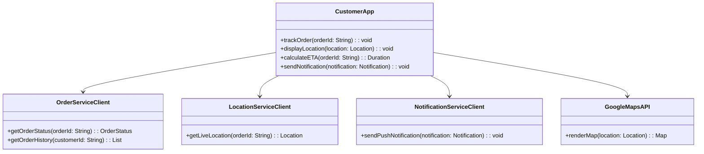
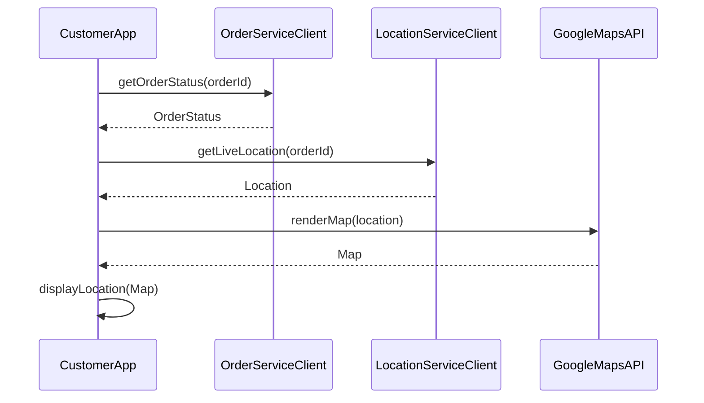
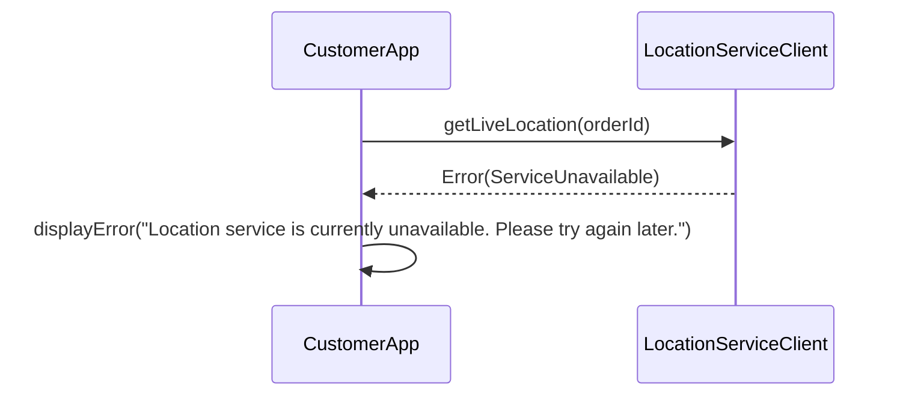

# Low-Level Design Document: Customer App Component

## 1. Component Overview

The Customer App component is responsible for providing users with real-time tracking of their food delivery orders. It displays order status, live location of delivery partners, dynamic ETAs, and sends push notifications for key events. The app interfaces with backend services to fetch order data, location updates, and notifications. It aims to enhance user experience by providing accurate and timely information.

### Boundaries
- Interfaces with Order Service for order status and history.
- Interfaces with Location Service for live location updates.
- Interfaces with Notification Service for push notifications.
- Utilizes Google Maps API for map rendering and location data.

## 2. Module/Class Diagram



## 3. Sequence Diagrams

### Happy Path: Order Tracking



### Error Scenario: Location Service Unavailable



## 4. API Contract

### Order Service Client

```yaml
openapi: 3.0.0
info:
  title: Order Service API
  version: 1.0.0
paths:
  /orders/{orderId}/status:
    get:
      summary: Get order status
      parameters:
        - name: orderId
          in: path
          required: true
          schema:
            type: string
      responses:
        '200':
          description: Order status retrieved successfully
          content:
            application/json:
              schema:
                $ref: '#/components/schemas/OrderStatus'
        '404':
          description: Order not found
        '500':
          description: Internal server error
components:
  schemas:
    OrderStatus:
      type: object
      properties:
        status:
          type: string
        timestamp:
          type: string
          format: date-time
```

### Location Service Client

```yaml
openapi: 3.0.0
info:
  title: Location Service API
  version: 1.0.0
paths:
  /locations/{orderId}:
    get:
      summary: Get live location
      parameters:
        - name: orderId
          in: path
          required: true
          schema:
            type: string
      responses:
        '200':
          description: Location retrieved successfully
          content:
            application/json:
              schema:
                $ref: '#/components/schemas/Location'
        '404':
          description: Order not found
        '503':
          description: Service unavailable
components:
  schemas:
    Location:
      type: object
      properties:
        latitude:
          type: number
        longitude:
          type: number
```

## 5. Internal Data Models

```yaml
OrderStatus:
  type: object
  properties:
    status:
      type: string
    timestamp:
      type: string
      format: date-time

Location:
  type: object
  properties:
    latitude:
      type: number
    longitude:
      type: number

Notification:
  type: object
  properties:
    message:
      type: string
    timestamp:
      type: string
      format: date-time
```

## 6. Business Logic / Algorithms

### Dynamic ETA Calculation

```pseudo
function calculateETA(orderId):
    orderStatus = OrderServiceClient.getOrderStatus(orderId)
    location = LocationServiceClient.getLiveLocation(orderId)
    distance = GoogleMapsAPI.calculateDistance(location, destination)
    trafficData = GoogleMapsAPI.getTrafficData(location)
    eta = (distance / averageSpeed) + trafficData.delay
    return eta
```

## 7. Error Handling Strategy

- **Error Categories:**
  - Network Errors
  - Service Unavailability
  - Data Not Found

- **Retry Policies:**
  - Exponential backoff for network errors
  - Immediate retry for transient errors

- **Fallback Behavior:**
  - Display cached data if available
  - Inform user of service unavailability

## 8. Caching Strategy

- **What to Cache:**
  - Recent order statuses
  - Last known location

- **TTL:**
  - Order statuses: 5 minutes
  - Locations: 2 minutes

- **Invalidation:**
  - On status change
  - On new location update

## 9. Configuration Parameters

- API endpoints for Order, Location, and Notification services
- Google Maps API key
- Cache TTL settings

## 10. External Dependencies

- **Libraries:**
  - WebSocket for real-time updates
  - HTTP client for API requests

- **Services:**
  - Order Service
  - Location Service
  - Notification Service
  - Google Maps API

## 11. Testing Strategy

- **Unit Test Scenarios:**
  - Validate order status retrieval
  - Validate location updates

- **Integration Test Scenarios:**
  - End-to-end order tracking flow
  - Notification delivery

- **Performance Test Scenarios:**
  - Load testing for concurrent users
  - Stress testing for peak loads

## 12. Deployment Considerations

- Ensure compatibility with existing mobile platforms (iOS, Android)
- Monitor real-time performance metrics
- Implement CI/CD pipelines for automated testing and deployment