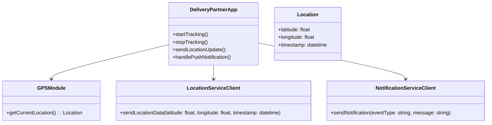
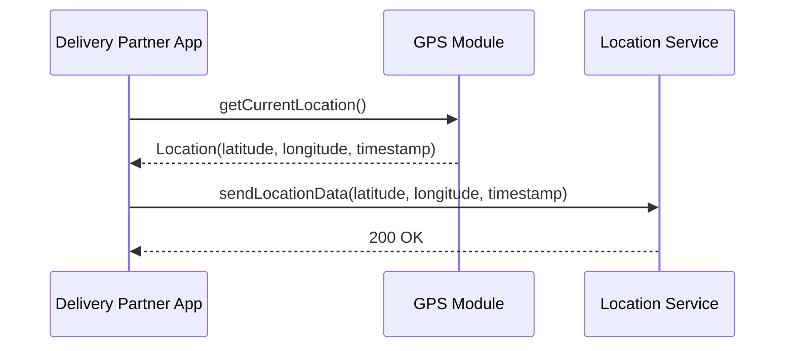
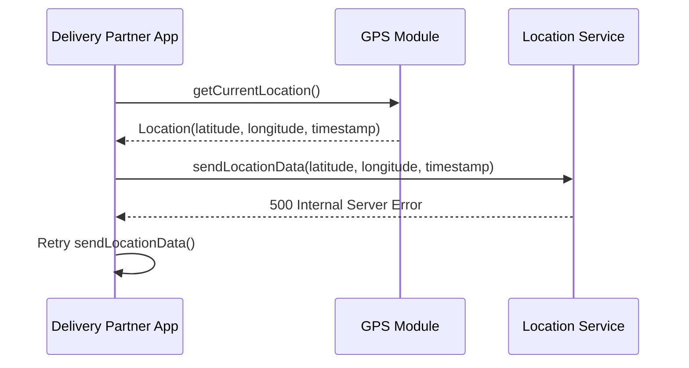

# Low-Level Design Document: Delivery Partner App Component

## 1. Component Overview

### Purpose
The Delivery Partner App component is responsible for capturing and transmitting the real-time location of delivery partners to the backend services. It ensures that location updates are sent efficiently and reliably, enabling accurate tracking and ETA calculations for customer orders.

### Boundaries
- **Input:** GPS location data from the delivery partner's device.
- **Output:** Location updates sent to the Location Service backend.
- **External Dependencies:** Google Maps API for geolocation services, Firebase Cloud Messaging for push notifications.

## 2. Module/Class Diagram



## 3. Sequence Diagrams

### Happy Path: Sending Location Update



### Error Scenario: Failed Location Update



## 4. API Contract

### Endpoint: Send Location Update

```yaml
POST /location/update
Request Body:
  application/json
  {
    "latitude": float,
    "longitude": float,
    "timestamp": string
  }
Response:
  200 OK
  400 Bad Request
  500 Internal Server Error
```

## 5. Internal Data Models

```python
class Location:
    def __init__(self, latitude: float, longitude: float, timestamp: datetime):
        self.latitude = latitude
        self.longitude = longitude
        self.timestamp = timestamp
```

## 6. Business Logic / Algorithms

### Pseudo-code for Location Update

```python
def send_location_update():
    location = GPSModule.get_current_location()
    try:
        response = LocationServiceClient.send_location_data(
            location.latitude, location.longitude, location.timestamp
        )
        if response.status_code != 200:
            raise Exception("Failed to send location update")
    except Exception as e:
        log_error(e)
        retry_send_location_update()
```

## 7. Error Handling Strategy

### Error Categories
- **Network Errors:** Retry with exponential backoff.
- **Server Errors (5xx):** Retry with exponential backoff.
- **Client Errors (4xx):** Log and alert for manual intervention.

### Retry Policies
- **Exponential Backoff:** Start with 1 second, double each retry up to a maximum of 5 retries.

### Fallback Behavior
- **Offline Mode:** Store location updates locally and send when network is restored.

## 8. Caching Strategy

- **Cache Location Data:** Store last known location with a TTL of 5 minutes for quick access.
- **Invalidation:** Clear cache upon successful location update.

## 9. Configuration Parameters

- **Location Update Interval:** 30 seconds
- **Retry Interval:** Initial 1 second, max 5 retries
- **Cache TTL:** 5 minutes

## 10. External Dependencies

- **Google Maps API:** For geolocation services.
- **Firebase Cloud Messaging:** For push notifications.
- **HTTP Client Library:** For REST API calls.

## 11. Testing Strategy

### Unit Test Scenarios
- Test location retrieval from GPS module.
- Test successful location update to Location Service.
- Test error handling and retry logic.

### Integration Test Scenarios
- Test end-to-end location update flow.
- Test integration with Google Maps API.

### Performance Test Scenarios
- Test handling of high-frequency location updates.
- Test scalability under concurrent usage.

## 12. Deployment Considerations

- **Platform:** Android and iOS
- **Continuous Integration:** Automated testing and deployment pipelines.
- **Monitoring:** Use tools like Firebase Crashlytics for error tracking and performance monitoring.
- **Security:** Ensure secure transmission of location data using HTTPS.