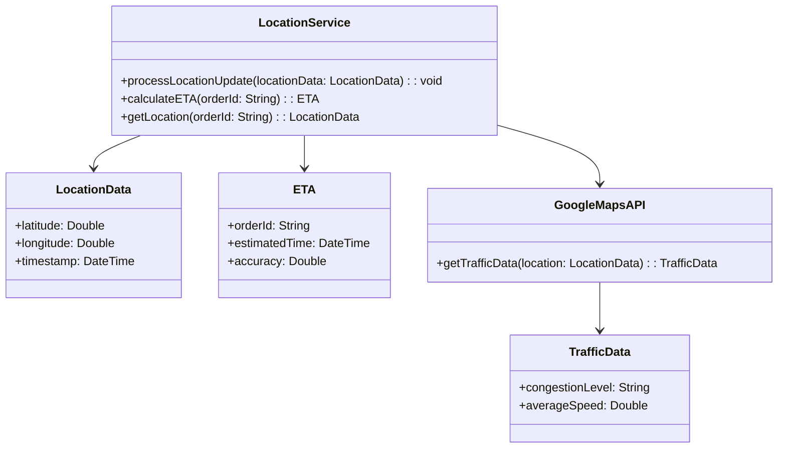
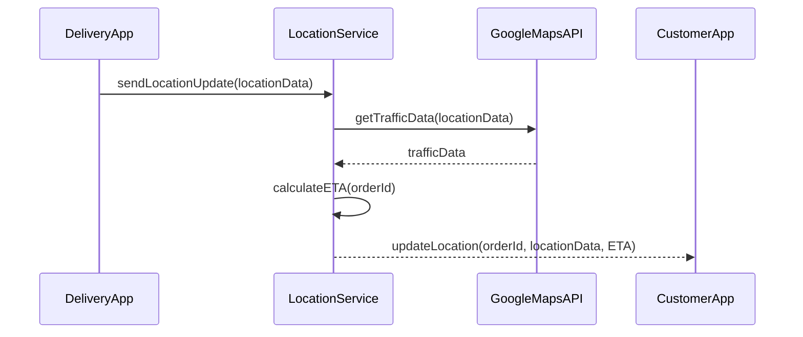
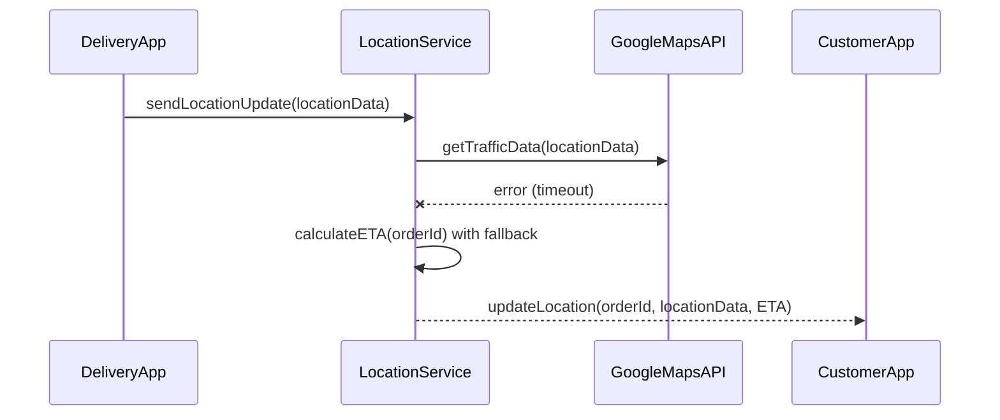

# Low-Level Design Document: Location Service Component

## 1. Component Overview

### Purpose
The Location Service is responsible for processing real-time location updates from delivery partners and providing live location tracking to customers. It calculates dynamic ETAs based on various factors such as distance, speed, traffic, and restaurant preparation time.

### Boundaries
- **Inputs:** Location updates from delivery partner apps, traffic data from Google Maps API.
- **Outputs:** Location data and ETAs to customer apps, notifications to Notification Service.

## 2. Module/Class Diagram



## 3. Sequence Diagrams

### 3.1 Happy Path: Location Update Processing



### 3.2 Error Scenario: Failed Traffic Data Retrieval



## 4. API Contract (OpenAPI-style)

### Endpoint: `/location/update`
- **Method:** POST
- **Request Body:**
  ```json
  {
    "orderId": "string",
    "latitude": "double",
    "longitude": "double",
    "timestamp": "string"
  }
  ```
- **Response Body:**
  ```json
  {
    "status": "string",
    "message": "string"
  }
  ```
- **Error Codes:**
  - `400`: Bad Request
  - `500`: Internal Server Error

### Endpoint: `/location/{orderId}`
- **Method:** GET
- **Response Body:**
  ```json
  {
    "orderId": "string",
    "latitude": "double",
    "longitude": "double",
    "ETA": {
      "estimatedTime": "string",
      "accuracy": "double"
    }
  }
  ```
- **Error Codes:**
  - `404`: Not Found
  - `500`: Internal Server Error

## 5. Internal Data Models

### LocationData
```json
{
  "latitude": "double",
  "longitude": "double",
  "timestamp": "string"
}
```

### ETA
```json
{
  "orderId": "string",
  "estimatedTime": "string",
  "accuracy": "double"
}
```

## 6. Business Logic / Algorithms

### Pseudo-code for ETA Calculation
```plaintext
function calculateETA(orderId):
    locationData = getLocationData(orderId)
    trafficData = GoogleMapsAPI.getTrafficData(locationData)
    if trafficData is not available:
        use default speed and congestion levels
    else:
        adjust ETA based on trafficData
    return ETA
```

## 7. Error Handling Strategy

### Error Categories
- **Network Errors:** Retry with exponential backoff.
- **Data Errors:** Log and alert for manual intervention.
- **Service Errors:** Use fallback data or default values.

### Retry Policies
- **Network Errors:** Retry up to 3 times with increasing delay.
- **Service Errors:** Retry once, then use fallback.

### Fallback Behavior
- Use cached or default traffic data if Google Maps API fails.

## 8. Caching Strategy

### What to Cache
- Traffic data for frequently accessed locations.
- Recent location updates for quick retrieval.

### TTL and Invalidation
- Traffic data: 5 minutes TTL.
- Location updates: 10 minutes TTL.

## 9. Configuration Parameters

- **API Keys:** Google Maps API key.
- **Retry Settings:** Max retries, backoff strategy.
- **Cache Settings:** TTL values, cache size.

## 10. External Dependencies

- **Google Maps API:** For traffic data.
- **Firebase Cloud Messaging:** For notifications.

## 11. Testing Strategy

### Unit Test Scenarios
- Location update processing.
- ETA calculation logic.

### Integration Test Scenarios
- Interaction with Google Maps API.
- End-to-end flow from location update to customer notification.

### Performance Test Scenarios
- High throughput location updates.
- Stress test for concurrent user handling.

## 12. Deployment Considerations

- **Scalability:** Deploy on Kubernetes with auto-scaling based on load.
- **Monitoring:** Use Prometheus and Grafana for real-time metrics.
- **Logging:** Centralized logging with ELK stack for error analysis.