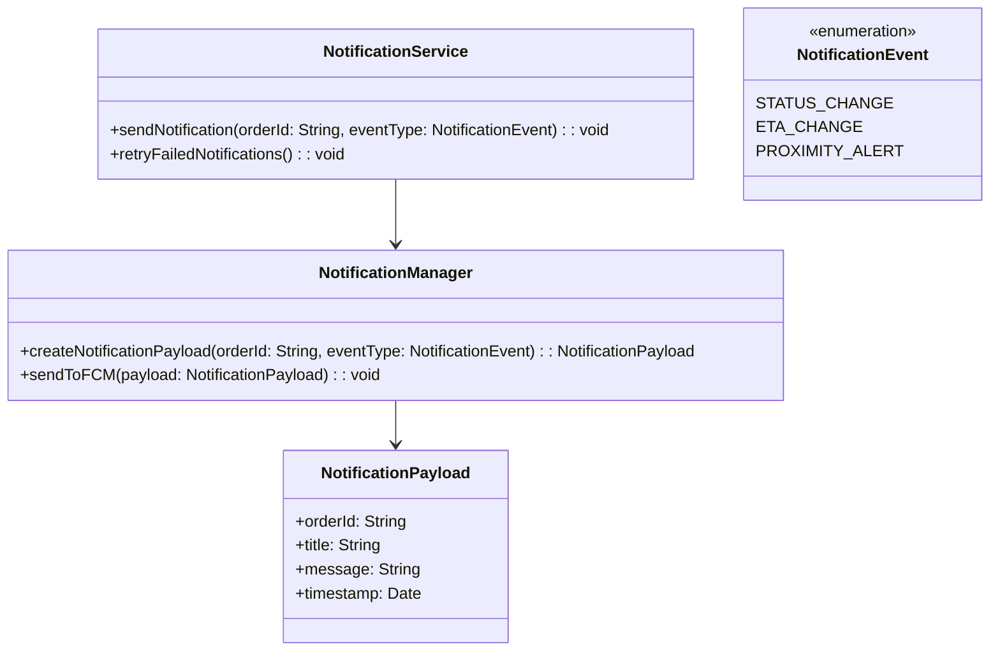
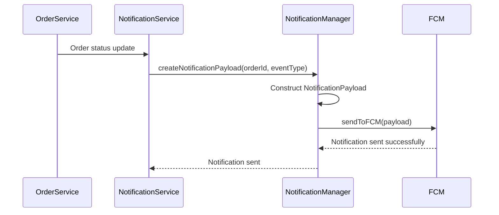
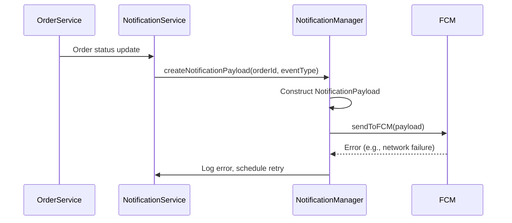

# Low-Level Design Document: Notification Service

## 1. Component Overview

The Notification Service is responsible for sending push notifications to customers based on order status changes, significant ETA updates, and proximity alerts. It interfaces with Firebase Cloud Messaging (FCM) to deliver notifications and integrates with the Order Service to fetch order details. The service is designed to handle high throughput and ensure reliable delivery of notifications.

### Boundaries
- **Input**: Order status updates, ETA changes, proximity alerts
- **Output**: Push notifications to customer devices via FCM

## 2. Module/Class Diagram



## 3. Sequence Diagrams

### 3.1 Happy Path: Sending Notification



### 3.2 Error Scenario: FCM Failure



## 4. API Contract

### 4.1 Send Notification

```yaml
POST /notifications/send
Request Body:
  application/json
  {
    "orderId": "string",
    "eventType": "string" // STATUS_CHANGE, ETA_CHANGE, PROXIMITY_ALERT
  }
Response:
  200 OK
  {
    "message": "Notification sent successfully"
  }
  500 Internal Server Error
  {
    "error": "Failed to send notification"
  }
```

## 5. Internal Data Models

```python
class NotificationPayload:
    def __init__(self, orderId: str, title: str, message: str, timestamp: datetime):
        self.orderId = orderId
        self.title = title
        self.message = message
        self.timestamp = timestamp
```

## 6. Business Logic / Algorithms

### Pseudo-code for Notification Sending

```python
def sendNotification(orderId: str, eventType: NotificationEvent):
    try:
        payload = NotificationManager.createNotificationPayload(orderId, eventType)
        NotificationManager.sendToFCM(payload)
    except Exception as e:
        logError(e)
        scheduleRetry(orderId, eventType)
```

## 7. Error Handling Strategy

### Error Categories
- **Network Errors**: Retry with exponential backoff
- **FCM Errors**: Log and retry
- **Payload Construction Errors**: Log and skip

### Retry Policies
- **Max Retries**: 5 attempts
- **Backoff Strategy**: Exponential backoff starting at 1 minute

### Fallback Behavior
- Log errors and notify support team if retries fail

## 8. Caching Strategy

- **Cache**: Recent notification payloads for 5 minutes
- **TTL**: 5 minutes
- **Invalidation**: On successful notification send

## 9. Configuration Parameters

- **FCM_API_KEY**: API key for Firebase Cloud Messaging
- **RETRY_INTERVAL**: Initial retry interval (1 minute)
- **MAX_RETRIES**: Maximum number of retries (5)

## 10. External Dependencies

- **Firebase Cloud Messaging**: For push notifications
- **Logging Library**: For error logging
- **HTTP Client Library**: For API requests

## 11. Testing Strategy

### Unit Test Scenarios
- Test notification payload creation
- Test successful notification send
- Test retry logic on failure

### Integration Test Scenarios
- Test end-to-end notification flow
- Test integration with FCM

### Performance Test Scenarios
- Test notification throughput under load
- Test retry mechanism under load

## 12. Deployment Considerations

- Deploy on Kubernetes with auto-scaling enabled
- Monitor FCM API usage and adjust quotas as needed
- Ensure logging and monitoring are configured for error tracking

This LLD provides a comprehensive guide for implementing the Notification Service component, ensuring reliability and scalability in the Real-Time Order Tracking System.