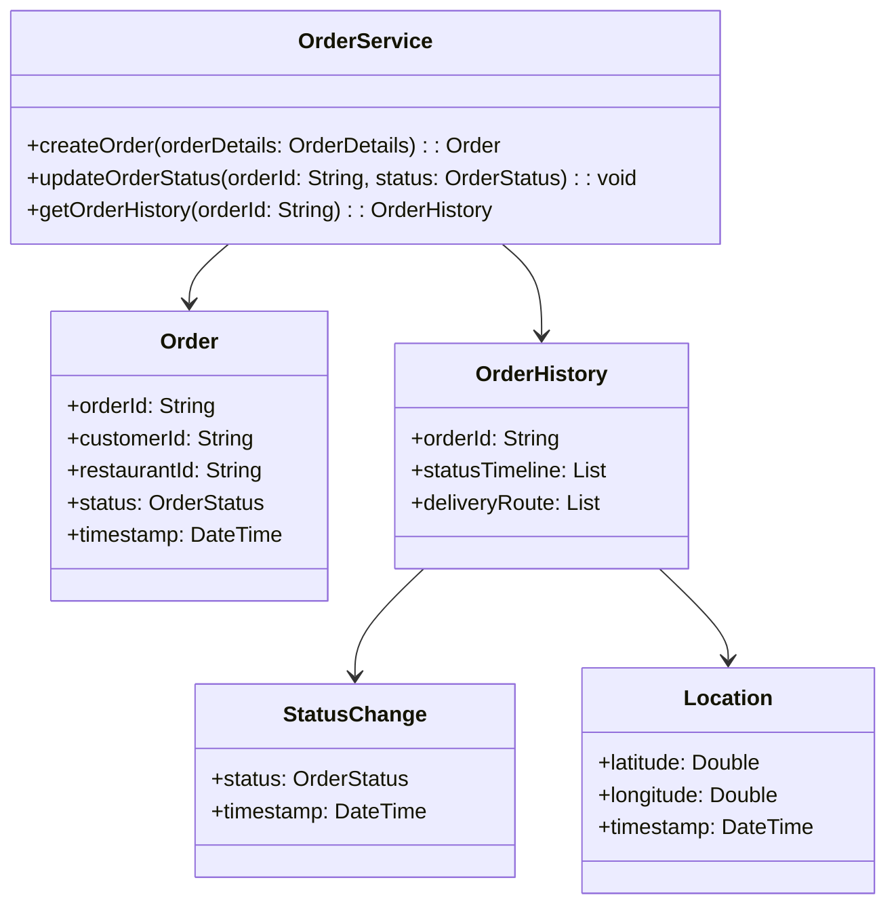
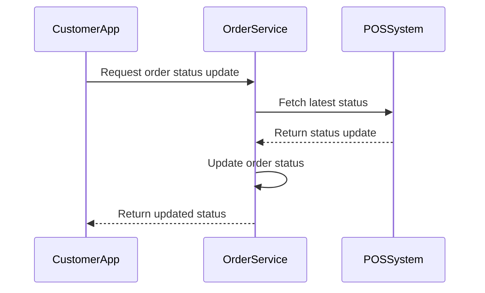
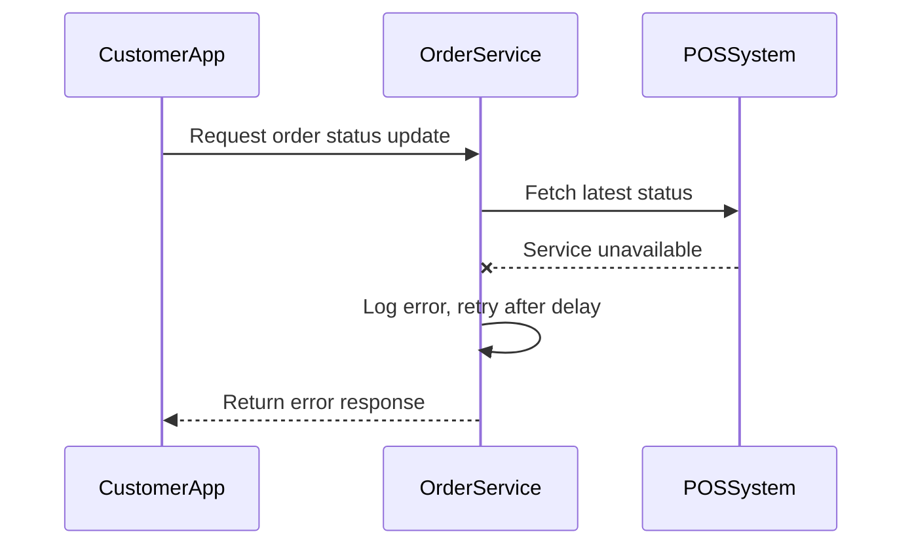

# Low-Level Design Document: Order Service Component

## 1. Component Overview

The Order Service is responsible for managing the lifecycle of food delivery orders, including tracking status changes and maintaining a history of each order. It interfaces with the restaurant POS system to receive updates and provides data to the customer app for real-time tracking. The service ensures that order statuses are accurately timestamped and stored, supporting up to 500,000 concurrent users and processing up to 175,000 write operations per second.

## 2. Module/Class Diagram



## 3. Sequence Diagrams

### Happy Path: Order Status Update



### Error Scenario: POS System Unavailable



## 4. API Contract

### Create Order

```yaml
POST /orders
Request Body:
  application/json
  {
    "customerId": "string",
    "restaurantId": "string",
    "orderDetails": {
      "items": [
        {
          "itemId": "string",
          "quantity": "integer"
        }
      ]
    }
  }
Response:
  201 Created
  application/json
  {
    "orderId": "string",
    "status": "PLACED",
    "timestamp": "datetime"
  }
Error Codes:
  400 Bad Request
  500 Internal Server Error
```

### Update Order Status

```yaml
PUT /orders/{orderId}/status
Request Body:
  application/json
  {
    "status": "OrderStatus"
  }
Response:
  200 OK
  application/json
  {
    "orderId": "string",
    "status": "OrderStatus",
    "timestamp": "datetime"
  }
Error Codes:
  404 Not Found
  500 Internal Server Error
```

### Get Order History

```yaml
GET /orders/{orderId}/history
Response:
  200 OK
  application/json
  {
    "orderId": "string",
    "statusTimeline": [
      {
        "status": "OrderStatus",
        "timestamp": "datetime"
      }
    ],
    "deliveryRoute": [
      {
        "latitude": "double",
        "longitude": "double",
        "timestamp": "datetime"
      }
    ]
  }
Error Codes:
  404 Not Found
  500 Internal Server Error
```

## 5. Internal Data Models

- **OrderStatus**: Enum {PLACED, CONFIRMED, PREPARING, PICKED_UP, IN_TRANSIT, DELIVERED}
- **OrderDetails**: Contains item list and quantities
- **StatusChange**: Records status and timestamp
- **Location**: Records latitude, longitude, and timestamp

## 6. Business Logic / Algorithms

### Update Order Status

```python
def update_order_status(order_id, new_status):
    order = fetch_order(order_id)
    if order:
        order.status = new_status
        order.timestamp = current_time()
        save_order(order)
    else:
        raise OrderNotFoundException(f"Order {order_id} not found")
```

## 7. Error Handling Strategy

- **Error Categories**: Validation errors, system errors, external service errors
- **Retry Policies**: Exponential backoff for external service calls
- **Fallback Behavior**: Return cached data if available

## 8. Caching Strategy

- **What to Cache**: Recent order statuses and histories
- **TTL**: 5 minutes
- **Invalidation**: On status update

## 9. Configuration Parameters

- **Database Connection**: URL, credentials
- **External Service URLs**: POS system, Google Maps API
- **Retry Delays**: Initial delay, max retries

## 10. External Dependencies

- **Libraries**: Spring Boot, Hibernate, Redis
- **Services**: Restaurant POS, Google Maps API

## 11. Testing Strategy

- **Unit Tests**: Validate business logic for status updates
- **Integration Tests**: Test interactions with POS system and customer app
- **Performance Tests**: Simulate high load scenarios

## 12. Deployment Considerations

- **Scalability**: Deploy on Kubernetes with auto-scaling
- **Monitoring**: Use Prometheus and Grafana for metrics and alerts
- **Security**: Ensure secure API endpoints with OAuth2 authentication