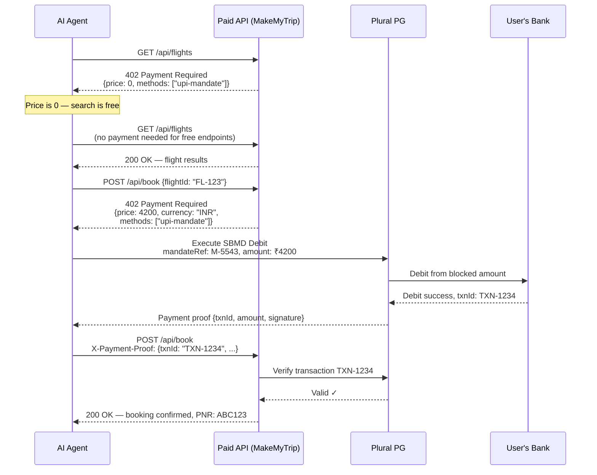
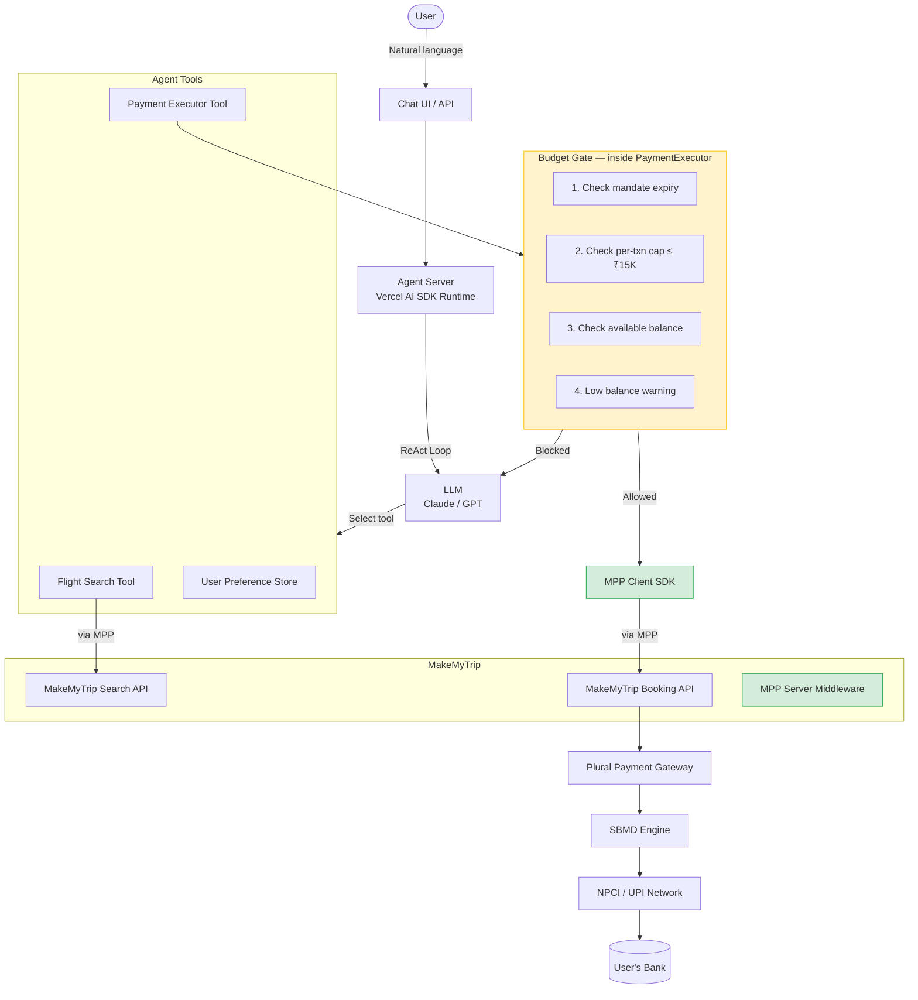
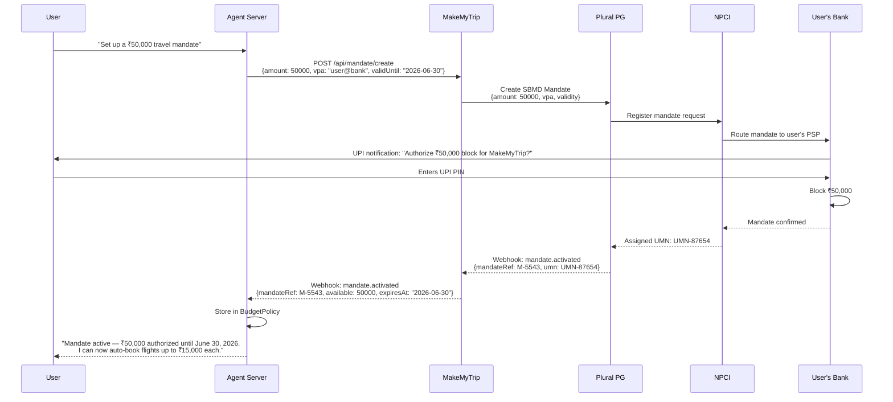
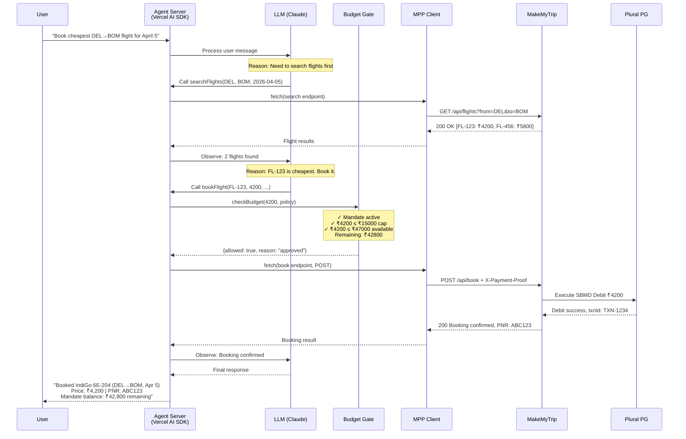
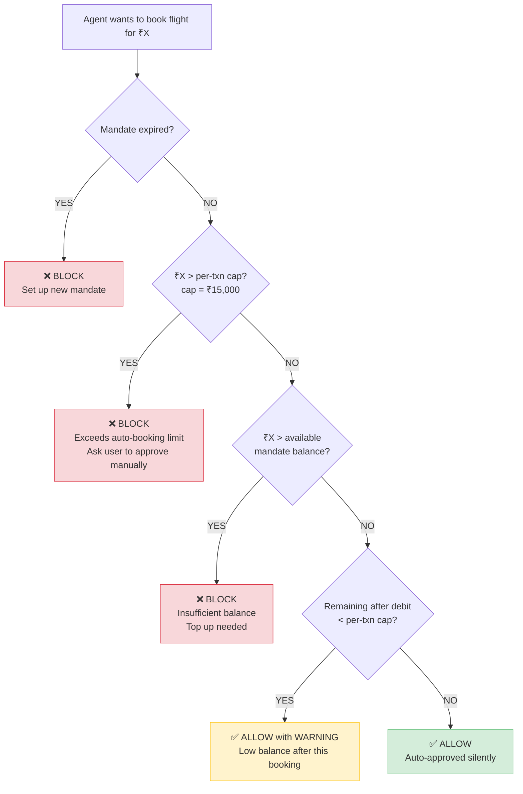
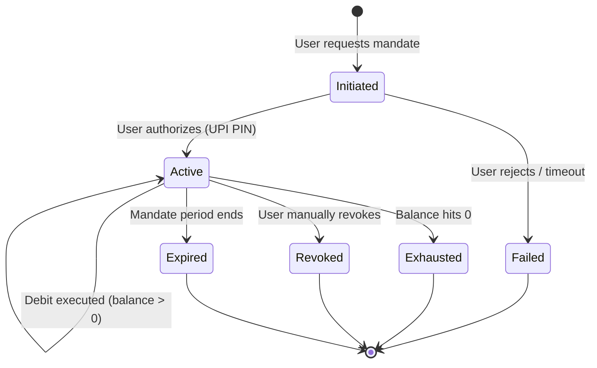
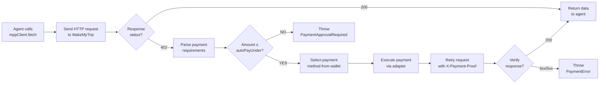
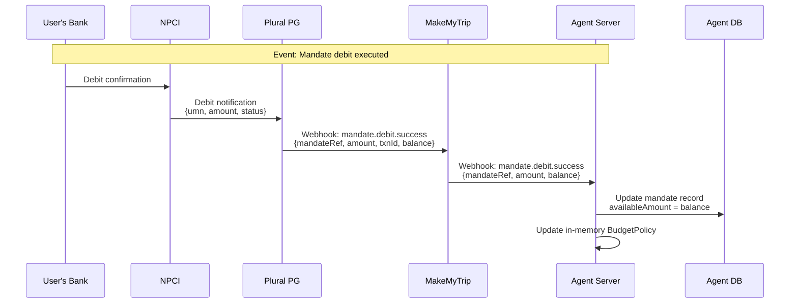
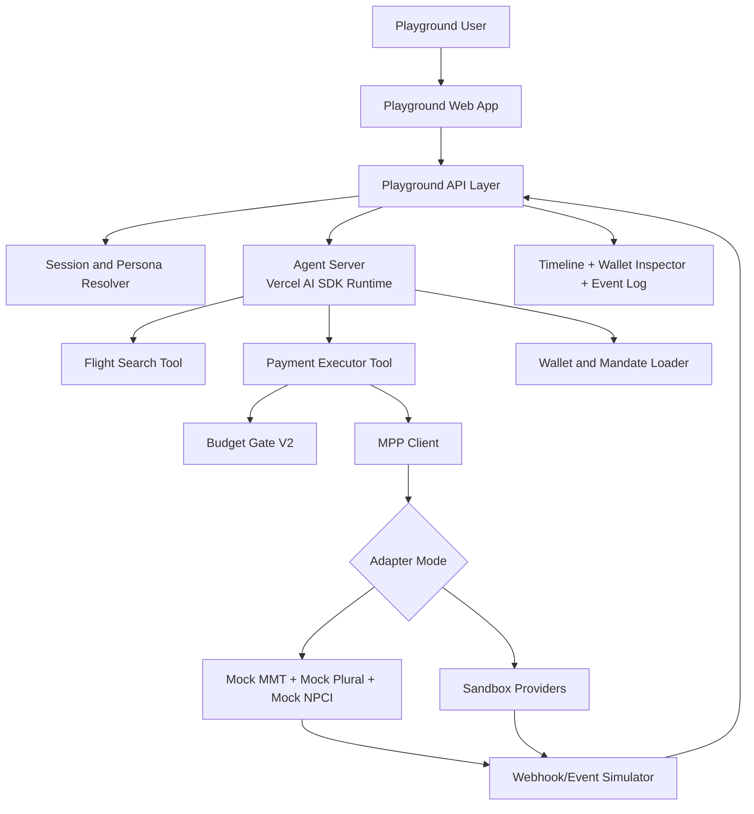

# Autonomous Flight Booking Agent — System Design Document

> **Framework**: Vercel AI SDK (TypeScript)
> **Payment Protocol**: MPP (Machine Payment Protocol) / X402
> **Payment Gateway**: Plural PG with SBMD (Single Block Multi Debit)
> **Authorization Strategy**: Budget-based autonomy (max ₹15,000 per transaction)

---

## Table of Contents

1. [MPP & X402 Protocol Overview](#1-mpp--x402-protocol-overview)
2. [High-Level Design](#2-high-level-design)
3. [SBMD / UPI Mandate Design](#3-sbmd--upi-mandate-design)
4. [Budget Gate Design](#4-budget-gate-design)
5. [Low-Level Design](#5-low-level-design)
6. [Vercel AI SDK Agent Integration](#6-vercel-ai-sdk-agent-integration)
7. [MPP SDK Structure & Integration](#7-mpp-sdk-structure--integration)
8. [Workflow Diagrams (Mermaid)](#8-workflow-diagrams-mermaid)
9. [Edge Cases & Decision Matrix](#9-edge-cases--decision-matrix)
10. [Multi-User VPA / Customer Wallet Handling Plan](#10-multi-user-vpa--customer-wallet-handling-plan)
11. [Agent Playground & Test Harness Plan](#11-agent-playground--test-harness-plan)

---

## 1. MPP & X402 Protocol Overview

### What is MPP?

**Machine Payment Protocol (MPP)** is a protocol layer built on top of HTTP that enables autonomous machine-to-machine payments. It extends the HTTP 402 (Payment Required) status code into a full payment negotiation workflow where AI agents can discover prices, negotiate payment methods, submit payments, and receive receipts — all without human intervention.

MPP is **payment-rail agnostic** — it works with UPI mandates, Stripe, cryptocurrency, or any payment method via pluggable adapters.

### What is X402?

**X402** is the underlying protocol specification that defines how HTTP 402 responses carry machine-readable payment requirements. When a server returns `402 Payment Required`, the response body contains structured data describing:

- What payment methods are accepted
- How much the resource costs
- Where to submit the payment proof
- What format the receipt should take

### X402 Protocol Flow

```
Agent                         Paid API Server               Payment Rail
  |                                |                            |
  |── GET /api/flights ──────────▶|                            |
  |                                |                            |
  |◀── 402 Payment Required ──────|                            |
  |    {                           |                            |
  |      price: 0,                 |                            |
  |      methods: ["upi-mandate"]  |                            |
  |      payTo: "..."              |                            |
  |    }                           |                            |
  |                                |                            |
  |── Execute Payment ─────────────────────────────────────────▶|
  |◀── Payment Proof ──────────────────────────────────────────|
  |                                |                            |
  |── GET /api/flights ──────────▶|                            |
  |    X-Payment-Proof: {...}      |                            |
  |                                |── Verify Proof ──────────▶|
  |                                |◀── Valid ─────────────────|
  |◀── 200 OK (flight data) ──────|                            |
```

### Core X402 Components

| Component | Role |
|-----------|------|
| **Payment Negotiation** | Server returns 402 with price, accepted methods, and payment instructions |
| **Payment Facilitator** | Middleware on the server that intercepts requests, checks payment, and gates access |
| **Receipt Verification** | Server-side verification that the payment proof is valid before serving the resource |
| **Payment Envelope** | Standardized JSON structure wrapping payment proof, method, amount, and timestamp |
| **Agent Wallet** | Client-side component managing the agent's payment methods and credentials |

### Payment Envelope Structure

```typescript
interface PaymentEnvelope {
  method: 'upi-mandate' | 'stripe' | 'x402-crypto';
  proof: {
    transactionId: string;
    amount: number;
    currency: string;
    timestamp: string;
    signature: string;
  };
  payer: {
    agentId: string;
    walletRef: string;
  };
}
```

### 402 Response Structure

```typescript
interface Payment402Response {
  status: 402;
  body: {
    price: number;
    currency: string;
    methods: PaymentMethod[];
    payTo: string;
    description: string;
    expiresAt: string;        // Price quote expiry
    invoiceId: string;        // For correlating payment to request
  };
}
```

---

## 2. High-Level Design

### System Overview

The system consists of an **autonomous AI agent** that accepts natural language instructions from users (e.g., "Book me a Delhi to Mumbai flight for tomorrow under ₹5000"), searches for flights via MakeMyTrip's API, and autonomously completes the booking using a pre-authorized UPI mandate through Plural Payment Gateway.

The same runtime is exposed through two primary interaction surfaces:
- a production interaction surface such as chat UI or API endpoint
- a playground interaction surface for demos, debugging, scenario simulation, and sandbox testing

Both surfaces must call the same orchestration path, wallet-loading logic, Budget Gate, and payment adapters. The playground is not an alternate payment path; it is a controlled workbench for observing and testing the same system behavior safely.

### Architecture Components

```
┌─────────────────────────────────────────────────────────────────────┐
│                         USER INTERFACE                              │
│  (Chat UI / API endpoint — user sends natural language requests)    │
└───────────────────────────────┬─────────────────────────────────────┘
                                │
                                ▼
┌─────────────────────────────────────────────────────────────────────┐
│                     AGENT SERVER (Orchestrator)                      │
│                                                                     │
│  ┌──────────────────────────────────────────────────────────┐       │
│  │  Vercel AI SDK Runtime (ReAct Loop)                      │       │
│  │                                                          │       │
│  │  LLM ──▶ Reason ──▶ Select Tool ──▶ Execute ──▶ Observe │       │
│  │   ▲                                               │      │       │
│  │   └───────────────── Loop ◀───────────────────────┘      │       │
│  └──────────────────────────────────────────────────────────┘       │
│                                                                     │
│  ┌─────────────┐  ┌──────────────────┐  ┌─────────────────┐        │
│  │ Flight      │  │ Payment Executor │  │ User Preference │        │
│  │ Search Tool │  │ Tool             │  │ Store           │        │
│  │             │  │ ┌──────────────┐ │  │                 │        │
│  │ Calls MMT   │  │ │ Budget Gate  │ │  │ Stores user     │        │
│  │ Search API  │  │ │ (embedded)   │ │  │ prefs, history  │        │
│  │ via MPP     │  │ └──────────────┘ │  │                 │        │
│  └─────────────┘  └──────────────────┘  └─────────────────┘        │
│                            │                                        │
│                   MPP Client SDK                                    │
│              (wallet, payer, retry)                                  │
└────────────────────────────┬────────────────────────────────────────┘
                             │
                             ▼
┌─────────────────────────────────────────────────────────────────────┐
│                   MakeMyTrip API (Merchant)                          │
│                                                                     │
│  ┌──────────────┐    ┌────────────────────────────────────┐         │
│  │ MPP Server   │    │ Endpoints:                         │         │
│  │ Middleware    │    │  GET  /api/search-flights (free)   │         │
│  │ (pricing,    │    │  POST /api/book-flight  (paid)     │         │
│  │  verifier,   │    │  GET  /api/seat-map     (₹10)      │         │
│  │  negotiator) │    └────────────────────────────────────┘         │
│  └──────────────┘                                                   │
└────────────────────────────┬────────────────────────────────────────┘
                             │
                             ▼
┌─────────────────────────────────────────────────────────────────────┐
│                   Plural Payment Gateway                            │
│                                                                     │
│  ┌──────────────────────────────────────────────────────────┐       │
│  │  SBMD (Single Block Multi Debit) Engine                  │       │
│  │                                                          │       │
│  │  • Create Mandate  • Execute Debit  • Check Balance      │       │
│  │  • Revoke Mandate  • Refund         • Mandate Status     │       │
│  └──────────────────────────────────────────────────────────┘       │
│                             │                                       │
│                      NPCI / UPI Network                             │
│                             │                                       │
│                     Customer's Bank                                  │
└─────────────────────────────────────────────────────────────────────┘
```

### Playground as a First-Class Interface

The playground sits in front of the same Agent Server and should be treated as a first-class product surface rather than an afterthought.

At a high level:
- the Playground Web App provides scenario selection, prompt entry, and result inspectors
- the Playground API layer creates sessions, binds personas or authenticated users, and forwards trusted request context to the agent runtime
- mock or sandbox adapters can be swapped beneath the MPP client, but ownership checks, Budget Gate evaluation, and webhook verification remain identical to the core design

This allows teams to validate the system through guided demos, deep debugging sessions, and provider sandbox runs without introducing a separate execution model.

### Framework-to-System Mapping

| Your System Component | Framework Concept (Vercel AI SDK) |
|----------------------|-----------------------------------|
| Agent Server (Orchestrator) | `generateText()` with tools and `maxSteps` |
| Playground Web App | Guided workbench for prompt entry, scenario selection, and result viewing |
| Playground API Layer | Session creation, persona binding, trace streaming, and simulation controls |
| Natural language parsing | LLM call (built-in) |
| Flight Search Tool | `tool()` definition |
| Payment Executor Tool | `tool()` definition (wraps MPP client SDK) |
| Budget Gate | Pre-execution check inside PaymentExecutor tool |
| User Preference Store | Agent memory / external state |
| Mandate management | Custom tool + MPP UPI adapter |
| Timeline / Inspectors | Structured telemetry emitted from tools, payment flows, and webhook handlers |

### ReAct Pattern (How the Agent Thinks)

The agent uses the **ReAct (Reason + Act)** pattern:

1. **Reason**: LLM analyzes the user's request and current state
2. **Act**: LLM selects and calls a tool (search flights, book flight, check preferences)
3. **Observe**: LLM receives tool output
4. **Loop**: Back to Reason with new information, until the task is complete

```
User: "Book the cheapest Delhi to Mumbai flight for April 5th"

→ Reason: I need to search for flights first
→ Act:    Call searchFlights({ from: "DEL", to: "BOM", date: "2026-04-05" })
→ Observe: [{ id: "FL-123", price: 4200, ... }, { id: "FL-456", price: 5800, ... }]

→ Reason: FL-123 is cheapest at ₹4,200, under the ₹15,000 cap. Book it.
→ Act:    Call bookFlight({ flightId: "FL-123", price: 4200 })
→ Observe: { booking: "BK-789", status: "confirmed", pnr: "ABC123" }

→ Reason: Booking confirmed. Report to user.
→ Final:  "Booked FL-123 (DEL→BOM, Apr 5) for ₹4,200. PNR: ABC123"
```

---

## 3. SBMD / UPI Mandate Design

### What is SBMD?

**Single Block Multi Debit (SBMD)** is a UPI mandate variant where the user authorizes (blocks) a lump sum amount once, and the merchant can debit from that blocked amount multiple times until the mandate expires or the balance is exhausted.

**Key SBMD properties:**
- **One-time user authorization** — user approves a total amount via UPI PIN
- **Multiple debits** — merchant can debit any amount ≤ remaining blocked balance
- **Time-bound** — mandate has an expiry date
- **Revocable** — user can revoke the mandate at any time
- **UMN tracking** — each mandate gets a Unique Mandate Number from NPCI

### Mandate Creation Workflow (13-Step)

```
Step  Actor               Action
─────────────────────────────────────────────────────────
 1    User                Opens agent UI, initiates mandate setup
 2    Agent Server        Calls MakeMyTrip "Create Mandate" API
 3    MakeMyTrip          Calls Plural PG "Create SBMD Mandate" API
                          with: amount, VPA, validity
 4    Plural PG           Sends mandate request to NPCI
 5    NPCI                Routes to user's bank (PSP)
 6    User's Bank         Sends UPI collect/intent to user's phone
 7    User                Enters UPI PIN to authorize the block
 8    User's Bank         Blocks the amount, confirms to NPCI
 9    NPCI                Assigns UMN (Unique Mandate Number),
                          notifies Plural PG
10    Plural PG           Stores mandate details (UMN, status, expiry),
                          sends webhook to MakeMyTrip
11    MakeMyTrip          Stores mandate reference,
                          sends webhook to Agent Server
12    Agent Server        Stores mandate in BudgetPolicy:
                          { mandateRef, mandateAvailable, mandateExpiresAt }
13    Agent Server        Confirms to user: "Mandate active —
                          ₹50,000 authorized until June 30"
```

### Mandate Lifecycle States

```
                    ┌──────────┐
        ┌──────────│ INITIATED │──────────┐
        │          └──────────┘           │
        │ (user ignores                   │ (user enters
        │  or rejects)                    │  UPI PIN)
        ▼                                 ▼
  ┌──────────┐                     ┌──────────┐
  │ FAILED / │                     │  ACTIVE   │◀─── debits happen here
  │ EXPIRED  │                     └──────────┘
  └──────────┘                       │       │
                           (balance  │       │ (user revokes
                            hits 0)  │       │  or expiry)
                                     ▼       ▼
                              ┌──────────┐ ┌──────────┐
                              │EXHAUSTED │ │ REVOKED/ │
                              └──────────┘ │ EXPIRED  │
                                           └──────────┘
```

### Mandate Data Model

```typescript
interface MandateRecord {
  mandateRef: string;         // Plural PG mandate ID
  umn: string;                // NPCI Unique Mandate Number
  vpa: string;                // User's UPI VPA
  totalAmount: number;        // Original blocked amount (e.g., 50000)
  availableAmount: number;    // Remaining balance after debits
  status: 'initiated' | 'active' | 'exhausted' | 'revoked' | 'expired' | 'failed';
  createdAt: string;          // ISO 8601
  expiresAt: string;          // ISO 8601
  debits: DebitRecord[];      // History of all debits
}

interface DebitRecord {
  debitId: string;
  amount: number;
  bookingRef: string;         // Linked booking ID
  status: 'success' | 'failed' | 'refunded';
  timestamp: string;
}
```

### SBMD Execution Flow (When Agent Books a Flight)

```
Agent Server           MakeMyTrip           Plural PG          NPCI/Bank
    │                      │                    │                   │
    │── POST /book ───────▶│                    │                   │
    │   (with payment      │                    │                   │
    │    proof/mandate ref) │                    │                   │
    │                      │── Execute Debit ──▶│                   │
    │                      │   mandateRef: M-55 │                   │
    │                      │   amount: ₹4,200   │                   │
    │                      │                    │── Debit from ────▶│
    │                      │                    │   blocked amount   │
    │                      │                    │◀── Success ───────│
    │                      │◀── Debit Success ──│                   │
    │                      │   txnId: TXN-1234  │                   │
    │◀── 200 Booking ──────│                    │                   │
    │   Confirmed           │                    │                   │
    │   PNR: ABC123         │                    │                   │
```

---

## 4. Budget Gate Design

### Why a Budget Gate?

The agent operates autonomously. Without guardrails, a misinterpreted instruction or hallucinated price could drain the user's mandate balance. The **Budget Gate** is a defense-in-depth mechanism that sits **inside** the PaymentExecutor tool — every payment attempt must pass through it. It cannot be bypassed by the LLM orchestrator.

### Budget Gate Architecture Placement

```
┌───────────────────────────────────────────────────────┐
│  Vercel AI SDK Runtime (LLM Orchestrator)             │
│                                                       │
│  LLM decides: "Book FL-123 for ₹4,200"               │
│       │                                               │
│       ▼                                               │
│  ┌───────────────────────────────────┐                │
│  │   PaymentExecutor Tool            │                │
│  │                                   │                │
│  │   ┌───────────────────────────┐   │                │
│  │   │     BUDGET GATE           │   │  ◀── ALL code  │
│  │   │                           │   │     paths pass  │
│  │   │  1. Check mandate expiry  │   │     through     │
│  │   │  2. Check per-txn cap     │   │     here        │
│  │   │  3. Check balance         │   │                │
│  │   │  4. Low balance warning   │   │                │
│  │   └───────────┬───────────────┘   │                │
│  │               │                   │                │
│  │          allowed?                 │                │
│  │          /     \                  │                │
│  │        yes      no               │                │
│  │         │        │               │                │
│  │    MPP Client   Return error     │                │
│  │    (execute     to LLM           │                │
│  │     payment)                     │                │
│  └───────────────────────────────────┘                │
└───────────────────────────────────────────────────────┘
```

**Key design decision**: The Budget Gate lives inside the tool, not in the LLM prompt. This ensures defense-in-depth — even if the LLM is jailbroken or hallucinates, the code-level check blocks unauthorized spending.

### Budget Policy Interface

```typescript
interface BudgetPolicy {
  perTransactionMax: number;     // ₹15,000 — user-configured cap
  mandateRef: string;            // Plural PG mandate reference
  mandateAvailable: number;      // Remaining balance in the mandate
  mandateExpiresAt: Date;        // Mandate expiry timestamp
}
```

### Budget Check Result Interface

```typescript
interface BudgetCheckResult {
  allowed: boolean;
  reason?: 'approved' | 'over_txn_limit' | 'insufficient_balance'
         | 'mandate_expired' | 'low_balance_warning';
  requiresUserApproval: boolean;
  message: string;
}
```

### Budget Gate Implementation

```typescript
function checkBudget(amount: number, policy: BudgetPolicy): BudgetCheckResult {
  // 1. Check mandate expiry
  if (new Date() > policy.mandateExpiresAt) {
    return {
      allowed: false,
      reason: 'mandate_expired',
      requiresUserApproval: true,
      message: 'Your mandate has expired. Please set up a new one.',
    };
  }

  // 2. Check per-transaction cap
  if (amount > policy.perTransactionMax) {
    return {
      allowed: false,
      reason: 'over_txn_limit',
      requiresUserApproval: true,
      message: `₹${amount} exceeds your ₹${policy.perTransactionMax} auto-booking limit. Approve manually?`,
    };
  }

  // 3. Check available mandate balance
  if (amount > policy.mandateAvailable) {
    return {
      allowed: false,
      reason: 'insufficient_balance',
      requiresUserApproval: true,
      message: `₹${amount} exceeds remaining mandate balance of ₹${policy.mandateAvailable}. Top up or authorize a new mandate.`,
    };
  }

  // 4. Low balance warning (still allowed)
  const remainingAfter = policy.mandateAvailable - amount;
  if (remainingAfter < policy.perTransactionMax) {
    return {
      allowed: true,
      reason: 'low_balance_warning',
      requiresUserApproval: false,
      message: `Booking approved. After this, only ₹${remainingAfter} remains — below your per-transaction cap. Consider topping up.`,
    };
  }

  // 5. Normal approval
  return {
    allowed: true,
    reason: 'approved',
    requiresUserApproval: false,
    message: `Auto-approved. ₹${remainingAfter} will remain after booking.`,
  };
}
```

### Budget Gate Decision Loop

```
        ┌──────────────────────┐
        │ Agent wants to book   │
        │ flight for ₹X         │
        └──────────┬───────────┘
                   │
                   ▼
        ┌──────────────────────┐
        │ Mandate expired?      │── YES ──▶ BLOCK: "Set up new mandate"
        └──────────┬───────────┘
                   │ NO
                   ▼
        ┌──────────────────────┐
        │ ₹X > per-txn cap?    │── YES ──▶ BLOCK: "Exceeds ₹15,000 cap.
        │ (₹15,000)            │           Approve manually?"
        └──────────┬───────────┘
                   │ NO
                   ▼
        ┌──────────────────────┐
        │ ₹X > available       │── YES ──▶ BLOCK: "Insufficient balance.
        │ mandate balance?      │           Top up needed."
        └──────────┬───────────┘
                   │ NO
                   ▼
        ┌──────────────────────┐
        │ Remaining after       │── YES ──▶ ALLOW with WARNING:
        │ < per-txn cap?        │           "Low balance after this"
        └──────────┬───────────┘
                   │ NO
                   ▼
              ┌──────────┐
              │  ALLOW   │
              │ (silent) │
              └──────────┘
```

---

## 5. Low-Level Design

### System Component Details

#### 5.1 Agent Server

The agent server is a Node.js / TypeScript application using Vercel AI SDK's `generateText` function with tools for flight search and booking.

**Responsibilities:**
- Accept user messages via HTTP API or WebSocket
- Run the ReAct loop using Vercel AI SDK
- Manage tool execution (search, book, preferences)
- Store conversation history and agent state
- Handle webhook callbacks from MakeMyTrip for mandate events
- Serve playground-driven runs through a trusted API layer and emit structured trace events for inspector panels

**Tech Stack:**
- Runtime: Node.js 20+
- Framework: Express/Fastify for HTTP, Vercel AI SDK for agent logic
- Database: PostgreSQL (mandates, bookings, user preferences)
- Cache: Redis (session state, rate limiting)
- Realtime transport: WebSocket or Server-Sent Events for playground trace streaming

#### 5.1.1 Playground Control Plane

A lightweight playground control plane should sit beside the agent server and reuse the same runtime contracts.

**Responsibilities:**
- Create, reset, and replay playground sessions
- Bind each playground run to a seeded persona or authenticated user context
- Select mock or sandbox adapter mode per session
- Stream trace events, tool outcomes, wallet state, and webhook activity to the playground UI
- Gate simulation controls based on operating mode

**Core principle:**
- The control plane may change observability and simulation behavior, but it must not weaken wallet ownership checks, request authentication, or Budget Gate enforcement

#### 5.2 Flight Search Tool

```typescript
interface FlightSearchParams {
  from: string;       // IATA code (DEL, BOM, BLR)
  to: string;         // IATA code
  date: string;       // YYYY-MM-DD
  passengers?: number; // default 1
  class?: 'economy' | 'business';
}

interface FlightResult {
  flightId: string;
  airline: string;
  departure: string;  // ISO 8601
  arrival: string;
  duration: string;    // "2h 15m"
  price: number;
  currency: string;
  seatsAvailable: number;
}
```

#### 5.3 Payment Executor Tool

```typescript
interface BookFlightParams {
  flightId: string;
  price: number;
  passengerName: string;
  passengerEmail: string;
}

interface BookingResult {
  bookingId: string;
  pnr: string;
  status: 'confirmed' | 'failed' | 'pending';
  flight: FlightResult;
  amountCharged: number;
  transactionId: string;
  mandateRemainingBalance: number;
}
```

#### 5.4 User Preference Store

```typescript
interface UserPreferences {
  userId: string;
  preferredAirlines: string[];      // ["IndiGo", "Air India"]
  seatPreference: 'window' | 'aisle' | 'middle' | 'any';
  mealPreference: string;
  budgetRange: { min: number; max: number };
  preferredTime: 'morning' | 'afternoon' | 'evening' | 'any';
  frequentRoutes: Array<{ from: string; to: string }>;
}
```

#### 5.5 Webhook Handler (Mandate Events)

```typescript
// POST /webhooks/mandate-status
interface MandateWebhookPayload {
  event: 'mandate.created' | 'mandate.activated' | 'mandate.revoked'
       | 'mandate.expired' | 'mandate.debit.success' | 'mandate.debit.failed';
  mandateRef: string;
  umn: string;
  data: {
    amount?: number;
    availableBalance?: number;
    transactionId?: string;
    reason?: string;
    timestamp: string;
  };
}
```

---

## 6. Vercel AI SDK Agent Integration

### Why Vercel AI SDK?

- **TypeScript-first** — native type safety for tools, parameters, and results
- **Streaming-first** — real-time responses to user
- **Multi-step tool use** — built-in `maxSteps` for ReAct loop
- **Model-agnostic** — works with OpenAI, Anthropic, Google, etc.
- **Used by Stripe** — production-proven for payment-related agentic workflows

### Full Agent Implementation

```typescript
import { generateText, tool } from 'ai';
import { anthropic } from '@ai-sdk/anthropic';
import { z } from 'zod';
import { MPPClient } from '@mpp/client';

// ─── MPP Client Setup ───────────────────────────────────
const mppClient = new MPPClient({
  wallet: {
    upi: { mandateRef: 'M-5543', vpa: 'agent@bank' },
    stripe: { paymentMethodId: 'pm_xxx' },
  },
  autoPayUnder: 15000, // Auto-pay for requests under ₹15,000
});

// ─── Budget Policy (loaded from DB per user) ────────────
const budgetPolicy: BudgetPolicy = {
  perTransactionMax: 15000,
  mandateRef: 'M-5543',
  mandateAvailable: 47000, // Remaining from ₹50,000 mandate
  mandateExpiresAt: new Date('2026-06-30'),
};

// ─── Agent Execution ────────────────────────────────────
const result = await generateText({
  model: anthropic('claude-sonnet-4-20250514'),

  system: `You are a flight booking agent. You help users search and book flights.
Rules:
- Always search before booking to show options
- Confirm flight details before booking
- Report the PNR and total charged after successful booking
- If budget gate blocks a booking, explain the reason to the user
- Never exceed the user's budget preferences`,

  messages: conversationHistory,

  tools: {
    // ─── Search Flights Tool ────────────────────────────
    searchFlights: tool({
      description: 'Search for available flights between two cities on a date',
      parameters: z.object({
        from: z.string().describe('Departure city IATA code (e.g., DEL)'),
        to: z.string().describe('Arrival city IATA code (e.g., BOM)'),
        date: z.string().describe('Travel date in YYYY-MM-DD format'),
        passengers: z.number().optional().default(1),
      }),
      execute: async ({ from, to, date, passengers }) => {
        // MPP client handles 402 negotiation automatically
        // Search is free (price: 0) so no payment occurs
        const response = await mppClient.fetch(
          `https://api.makemytrip.com/flights?from=${from}&to=${to}&date=${date}&pax=${passengers}`
        );
        return response.json();
      },
    }),

    // ─── Book Flight Tool (with Budget Gate) ────────────
    bookFlight: tool({
      description: 'Book a specific flight. Budget gate will auto-check authorization.',
      parameters: z.object({
        flightId: z.string().describe('Flight ID from search results'),
        price: z.number().describe('Flight price in INR'),
        passengerName: z.string().describe('Full passenger name'),
        passengerEmail: z.string().email().describe('Passenger email'),
      }),
      execute: async ({ flightId, price, passengerName, passengerEmail }) => {
        // ── BUDGET GATE (defense-in-depth) ──────────────
        const budgetCheck = checkBudget(price, budgetPolicy);

        if (!budgetCheck.allowed) {
          return {
            success: false,
            blocked: true,
            reason: budgetCheck.reason,
            message: budgetCheck.message,
            requiresUserApproval: budgetCheck.requiresUserApproval,
          };
        }

        // ── Execute booking via MPP ─────────────────────
        const response = await mppClient.fetch(
          'https://api.makemytrip.com/book',
          {
            method: 'POST',
            body: JSON.stringify({
              flightId,
              passengerName,
              passengerEmail,
            }),
          }
        );
        const booking = await response.json();

        // ── Update local budget tracking ────────────────
        budgetPolicy.mandateAvailable -= price;

        return {
          success: true,
          booking,
          message: budgetCheck.message, // Includes low-balance warnings
          remainingBalance: budgetPolicy.mandateAvailable,
        };
      },
    }),

    // ─── Get User Preferences Tool ──────────────────────
    getUserPreferences: tool({
      description: 'Retrieve user travel preferences to personalize search and recommendations',
      parameters: z.object({
        userId: z.string(),
      }),
      execute: async ({ userId }) => {
        return await db.userPreferences.findUnique({ where: { userId } });
      },
    }),

    // ─── Check Mandate Status Tool ──────────────────────
    checkMandateStatus: tool({
      description: 'Check current mandate balance and status',
      parameters: z.object({}),
      execute: async () => {
        return {
          mandateRef: budgetPolicy.mandateRef,
          available: budgetPolicy.mandateAvailable,
          expiresAt: budgetPolicy.mandateExpiresAt,
          perTransactionCap: budgetPolicy.perTransactionMax,
          status: new Date() > budgetPolicy.mandateExpiresAt ? 'expired' : 'active',
        };
      },
    }),
  },

  maxSteps: 10, // Maximum ReAct iterations
});
```

---

## 7. MPP SDK Structure & Integration

### SDK Directory Layout

```
mpp-sdk/
├── middleware/              ← Server-side (MakeMyTrip installs this)
│   ├── pricing.ts           ← Defines cost per endpoint
│   ├── verifier.ts          ← Validates payment proofs
│   └── negotiator.ts        ← Returns 402 + payment options
├── client/                 ← Client-side (Agent installs this)
│   ├── wallet.ts            ← Manages agent's payment methods
│   ├── payer.ts             ← Auto-pays when 402 is received
│   └── retry.ts             ← Re-sends request with proof attached
├── types/                  ← Shared type definitions
│   ├── payment-envelope.ts
│   ├── receipt.ts
│   └── pricing-rule.ts
└── adapters/               ← Payment rail integrations
    ├── upi.ts               ← UPI mandate adapter (Plural PG)
    ├── stripe.ts            ← Stripe adapter
    └── crypto.ts            ← Cryptocurrency adapter
```

### Server-Side SDK Usage (MakeMyTrip)

```typescript
import { createMPPMiddleware } from '@mpp/server';

const mpp = createMPPMiddleware({
  pricing: {
    'POST /api/book':     { amount: 'dynamic', resolver: getBookingPrice },
    'GET /api/search':    { amount: 0 },       // Free — no payment required
    'GET /api/seat-map':  { amount: 10, currency: 'INR' },
  },
  verifyPayment: async (proof) => {
    const adapter = getAdapter(proof.method); // upi, stripe, crypto
    return adapter.verify(proof);
  },
  acceptedMethods: ['upi-mandate', 'stripe', 'x402-crypto'],
});

app.use(mpp);
```

### Client-Side SDK Usage (Agent)

```typescript
import { MPPClient } from '@mpp/client';

const client = new MPPClient({
  wallet: {
    upi: { mandateRef: 'M-5543', vpa: 'agent@bank' },
    stripe: { paymentMethodId: 'pm_xxx' },
  },
  autoPayUnder: 15000, // Auto-approve payments under this amount
});

// The client transparently handles the 402 → pay → retry cycle:
// 1. fetch() sends GET request
// 2. Server returns 402 with price and methods
// 3. Client picks a payment method from wallet
// 4. Client executes payment via the appropriate adapter
// 5. Client retries request with X-Payment-Proof header
// 6. Server verifies proof, returns 200 with data
const flights = await client.fetch(
  'https://api.makemytrip.com/flights?from=DEL&to=BOM'
);
```

### How MPP Client Handles 402 Internally

```typescript
// Simplified internal flow of MPPClient.fetch()
async fetch(url: string, options?: RequestInit): Promise<Response> {
  // First attempt — no payment
  const response = await globalThis.fetch(url, options);

  if (response.status !== 402) {
    return response; // No payment needed
  }

  // Parse 402 response
  const paymentRequired = await response.json();
  const { price, currency, methods, invoiceId } = paymentRequired;

  // Check auto-pay threshold
  if (price > this.autoPayUnder) {
    throw new PaymentApprovalRequired(price, currency);
  }

  // Select best payment method
  const method = this.selectMethod(methods);
  const adapter = this.getAdapter(method);

  // Execute payment
  const proof = await adapter.pay({
    amount: price,
    currency,
    invoiceId,
    ...this.wallet[method],
  });

  // Retry with payment proof
  return globalThis.fetch(url, {
    ...options,
    headers: {
      ...options?.headers,
      'X-Payment-Proof': JSON.stringify(proof),
    },
  });
}
```

---

## 8. Workflow Diagrams (Mermaid)

### 8.1 X402 Protocol Flow



### 8.2 Full System Architecture



### 8.3 Mandate Creation Workflow



### 8.4 End-to-End Booking Flow (with Budget Gate)



### 8.5 Budget Gate Decision Flowchart



### 8.6 Mandate Lifecycle State Machine



### 8.7 MPP Client 402 Handling Flow



### 8.8 Webhook Cascade (Mandate Events)



---

## 9. Edge Cases & Decision Matrix

| # | Scenario | Budget Gate Decision | Agent Response |
|---|----------|---------------------|----------------|
| 1 | Flight costs ₹4,200 (under cap, sufficient balance) | ✅ ALLOW (silent) | Books automatically, reports PNR |
| 2 | Flight costs ₹18,000 (over ₹15K per-txn cap) | ❌ BLOCK | "₹18,000 exceeds your ₹15,000 auto-limit. Want me to book anyway?" |
| 3 | Flight costs ₹8,000 but only ₹6,000 remains in mandate | ❌ BLOCK | "₹8,000 exceeds remaining ₹6,000 balance. Please top up your mandate." |
| 4 | Mandate expired yesterday | ❌ BLOCK | "Your mandate expired on Mar 30. Please set up a new one." |
| 5 | Flight costs ₹12,000, leaving ₹3,000 after (below ₹15K cap) | ✅ ALLOW + WARNING | "Booked! ₹3,000 remaining — below your per-transaction cap. Consider topping up." |
| 6 | User explicitly says "book it" for a ₹20,000 flight | Agent escalates to user for manual override | Agent asks user to approve the over-cap payment manually |
| 7 | Plural PG debit fails (bank timeout) | MPP client retries, then returns error | "Booking failed due to payment issue. Shall I retry?" |
| 8 | MakeMyTrip indicates seat no longer available after payment | MPP handles refund flow | "Flight sold out after payment. Refund of ₹4,200 initiated. Searching alternatives..." |

### Error Recovery Patterns

**Payment failure (transient):**
- MPP client retries with exponential backoff (max 3 attempts)
- If all retries fail, report to user with option to retry

**Seat unavailability after payment:**
- MakeMyTrip initiates refund via Plural PG
- Plural PG credits amount back to mandate (mandate balance restored)
- Agent automatically searches for alternatives

**Mandate revoked mid-session:**
- Agent receives webhook: `mandate.revoked`
- Updates BudgetPolicy: marks mandate as expired
- Next booking attempt blocked by Budget Gate
- Agent informs user: "Your mandate was revoked. Set up a new one to continue."

---

## Appendix: Quick Reference

### API Endpoints (MakeMyTrip — MPP-protected)

| Endpoint | Method | Price | Auth |
|----------|--------|-------|------|
| `/api/search-flights` | GET | Free (₹0) | MPP |
| `/api/book-flight` | POST | Dynamic (flight price) | MPP + SBMD debit |
| `/api/seat-map` | GET | ₹10 per request | MPP |
| `/api/mandate/create` | POST | Free | API key |
| `/api/mandate/status` | GET | Free | API key |

### Environment Variables

```
# Agent Server
LLM_PROVIDER=anthropic
LLM_MODEL=claude-sonnet-4-20250514
MMT_API_BASE=https://api.makemytrip.com
MPP_WALLET_UPI_VPA=agent@bank
MPP_WALLET_UPI_MANDATE_REF=M-5543

# Budget Configuration
BUDGET_PER_TXN_MAX=15000

# Webhook
WEBHOOK_SECRET=whsec_xxx
```

### Key Design Decisions Summary

| Decision | Choice | Rationale |
|----------|--------|-----------|
| Agent Framework | Vercel AI SDK | TypeScript-first, streaming, multi-step tools, used by Stripe |
| Authorization Strategy | Budget-based autonomy | Balance between UX (no per-booking approval) and safety (capped spending) |
| Budget Gate Placement | Inside PaymentExecutor tool | Defense-in-depth: code-level enforcement, cannot be bypassed by LLM |
| Payment Protocol | MPP / X402 | Payment-rail agnostic, standard HTTP extension |
| UPI Integration | SBMD via Plural PG | One-time auth, multiple debits — ideal for autonomous agent |
| Agent Pattern | ReAct (Reason + Act) | Industry standard for tool-using LLM agents |

---

## 10. Multi-User VPA / Customer Wallet Handling Plan

This section converts the current document from a single-user illustrative design into a production-safe plan for a multi-user agent platform where many authenticated users can access the same agent service concurrently without leaking mandate access, wallet state, or booking authority across accounts.

### 10.1 Scope

**Included in scope:**
- Customer-owned wallets only
- One user with multiple VPAs and multiple active mandates
- Automatic fallback to the next pre-authorized mandate within a user-defined order
- Concurrent usage by many users against the same agent service
- Support, audit, refund, dispute, and reconciliation flows

**Out of scope for this revision:**
- Shared team wallet or organization wallet where multiple users spend from one common mandate
- Cross-user spending approvals
- Merchant-funded delegated wallets

### 10.2 Core Design Principle

The **security boundary is not the VPA**. The security boundary is the authenticated user and the mandate ownership mapping maintained by the backend.

The runtime authority chain must be:

`authenticated user -> user wallet profile -> owned mandateRef -> payment intent -> debit attempt -> verified payment proof`

This means:
- VPA is only a payment instrument identifier and display attribute
- `mandateRef` is the runtime authorization handle for debits
- the agent must never trust a `userId` coming from the model or client tool arguments for payment operations
- every debit, refund, reversal, and webhook update must resolve to exactly one authenticated user before state changes are applied

### 10.3 Why the Current Baseline Is Not Enough

The current document is correct for explaining the protocol, but the sample runtime is still single-user shaped because it uses:
- one global `MPPClient`
- one global `BudgetPolicy`
- one hardcoded VPA
- one hardcoded mandate reference
- in-memory mandate balance updates without request-scoped ownership resolution

That pattern is unsafe in a real multi-user deployment because user A and user B could otherwise read or mutate the same wallet state.

### 10.4 Target Ownership Model

Each authenticated user gets a wallet profile that contains one or more mandates created from their own approved VPAs.

```typescript
interface RequestContext {
  userId: string;
  sessionId: string;
  agentSessionId: string;
  traceId: string;
  authMethod: 'jwt' | 'session-cookie' | 'oauth';
  authenticatedAt: string;
}

interface UserWalletProfile {
  userId: string;
  defaultMandateRef?: string;
  walletSelectionPolicy: WalletSelectionPolicy;
  mandates: WalletMandate[];
}

interface WalletMandate {
  mandateRef: string;
  umn: string;
  vpaMasked: string;
  vpaFingerprint: string;
  status: 'initiated' | 'active' | 'exhausted' | 'revoked' | 'expired' | 'failed';
  availableAmount: number;
  totalAmount: number;
  priority: number;
  expiresAt: string;
  version: number;
}

interface WalletSelectionPolicy {
  mode: 'user-defined-order';
  autoSwitchEnabled: boolean;
  fallbackMandateRefs: string[];
}
```

Rules:
- A mandate belongs to exactly one user
- A user may own multiple mandates
- A request may charge only a mandate that belongs to the current authenticated user
- A VPA change creates a new mandate onboarding flow unless the payment provider supports a verified mandate migration path

### 10.5 Storage Model

PostgreSQL is the source of truth for wallet ownership, booking-to-payment mapping, mandate state, refunds, disputes, and webhook processing. Redis is used only for short-lived cache and locking.

Recommended persistent entities:
- `users`
- `user_wallet_profiles`
- `mandates`
- `mandate_ownership`
- `payment_intents`
- `debit_attempts`
- `bookings`
- `refunds`
- `chargebacks`
- `webhook_events`
- `conversation_sessions`

Suggested records:

```typescript
interface PaymentIntent {
  paymentIntentId: string;
  userId: string;
  sessionId: string;
  agentSessionId: string;
  mandateRef: string;
  invoiceId: string;
  quotedAmount: number;
  currency: string;
  merchant: 'makemytrip';
  status: 'created' | 'authorized' | 'debited' | 'booking_confirmed' | 'failed' | 'refunded';
  createdAt: string;
  expiresAt: string;
}

interface DebitAttempt {
  debitId: string;
  paymentIntentId: string;
  userId: string;
  mandateRef: string;
  amount: number;
  providerTxnId?: string;
  status: 'initiated' | 'success' | 'failed' | 'refunded' | 'chargeback';
  idempotencyKey: string;
  createdAt: string;
}

interface WebhookEventRecord {
  eventId: string;
  provider: 'plural' | 'makemytrip';
  eventType: string;
  mandateRef?: string;
  umn?: string;
  signatureVerified: boolean;
  payloadHash: string;
  processedAt?: string;
  status: 'received' | 'processed' | 'ignored' | 'failed';
}
```

### 10.6 Authentication and Request Context

Before the agent executes any tool, the server must authenticate the caller and build a trusted `RequestContext`.

Requirements:
- authenticate at the HTTP boundary using JWT or secure session cookies
- derive `userId` from server-side auth middleware only
- load conversation history by `userId + sessionId`
- load wallet profile by `userId`
- reject any payment-capable request when no active mandate is available for that user
- never expose raw mandate references or full VPA values to the model unless strictly needed for task completion

The model should reason about travel and booking, but payment ownership resolution must remain server-controlled.

### 10.7 Agent Runtime Changes

The current sample uses a module-level client and policy. The multi-user design must instead create payment state per request.

```typescript
async function buildAgentRuntime(request: HttpRequest) {
  const requestContext = await authenticateRequest(request);
  const walletProfile = await walletRepo.getWalletProfile(requestContext.userId);
  const conversationHistory = await conversationRepo.load(
    requestContext.userId,
    requestContext.sessionId,
  );

  const selectedMandate = selectMandate(walletProfile);

  const mppClient = new MPPClient({
    wallet: {
      upi: {
        mandateRef: selectedMandate.mandateRef,
      },
    },
    autoPayUnder: 15000,
  });

  return {
    requestContext,
    walletProfile,
    selectedMandate,
    mppClient,
    conversationHistory,
  };
}
```

Runtime rules:
- no module-level `MPPClient`
- no module-level `BudgetPolicy`
- no global wallet state in environment variables other than provider credentials
- all mutable spending state must come from storage for the current user

### 10.8 Tool Contract Changes

Payment-capable tools must use trusted server context instead of accepting arbitrary identity from the model.

**Allowed pattern:**
- `searchFlights({ from, to, date, passengers })`
- server injects user context internally

**Disallowed pattern:**
- `bookFlight({ userId, mandateRef, ... })` coming from the model

Recommended tool behavior:
- `searchFlights`: free endpoint, no debit, but still scoped to the authenticated session
- `bookFlight`: builds payment intent, runs Budget Gate v2, executes debit, binds booking to the current user
- `checkMandateStatus`: returns only the current user’s active mandates and masked identifiers
- `switchWallet`: allows the current user to temporarily select a different owned mandate for the current session

### 10.9 Multi-VPA Wallet Selection

One user may have multiple active mandates. The initial policy for this document is simple and deterministic: **auto-switch within user-defined order**.

Selection logic:
1. Try the user’s currently selected mandate
2. If it is revoked, expired, exhausted, or below required amount, evaluate the next mandate in fallback order
3. Continue until one mandate passes Budget Gate v2
4. If none qualify, block and ask the user to create or top up a mandate

```typescript
function selectEligibleMandate(
  walletProfile: UserWalletProfile,
  amount: number,
  now: Date,
): WalletMandate | null {
  const orderedMandates = walletProfile.walletSelectionPolicy.fallbackMandateRefs
    .map((mandateRef) => walletProfile.mandates.find((item) => item.mandateRef === mandateRef))
    .filter((item): item is WalletMandate => Boolean(item));

  for (const mandate of orderedMandates) {
    const isActive = mandate.status === 'active';
    const isExpired = new Date(mandate.expiresAt) <= now;
    const hasFunds = mandate.availableAmount >= amount;

    if (isActive && !isExpired && hasFunds) {
      return mandate;
    }
  }

  return null;
}
```

Rules:
- auto-switch is allowed only within the same authenticated user’s owned mandates
- auto-switch reason must be recorded on the payment intent
- manual user choice overrides fallback order for the current session
- switch state resets on logout or session expiry

### 10.10 Budget Gate V2

The Budget Gate remains inside the payment executor, but it becomes a **live authorization gate** instead of a static in-memory check.

Each booking attempt must validate:
1. request is authenticated
2. mandate belongs to current `userId`
3. mandate status is `active`
4. mandate has not expired
5. quoted price has not expired
6. price is within per-transaction cap
7. mandate has enough available balance
8. wallet version has not changed since selection
9. merchant and payment method are allowed for this mandate

```typescript
interface BudgetCheckResultV2 {
  allowed: boolean;
  reason:
    | 'approved'
    | 'over_txn_limit'
    | 'insufficient_balance'
    | 'mandate_expired'
    | 'mandate_revoked'
    | 'mandate_not_owned'
    | 'quote_expired'
    | 'wallet_state_changed';
  selectedMandateRef?: string;
  requiresUserApproval: boolean;
  message: string;
}
```

### 10.11 Payment Proof and Envelope Binding

The payment envelope must be extended so proof is bound not only to amount and provider transaction, but also to the current user and payment intent.

```typescript
interface PaymentEnvelopeV2 {
  method: 'upi-mandate';
  proof: {
    transactionId: string;
    amount: number;
    currency: string;
    timestamp: string;
    signature: string;
  };
  payer: {
    userId: string;
    sessionId: string;
    agentSessionId: string;
    walletRef: string;
    mandateRef: string;
  };
  intent: {
    paymentIntentId: string;
    invoiceId: string;
    debitId: string;
  };
}
```

Server verification must ensure:
- proof signature is valid
- `invoiceId` matches the booking quote
- `mandateRef` belongs to the authenticated user
- `debitId` has not already been consumed for another booking
- `paymentIntentId` is in a valid state transition

### 10.12 Concurrency, Locking, and Idempotency

Two classes of race conditions must be handled:
- many users booking at once against different mandates
- one user or one session issuing multiple bookings against the same mandate concurrently

Required controls:
- mandate-level distributed lock using Redis or database advisory lock
- optimistic version check on the mandate row
- idempotency key on debit execution
- idempotency key on booking completion callback
- persistent debit attempt table before provider call

Example invariants:
- the same `debitId` must never create two successful debits
- the same payment proof must never confirm two bookings
- two concurrent bookings on the same mandate must serialize at the debit boundary
- out-of-order webhook delivery must not revert state to an older balance snapshot

### 10.13 Webhook Handling Plan

Webhook processing must be authoritative but never blindly trusted.

Processing steps:
1. verify provider signature using `WEBHOOK_SECRET`
2. compute payload hash and deduplicate using `webhook_events`
3. resolve `mandateRef` or `umn` to one owned mandate record
4. resolve mandate to `userId`
5. apply state transition only if event ordering and version checks pass
6. update balance, status, and linked debit or refund records atomically

Rules:
- invalid signature means reject and audit-log the request
- unknown mandate means store for investigation, do not mutate balances
- duplicate webhook means mark as ignored, do not replay side effects
- webhook handlers must be lock-aware when a debit is currently in flight

### 10.14 Reconciliation and Recovery

Because provider webhooks can be delayed or lost, the system needs active reconciliation jobs.

Scheduled jobs:
- reconcile mandate balances with Plural PG
- reconcile payment intents and booking outcomes with MakeMyTrip
- mark expired mandates based on UTC time
- detect stuck debit attempts in `initiated` state
- detect missing refund or chargeback state transitions

Recovery rules:
- if debit succeeded but response was lost, return the stored idempotent result on retry
- if booking failed after successful debit, create refund workflow and keep user state visible as `refund_pending`
- if a mandate is revoked mid-session, next payment attempt must fail even if stale in-memory state says otherwise
- if balance mismatch is detected, provider balance wins and local state is corrected with an audit event

### 10.15 Use-Case Coverage Matrix

| Category | Scenario | Required Handling |
|----------|----------|-------------------|
| Concurrent users | User A and user B use the same agent service at the same time | Each request builds its own `RequestContext`, wallet profile, and selected mandate; no shared mutable wallet state |
| Single user, multiple VPAs | Primary mandate has insufficient balance | Auto-switch to the next owned mandate in user-defined order and record the switch reason |
| Shared device | User A logs out and user B logs in on the same device | Clear session-bound wallet selection and conversation context; user B loads only their own wallet profile |
| Revocation | User revokes mandate from bank app mid-session | Webhook marks mandate revoked; next Budget Gate check blocks booking |
| Expiry | Mandate expires between search and booking | Fresh pre-debit validation blocks booking and prompts setup of a new mandate |
| Duplicate action | User double-clicks book | Idempotent payment intent and debit handling prevent duplicate debit |
| Lost response | Debit succeeds but provider response times out | Retry with same idempotency key returns stored outcome instead of a second debit |
| Seat failure after payment | Booking inventory disappears after debit | Booking moves to failed state and refund workflow starts automatically |
| Partial refund | Airline refunds only part of fare | Refund record stores original debit, refund amount, and reason; mandate balance is updated after verified refund event |
| Chargeback | User disputes a debit with the bank | Chargeback record is created, support is alerted, and audit trail is preserved |
| Reconciliation gap | Local balance differs from provider balance | Scheduled reconciliation corrects local state and records an ops event |
| Manual wallet choice | User says to use a specific VPA for this booking | Server validates ownership and makes a session-scoped wallet switch |
| No active wallet | User has no active or funded mandate | Booking is blocked and the agent guides the user to create a new mandate |

### 10.16 Required Changes to Existing Sections

The following parts of this document must be treated as single-user examples and updated during implementation:
- `PaymentEnvelope` should become `PaymentEnvelopeV2` with user and intent binding
- `BudgetPolicy` should become request-scoped, not module-scoped
- `MPPClient` examples should be built per request from owned mandate state
- `getUserPreferences` and other tools should rely on trusted request context
- environment variables must stop implying one hardcoded wallet for the entire agent service
- webhook examples should include signature verification and ownership resolution
- diagrams should show per-user context loading before payment execution

### 10.17 Rollout Plan

1. Add authentication middleware and request context construction.
2. Create wallet ownership and mandate tables in PostgreSQL.
3. Move mandate state from process memory to persistent storage.
4. Build request-scoped `MPPClient` creation.
5. Implement Budget Gate v2 and mandate ownership checks.
6. Add multi-VPA selection and session-scoped wallet switching.
7. Add distributed locking and idempotent debit flow.
8. Add verified webhook ingestion and reconciliation jobs.
9. Rewrite existing code examples and diagrams in this document to remove single-user assumptions.
10. Execute concurrency, replay, refund, and chargeback tabletop tests before production rollout.

### 10.18 Verification Checklist

- user A and user B can book concurrently without observing each other’s balances or mandates
- one user with two VPAs falls back correctly when the first mandate is insufficient
- duplicate `debitId` replays return the original outcome instead of charging again
- duplicate or out-of-order webhooks do not corrupt balance state
- mandate revocation is honored on the next payment attempt even after a stale cached read
- conversation history and wallet selection remain isolated by `userId + sessionId`
- no code path depends on a global VPA or global mandate reference for runtime authorization

This plan should be considered the target state for converting the document from a protocol demo into a production-safe multi-user wallet architecture.

---

## 11. Agent Playground & Test Harness Plan

This section defines a playground for working with, demonstrating, and testing the agent. The target experience is inspired by the interaction model of agentic playgrounds: start from a preset use case, run the agent live, inspect what happened, and deliberately trigger edge cases without modifying production systems.

The playground must not become a separate architecture. It should exercise the same agent runtime, Budget Gate rules, MPP flow, and multi-user wallet model described in this document, with mock services by default and provider sandbox integration as an optional advanced mode.

### 11.1 Objectives

The playground should serve three purposes:
- help external users understand what the agent can do
- help internal engineers and QA validate correctness under normal and failure conditions
- help product and payment teams test wallet, mandate, webhook, and refund flows safely

The playground is successful only if it can validate both the happy path and the hard production cases such as mandate expiry, wallet fallback, duplicate webhook delivery, and payment idempotency.

### 11.2 Operating Modes

| Mode | Audience | Backing Services | Visible Controls | Primary Goal |
|------|----------|------------------|------------------|--------------|
| Demo Mode | External users, product demos | Mock search, mock booking, mock payment rail | Use-case picker, chat, result panel, safe status cards | Show agent capability with minimal complexity |
| Internal Debug Mode | Engineers, QA, support | Mock services plus full event simulator | Timeline, tool traces, wallet inspector, webhook log, raw payload viewers | Debug agent behavior and payment state transitions |
| Sandbox Mode | Internal teams, controlled partners | Real or provider-sandbox adapters where available | Limited debug controls, provider health, sandbox credentials gate | Validate end-to-end integration against external systems |

Rules:
- Demo Mode should never expose raw provider credentials, full VPA values, or unsafe mutation controls.
- Internal Debug Mode may expose simulated controls, but only to authenticated internal users.
- Sandbox Mode must preserve the same request authentication, wallet ownership, and Budget Gate checks as production.

### 11.3 Core User Experience

The playground should open with a use-case selection surface similar to a scenario gallery. Instead of generic enterprise tasks, it should offer flight-booking and payment-specific scenarios.

Recommended use-case cards:
- Search cheapest flight
- Set up mandate
- Auto-book under cap
- Booking blocked by per-transaction cap
- Booking blocked by insufficient balance
- Booking blocked by expired mandate
- Booking blocked after mandate revocation
- Multi-VPA auto-switch
- Booking success followed by refund
- Booking success followed by chargeback investigation

After selecting a use case, the user enters a workbench view with these areas:
- scenario selector and seeded persona switcher
- prompt input and conversation stream
- live execution timeline showing search, quote, Budget Gate, debit, booking, refund, and webhook events
- result panel showing booking, payment, and wallet outcome
- inspector tabs for tools, payment intent, wallet state, webhook events, and API payloads

### 11.4 UX Layout Recommendation

```text
┌─────────────────────────────────────────────────────────────────────┐
│ Header: environment | mode | test persona | reset | replay         │
├───────────────┬───────────────────────────────┬─────────────────────┤
│ Use Cases     │ Agent Workbench               │ Inspectors          │
│               │                               │                     │
│ - Search      │ Prompt / chat stream          │ - Timeline          │
│ - Mandate     │ Tool results                  │ - Tool calls        │
│ - Book        │ Final answer                  │ - Wallet state      │
│ - Refund      │ Manual controls               │ - Payment intent    │
│ - Chargeback  │                               │ - Webhook log       │
│               │                               │ - Payload viewer    │
└───────────────┴───────────────────────────────┴─────────────────────┘
```

The right-side inspector is essential. Unlike a normal chat UI, the playground must help testers see how the agent arrived at a result, what tools ran, what payment state changed, and which webhook events were consumed.

### 11.5 High-Level Playground Architecture



Key architectural rule:
- the playground must use the same server-side request context and ownership resolution path as the main agent design
- adapter choice may change between mock and sandbox mode, but identity, wallet loading, and payment authorization logic must not fork into a separate security model

### 11.6 Core Components

#### 11.6.1 Playground Web App

Responsibilities:
- render use-case picker and workbench
- maintain front-end session state for one playground run
- stream responses from the agent
- display scenario status and structured inspectors
- expose safe simulation controls based on mode

Suggested UI modules:
- `ScenarioGallery`
- `AgentWorkbench`
- `TimelinePanel`
- `WalletInspector`
- `PaymentIntentInspector`
- `WebhookEventPanel`
- `PayloadViewer`

#### 11.6.2 Playground API Layer

Responsibilities:
- create and reset playground sessions
- bind each run to a persona or authenticated user
- pass a trusted `RequestContext` to the agent runtime
- forward simulation events to mock adapters
- aggregate structured telemetry for the inspector panels

#### 11.6.3 Mock Service Layer

Mock adapters should exist for:
- MakeMyTrip flight search and booking APIs
- Plural PG mandate creation, debit, refund, and mandate status APIs
- NPCI and bank-side lifecycle transitions
- webhook dispatch and delay simulation

The mock layer must support deterministic scenarios, not only random fake data.

### 11.7 Persona and Wallet Fixtures

The playground should ship with seeded personas so users can start testing immediately.

| Persona | Wallet Setup | Primary Scenario Coverage |
|---------|--------------|---------------------------|
| `demo-single-active` | One active mandate with healthy balance | Happy-path search and booking |
| `demo-over-cap` | One active mandate with enough funds but low auto-book cap | Per-transaction cap block |
| `demo-low-balance` | One active mandate below target fare | Insufficient balance |
| `demo-expired` | One expired mandate | Expiry handling |
| `demo-revoked` | One revoked mandate | Revocation handling |
| `demo-multi-vpa` | Two active mandates in fallback order | Auto-switch and mandate selection |
| `demo-refund` | One active mandate with a historical refunded booking | Refund exploration |
| `demo-chargeback` | One active mandate with disputed transaction history | Audit and support investigation |

Persona rules:
- personas in Demo Mode must be isolated, ephemeral, and resettable
- internal users may clone or modify persona state in Debug Mode
- sandbox users should use pre-seeded sandbox mandates rather than real onboarding in the first version

### 11.8 Session and Isolation Model

Every playground run must be tied to a single trusted request context.

```typescript
interface PlaygroundSession {
  playgroundSessionId: string;
  mode: 'demo' | 'debug' | 'sandbox';
  userId: string;
  sessionId: string;
  agentSessionId: string;
  scenarioId: string;
  adapterMode: 'mock' | 'sandbox';
  createdAt: string;
  expiresAt: string;
}

interface PlaygroundRun {
  runId: string;
  playgroundSessionId: string;
  prompt: string;
  selectedPersona: string;
  selectedMandateRef?: string;
  status: 'running' | 'completed' | 'failed' | 'reset';
  createdAt: string;
}
```

Isolation rules:
- user A and user B must never share the same wallet cache, conversation state, or inspector stream
- one user opening multiple tabs must still get distinct `playgroundSessionId` values
- payment simulation events must target a specific session or persona, not a global mutable state bucket

### 11.9 Agent and Tool Integration

The playground should exercise the same major behaviors already documented in this file:
- `searchFlights`
- `bookFlight`
- `getUserPreferences`
- `checkMandateStatus`
- Budget Gate v2
- request-scoped wallet loading
- webhook processing and reconciliation logic

The main difference is observability. In playground mode, the system should emit structured trace events at each step.

```typescript
interface PlaygroundTraceEvent {
  eventId: string;
  runId: string;
  phase:
    | 'prompt_received'
    | 'tool_selected'
    | 'flight_search'
    | 'quote_received'
    | 'budget_gate_checked'
    | 'mandate_selected'
    | 'payment_intent_created'
    | 'debit_attempted'
    | 'booking_confirmed'
    | 'refund_started'
    | 'webhook_received';
  summary: string;
  timestamp: string;
  metadata: Record<string, unknown>;
}
```

The UI may show these events as a step timeline and expandable detail cards.

### 11.10 Simulation Controls

The playground must support manual scenario injection. At minimum, Debug Mode should allow the tester to trigger:
- debit success
- debit failure
- debit timeout
- lost response after successful debit
- delayed webhook
- duplicate webhook
- out-of-order webhook delivery
- mandate revocation
- mandate expiry
- low balance
- wallet fallback to secondary mandate
- partial refund
- full refund
- chargeback initiation

Simulation controls should affect only the current playground session unless the tester explicitly requests a shared test scenario.

### 11.11 Suggested Playground APIs

```text
POST   /playground/sessions
POST   /playground/sessions/:id/reset
GET    /playground/sessions/:id
POST   /playground/runs
GET    /playground/runs/:id
GET    /playground/runs/:id/events
POST   /playground/runs/:id/simulate
GET    /playground/personas
POST   /playground/personas/:id/clone
```

Example simulation request:

```json
{
  "event": "mandate.revoked",
  "target": "current-session",
  "delayMs": 0,
  "metadata": {
    "reason": "user_action"
  }
}
```

### 11.12 Observability and Inspectors

The playground should expose these inspectors:
- Timeline: ordered list of structured trace events
- Tool Calls: tool name, input summary, result summary, duration
- Wallet State: active mandates, available balance, fallback order, current selection
- Payment Intent: quote, payment intent state, debit attempts, idempotency status
- Webhook Log: received, ignored, failed, processed events
- Payload Viewer: sanitized request and response payloads for 402, payment proof, booking, refund, and webhooks

Important restriction:
- expose safe summaries of the agent’s reasoning and decisions
- do not display raw chain-of-thought or unrestricted hidden reasoning text

### 11.13 Security and Guardrails

The playground will be attractive to testers and attackers alike, so it must include explicit safety controls.

Required controls:
- rate limiting per IP and per session
- mode-based access control
- masked VPA and redacted PII in all inspectors
- audit logs for sandbox actions and admin-only simulations
- sandbox credentials stored only on the server
- reset and teardown of ephemeral demo sessions
- CSRF and origin protection for mutation endpoints

Rules by mode:
- Demo Mode: anonymous or lightweight persona selection, no destructive simulation controls
- Debug Mode: authenticated internal access, full simulation controls
- Sandbox Mode: authenticated internal or partner access, restricted to safe provider-backed actions

### 11.14 Verification Scenarios

The playground design must support at least these test flows:

1. Search-only run with free endpoint and no payment proof.
2. Booking success under cap with one active mandate.
3. Booking blocked by per-transaction cap.
4. Booking blocked by insufficient balance.
5. Booking blocked because mandate expired between search and payment.
6. Booking blocked because mandate was revoked mid-session.
7. Multi-VPA fallback where primary mandate is skipped and secondary mandate is used.
8. Duplicate booking click where idempotency prevents double debit.
9. Debit success with lost response, followed by idempotent retry.
10. Booking failure after debit, followed by refund initiation.
11. Duplicate and delayed webhooks with correct final state.
12. Two concurrent sessions proving wallet and conversation isolation.

### 11.15 Rollout Plan

1. Add the playground section to the system design document.
2. Build mock adapters for MMT, Plural PG, NPCI, and webhook dispatch.
3. Define seeded personas and wallet fixtures.
4. Build the Playground API layer and session model.
5. Build the web workbench with scenario picker and inspector panels.
6. Add structured trace emission from the agent runtime.
7. Add Debug Mode simulation controls.
8. Add sandbox mode behind restricted access.
9. Execute the verification scenarios in this section before public exposure.

### 11.16 Relationship to the Multi-User Wallet Plan

This playground section depends on Section 10 and should be implemented using the same design rules:
- authenticated user identity is the security boundary
- wallet ownership is resolved server-side
- `mandateRef` is the debit authority, not VPA alone
- no module-level wallet or global budget state is allowed
- all test runs must still obey Budget Gate v2, webhook verification, and request-scoped wallet loading

The playground is not an exception path. It is a controlled surface for proving that the production design behaves correctly.

### 11.17 Implementation Backlog

The playground should be delivered as a phased backlog so frontend, backend, mock services, and QA can move in parallel without diverging from the core payment design.

#### 11.17.1 Frontend Milestones

| Milestone | Scope | Exit Criteria |
|-----------|-------|---------------|
| FE-1 Workbench Shell | Build header, mode switcher, scenario gallery, chat pane, and result area | A tester can start a scenario and see agent output in a stable layout |
| FE-2 Inspectors | Add timeline, tool calls, wallet inspector, payment intent inspector, and webhook panel | All major trace events render in structured inspector tabs |
| FE-3 Simulation Controls | Add debug-only controls for failure injection and replay | Internal users can trigger mock debit, webhook, refund, and revocation events from the UI |
| FE-4 Persona Flows | Add persona selector, reset, clone, and replay | A tester can switch personas without leaking state across sessions |
| FE-5 Sandbox UX | Add clear mode labeling, provider health, and restricted control visibility | Sandbox mode is visually distinct and hides unsafe simulation controls |

#### 11.17.2 Backend Milestones

| Milestone | Scope | Exit Criteria |
|-----------|-------|---------------|
| BE-1 Playground Sessions | Implement playground session and run APIs | Sessions can be created, reset, and queried with trusted request context |
| BE-2 Trace Pipeline | Emit structured trace events from runtime, tool execution, and webhook handlers | Inspector APIs return ordered, sanitized trace events for a run |
| BE-3 Persona Binding | Seed personas and bind each run to isolated wallet fixtures | Concurrent demo or debug runs do not share wallet or conversation state |
| BE-4 Simulation Engine | Implement `/simulate` event ingestion and routing to mock adapters | Debug mode can deterministically trigger scenario events |
| BE-5 Access Control | Enforce demo, debug, and sandbox permissions | Public users cannot access internal controls or sandbox-only operations |

#### 11.17.3 Mock and Sandbox Milestones

| Milestone | Scope | Exit Criteria |
|-----------|-------|---------------|
| MOCK-1 Mock Search and Booking | Deterministic MMT search and booking mocks | Seeded scenarios return predictable flights, prices, and inventory outcomes |
| MOCK-2 Mock Payment Rail | Mock mandate create, debit, refund, revoke, and status APIs | Payment scenarios can run end to end without external providers |
| MOCK-3 Webhook Simulator | Duplicate, delayed, and out-of-order webhook support | Webhook edge cases are reproducible from the UI or API |
| SBX-1 Sandbox Adapter Layer | Configure provider sandbox adapters behind mode gating | The same workbench can run against sandbox while preserving core checks |
| SBX-2 Sandbox Fixture Strategy | Pre-seeded sandbox mandates and users | Sandbox validation works without manual mandate creation during early rollout |

#### 11.17.4 QA and Verification Milestones

| Milestone | Scope | Exit Criteria |
|-----------|-------|---------------|
| QA-1 Happy Paths | Search, mandate check, successful booking | All demo scenarios produce expected output and wallet updates |
| QA-2 Budget Gate Coverage | Over-cap, low-balance, expired, revoked, exhausted | Every Budget Gate branch is testable and visible in the timeline |
| QA-3 Isolation and Concurrency | Multi-user isolation and same-mandate races | No shared wallet leakage; lock or idempotency behavior is deterministic |
| QA-4 Failure Recovery | Lost response, refund, duplicate webhook, delayed webhook | Final state remains correct after retries and asynchronous recovery |
| QA-5 Sandbox Acceptance | Provider-backed runs with restricted controls | Sandbox mode validates integration without bypassing ownership or auth checks |

#### 11.17.5 Recommended Delivery Sequence

1. Build mock-first backend sessions, personas, and trace APIs.
2. Ship the frontend workbench shell with read-only inspectors.
3. Add deterministic mock payment and webhook simulation.
4. Add debug-only simulation controls.
5. Run the full QA suite on mock mode.
6. Add sandbox adapters and restricted sandbox UX.
7. Re-run verification scenarios in both mock and sandbox modes.

#### 11.17.6 Definition of Done

The playground can be considered ready when:
- an external demo user can run preset scenarios without seeing unsafe internals
- an internal tester can inspect tool traces, wallet state, and webhook events
- all critical payment and wallet edge cases listed in Section 11.14 are reproducible
- the playground reuses the same request-scoped wallet and Budget Gate model defined in Section 10
- mock mode is stable and sandbox mode is gated, auditable, and clearly labeled

### 11.18 PRD-Style Requirements

#### 11.18.1 Product Summary

The playground is a guided and debuggable workbench for running the flight booking agent in Demo Mode, Internal Debug Mode, and Sandbox Mode. It must let users understand the agent, inspect execution, and reproduce payment edge cases without bypassing the production-grade wallet ownership, request context, or Budget Gate model defined in this document.

#### 11.18.2 Target Personas

| Persona | Need from Playground |
|---------|----------------------|
| External evaluator | Understand what the agent can do through guided scenarios |
| Product stakeholder | Demonstrate use cases and review UX flows |
| Engineer | Inspect tool execution, traces, and system state |
| QA tester | Reproduce edge cases and verify state transitions |
| Support or payments analyst | Investigate refunds, chargebacks, and mandate issues |
| Integration partner | Validate provider-backed flows in sandbox mode |

#### 11.18.3 Problem Statement

Teams need a safe environment where they can:
- start from realistic scenarios without manual setup
- observe how the agent reasons through search, payment, and booking flows
- test multi-user wallet isolation and multi-VPA fallback behavior
- simulate failures such as revocation, expiry, duplicate webhooks, and lost responses
- validate provider-backed integrations without exposing production risk

#### 11.18.4 Goals

- Make scenarios easy to discover and launch.
- Make execution easy to observe with timelines and inspectors.
- Make failure cases easy to simulate deterministically.
- Make multi-user safety and payment correctness easy to validate.
- Reuse the same wallet and payment architecture as the core runtime.

#### 11.18.5 Non-Goals

- Replacing the production booking interface.
- Exposing raw chain-of-thought or unrestricted internal prompts.
- Allowing public users to trigger unsafe payment mutations or provider operations.
- Building a separate wallet or payment model just for the playground.

#### 11.18.6 UI Functional Requirements

1. The landing page must show scenario cards for search, mandate setup, booking success, over-cap block, insufficient balance, expired mandate, revoked mandate, multi-VPA fallback, refund, and chargeback exploration.
2. The workbench must support prompt entry, response streaming, run reset, replay, and persona switching.
3. The UI must display a live execution timeline for the current run.
4. The UI must provide inspector tabs for tool calls, wallet state, payment intent state, webhook events, and sanitized payloads.
5. Demo Mode must hide destructive simulation controls and all sensitive provider details.
6. Internal Debug Mode must allow deterministic failure injection and replay.
7. Sandbox Mode must clearly label provider-backed execution and restrict controls that do not make sense against external systems.
8. The UI must show the current mode, persona, adapter mode, and session status at all times.

#### 11.18.7 API Functional Requirements

1. The backend must create isolated playground sessions and runs.
2. The backend must bind each run to a trusted persona or authenticated user context.
3. The backend must expose ordered trace events, run status, wallet summaries, and webhook activity for the current session.
4. The backend must support deterministic simulation events such as revocation, expiry, refund, delayed webhook, duplicate webhook, out-of-order webhook delivery, and lost response.
5. The backend must support mock mode by default and provider-sandbox adapter selection behind access control.
6. The backend must preserve request-scoped wallet loading, Budget Gate evaluation, and ownership checks identical to the core runtime.
7. The backend must redact or mask full VPA and PII values in all responses sent to the playground UI.

#### 11.18.8 Non-Functional Requirements

1. Session isolation must prevent wallet, conversation, trace, and webhook leakage across concurrent users.
2. Timeline and inspector updates should feel real time during a run.
3. Demo session reset should be fast and deterministic.
4. All simulation actions in Debug Mode and Sandbox Mode must be auditable.
5. Rate limiting and mode-based access control must protect public and internal surfaces.
6. The playground must remain usable on desktop and mobile, although Debug Mode may prioritize desktop inspector layouts.

#### 11.18.9 Success Metrics

- A new evaluator can complete a guided scenario without prior training.
- An internal tester can reproduce all major payment edge cases from a single surface.
- The playground can demonstrate multi-user isolation and idempotent recovery behavior on demand.
- Sandbox runs can validate provider integration without bypassing core security and payment invariants.

#### 11.18.10 Acceptance Criteria

- Every verification scenario in Section 11.14 is runnable through the same playground surface.
- All visible state transitions can be explained through timeline events, inspector data, and webhook records.
- The playground does not rely on a global wallet, global mandate reference, or client-supplied wallet authority.
- Demo Mode, Debug Mode, and Sandbox Mode each enforce the correct level of visibility and control.

### 11.19 Proposed Folder and File Structure

The structure below assumes a TypeScript monorepo so the playground can share types, runtime helpers, and mock adapters with the core agent system. If the implementation is done in a single repository service, these packages can be collapsed while preserving the same boundaries.

```text
playground/
├── apps/
│   └── playground-web/
│       └── src/
│           ├── app/
│           │   ├── page.tsx
│           │   ├── workbench/page.tsx
│           │   ├── sessions/[sessionId]/page.tsx
│           │   └── sandbox/page.tsx
│           ├── components/
│           │   ├── layout/
│           │   ├── navigation/
│           │   ├── feedback/
│           │   └── cards/
│           ├── features/
│           │   ├── scenarios/
│           │   ├── workbench/
│           │   ├── inspectors/
│           │   ├── personas/
│           │   └── simulation/
│           └── lib/
│               ├── api/
│               ├── hooks/
│               ├── state/
│               └── types/
├── services/
│   └── playground-api/
│       └── src/
│           ├── routes/
│           ├── controllers/
│           ├── services/
│           ├── adapters/
│           ├── middleware/
│           └── repositories/
├── packages/
│   ├── agent-runtime/
│   │   └── src/
│   │       ├── builder/
│   │       ├── tools/
│   │       ├── payments/
│   │       └── tracing/
│   ├── playground-shared/
│   │   └── src/
│   │       ├── types/
│   │       ├── validators/
│   │       └── constants/
│   └── mock-adapters/
│       └── src/
│           ├── mmt/
│           ├── plural/
│           ├── npci/
│           └── webhooks/
├── infra/
│   └── playground/
│       ├── env/
│       ├── sandbox/
│       └── deployment/
└── tests/
  ├── playground-e2e/
  └── playground-fixtures/
```

#### 11.19.1 Frontend Structure

- `apps/playground-web/src/app/page.tsx`: scenario landing page and mode entry point
- `apps/playground-web/src/app/workbench/page.tsx`: main workbench layout with prompt input and result stream
- `apps/playground-web/src/app/sessions/[sessionId]/page.tsx`: session replay and deep inspection view
- `apps/playground-web/src/features/scenarios`: scenario gallery, cards, metadata, and quick-start actions
- `apps/playground-web/src/features/workbench`: prompt composer, chat stream, mode banner, run controls
- `apps/playground-web/src/features/inspectors`: timeline, tool calls, wallet inspector, payment intent inspector, webhook log, payload viewer
- `apps/playground-web/src/features/personas`: persona selection, cloning, and reset actions
- `apps/playground-web/src/features/simulation`: debug-only event injection and replay controls

#### 11.19.2 Backend Structure

- `services/playground-api/src/routes`: session, run, event, persona, simulation, health, and access endpoints
- `services/playground-api/src/controllers`: transport-facing handlers separated from domain logic
- `services/playground-api/src/services`: session manager, persona loader, trace aggregator, simulation dispatcher, audit logger
- `services/playground-api/src/adapters`: mock and sandbox adapter selection plus provider wrapper interfaces
- `services/playground-api/src/middleware`: auth, request context, rate limiting, mode gating, origin protection
- `services/playground-api/src/repositories`: persistence for sessions, runs, traces, persona state, and audit records

#### 11.19.3 Shared Runtime Structure

- `packages/agent-runtime/src/builder`: request-scoped agent runtime creation
- `packages/agent-runtime/src/tools`: tool wiring shared with production and playground paths
- `packages/agent-runtime/src/payments`: Budget Gate integration, payment intent creation, wallet selection hooks
- `packages/agent-runtime/src/tracing`: structured trace emission, event normalization, sanitization helpers
- `packages/playground-shared/src/types`: session, run, trace event, wallet summary, and simulation request shapes
- `packages/playground-shared/src/validators`: schema validation for UI and API contracts
- `packages/playground-shared/src/constants`: mode names, scenario ids, persona ids, and event names

#### 11.19.4 Mock Adapter Structure

- `packages/mock-adapters/src/mmt`: deterministic search, quote, booking, and inventory scenarios
- `packages/mock-adapters/src/plural`: mandate create, debit, refund, revoke, status, and chargeback scenarios
- `packages/mock-adapters/src/npci`: bank and mandate lifecycle simulation
- `packages/mock-adapters/src/webhooks`: delayed, duplicate, and out-of-order event delivery

#### 11.19.5 Infrastructure and Test Structure

- `infra/playground/env`: demo, debug, and sandbox environment examples
- `infra/playground/sandbox`: sandbox adapter configuration and provider notes
- `infra/playground/deployment`: deployment-specific configuration for public demo and internal environments
- `tests/playground-e2e`: end-to-end scenarios for happy path, isolation, concurrency, refund, and webhook ordering
- `tests/playground-fixtures`: persona seeds, wallet snapshots, scenario payloads, and reusable mock datasets

#### 11.19.6 Implementation Notes

- Keep production runtime logic in shared packages rather than copying it into playground-only code.
- Treat the mock layer as deterministic test infrastructure, not as ad hoc UI-only stubs.
- Keep sensitive credentials and sandbox-only secrets in backend or infrastructure layers only.
- Preserve the same request-scoped wallet and Budget Gate contracts used by the main agent path.

### 11.20 Exact API Contract Schemas

This section defines the exact API contract for the playground session, run, event, and simulation endpoints. These contracts are the source of truth for frontend and backend implementation.

**Base path:** `/api/playground/v1`

**Contract rules:**
- All responses use the envelope `{ data, error, meta }`
- All timestamps use ISO 8601 UTC format
- `meta.requestId` is mandatory on every response
- Session, run, and wallet ownership are resolved server-side
- Client must never send `userId`, `mandateRef`, full `vpa`, or any other wallet authority field
- Event pagination uses cursor-based pagination
- Real-time timeline streaming uses Server-Sent Events

#### 11.20.1 Common Schema Types

```typescript
type ISO8601 = string;
type Cursor = string;

type PlaygroundMode = 'demo' | 'debug' | 'sandbox';
type AdapterMode = 'mock' | 'sandbox';

type PlaygroundSessionStatus =
  | 'active'
  | 'expired'
  | 'resetting'
  | 'closed';

type PlaygroundRunStatus =
  | 'queued'
  | 'running'
  | 'completed'
  | 'failed'
  | 'blocked'
  | 'cancelled';

type EventSource =
  | 'agent'
  | 'tool'
  | 'payment'
  | 'webhook'
  | 'simulation'
  | 'system';

type EventPhase =
  | 'prompt_received'
  | 'tool_selected'
  | 'flight_search'
  | 'quote_received'
  | 'budget_gate_checked'
  | 'mandate_selected'
  | 'payment_intent_created'
  | 'debit_attempted'
  | 'booking_confirmed'
  | 'booking_blocked'
  | 'refund_started'
  | 'webhook_received'
  | 'run_completed';

type EventStatus =
  | 'started'
  | 'completed'
  | 'failed'
  | 'blocked'
  | 'ignored'
  | 'scheduled';

type SimulationType =
  | 'mandate.revoked'
  | 'mandate.expired'
  | 'mandate.low-balance'
  | 'payment.debit-failed'
  | 'payment.debit-timeout'
  | 'payment.response-lost'
  | 'webhook.delayed'
  | 'webhook.duplicate'
  | 'webhook.out-of-order'
  | 'wallet.fallback'
  | 'refund.partial'
  | 'refund.full'
  | 'chargeback.created';

interface ApiMeta {
  requestId: string;
  timestamp: ISO8601;
  cursor?: Cursor | null;
  nextCursor?: Cursor | null;
  hasMore?: boolean;
}

interface ApiErrorDetail {
  field?: string | null;
  issue: string;
}

interface ApiErrorBody {
  code: string;
  message: string;
  details?: ApiErrorDetail[];
}

interface ApiSuccess<T> {
  data: T;
  error: null;
  meta: ApiMeta;
}

interface ApiListSuccess<T> {
  data: T[];
  error: null;
  meta: ApiMeta;
}

interface ApiFailure {
  data: null;
  error: ApiErrorBody;
  meta: ApiMeta;
}

interface WalletSummary {
  activeMandateCount: number;
  selectedMandateAlias: string | null;
  availableAmount: number | null;
  perTransactionMax: number | null;
  expiresAt: ISO8601 | null;
}

interface PlaygroundCapabilities {
  canReplay: boolean;
  canReset: boolean;
  canSimulate: boolean;
  canUseSandbox: boolean;
}

interface PlaygroundActor {
  actorType: 'persona' | 'authenticated-user';
  actorRef: string;
  displayLabel: string;
}
```

#### 11.20.2 Session Contracts

##### `POST /api/playground/v1/sessions`

Create a new playground session.

**Request schema**

```typescript
interface CreatePlaygroundSessionRequest {
  mode: PlaygroundMode;
  scenarioId: string;
  personaId?: string | null;
  adapterMode?: AdapterMode | null;
  replayFromRunId?: string | null;
  client?: {
    timezone?: string | null;
    locale?: string | null;
    viewport?: 'mobile' | 'tablet' | 'desktop' | null;
  };
}
```

**Response schema**

```typescript
interface PlaygroundSession {
  playgroundSessionId: string;
  mode: PlaygroundMode;
  adapterMode: AdapterMode;
  status: PlaygroundSessionStatus;
  actor: PlaygroundActor;
  scenarioId: string;
  capabilities: PlaygroundCapabilities;
  walletSummary: WalletSummary;
  activeRunId: string | null;
  createdAt: ISO8601;
  expiresAt: ISO8601;
  updatedAt: ISO8601;
}

type CreatePlaygroundSessionResponse = ApiSuccess<PlaygroundSession>;
```

**Validation**
- `scenarioId` is required
- `personaId` is required in `demo` mode
- `adapterMode` defaults to `mock`
- `adapterMode='sandbox'` requires sandbox access
- Client must not send wallet authority fields

**Status codes**
- `201 Created`
- `400 Bad Request`
- `403 Forbidden`
- `422 Unprocessable Entity`

##### `GET /api/playground/v1/sessions/{playgroundSessionId}`

Fetch session state and current wallet summary.

```typescript
type GetPlaygroundSessionResponse = ApiSuccess<PlaygroundSession>;
```

**Status codes**
- `200 OK`
- `404 Not Found`
- `410 Gone`

##### `POST /api/playground/v1/sessions/{playgroundSessionId}/reset`

Reset run state or session fixture state.

**Request schema**

```typescript
interface ResetPlaygroundSessionRequest {
  resetScope: 'run-state' | 'session-state' | 'persona-state';
  preserveScenario?: boolean;
  reason?: string | null;
}
```

**Response schema**

```typescript
interface ResetPlaygroundSessionResult {
  playgroundSessionId: string;
  status: 'active';
  resetAt: ISO8601;
  clearedRunCount: number;
  walletRestored: boolean;
  scenarioId: string;
  walletSummary: WalletSummary;
}

type ResetPlaygroundSessionResponse = ApiSuccess<ResetPlaygroundSessionResult>;
```

**Validation**
- `persona-state` reset is allowed only for internal users
- `preserveScenario` defaults to `true`

**Status codes**
- `200 OK`
- `403 Forbidden`
- `404 Not Found`
- `409 Conflict`

#### 11.20.3 Run Contracts

##### `POST /api/playground/v1/runs`

Create a new run inside an active session.

**Request schema**

```typescript
interface CreatePlaygroundRunRequest {
  playgroundSessionId: string;
  prompt: string;
  scenarioId?: string | null;
  inputOverrides?: {
    from?: string;
    to?: string;
    date?: string;
    passengers?: number;
    cabinClass?: 'economy' | 'business';
    passengerName?: string | null;
    passengerEmail?: string | null;
  };
  walletSelection?: {
    mode: 'default' | 'manual';
    mandateAlias?: string | null;
  };
}
```

**Response schema**

```typescript
interface PlaygroundRunOutcome {
  resultType:
    | 'search-only'
    | 'booking-success'
    | 'booking-blocked'
    | 'refund-pending'
    | 'chargeback-open'
    | 'failed'
    | null;
  bookingId: string | null;
  pnr: string | null;
  amountCharged: number | null;
  currency: string | null;
  blockingReasonCode: string | null;
}

interface PlaygroundRun {
  runId: string;
  playgroundSessionId: string;
  scenarioId: string;
  status: PlaygroundRunStatus;
  prompt: string;
  currentPhase: EventPhase | null;
  selectedMandateAlias: string | null;
  streamUrl: string;
  outcome: PlaygroundRunOutcome | null;
  createdAt: ISO8601;
  startedAt: ISO8601 | null;
  completedAt: ISO8601 | null;
}

type CreatePlaygroundRunResponse = ApiSuccess<PlaygroundRun>;
```

**Validation**
- `prompt` length must be between `1` and `4000`
- `walletSelection.mode='manual'` requires `mandateAlias`
- `mandateAlias` must resolve to a mandate owned by the current session actor
- Client must not send `userId`, `mandateRef`, `walletRef`, or full `vpa`

**Status codes**
- `201 Created`
- `404 Not Found`
- `409 Conflict`
- `422 Unprocessable Entity`

##### `GET /api/playground/v1/runs/{runId}`

Fetch the current run status and final state.

```typescript
interface PaymentIntentSummary {
  paymentIntentId: string | null;
  invoiceId: string | null;
  status:
    | 'created'
    | 'authorized'
    | 'debited'
    | 'booking_confirmed'
    | 'failed'
    | 'refunded'
    | null;
  debitAttempts: number;
  lastDebitId: string | null;
}

interface PlaygroundRunDetails extends PlaygroundRun {
  walletSnapshot: {
    activeMandateCount: number;
    selectedMandateAlias: string | null;
    availableAmount: number | null;
    fallbackOrder: string[];
  };
  paymentIntent: PaymentIntentSummary;
}

type GetPlaygroundRunResponse = ApiSuccess<PlaygroundRunDetails>;
```

**Status codes**
- `200 OK`
- `404 Not Found`

#### 11.20.4 Event Contracts

##### `GET /api/playground/v1/runs/{runId}/events`

List structured events for the run.

**Query parameters**
- `cursor`: optional
- `limit`: optional, default `50`, max `200`
- `source`: optional `EventSource`
- `phase`: optional `EventPhase`
- `includePayloads`: optional boolean, allowed only in `debug` or `sandbox`

**Response schema**

```typescript
interface PlaygroundRunEvent {
  eventId: string;
  runId: string;
  playgroundSessionId: string;
  source: EventSource;
  phase: EventPhase;
  status: EventStatus;
  summary: string;
  detail: string | null;
  timestamp: ISO8601;
  durationMs: number | null;
  metadata: {
    scenarioId?: string;
    toolName?: string;
    paymentIntentId?: string;
    debitId?: string;
    webhookEventId?: string;
    mandateAlias?: string;
    simulationId?: string;
  };
  payloads: {
    request?: Record<string, unknown> | null;
    response?: Record<string, unknown> | null;
  } | null;
}

type ListPlaygroundRunEventsResponse = ApiListSuccess<PlaygroundRunEvent>;
```

**Status codes**
- `200 OK`
- `400 Bad Request`
- `403 Forbidden`
- `404 Not Found`

##### `GET /api/playground/v1/runs/{runId}/events/stream`

Stream live events using Server-Sent Events.

**Headers**
- `Accept: text/event-stream`

**SSE event contracts**

```typescript
type TraceStreamEvent =
  | {
      event: 'trace';
      data: PlaygroundRunEvent;
    }
  | {
      event: 'heartbeat';
      data: { timestamp: ISO8601 };
    }
  | {
      event: 'run.completed';
      data: {
        runId: string;
        status: 'completed' | 'failed' | 'blocked' | 'cancelled';
        completedAt: ISO8601;
      };
    };
```

This stream is the real-time counterpart to the paginated events endpoint and is the source for the workbench timeline UI.

**Status codes**
- `200 OK`
- `404 Not Found`
- `409 Conflict`

#### 11.20.5 Simulation Contracts

##### `POST /api/playground/v1/runs/{runId}/simulate`

Create a deterministic simulation event for the current run or session.

**Request schema**

```typescript
interface CreateRunSimulationRequest {
  simulationType: SimulationType;
  target: 'current-run' | 'current-session';
  delayMs?: number;
  payload?: {
    amount?: number | null;
    availableAmount?: number | null;
    reason?: string | null;
    mandateAlias?: string | null;
    originalEventId?: string | null;
  };
}
```

**Response schema**

```typescript
interface PlaygroundSimulation {
  simulationId: string;
  runId: string;
  playgroundSessionId: string;
  simulationType: SimulationType;
  target: 'current-run' | 'current-session';
  status: 'scheduled' | 'running' | 'completed' | 'failed' | 'cancelled';
  createdAt: ISO8601;
  scheduledFor: ISO8601;
}

type CreateRunSimulationResponse = ApiSuccess<PlaygroundSimulation>;
```

**Validation**
- `delayMs` defaults to `0`
- `mandateAlias` must belong to the current session actor
- `simulationType='wallet.fallback'` requires an eligible fallback wallet
- `demo` mode must reject all simulation requests

**Status codes**
- `202 Accepted`
- `403 Forbidden`
- `404 Not Found`
- `409 Conflict`
- `422 Unprocessable Entity`

#### 11.20.6 Error Contracts

```typescript
type PlaygroundErrorCode =
  | 'PLAYGROUND_VALIDATION_FAILED'
  | 'PLAYGROUND_MODE_FORBIDDEN'
  | 'PLAYGROUND_SESSION_NOT_FOUND'
  | 'PLAYGROUND_SESSION_EXPIRED'
  | 'PLAYGROUND_RUN_NOT_FOUND'
  | 'PLAYGROUND_RUN_ALREADY_ACTIVE'
  | 'PLAYGROUND_SIMULATION_FORBIDDEN'
  | 'PLAYGROUND_SANDBOX_DISABLED'
  | 'PLAYGROUND_CURSOR_INVALID'
  | 'PLAYGROUND_INTERNAL_ERROR';

type PlaygroundErrorResponse = ApiFailure;
```

**Example error response**

```json
{
  "data": null,
  "error": {
    "code": "PLAYGROUND_SIMULATION_FORBIDDEN",
    "message": "Simulation is not allowed in demo mode",
    "details": [
      {
        "field": "simulationType",
        "issue": "Debug or sandbox mode is required"
      }
    ]
  },
  "meta": {
    "requestId": "req_123",
    "timestamp": "2026-03-31T12:00:00Z"
  }
}
```

#### 11.20.7 Endpoint Summary

| Endpoint | Method | Purpose | Success Code |
|----------|--------|---------|--------------|
| `/api/playground/v1/sessions` | POST | Create session | `201` |
| `/api/playground/v1/sessions/{playgroundSessionId}` | GET | Fetch session | `200` |
| `/api/playground/v1/sessions/{playgroundSessionId}/reset` | POST | Reset session | `200` |
| `/api/playground/v1/runs` | POST | Create run | `201` |
| `/api/playground/v1/runs/{runId}` | GET | Fetch run | `200` |
| `/api/playground/v1/runs/{runId}/events` | GET | List events | `200` |
| `/api/playground/v1/runs/{runId}/events/stream` | GET | Stream live events | `200` |
| `/api/playground/v1/runs/{runId}/simulate` | POST | Create simulation | `202` |

### 11.21 Exact Zod Validation Schemas

The following Zod schemas mirror the contract section above and can be used as the initial backend and frontend validation layer.

```typescript
import { z } from 'zod';

const iso8601Schema = z.string().datetime({ offset: true });
const cursorSchema = z.string().min(1);

const playgroundModeSchema = z.enum(['demo', 'debug', 'sandbox']);
const adapterModeSchema = z.enum(['mock', 'sandbox']);
const playgroundSessionStatusSchema = z.enum(['active', 'expired', 'resetting', 'closed']);
const playgroundRunStatusSchema = z.enum(['queued', 'running', 'completed', 'failed', 'blocked', 'cancelled']);
const eventSourceSchema = z.enum(['agent', 'tool', 'payment', 'webhook', 'simulation', 'system']);
const eventPhaseSchema = z.enum([
  'prompt_received',
  'tool_selected',
  'flight_search',
  'quote_received',
  'budget_gate_checked',
  'mandate_selected',
  'payment_intent_created',
  'debit_attempted',
  'booking_confirmed',
  'booking_blocked',
  'refund_started',
  'webhook_received',
  'run_completed',
]);
const eventStatusSchema = z.enum(['started', 'completed', 'failed', 'blocked', 'ignored', 'scheduled']);
const simulationTypeSchema = z.enum([
  'mandate.revoked',
  'mandate.expired',
  'mandate.low-balance',
  'payment.debit-failed',
  'payment.debit-timeout',
  'payment.response-lost',
  'webhook.delayed',
  'webhook.duplicate',
  'webhook.out-of-order',
  'wallet.fallback',
  'refund.partial',
  'refund.full',
  'chargeback.created',
]);

const apiMetaSchema = z.object({
  requestId: z.string().min(1),
  timestamp: iso8601Schema,
  cursor: cursorSchema.nullish(),
  nextCursor: cursorSchema.nullish(),
  hasMore: z.boolean().optional(),
});

const apiErrorDetailSchema = z.object({
  field: z.string().nullish(),
  issue: z.string().min(1),
});

const apiErrorBodySchema = z.object({
  code: z.string().min(1),
  message: z.string().min(1),
  details: z.array(apiErrorDetailSchema).optional(),
});

const apiSuccessSchema = <T extends z.ZodTypeAny>(dataSchema: T) =>
  z.object({
    data: dataSchema,
    error: z.null(),
    meta: apiMetaSchema,
  });

const apiListSuccessSchema = <T extends z.ZodTypeAny>(itemSchema: T) =>
  z.object({
    data: z.array(itemSchema),
    error: z.null(),
    meta: apiMetaSchema,
  });

const apiFailureSchema = z.object({
  data: z.null(),
  error: apiErrorBodySchema,
  meta: apiMetaSchema,
});

const walletSummarySchema = z.object({
  activeMandateCount: z.number().int().nonnegative(),
  selectedMandateAlias: z.string().nullable(),
  availableAmount: z.number().nonnegative().nullable(),
  perTransactionMax: z.number().nonnegative().nullable(),
  expiresAt: iso8601Schema.nullable(),
});

const playgroundCapabilitiesSchema = z.object({
  canReplay: z.boolean(),
  canReset: z.boolean(),
  canSimulate: z.boolean(),
  canUseSandbox: z.boolean(),
});

const playgroundActorSchema = z.object({
  actorType: z.enum(['persona', 'authenticated-user']),
  actorRef: z.string().min(1),
  displayLabel: z.string().min(1),
});

const createPlaygroundSessionRequestSchema = z.object({
  mode: playgroundModeSchema,
  scenarioId: z.string().min(1),
  personaId: z.string().min(1).nullable().optional(),
  adapterMode: adapterModeSchema.nullable().optional(),
  replayFromRunId: z.string().min(1).nullable().optional(),
  client: z.object({
    timezone: z.string().min(1).nullable().optional(),
    locale: z.string().min(1).nullable().optional(),
    viewport: z.enum(['mobile', 'tablet', 'desktop']).nullable().optional(),
  }).optional(),
});

const playgroundSessionSchema = z.object({
  playgroundSessionId: z.string().min(1),
  mode: playgroundModeSchema,
  adapterMode: adapterModeSchema,
  status: playgroundSessionStatusSchema,
  actor: playgroundActorSchema,
  scenarioId: z.string().min(1),
  capabilities: playgroundCapabilitiesSchema,
  walletSummary: walletSummarySchema,
  activeRunId: z.string().min(1).nullable(),
  createdAt: iso8601Schema,
  expiresAt: iso8601Schema,
  updatedAt: iso8601Schema,
});

const resetPlaygroundSessionRequestSchema = z.object({
  resetScope: z.enum(['run-state', 'session-state', 'persona-state']),
  preserveScenario: z.boolean().optional(),
  reason: z.string().min(1).nullable().optional(),
});

const resetPlaygroundSessionResultSchema = z.object({
  playgroundSessionId: z.string().min(1),
  status: z.literal('active'),
  resetAt: iso8601Schema,
  clearedRunCount: z.number().int().nonnegative(),
  walletRestored: z.boolean(),
  scenarioId: z.string().min(1),
  walletSummary: walletSummarySchema,
});

const createPlaygroundRunRequestSchema = z.object({
  playgroundSessionId: z.string().min(1),
  prompt: z.string().min(1).max(4000),
  scenarioId: z.string().min(1).nullable().optional(),
  inputOverrides: z.object({
    from: z.string().min(3).max(3).optional(),
    to: z.string().min(3).max(3).optional(),
    date: z.string().min(1).optional(),
    passengers: z.number().int().positive().optional(),
    cabinClass: z.enum(['economy', 'business']).optional(),
    passengerName: z.string().min(1).nullable().optional(),
    passengerEmail: z.string().email().nullable().optional(),
  }).optional(),
  walletSelection: z.object({
    mode: z.enum(['default', 'manual']),
    mandateAlias: z.string().min(1).nullable().optional(),
  }).optional(),
});

const playgroundRunOutcomeSchema = z.object({
  resultType: z.enum([
    'search-only',
    'booking-success',
    'booking-blocked',
    'refund-pending',
    'chargeback-open',
    'failed',
  ]).nullable(),
  bookingId: z.string().min(1).nullable(),
  pnr: z.string().min(1).nullable(),
  amountCharged: z.number().nonnegative().nullable(),
  currency: z.string().min(1).nullable(),
  blockingReasonCode: z.string().min(1).nullable(),
});

const playgroundRunSchema = z.object({
  runId: z.string().min(1),
  playgroundSessionId: z.string().min(1),
  scenarioId: z.string().min(1),
  status: playgroundRunStatusSchema,
  prompt: z.string().min(1),
  currentPhase: eventPhaseSchema.nullable(),
  selectedMandateAlias: z.string().min(1).nullable(),
  streamUrl: z.string().min(1),
  outcome: playgroundRunOutcomeSchema.nullable(),
  createdAt: iso8601Schema,
  startedAt: iso8601Schema.nullable(),
  completedAt: iso8601Schema.nullable(),
});

const paymentIntentSummarySchema = z.object({
  paymentIntentId: z.string().min(1).nullable(),
  invoiceId: z.string().min(1).nullable(),
  status: z.enum([
    'created',
    'authorized',
    'debited',
    'booking_confirmed',
    'failed',
    'refunded',
  ]).nullable(),
  debitAttempts: z.number().int().nonnegative(),
  lastDebitId: z.string().min(1).nullable(),
});

const playgroundRunDetailsSchema = playgroundRunSchema.extend({
  walletSnapshot: z.object({
    activeMandateCount: z.number().int().nonnegative(),
    selectedMandateAlias: z.string().min(1).nullable(),
    availableAmount: z.number().nonnegative().nullable(),
    fallbackOrder: z.array(z.string().min(1)),
  }),
  paymentIntent: paymentIntentSummarySchema,
});

const listPlaygroundRunEventsQuerySchema = z.object({
  cursor: cursorSchema.optional(),
  limit: z.coerce.number().int().min(1).max(200).default(50),
  source: eventSourceSchema.optional(),
  phase: eventPhaseSchema.optional(),
  includePayloads: z.coerce.boolean().optional(),
});

const playgroundRunEventSchema = z.object({
  eventId: z.string().min(1),
  runId: z.string().min(1),
  playgroundSessionId: z.string().min(1),
  source: eventSourceSchema,
  phase: eventPhaseSchema,
  status: eventStatusSchema,
  summary: z.string().min(1),
  detail: z.string().nullable(),
  timestamp: iso8601Schema,
  durationMs: z.number().int().nonnegative().nullable(),
  metadata: z.object({
    scenarioId: z.string().min(1).optional(),
    toolName: z.string().min(1).optional(),
    paymentIntentId: z.string().min(1).optional(),
    debitId: z.string().min(1).optional(),
    webhookEventId: z.string().min(1).optional(),
    mandateAlias: z.string().min(1).optional(),
    simulationId: z.string().min(1).optional(),
  }),
  payloads: z.object({
    request: z.record(z.string(), z.unknown()).nullish(),
    response: z.record(z.string(), z.unknown()).nullish(),
  }).nullable(),
});

const traceStreamEventSchema = z.discriminatedUnion('event', [
  z.object({
    event: z.literal('trace'),
    data: playgroundRunEventSchema,
  }),
  z.object({
    event: z.literal('heartbeat'),
    data: z.object({
      timestamp: iso8601Schema,
    }),
  }),
  z.object({
    event: z.literal('run.completed'),
    data: z.object({
      runId: z.string().min(1),
      status: z.enum(['completed', 'failed', 'blocked', 'cancelled']),
      completedAt: iso8601Schema,
    }),
  }),
]);

const createRunSimulationRequestSchema = z.object({
  simulationType: simulationTypeSchema,
  target: z.enum(['current-run', 'current-session']),
  delayMs: z.number().int().nonnegative().optional(),
  payload: z.object({
    amount: z.number().nonnegative().nullable().optional(),
    availableAmount: z.number().nonnegative().nullable().optional(),
    reason: z.string().min(1).nullable().optional(),
    mandateAlias: z.string().min(1).nullable().optional(),
    originalEventId: z.string().min(1).nullable().optional(),
  }).optional(),
});

const playgroundSimulationSchema = z.object({
  simulationId: z.string().min(1),
  runId: z.string().min(1),
  playgroundSessionId: z.string().min(1),
  simulationType: simulationTypeSchema,
  target: z.enum(['current-run', 'current-session']),
  status: z.enum(['scheduled', 'running', 'completed', 'failed', 'cancelled']),
  createdAt: iso8601Schema,
  scheduledFor: iso8601Schema,
});

const playgroundErrorCodeSchema = z.enum([
  'PLAYGROUND_VALIDATION_FAILED',
  'PLAYGROUND_MODE_FORBIDDEN',
  'PLAYGROUND_SESSION_NOT_FOUND',
  'PLAYGROUND_SESSION_EXPIRED',
  'PLAYGROUND_RUN_NOT_FOUND',
  'PLAYGROUND_RUN_ALREADY_ACTIVE',
  'PLAYGROUND_SIMULATION_FORBIDDEN',
  'PLAYGROUND_SANDBOX_DISABLED',
  'PLAYGROUND_CURSOR_INVALID',
  'PLAYGROUND_INTERNAL_ERROR',
]);

const createPlaygroundSessionResponseSchema = apiSuccessSchema(playgroundSessionSchema);
const getPlaygroundSessionResponseSchema = apiSuccessSchema(playgroundSessionSchema);
const resetPlaygroundSessionResponseSchema = apiSuccessSchema(resetPlaygroundSessionResultSchema);
const createPlaygroundRunResponseSchema = apiSuccessSchema(playgroundRunSchema);
const getPlaygroundRunResponseSchema = apiSuccessSchema(playgroundRunDetailsSchema);
const listPlaygroundRunEventsResponseSchema = apiListSuccessSchema(playgroundRunEventSchema);
const createRunSimulationResponseSchema = apiSuccessSchema(playgroundSimulationSchema);
const playgroundErrorResponseSchema = apiFailureSchema.extend({
  error: apiErrorBodySchema.extend({
    code: playgroundErrorCodeSchema,
  }),
});
```

#### 11.21.1 Zod Implementation Notes

- Keep endpoint-specific authorization checks outside the basic Zod schema layer.
- Use Zod for shape validation, then apply server-side ownership rules such as verifying `mandateAlias` belongs to the current session actor.
- For SSE transport, validate event payloads before serialization to the `text/event-stream` response.
- Prefer deriving TypeScript types from the Zod schemas rather than maintaining duplicate interface definitions in code.

### 11.22 OpenAPI-Style YAML Excerpt

The following OpenAPI-style YAML excerpt mirrors the same contract set. It is intentionally scoped to the playground endpoints and can be promoted into a standalone OpenAPI file later.

```yaml
openapi: 3.1.0
info:
  title: Agent Playground API
  version: 1.0.0
  description: API contracts for playground sessions, runs, events, and simulation controls.
servers:
  - url: /api/playground/v1
paths:
  /sessions:
    post:
      summary: Create playground session
      operationId: createPlaygroundSession
      requestBody:
        required: true
        content:
          application/json:
            schema:
              $ref: '#/components/schemas/CreatePlaygroundSessionRequest'
      responses:
        '201':
          description: Session created
          content:
            application/json:
              schema:
                $ref: '#/components/schemas/CreatePlaygroundSessionResponse'
        '400':
          description: Invalid request
          content:
            application/json:
              schema:
                $ref: '#/components/schemas/PlaygroundErrorResponse'
        '403':
          description: Forbidden mode
          content:
            application/json:
              schema:
                $ref: '#/components/schemas/PlaygroundErrorResponse'
  /sessions/{playgroundSessionId}:
    get:
      summary: Get playground session
      operationId: getPlaygroundSession
      parameters:
        - $ref: '#/components/parameters/PlaygroundSessionId'
      responses:
        '200':
          description: Session details
          content:
            application/json:
              schema:
                $ref: '#/components/schemas/GetPlaygroundSessionResponse'
        '404':
          description: Session not found
          content:
            application/json:
              schema:
                $ref: '#/components/schemas/PlaygroundErrorResponse'
        '410':
          description: Session expired
          content:
            application/json:
              schema:
                $ref: '#/components/schemas/PlaygroundErrorResponse'
  /sessions/{playgroundSessionId}/reset:
    post:
      summary: Reset playground session
      operationId: resetPlaygroundSession
      parameters:
        - $ref: '#/components/parameters/PlaygroundSessionId'
      requestBody:
        required: true
        content:
          application/json:
            schema:
              $ref: '#/components/schemas/ResetPlaygroundSessionRequest'
      responses:
        '200':
          description: Session reset
          content:
            application/json:
              schema:
                $ref: '#/components/schemas/ResetPlaygroundSessionResponse'
        '403':
          description: Forbidden reset scope
          content:
            application/json:
              schema:
                $ref: '#/components/schemas/PlaygroundErrorResponse'
        '409':
          description: Reset conflict
          content:
            application/json:
              schema:
                $ref: '#/components/schemas/PlaygroundErrorResponse'
  /runs:
    post:
      summary: Create playground run
      operationId: createPlaygroundRun
      requestBody:
        required: true
        content:
          application/json:
            schema:
              $ref: '#/components/schemas/CreatePlaygroundRunRequest'
      responses:
        '201':
          description: Run created
          content:
            application/json:
              schema:
                $ref: '#/components/schemas/CreatePlaygroundRunResponse'
        '409':
          description: Active run conflict
          content:
            application/json:
              schema:
                $ref: '#/components/schemas/PlaygroundErrorResponse'
        '422':
          description: Validation failed
          content:
            application/json:
              schema:
                $ref: '#/components/schemas/PlaygroundErrorResponse'
  /runs/{runId}:
    get:
      summary: Get playground run
      operationId: getPlaygroundRun
      parameters:
        - $ref: '#/components/parameters/RunId'
      responses:
        '200':
          description: Run details
          content:
            application/json:
              schema:
                $ref: '#/components/schemas/GetPlaygroundRunResponse'
        '404':
          description: Run not found
          content:
            application/json:
              schema:
                $ref: '#/components/schemas/PlaygroundErrorResponse'
  /runs/{runId}/events:
    get:
      summary: List run events
      operationId: listPlaygroundRunEvents
      parameters:
        - $ref: '#/components/parameters/RunId'
        - $ref: '#/components/parameters/Cursor'
        - $ref: '#/components/parameters/Limit'
        - $ref: '#/components/parameters/EventSource'
        - $ref: '#/components/parameters/EventPhase'
        - $ref: '#/components/parameters/IncludePayloads'
      responses:
        '200':
          description: Event list
          content:
            application/json:
              schema:
                $ref: '#/components/schemas/ListPlaygroundRunEventsResponse'
        '403':
          description: Payload visibility forbidden
          content:
            application/json:
              schema:
                $ref: '#/components/schemas/PlaygroundErrorResponse'
  /runs/{runId}/events/stream:
    get:
      summary: Stream run events
      operationId: streamPlaygroundRunEvents
      parameters:
        - $ref: '#/components/parameters/RunId'
      responses:
        '200':
          description: SSE stream opened
          content:
            text/event-stream:
              schema:
                type: string
        '404':
          description: Run not found
          content:
            application/json:
              schema:
                $ref: '#/components/schemas/PlaygroundErrorResponse'
        '409':
          description: Run no longer active
          content:
            application/json:
              schema:
                $ref: '#/components/schemas/PlaygroundErrorResponse'
  /runs/{runId}/simulate:
    post:
      summary: Simulate deterministic run event
      operationId: createPlaygroundSimulation
      parameters:
        - $ref: '#/components/parameters/RunId'
      requestBody:
        required: true
        content:
          application/json:
            schema:
              $ref: '#/components/schemas/CreateRunSimulationRequest'
      responses:
        '202':
          description: Simulation accepted
          content:
            application/json:
              schema:
                $ref: '#/components/schemas/CreateRunSimulationResponse'
        '403':
          description: Simulation forbidden
          content:
            application/json:
              schema:
                $ref: '#/components/schemas/PlaygroundErrorResponse'
        '422':
          description: Invalid simulation payload
          content:
            application/json:
              schema:
                $ref: '#/components/schemas/PlaygroundErrorResponse'
components:
  parameters:
    PlaygroundSessionId:
      name: playgroundSessionId
      in: path
      required: true
      schema:
        type: string
    RunId:
      name: runId
      in: path
      required: true
      schema:
        type: string
    Cursor:
      name: cursor
      in: query
      required: false
      schema:
        type: string
    Limit:
      name: limit
      in: query
      required: false
      schema:
        type: integer
        minimum: 1
        maximum: 200
        default: 50
    EventSource:
      name: source
      in: query
      required: false
      schema:
        $ref: '#/components/schemas/EventSource'
    EventPhase:
      name: phase
      in: query
      required: false
      schema:
        $ref: '#/components/schemas/EventPhase'
    IncludePayloads:
      name: includePayloads
      in: query
      required: false
      schema:
        type: boolean
  schemas:
    ApiMeta:
      type: object
      required: [requestId, timestamp]
      properties:
        requestId:
          type: string
        timestamp:
          type: string
          format: date-time
        cursor:
          type: string
          nullable: true
        nextCursor:
          type: string
          nullable: true
        hasMore:
          type: boolean
    ApiErrorDetail:
      type: object
      required: [issue]
      properties:
        field:
          type: string
          nullable: true
        issue:
          type: string
    ApiErrorBody:
      type: object
      required: [code, message]
      properties:
        code:
          $ref: '#/components/schemas/PlaygroundErrorCode'
        message:
          type: string
        details:
          type: array
          items:
            $ref: '#/components/schemas/ApiErrorDetail'
    PlaygroundErrorCode:
      type: string
      enum:
        - PLAYGROUND_VALIDATION_FAILED
        - PLAYGROUND_MODE_FORBIDDEN
        - PLAYGROUND_SESSION_NOT_FOUND
        - PLAYGROUND_SESSION_EXPIRED
        - PLAYGROUND_RUN_NOT_FOUND
        - PLAYGROUND_RUN_ALREADY_ACTIVE
        - PLAYGROUND_SIMULATION_FORBIDDEN
        - PLAYGROUND_SANDBOX_DISABLED
        - PLAYGROUND_CURSOR_INVALID
        - PLAYGROUND_INTERNAL_ERROR
    PlaygroundMode:
      type: string
      enum: [demo, debug, sandbox]
    AdapterMode:
      type: string
      enum: [mock, sandbox]
    PlaygroundSessionStatus:
      type: string
      enum: [active, expired, resetting, closed]
    PlaygroundRunStatus:
      type: string
      enum: [queued, running, completed, failed, blocked, cancelled]
    EventSource:
      type: string
      enum: [agent, tool, payment, webhook, simulation, system]
    EventPhase:
      type: string
      enum:
        - prompt_received
        - tool_selected
        - flight_search
        - quote_received
        - budget_gate_checked
        - mandate_selected
        - payment_intent_created
        - debit_attempted
        - booking_confirmed
        - booking_blocked
        - refund_started
        - webhook_received
        - run_completed
    EventStatus:
      type: string
      enum: [started, completed, failed, blocked, ignored, scheduled]
    SimulationType:
      type: string
      enum:
        - mandate.revoked
        - mandate.expired
        - mandate.low-balance
        - payment.debit-failed
        - payment.debit-timeout
        - payment.response-lost
        - webhook.delayed
        - webhook.duplicate
        - webhook.out-of-order
        - wallet.fallback
        - refund.partial
        - refund.full
        - chargeback.created
    WalletSummary:
      type: object
      required: [activeMandateCount, selectedMandateAlias, availableAmount, perTransactionMax, expiresAt]
      properties:
        activeMandateCount:
          type: integer
          minimum: 0
        selectedMandateAlias:
          type: string
          nullable: true
        availableAmount:
          type: number
          nullable: true
        perTransactionMax:
          type: number
          nullable: true
        expiresAt:
          type: string
          format: date-time
          nullable: true
    PlaygroundCapabilities:
      type: object
      required: [canReplay, canReset, canSimulate, canUseSandbox]
      properties:
        canReplay:
          type: boolean
        canReset:
          type: boolean
        canSimulate:
          type: boolean
        canUseSandbox:
          type: boolean
    PlaygroundActor:
      type: object
      required: [actorType, actorRef, displayLabel]
      properties:
        actorType:
          type: string
          enum: [persona, authenticated-user]
        actorRef:
          type: string
        displayLabel:
          type: string
    PlaygroundSession:
      type: object
      required:
        - playgroundSessionId
        - mode
        - adapterMode
        - status
        - actor
        - scenarioId
        - capabilities
        - walletSummary
        - activeRunId
        - createdAt
        - expiresAt
        - updatedAt
      properties:
        playgroundSessionId:
          type: string
        mode:
          $ref: '#/components/schemas/PlaygroundMode'
        adapterMode:
          $ref: '#/components/schemas/AdapterMode'
        status:
          $ref: '#/components/schemas/PlaygroundSessionStatus'
        actor:
          $ref: '#/components/schemas/PlaygroundActor'
        scenarioId:
          type: string
        capabilities:
          $ref: '#/components/schemas/PlaygroundCapabilities'
        walletSummary:
          $ref: '#/components/schemas/WalletSummary'
        activeRunId:
          type: string
          nullable: true
        createdAt:
          type: string
          format: date-time
        expiresAt:
          type: string
          format: date-time
        updatedAt:
          type: string
          format: date-time
    CreatePlaygroundSessionRequest:
      type: object
      required: [mode, scenarioId]
      properties:
        mode:
          $ref: '#/components/schemas/PlaygroundMode'
        scenarioId:
          type: string
        personaId:
          type: string
          nullable: true
        adapterMode:
          $ref: '#/components/schemas/AdapterMode'
        replayFromRunId:
          type: string
          nullable: true
        client:
          type: object
          properties:
            timezone:
              type: string
              nullable: true
            locale:
              type: string
              nullable: true
            viewport:
              type: string
              enum: [mobile, tablet, desktop]
              nullable: true
    CreatePlaygroundSessionResponse:
      type: object
      required: [data, error, meta]
      properties:
        data:
          $ref: '#/components/schemas/PlaygroundSession'
        error:
          type: 'null'
        meta:
          $ref: '#/components/schemas/ApiMeta'
    GetPlaygroundSessionResponse:
      $ref: '#/components/schemas/CreatePlaygroundSessionResponse'
    ResetPlaygroundSessionRequest:
      type: object
      required: [resetScope]
      properties:
        resetScope:
          type: string
          enum: [run-state, session-state, persona-state]
        preserveScenario:
          type: boolean
        reason:
          type: string
          nullable: true
    ResetPlaygroundSessionResult:
      type: object
      required: [playgroundSessionId, status, resetAt, clearedRunCount, walletRestored, scenarioId, walletSummary]
      properties:
        playgroundSessionId:
          type: string
        status:
          type: string
          enum: [active]
        resetAt:
          type: string
          format: date-time
        clearedRunCount:
          type: integer
          minimum: 0
        walletRestored:
          type: boolean
        scenarioId:
          type: string
        walletSummary:
          $ref: '#/components/schemas/WalletSummary'
    ResetPlaygroundSessionResponse:
      type: object
      required: [data, error, meta]
      properties:
        data:
          $ref: '#/components/schemas/ResetPlaygroundSessionResult'
        error:
          type: 'null'
        meta:
          $ref: '#/components/schemas/ApiMeta'
    CreatePlaygroundRunRequest:
      type: object
      required: [playgroundSessionId, prompt]
      properties:
        playgroundSessionId:
          type: string
        prompt:
          type: string
          minLength: 1
          maxLength: 4000
        scenarioId:
          type: string
          nullable: true
        inputOverrides:
          type: object
          properties:
            from:
              type: string
            to:
              type: string
            date:
              type: string
            passengers:
              type: integer
            cabinClass:
              type: string
              enum: [economy, business]
            passengerName:
              type: string
              nullable: true
            passengerEmail:
              type: string
              format: email
              nullable: true
        walletSelection:
          type: object
          properties:
            mode:
              type: string
              enum: [default, manual]
            mandateAlias:
              type: string
              nullable: true
    PlaygroundRunOutcome:
      type: object
      required: [resultType, bookingId, pnr, amountCharged, currency, blockingReasonCode]
      properties:
        resultType:
          type: string
          nullable: true
          enum: [search-only, booking-success, booking-blocked, refund-pending, chargeback-open, failed, null]
        bookingId:
          type: string
          nullable: true
        pnr:
          type: string
          nullable: true
        amountCharged:
          type: number
          nullable: true
        currency:
          type: string
          nullable: true
        blockingReasonCode:
          type: string
          nullable: true
    PlaygroundRun:
      type: object
      required:
        - runId
        - playgroundSessionId
        - scenarioId
        - status
        - prompt
        - currentPhase
        - selectedMandateAlias
        - streamUrl
        - outcome
        - createdAt
        - startedAt
        - completedAt
      properties:
        runId:
          type: string
        playgroundSessionId:
          type: string
        scenarioId:
          type: string
        status:
          $ref: '#/components/schemas/PlaygroundRunStatus'
        prompt:
          type: string
        currentPhase:
          allOf:
            - $ref: '#/components/schemas/EventPhase'
          nullable: true
        selectedMandateAlias:
          type: string
          nullable: true
        streamUrl:
          type: string
        outcome:
          allOf:
            - $ref: '#/components/schemas/PlaygroundRunOutcome'
          nullable: true
        createdAt:
          type: string
          format: date-time
        startedAt:
          type: string
          format: date-time
          nullable: true
        completedAt:
          type: string
          format: date-time
          nullable: true
    CreatePlaygroundRunResponse:
      type: object
      required: [data, error, meta]
      properties:
        data:
          $ref: '#/components/schemas/PlaygroundRun'
        error:
          type: 'null'
        meta:
          $ref: '#/components/schemas/ApiMeta'
    PaymentIntentSummary:
      type: object
      required: [paymentIntentId, invoiceId, status, debitAttempts, lastDebitId]
      properties:
        paymentIntentId:
          type: string
          nullable: true
        invoiceId:
          type: string
          nullable: true
        status:
          type: string
          nullable: true
          enum: [created, authorized, debited, booking_confirmed, failed, refunded, null]
        debitAttempts:
          type: integer
          minimum: 0
        lastDebitId:
          type: string
          nullable: true
    PlaygroundRunDetails:
      allOf:
        - $ref: '#/components/schemas/PlaygroundRun'
        - type: object
          required: [walletSnapshot, paymentIntent]
          properties:
            walletSnapshot:
              type: object
              required: [activeMandateCount, selectedMandateAlias, availableAmount, fallbackOrder]
              properties:
                activeMandateCount:
                  type: integer
                selectedMandateAlias:
                  type: string
                  nullable: true
                availableAmount:
                  type: number
                  nullable: true
                fallbackOrder:
                  type: array
                  items:
                    type: string
            paymentIntent:
              $ref: '#/components/schemas/PaymentIntentSummary'
    GetPlaygroundRunResponse:
      type: object
      required: [data, error, meta]
      properties:
        data:
          $ref: '#/components/schemas/PlaygroundRunDetails'
        error:
          type: 'null'
        meta:
          $ref: '#/components/schemas/ApiMeta'
    PlaygroundRunEvent:
      type: object
      required:
        - eventId
        - runId
        - playgroundSessionId
        - source
        - phase
        - status
        - summary
        - detail
        - timestamp
        - durationMs
        - metadata
        - payloads
      properties:
        eventId:
          type: string
        runId:
          type: string
        playgroundSessionId:
          type: string
        source:
          $ref: '#/components/schemas/EventSource'
        phase:
          $ref: '#/components/schemas/EventPhase'
        status:
          $ref: '#/components/schemas/EventStatus'
        summary:
          type: string
        detail:
          type: string
          nullable: true
        timestamp:
          type: string
          format: date-time
        durationMs:
          type: integer
          nullable: true
        metadata:
          type: object
          additionalProperties: true
        payloads:
          type: object
          nullable: true
          properties:
            request:
              type: object
              nullable: true
              additionalProperties: true
            response:
              type: object
              nullable: true
              additionalProperties: true
    ListPlaygroundRunEventsResponse:
      type: object
      required: [data, error, meta]
      properties:
        data:
          type: array
          items:
            $ref: '#/components/schemas/PlaygroundRunEvent'
        error:
          type: 'null'
        meta:
          $ref: '#/components/schemas/ApiMeta'
    CreateRunSimulationRequest:
      type: object
      required: [simulationType, target]
      properties:
        simulationType:
          $ref: '#/components/schemas/SimulationType'
        target:
          type: string
          enum: [current-run, current-session]
        delayMs:
          type: integer
          minimum: 0
        payload:
          type: object
          properties:
            amount:
              type: number
              nullable: true
            availableAmount:
              type: number
              nullable: true
            reason:
              type: string
              nullable: true
            mandateAlias:
              type: string
              nullable: true
            originalEventId:
              type: string
              nullable: true
    PlaygroundSimulation:
      type: object
      required:
        - simulationId
        - runId
        - playgroundSessionId
        - simulationType
        - target
        - status
        - createdAt
        - scheduledFor
      properties:
        simulationId:
          type: string
        runId:
          type: string
        playgroundSessionId:
          type: string
        simulationType:
          $ref: '#/components/schemas/SimulationType'
        target:
          type: string
          enum: [current-run, current-session]
        status:
          type: string
          enum: [scheduled, running, completed, failed, cancelled]
        createdAt:
          type: string
          format: date-time
        scheduledFor:
          type: string
          format: date-time
    CreateRunSimulationResponse:
      type: object
      required: [data, error, meta]
      properties:
        data:
          $ref: '#/components/schemas/PlaygroundSimulation'
        error:
          type: 'null'
        meta:
          $ref: '#/components/schemas/ApiMeta'
    PlaygroundErrorResponse:
      type: object
      required: [data, error, meta]
      properties:
        data:
          type: 'null'
        error:
          $ref: '#/components/schemas/ApiErrorBody'
        meta:
          $ref: '#/components/schemas/ApiMeta'
```

#### 11.22.1 OpenAPI Notes

- Promote this YAML into a standalone API spec file once the implementation repo structure is finalized.
- Keep the OpenAPI schemas and the Zod schemas generated from one source where possible to avoid contract drift.
- Treat the SSE stream endpoint as transport-specific even though its payloads are modeled by the same event schema family.

### 11.23 Example JSON Payloads

The examples below show realistic request and response bodies for the main playground endpoints. They are intentionally aligned with the session, run, event, and simulation contracts defined in Section 11.20.

#### 11.23.1 Create Session Example

**Request**

```json
{
  "mode": "demo",
  "scenarioId": "book-flight-under-cap",
  "personaId": "demo-single-active",
  "adapterMode": "mock",
  "client": {
    "timezone": "Asia/Kolkata",
    "locale": "en-IN",
    "viewport": "desktop"
  }
}
```

**Response**

```json
{
  "data": {
    "playgroundSessionId": "ps_8d9f2a1c",
    "mode": "demo",
    "adapterMode": "mock",
    "status": "active",
    "actor": {
      "actorType": "persona",
      "actorRef": "demo-single-active",
      "displayLabel": "Single Active Mandate"
    },
    "scenarioId": "book-flight-under-cap",
    "capabilities": {
      "canReplay": true,
      "canReset": true,
      "canSimulate": false,
      "canUseSandbox": false
    },
    "walletSummary": {
      "activeMandateCount": 1,
      "selectedMandateAlias": "primary-upi",
      "availableAmount": 50000,
      "perTransactionMax": 15000,
      "expiresAt": "2026-06-30T23:59:59Z"
    },
    "activeRunId": null,
    "createdAt": "2026-03-31T12:00:00Z",
    "expiresAt": "2026-03-31T13:00:00Z",
    "updatedAt": "2026-03-31T12:00:00Z"
  },
  "error": null,
  "meta": {
    "requestId": "req_01JQ8M7YF8E1R4P3X7M9QK2A6B",
    "timestamp": "2026-03-31T12:00:00Z"
  }
}
```

#### 11.23.2 Get Session Example

**Response**

```json
{
  "data": {
    "playgroundSessionId": "ps_8d9f2a1c",
    "mode": "demo",
    "adapterMode": "mock",
    "status": "active",
    "actor": {
      "actorType": "persona",
      "actorRef": "demo-single-active",
      "displayLabel": "Single Active Mandate"
    },
    "scenarioId": "book-flight-under-cap",
    "capabilities": {
      "canReplay": true,
      "canReset": true,
      "canSimulate": false,
      "canUseSandbox": false
    },
    "walletSummary": {
      "activeMandateCount": 1,
      "selectedMandateAlias": "primary-upi",
      "availableAmount": 45800,
      "perTransactionMax": 15000,
      "expiresAt": "2026-06-30T23:59:59Z"
    },
    "activeRunId": "run_2c7d901b",
    "createdAt": "2026-03-31T12:00:00Z",
    "expiresAt": "2026-03-31T13:00:00Z",
    "updatedAt": "2026-03-31T12:01:05Z"
  },
  "error": null,
  "meta": {
    "requestId": "req_01JQ8M7Z4S8YCP8F7QH0K5ZC0R",
    "timestamp": "2026-03-31T12:01:05Z"
  }
}
```

#### 11.23.3 Reset Session Example

**Request**

```json
{
  "resetScope": "session-state",
  "preserveScenario": true,
  "reason": "restart demo flow"
}
```

**Response**

```json
{
  "data": {
    "playgroundSessionId": "ps_8d9f2a1c",
    "status": "active",
    "resetAt": "2026-03-31T12:05:00Z",
    "clearedRunCount": 1,
    "walletRestored": true,
    "scenarioId": "book-flight-under-cap",
    "walletSummary": {
      "activeMandateCount": 1,
      "selectedMandateAlias": "primary-upi",
      "availableAmount": 50000,
      "perTransactionMax": 15000,
      "expiresAt": "2026-06-30T23:59:59Z"
    }
  },
  "error": null,
  "meta": {
    "requestId": "req_01JQ8M80P0W5MEHHSBQ2B35T4E",
    "timestamp": "2026-03-31T12:05:00Z"
  }
}
```

#### 11.23.4 Create Run Example

**Request**

```json
{
  "playgroundSessionId": "ps_8d9f2a1c",
  "prompt": "Book the cheapest Delhi to Mumbai flight for tomorrow under my limit",
  "scenarioId": "book-flight-under-cap",
  "inputOverrides": {
    "from": "DEL",
    "to": "BOM",
    "date": "2026-04-01",
    "passengers": 1,
    "cabinClass": "economy",
    "passengerName": "Harsh Kumar",
    "passengerEmail": "harsh@example.com"
  },
  "walletSelection": {
    "mode": "default"
  }
}
```

**Response**

```json
{
  "data": {
    "runId": "run_2c7d901b",
    "playgroundSessionId": "ps_8d9f2a1c",
    "scenarioId": "book-flight-under-cap",
    "status": "running",
    "prompt": "Book the cheapest Delhi to Mumbai flight for tomorrow under my limit",
    "currentPhase": "prompt_received",
    "selectedMandateAlias": "primary-upi",
    "streamUrl": "/api/playground/v1/runs/run_2c7d901b/events/stream",
    "outcome": null,
    "createdAt": "2026-03-31T12:00:10Z",
    "startedAt": "2026-03-31T12:00:10Z",
    "completedAt": null
  },
  "error": null,
  "meta": {
    "requestId": "req_01JQ8M82ZBPHM7BXXQ1Y5B6F91",
    "timestamp": "2026-03-31T12:00:10Z"
  }
}
```

#### 11.23.5 Get Run Example

**Response**

```json
{
  "data": {
    "runId": "run_2c7d901b",
    "playgroundSessionId": "ps_8d9f2a1c",
    "scenarioId": "book-flight-under-cap",
    "status": "completed",
    "prompt": "Book the cheapest Delhi to Mumbai flight for tomorrow under my limit",
    "currentPhase": "run_completed",
    "selectedMandateAlias": "primary-upi",
    "streamUrl": "/api/playground/v1/runs/run_2c7d901b/events/stream",
    "outcome": {
      "resultType": "booking-success",
      "bookingId": "bk_91a4c770",
      "pnr": "ABC123",
      "amountCharged": 4200,
      "currency": "INR",
      "blockingReasonCode": null
    },
    "createdAt": "2026-03-31T12:00:10Z",
    "startedAt": "2026-03-31T12:00:10Z",
    "completedAt": "2026-03-31T12:00:16Z",
    "walletSnapshot": {
      "activeMandateCount": 1,
      "selectedMandateAlias": "primary-upi",
      "availableAmount": 45800,
      "fallbackOrder": ["primary-upi"]
    },
    "paymentIntent": {
      "paymentIntentId": "pi_7f31b6ac",
      "invoiceId": "inv_5543_20260331",
      "status": "booking_confirmed",
      "debitAttempts": 1,
      "lastDebitId": "db_117a53af"
    }
  },
  "error": null,
  "meta": {
    "requestId": "req_01JQ8M85WQW5RM8X4J41M3P10Y",
    "timestamp": "2026-03-31T12:00:16Z"
  }
}
```

#### 11.23.6 List Events Example

**Response**

```json
{
  "data": [
    {
      "eventId": "evt_001",
      "runId": "run_2c7d901b",
      "playgroundSessionId": "ps_8d9f2a1c",
      "source": "agent",
      "phase": "prompt_received",
      "status": "completed",
      "summary": "Prompt accepted and run started",
      "detail": "User requested cheapest DEL to BOM booking under configured limit.",
      "timestamp": "2026-03-31T12:00:10Z",
      "durationMs": 12,
      "metadata": {
        "scenarioId": "book-flight-under-cap"
      },
      "payloads": null
    },
    {
      "eventId": "evt_002",
      "runId": "run_2c7d901b",
      "playgroundSessionId": "ps_8d9f2a1c",
      "source": "tool",
      "phase": "flight_search",
      "status": "completed",
      "summary": "Flight search returned 2 options",
      "detail": "Cheapest fare identified at INR 4200.",
      "timestamp": "2026-03-31T12:00:11Z",
      "durationMs": 194,
      "metadata": {
        "toolName": "searchFlights"
      },
      "payloads": null
    }
  ],
  "error": null,
  "meta": {
    "requestId": "req_01JQ8M86THNQ4N8D6AYF9D20WX",
    "timestamp": "2026-03-31T12:00:16Z",
    "cursor": null,
    "nextCursor": "evt_002",
    "hasMore": false
  }
}
```

#### 11.23.7 SSE Event Stream Example

```text
event: trace
data: {"eventId":"evt_003","runId":"run_2c7d901b","playgroundSessionId":"ps_8d9f2a1c","source":"payment","phase":"budget_gate_checked","status":"completed","summary":"Budget Gate approved booking","detail":"Fare INR 4200 is within cap and available balance.","timestamp":"2026-03-31T12:00:12Z","durationMs":22,"metadata":{"paymentIntentId":"pi_7f31b6ac","mandateAlias":"primary-upi"},"payloads":null}

event: trace
data: {"eventId":"evt_004","runId":"run_2c7d901b","playgroundSessionId":"ps_8d9f2a1c","source":"payment","phase":"debit_attempted","status":"completed","summary":"Debit succeeded","detail":"Plural mock adapter returned successful debit for INR 4200.","timestamp":"2026-03-31T12:00:13Z","durationMs":156,"metadata":{"paymentIntentId":"pi_7f31b6ac","debitId":"db_117a53af"},"payloads":null}

event: run.completed
data: {"runId":"run_2c7d901b","status":"completed","completedAt":"2026-03-31T12:00:16Z"}
```

#### 11.23.8 Create Simulation Example

**Request**

```json
{
  "simulationType": "mandate.revoked",
  "target": "current-session",
  "delayMs": 0,
  "payload": {
    "reason": "user_action",
    "mandateAlias": "primary-upi"
  }
}
```

**Response**

```json
{
  "data": {
    "simulationId": "sim_91f34ba2",
    "runId": "run_2c7d901b",
    "playgroundSessionId": "ps_8d9f2a1c",
    "simulationType": "mandate.revoked",
    "target": "current-session",
    "status": "scheduled",
    "createdAt": "2026-03-31T12:02:00Z",
    "scheduledFor": "2026-03-31T12:02:00Z"
  },
  "error": null,
  "meta": {
    "requestId": "req_01JQ8M8A5W4FQ5T7TRP2JD7G7S",
    "timestamp": "2026-03-31T12:02:00Z"
  }
}
```

#### 11.23.9 Error Example

```json
{
  "data": null,
  "error": {
    "code": "PLAYGROUND_SIMULATION_FORBIDDEN",
    "message": "Simulation is not allowed in demo mode",
    "details": [
      {
        "field": "simulationType",
        "issue": "Debug or sandbox mode is required"
      }
    ]
  },
  "meta": {
    "requestId": "req_01JQ8M8B2KXH2WZPVJH3P4PX47",
    "timestamp": "2026-03-31T12:02:10Z"
  }
}
```

### 11.24 TypeScript Client Shape

The client shape below is intentionally minimal and mirrors the contract sections above. It is suitable as a thin SDK wrapper for the playground web app.

```typescript
export interface PlaygroundApiClientOptions {
  baseUrl?: string;
  fetchFn?: typeof fetch;
  headers?: Record<string, string>;
}

export class PlaygroundApiClient {
  private readonly baseUrl: string;
  private readonly fetchFn: typeof fetch;
  private readonly headers: Record<string, string>;

  constructor(options: PlaygroundApiClientOptions = {}) {
    this.baseUrl = options.baseUrl ?? '/api/playground/v1';
    this.fetchFn = options.fetchFn ?? fetch;
    this.headers = {
      'Content-Type': 'application/json',
      ...(options.headers ?? {}),
    };
  }

  async createSession(
    input: CreatePlaygroundSessionRequest,
  ): Promise<CreatePlaygroundSessionResponse> {
    return this.request('/sessions', {
      method: 'POST',
      body: JSON.stringify(input),
    });
  }

  async getSession(
    playgroundSessionId: string,
  ): Promise<GetPlaygroundSessionResponse> {
    return this.request(`/sessions/${playgroundSessionId}`, {
      method: 'GET',
    });
  }

  async resetSession(
    playgroundSessionId: string,
    input: ResetPlaygroundSessionRequest,
  ): Promise<ResetPlaygroundSessionResponse> {
    return this.request(`/sessions/${playgroundSessionId}/reset`, {
      method: 'POST',
      body: JSON.stringify(input),
    });
  }

  async createRun(
    input: CreatePlaygroundRunRequest,
  ): Promise<CreatePlaygroundRunResponse> {
    return this.request('/runs', {
      method: 'POST',
      body: JSON.stringify(input),
    });
  }

  async getRun(runId: string): Promise<GetPlaygroundRunResponse> {
    return this.request(`/runs/${runId}`, {
      method: 'GET',
    });
  }

  async listRunEvents(
    runId: string,
    query: {
      cursor?: string;
      limit?: number;
      source?: EventSource;
      phase?: EventPhase;
      includePayloads?: boolean;
    } = {},
  ): Promise<ListPlaygroundRunEventsResponse> {
    const searchParams = new URLSearchParams();

    if (query.cursor) searchParams.set('cursor', query.cursor);
    if (query.limit) searchParams.set('limit', String(query.limit));
    if (query.source) searchParams.set('source', query.source);
    if (query.phase) searchParams.set('phase', query.phase);
    if (query.includePayloads !== undefined) {
      searchParams.set('includePayloads', String(query.includePayloads));
    }

    const suffix = searchParams.toString();
    const path = suffix
      ? `/runs/${runId}/events?${suffix}`
      : `/runs/${runId}/events`;

    return this.request(path, { method: 'GET' });
  }

  streamRunEvents(runId: string): EventSource {
    return new EventSource(`${this.baseUrl}/runs/${runId}/events/stream`);
  }

  async simulateRun(
    runId: string,
    input: CreateRunSimulationRequest,
  ): Promise<CreateRunSimulationResponse> {
    return this.request(`/runs/${runId}/simulate`, {
      method: 'POST',
      body: JSON.stringify(input),
    });
  }

  private async request<T>(
    path: string,
    init: RequestInit,
  ): Promise<T> {
    const response = await this.fetchFn(`${this.baseUrl}${path}`, {
      ...init,
      headers: {
        ...this.headers,
        ...(init.headers ?? {}),
      },
    });

    const json = (await response.json()) as T | PlaygroundErrorResponse;

    if (!response.ok) {
      throw json;
    }

    return json as T;
  }
}
```

#### 11.24.1 Client Usage Example

```typescript
const playgroundClient = new PlaygroundApiClient();

const session = await playgroundClient.createSession({
  mode: 'demo',
  scenarioId: 'book-flight-under-cap',
  personaId: 'demo-single-active',
  adapterMode: 'mock',
});

const run = await playgroundClient.createRun({
  playgroundSessionId: session.data.playgroundSessionId,
  prompt: 'Book the cheapest Delhi to Mumbai flight for tomorrow under my limit',
});

const stream = playgroundClient.streamRunEvents(run.data.runId);
stream.addEventListener('trace', (event) => {
  console.log('trace', JSON.parse(event.data));
});
```

### 11.25 Database Table Schemas

This section defines the persistence model for the playground control plane. PostgreSQL is the recommended source of truth for session, run, trace, and simulation state. Redis can still be used for ephemeral locking and short-lived caching, but not as the primary store for audit-relevant playground execution history.

#### 11.25.1 Design Principles

- Store only masked or indirect wallet identifiers in playground-facing tables.
- Keep raw provider secrets and full VPA values out of these tables.
- Use request-scoped identifiers so runs, traces, and simulations can always be tied back to one session.
- Retain trace and simulation data long enough for debugging and QA, but allow expiry for demo-mode cleanup.
- Use JSONB only for flexible metadata and sanitized payload snapshots, not for primary lookup keys.

#### 11.25.2 Entity Relationship Summary

```text
playground_sessions (1) ────< playground_runs (N)
playground_runs     (1) ────< playground_run_traces (N)
playground_runs     (1) ────< playground_simulations (N)

Optional logical links:
- playground_sessions.actor_ref -> persona fixture or authenticated user
- playground_runs.payment_intent_id -> payment intent table from main runtime
- playground_run_traces.webhook_event_id -> webhook events table when applicable
```

#### 11.25.3 `playground_sessions`

Purpose:
- Stores the lifetime of a playground session, selected mode, actor binding, and current wallet summary.
- Acts as the root record for isolation, cleanup, and audit.

Recommended schema:

```sql
CREATE TABLE playground_sessions (
  id UUID PRIMARY KEY DEFAULT gen_random_uuid(),
  playground_session_id UUID NOT NULL UNIQUE,
  mode TEXT NOT NULL CHECK (mode IN ('demo', 'debug', 'sandbox')),
  adapter_mode TEXT NOT NULL CHECK (adapter_mode IN ('mock', 'sandbox')),
  status TEXT NOT NULL CHECK (status IN ('active', 'expired', 'resetting', 'closed')),

  actor_type TEXT NOT NULL CHECK (actor_type IN ('persona', 'authenticated-user')),
  actor_ref TEXT NOT NULL,
  actor_display_label TEXT NOT NULL,
  scenario_id TEXT NOT NULL,

  can_replay BOOLEAN NOT NULL DEFAULT TRUE,
  can_reset BOOLEAN NOT NULL DEFAULT TRUE,
  can_simulate BOOLEAN NOT NULL DEFAULT FALSE,
  can_use_sandbox BOOLEAN NOT NULL DEFAULT FALSE,

  selected_mandate_alias TEXT NULL,
  active_mandate_count INTEGER NOT NULL DEFAULT 0,
  available_amount NUMERIC(14,2) NULL,
  per_transaction_max NUMERIC(14,2) NULL,
  mandate_expires_at TIMESTAMPTZ NULL,

  active_run_id UUID NULL,
  created_at TIMESTAMPTZ NOT NULL DEFAULT NOW(),
  updated_at TIMESTAMPTZ NOT NULL DEFAULT NOW(),
  expires_at TIMESTAMPTZ NOT NULL,
  closed_at TIMESTAMPTZ NULL,

  metadata JSONB NOT NULL DEFAULT '{}'::jsonb
);
```

Recommended indexes:

```sql
CREATE INDEX idx_playground_sessions_actor_ref
  ON playground_sessions (actor_type, actor_ref);

CREATE INDEX idx_playground_sessions_status_expires_at
  ON playground_sessions (status, expires_at);

CREATE INDEX idx_playground_sessions_scenario_id
  ON playground_sessions (scenario_id);
```

Notes:
- `active_run_id` is nullable because a session can exist before a run starts.
- `metadata` can store safe UI state such as selected persona variant, locale, or mode-specific flags.

#### 11.25.4 `playground_runs`

Purpose:
- Stores each prompt execution within a session.
- Carries the selected scenario, run outcome, and any linked payment intent summary.

Recommended schema:

```sql
CREATE TABLE playground_runs (
  id UUID PRIMARY KEY DEFAULT gen_random_uuid(),
  run_id UUID NOT NULL UNIQUE,
  playground_session_id UUID NOT NULL REFERENCES playground_sessions(playground_session_id) ON DELETE CASCADE,

  scenario_id TEXT NOT NULL,
  status TEXT NOT NULL CHECK (status IN ('queued', 'running', 'completed', 'failed', 'blocked', 'cancelled')),
  prompt TEXT NOT NULL,
  current_phase TEXT NULL CHECK (
    current_phase IN (
      'prompt_received',
      'tool_selected',
      'flight_search',
      'quote_received',
      'budget_gate_checked',
      'mandate_selected',
      'payment_intent_created',
      'debit_attempted',
      'booking_confirmed',
      'booking_blocked',
      'refund_started',
      'webhook_received',
      'run_completed'
    )
  ),

  selected_mandate_alias TEXT NULL,
  stream_url TEXT NOT NULL,

  result_type TEXT NULL CHECK (
    result_type IN (
      'search-only',
      'booking-success',
      'booking-blocked',
      'refund-pending',
      'chargeback-open',
      'failed'
    )
  ),
  booking_id TEXT NULL,
  pnr TEXT NULL,
  amount_charged NUMERIC(14,2) NULL,
  currency_code TEXT NULL,
  blocking_reason_code TEXT NULL,

  payment_intent_id TEXT NULL,
  invoice_id TEXT NULL,
  payment_intent_status TEXT NULL,
  debit_attempts INTEGER NOT NULL DEFAULT 0,
  last_debit_id TEXT NULL,

  created_at TIMESTAMPTZ NOT NULL DEFAULT NOW(),
  started_at TIMESTAMPTZ NULL,
  completed_at TIMESTAMPTZ NULL,
  failed_at TIMESTAMPTZ NULL,

  input_overrides JSONB NOT NULL DEFAULT '{}'::jsonb,
  wallet_snapshot JSONB NOT NULL DEFAULT '{}'::jsonb,
  metadata JSONB NOT NULL DEFAULT '{}'::jsonb
);
```

Recommended indexes:

```sql
CREATE INDEX idx_playground_runs_session_created_at
  ON playground_runs (playground_session_id, created_at DESC);

CREATE INDEX idx_playground_runs_status_created_at
  ON playground_runs (status, created_at DESC);

CREATE INDEX idx_playground_runs_payment_intent_id
  ON playground_runs (payment_intent_id);
```

Notes:
- `wallet_snapshot` stores the sanitized wallet state visible to the user for this run.
- `input_overrides` is useful for replay and QA reproducibility.

#### 11.25.5 `playground_run_traces`

Purpose:
- Stores the structured timeline emitted during a run.
- Supports both the event list endpoint and replay or inspection UIs.

Recommended schema:

```sql
CREATE TABLE playground_run_traces (
  id UUID PRIMARY KEY DEFAULT gen_random_uuid(),
  event_id UUID NOT NULL UNIQUE,
  run_id UUID NOT NULL REFERENCES playground_runs(run_id) ON DELETE CASCADE,
  playground_session_id UUID NOT NULL REFERENCES playground_sessions(playground_session_id) ON DELETE CASCADE,

  source TEXT NOT NULL CHECK (source IN ('agent', 'tool', 'payment', 'webhook', 'simulation', 'system')),
  phase TEXT NOT NULL CHECK (
    phase IN (
      'prompt_received',
      'tool_selected',
      'flight_search',
      'quote_received',
      'budget_gate_checked',
      'mandate_selected',
      'payment_intent_created',
      'debit_attempted',
      'booking_confirmed',
      'booking_blocked',
      'refund_started',
      'webhook_received',
      'run_completed'
    )
  ),
  status TEXT NOT NULL CHECK (status IN ('started', 'completed', 'failed', 'blocked', 'ignored', 'scheduled')),

  summary TEXT NOT NULL,
  detail TEXT NULL,
  duration_ms INTEGER NULL,
  event_timestamp TIMESTAMPTZ NOT NULL,

  scenario_id TEXT NULL,
  tool_name TEXT NULL,
  payment_intent_id TEXT NULL,
  debit_id TEXT NULL,
  webhook_event_id TEXT NULL,
  mandate_alias TEXT NULL,
  simulation_id TEXT NULL,

  request_payload JSONB NULL,
  response_payload JSONB NULL,
  metadata JSONB NOT NULL DEFAULT '{}'::jsonb,
  created_at TIMESTAMPTZ NOT NULL DEFAULT NOW()
);
```

Recommended indexes:

```sql
CREATE INDEX idx_playground_run_traces_run_timestamp
  ON playground_run_traces (run_id, event_timestamp ASC);

CREATE INDEX idx_playground_run_traces_session_timestamp
  ON playground_run_traces (playground_session_id, event_timestamp ASC);

CREATE INDEX idx_playground_run_traces_source_phase
  ON playground_run_traces (source, phase);

CREATE INDEX idx_playground_run_traces_payment_intent_id
  ON playground_run_traces (payment_intent_id);
```

Notes:
- `request_payload` and `response_payload` must contain sanitized payloads only.
- The SSE endpoint should stream from in-memory event propagation when possible, but this table remains the persistence and replay source.

#### 11.25.6 `playground_simulations`

Purpose:
- Stores scheduled or executed simulation events for a run or session.
- Provides auditability for injected failures and deterministic test behavior.

Recommended schema:

```sql
CREATE TABLE playground_simulations (
  id UUID PRIMARY KEY DEFAULT gen_random_uuid(),
  simulation_id UUID NOT NULL UNIQUE,
  run_id UUID NOT NULL REFERENCES playground_runs(run_id) ON DELETE CASCADE,
  playground_session_id UUID NOT NULL REFERENCES playground_sessions(playground_session_id) ON DELETE CASCADE,

  simulation_type TEXT NOT NULL CHECK (
    simulation_type IN (
      'mandate.revoked',
      'mandate.expired',
      'mandate.low-balance',
      'payment.debit-failed',
      'payment.debit-timeout',
      'payment.response-lost',
      'webhook.delayed',
      'webhook.duplicate',
      'webhook.out-of-order',
      'wallet.fallback',
      'refund.partial',
      'refund.full',
      'chargeback.created'
    )
  ),
  target TEXT NOT NULL CHECK (target IN ('current-run', 'current-session')),
  status TEXT NOT NULL CHECK (status IN ('scheduled', 'running', 'completed', 'failed', 'cancelled')),

  delay_ms INTEGER NOT NULL DEFAULT 0,
  scheduled_for TIMESTAMPTZ NOT NULL,
  executed_at TIMESTAMPTZ NULL,
  completed_at TIMESTAMPTZ NULL,

  amount NUMERIC(14,2) NULL,
  available_amount NUMERIC(14,2) NULL,
  reason TEXT NULL,
  mandate_alias TEXT NULL,
  original_event_id UUID NULL,

  payload JSONB NOT NULL DEFAULT '{}'::jsonb,
  result_payload JSONB NULL,
  created_by TEXT NOT NULL,
  created_at TIMESTAMPTZ NOT NULL DEFAULT NOW(),
  metadata JSONB NOT NULL DEFAULT '{}'::jsonb
);
```

Recommended indexes:

```sql
CREATE INDEX idx_playground_simulations_run_scheduled_for
  ON playground_simulations (run_id, scheduled_for ASC);

CREATE INDEX idx_playground_simulations_status_scheduled_for
  ON playground_simulations (status, scheduled_for ASC);

CREATE INDEX idx_playground_simulations_type_created_at
  ON playground_simulations (simulation_type, created_at DESC);
```

Notes:
- `created_by` should store an internal actor id or persona ref, not a raw email if avoidable.
- `result_payload` can capture the observed simulation outcome for audit and replay debugging.

#### 11.25.7 Optional Supporting Tables

These are not required for the first cut, but they become useful as the playground matures:
- `playground_persona_snapshots`: versioned fixture states for personas
- `playground_audit_logs`: administrative and sandbox access logs
- `playground_saved_replays`: named sessions or run templates for internal teams

#### 11.25.8 Retention and Cleanup Policy

Recommended policy:
- Demo-mode sessions: auto-expire and purge after 24 hours
- Debug-mode sessions: retain 7 to 14 days for investigation
- Sandbox-mode sessions: retain 30 days or according to audit requirements
- Trace payloads with sanitized request and response snapshots: prune with the same lifecycle as their parent runs
- Simulations: retain at least as long as runs, since they explain injected failures

Example cleanup queries:

```sql
DELETE FROM playground_sessions
WHERE mode = 'demo'
  AND expires_at < NOW() - INTERVAL '24 hours';

DELETE FROM playground_runs
WHERE created_at < NOW() - INTERVAL '30 days'
  AND playground_session_id IN (
  SELECT playground_session_id
  FROM playground_sessions
  WHERE status IN ('expired', 'closed')
  );
```

#### 11.25.9 Database Constraints and Operational Notes

- Use foreign keys with `ON DELETE CASCADE` from sessions to runs, traces, and simulations for safe teardown of demo data.
- Keep `playground_session_id`, `run_id`, `event_id`, and `simulation_id` as public-safe UUID identifiers.
- Use numeric money columns for INR amounts instead of storing money as strings.
- Keep provider-specific identifiers nullable because some demo-mode runs will never reach payment stages.
- Consider table partitioning for `playground_run_traces` if debug and sandbox traffic becomes large.
- Add a background job to refresh `updated_at` on sessions and mark expired sessions proactively.

#### 11.25.10 Minimal Migration Order

1. Create `playground_sessions`
2. Create `playground_runs`
3. Create `playground_run_traces`
4. Create `playground_simulations`
5. Add indexes
6. Add cleanup jobs and retention automation
