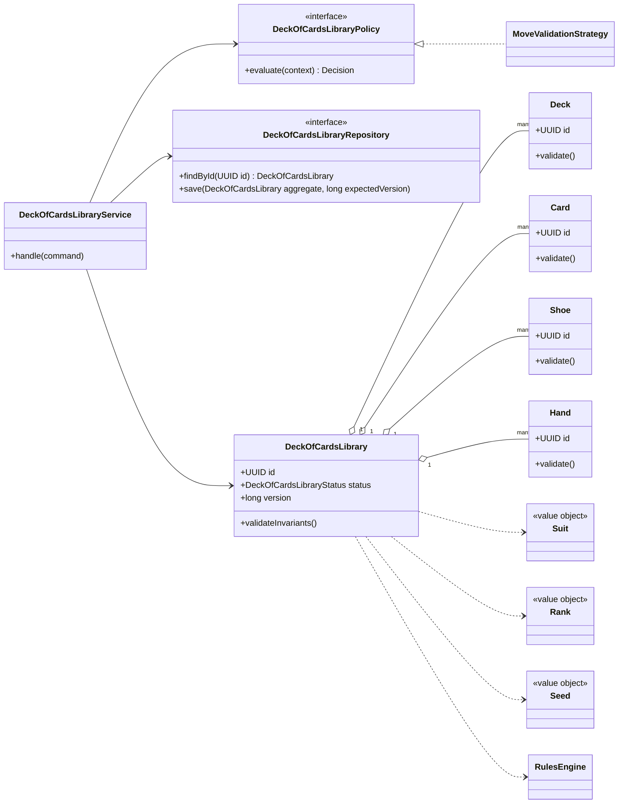
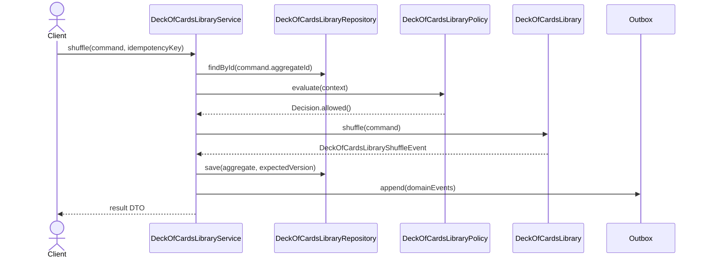

# 019. Design A Deck Of Cards Library

Source problem: `Design a deck of cards library.`  
Category: `Reusable library`  
Primary focus: `value objects, shuffle strategy, dealing, immutability`  
Archetype: `game`

## 1. Interview Framing

Design `deck of cards library` as a domain-centered LLD. Start with behavior, invariants, lifecycle states, and change points before naming classes. Keep the core model independent from UI, database, queues, and vendor SDKs.

## 2. Requirements

- Support the main user journeys for `deck of cards library` with clear command boundaries.
- Maintain lifecycle state with explicit valid transitions: `NEW, SHUFFLED, DEALING, EXHAUSTED, DISCARDED`.
- Preserve core invariants inside the aggregate instead of scattering checks across controllers.
- Expose repository and policy interfaces so storage, rules, and integrations can change independently.
- Emit domain events for important state changes to support audit, projections, and notifications.
- Separate board state from rules so alternate game variants can be plugged in.

## 3. Non-Goals

- Full distributed system design, capacity planning, and network protocols.
- UI screens, mobile clients, and authentication flows unless they affect domain invariants.
- Vendor-specific database schemas or framework annotations in the core model.
- A complete graphics engine or multiplayer networking stack.

## 4. Actors And Use Cases

Actors:

- `GameEngine`
- `Dealer`
- `RulesProvider`

Primary use cases:

- `shuffle` command on `DeckOfCardsLibrary`
- `dealCard` command on `DeckOfCardsLibrary`
- `dealHand` command on `DeckOfCardsLibrary`
- `resetDeck` command on `DeckOfCardsLibrary`

## 5. Core Domain Model

| Type | Examples | Responsibility |
|---|---|---|
| Aggregate root | `DeckOfCardsLibrary` | Owns lifecycle, invariants, version, and domain events. |
| Entities | `Deck, Card, Shoe, Hand, ShufflePolicy` | Have identity and change over time under the aggregate. |
| Value objects | `Suit, Rank, Seed, CardCount` | Immutable concepts compared by value. |
| Policies | `DeckOfCardsLibraryPolicy`, validation/ranking/pricing strategies | Encapsulate rules that vary by business or deployment. |
| Repositories | `DeckOfCardsLibraryRepository` | Load/save aggregate with optimistic concurrency. |
| Events | Domain event records | Capture meaningful state changes after successful commands. |

## 6. State, Invariants, And Relationships

States:

```text
NEW, SHUFFLED, DEALING, EXHAUSTED, DISCARDED
```

Invariants:

- `DeckOfCardsLibrary` can only move through declared states; invalid transitions fail fast.
- Every command validates caller intent, current state, and policy decision before mutating state.
- Aggregate version increases exactly once per successful command.
- Domain events are recorded only after the aggregate has accepted the state change.
- A move is applied only if it is legal for the current turn, board, and rule set.

Relationships:

| Component | Relationship | Collaborators | Why it exists |
|---|---|---|---|
| `DeckOfCardsLibraryService` | Depends on | Repository, policies, clock/idempotency store | Coordinates one use case and transaction boundary. |
| `DeckOfCardsLibrary` | Composes | Deck, Card, Shoe | Owns invariants and lifecycle transitions. |
| `DeckOfCardsLibraryRepository` | Abstracts | Persistence model | Keeps database details out of domain code. |
| `DeckOfCardsLibraryPolicy` | Strategy/specification | Business rules | Enables new rules without editing core workflow. |
| Domain events | Publish facts | Outbox/subscribers | Decouples side effects such as notifications, indexing, and audit. |

## 7. UML Class Diagram



## 8. Main Sequence



## 9. Applied Design Patterns

| Pattern | Where it fits |
|---|---|
| Strategy | Swap algorithms such as pricing, ranking, scheduling, matching, or retry without changing the aggregate. |

## 10. Java Reference Design

This is intentionally framework-free Java. In an interview, write the aggregate, repository, policy, and service first; add adapters later.

```java
package lld.deckofcardslibrary;

import java.util.*;

record Position(int row, int column) {}
record Move(UUID playerId, Position from, Position to, Map<String, String> metadata) {}
record MoveResult(boolean accepted, String reason) {
    static MoveResult accepted() { return new MoveResult(true, "accepted"); }
    static MoveResult rejected(String reason) { return new MoveResult(false, reason); }
}

enum DeckOfCardsLibraryStatus {
    NEW,
    SHUFFLED,
    DEALING,
    EXHAUSTED,
    DISCARDED
}

interface MoveRule {
    MoveResult validate(DeckOfCardsLibrary game, Move move);
}

final class Board {
    private final int rows;
    private final int columns;
    private final Map<Position, String> pieces = new HashMap<>();

    Board(int rows, int columns) {
        this.rows = rows;
        this.columns = columns;
    }

    boolean inside(Position p) {
        return p.row() >= 0 && p.row() < rows && p.column() >= 0 && p.column() < columns;
    }

    Optional<String> pieceAt(Position p) {
        return Optional.ofNullable(pieces.get(p));
    }

    void move(Position from, Position to) {
        String piece = pieces.remove(from);
        if (piece == null) throw new IllegalStateException("No piece at " + from);
        pieces.put(to, piece);
    }
}

final class DeckOfCardsLibrary {
    private final UUID id = UUID.randomUUID();
    private final Board board;
    private final List<MoveRule> rules;
    private DeckOfCardsLibraryStatus status = DeckOfCardsLibraryStatus.NEW;
    private UUID currentPlayerId;

    DeckOfCardsLibrary(Board board, List<MoveRule> rules, UUID firstPlayerId) {
        this.board = Objects.requireNonNull(board);
        this.rules = List.copyOf(rules);
        this.currentPlayerId = Objects.requireNonNull(firstPlayerId);
    }

    public MoveResult applyMove(Move move) {
        if (!move.playerId().equals(currentPlayerId)) return MoveResult.rejected("not current player's turn");
        for (MoveRule rule : rules) {
            MoveResult result = rule.validate(this, move);
            if (!result.accepted()) return result;
        }
        board.move(move.from(), move.to());
        status = DeckOfCardsLibraryStatus.SHUFFLED;
        return MoveResult.accepted();
    }

    public Board board() { return board; }
    public DeckOfCardsLibraryStatus status() { return status; }
    public UUID id() { return id; }
}
```

## 11. Concurrency And Thread Safety

- Use optimistic concurrency on aggregate save: `save(aggregate, expectedVersion)`.
- Lock scarce resources such as seats, rooms, inventory, accounts, or tasks with short-lived holds.
- Make commands idempotent when callers can retry after timeout.
- Publish events through an outbox in the same transaction as the aggregate update.

## 12. Persistence And Transactions

- Persist `DeckOfCardsLibrary` as the aggregate table/document with `id`, `status`, `version`, and audit timestamps.
- Persist child entities in owned tables/documents keyed by aggregate id.
- Store domain events in an outbox table in the same transaction.
- Add indexes for business lookup keys, active state, owner/user id, and expiry deadlines.

## 13. Error Handling And Idempotency

- Return typed domain errors: `NotFound`, `InvalidState`, `PolicyRejected`, `Conflict`, and `DuplicateCommand`.
- Never partially mutate aggregate state before all guards pass.
- Log rejection reasons with correlation id; avoid logging secrets, tokens, or sensitive payloads.

## 14. Extensibility Hooks

| Change point | Extension mechanism |
|---|---|
| Swap algorithms such as pricing, ranking, scheduling, matching, or retry without changing the aggregate. | `Strategy` |
| New persistence backend | Implement repository/adapter interfaces. |
| New read model or notification | Subscribe to domain events from the outbox. |
| New validation or business rule | Add policy/specification implementation and register it. |

## 15. Test Plan

- Unit test `DeckOfCardsLibrary` invariants and each command method.
- State-machine test all valid and invalid `DeckOfCardsLibraryStatus` transitions.
- Contract test every `DeckOfCardsLibraryRepository` implementation with optimistic conflict cases.
- Policy tests for allow/deny decisions and explainability.
- Idempotency tests that replay the same command and verify a single mutation/event.
- Property tests for legal move generation and terminal result detection.

## 16. Interview Tips

1. Start with the invariant: `DeckOfCardsLibrary` owns state and rejects invalid transitions.
2. Explain the command path: controller -> `DeckOfCardsLibraryService` -> policy -> aggregate -> repository -> outbox.
3. Call out the primary change points and the pattern that protects each one.
4. Discuss concurrency explicitly: optimistic versioning for aggregates or locks/atomics for in-memory structures.
5. Finish with tests: state transitions, policies, repository contracts, idempotency, and concurrency.
