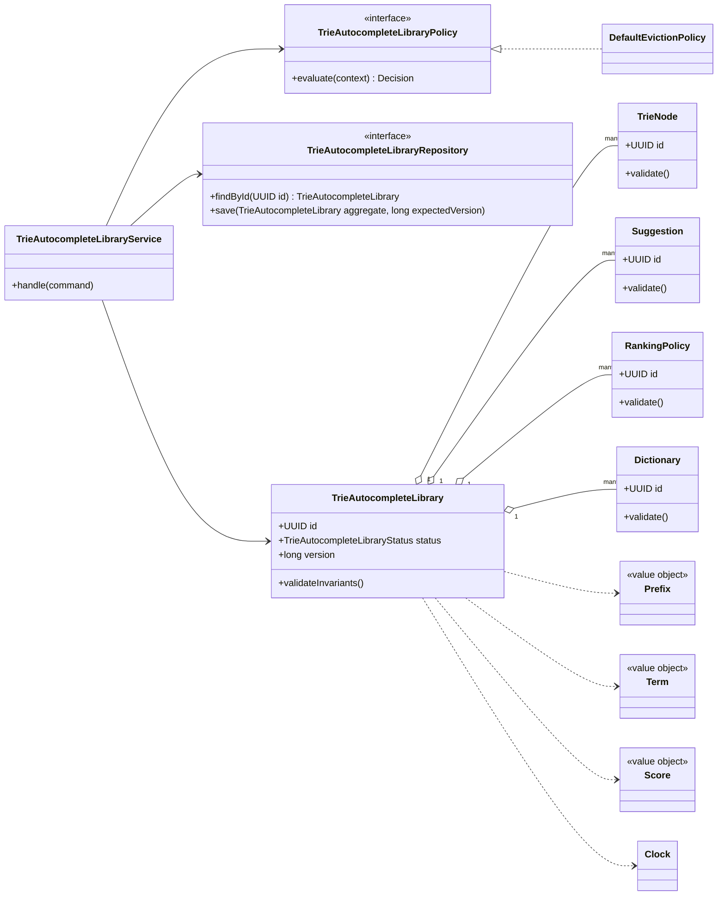
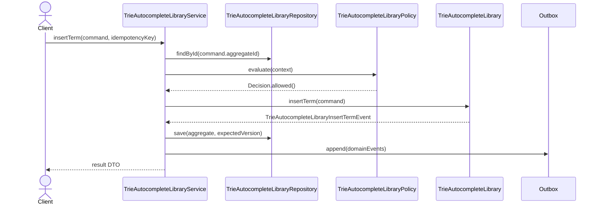

# 046. Design Trie/Autocomplete Library

Source problem: `Design trie/autocomplete library.`  
Category: `Data structure`  
Primary focus: `prefix search, ranking, memory trade-offs`  
Archetype: `data-structure`

## 1. Interview Framing

Design `trie autocomplete library` as a domain-centered LLD. Start with behavior, invariants, lifecycle states, and change points before naming classes. Keep the core model independent from UI, database, queues, and vendor SDKs.

## 2. Requirements

- Support the main user journeys for `trie autocomplete library` with clear command boundaries.
- Maintain lifecycle state with explicit valid transitions: `EMPTY, INDEXED, QUERYING, UPDATING, CLOSED`.
- Preserve core invariants inside the aggregate instead of scattering checks across controllers.
- Expose repository and policy interfaces so storage, rules, and integrations can change independently.
- Emit domain events for important state changes to support audit, projections, and notifications.
- Provide predictable algorithmic complexity and document concurrency guarantees.
- Allow clock, eviction, hash, ranking, or cleanup policies to be injected for deterministic tests.

## 3. Non-Goals

- Full distributed system design, capacity planning, and network protocols.
- UI screens, mobile clients, and authentication flows unless they affect domain invariants.
- Vendor-specific database schemas or framework annotations in the core model.
- A production-grade replacement for JDK collections unless explicitly required.

## 4. Actors And Use Cases

Actors:

- `SearchClient`
- `Indexer`
- `RankingService`

Primary use cases:

- `insertTerm` command on `TrieAutocompleteLibrary`
- `deleteTerm` command on `TrieAutocompleteLibrary`
- `searchPrefix` command on `TrieAutocompleteLibrary`
- `rankSuggestions` command on `TrieAutocompleteLibrary`

## 5. Core Domain Model

| Type | Examples | Responsibility |
|---|---|---|
| Aggregate root | `TrieAutocompleteLibrary` | Owns lifecycle, invariants, version, and domain events. |
| Entities | `TrieNode, Suggestion, RankingPolicy, Dictionary` | Have identity and change over time under the aggregate. |
| Value objects | `Prefix, Term, Score, Locale` | Immutable concepts compared by value. |
| Policies | `TrieAutocompleteLibraryPolicy`, validation/ranking/pricing strategies | Encapsulate rules that vary by business or deployment. |
| Repositories | `TrieAutocompleteLibraryRepository` | Load/save aggregate with optimistic concurrency. |
| Events | Domain event records | Capture meaningful state changes after successful commands. |

## 6. State, Invariants, And Relationships

States:

```text
EMPTY, INDEXED, QUERYING, UPDATING, CLOSED
```

Invariants:

- `TrieAutocompleteLibrary` can only move through declared states; invalid transitions fail fast.
- Every command validates caller intent, current state, and policy decision before mutating state.
- Aggregate version increases exactly once per successful command.
- Domain events are recorded only after the aggregate has accepted the state change.
- Public operations preserve documented time complexity for the chosen data structure.
- Eviction or cleanup cannot remove an entry that was concurrently made visible without a lock/compare step.

Relationships:

| Component | Relationship | Collaborators | Why it exists |
|---|---|---|---|
| `TrieAutocompleteLibraryService` | Depends on | Repository, policies, clock/idempotency store | Coordinates one use case and transaction boundary. |
| `TrieAutocompleteLibrary` | Composes | TrieNode, Suggestion, RankingPolicy | Owns invariants and lifecycle transitions. |
| `TrieAutocompleteLibraryRepository` | Abstracts | Persistence model | Keeps database details out of domain code. |
| `TrieAutocompleteLibraryPolicy` | Strategy/specification | Business rules | Enables new rules without editing core workflow. |
| Domain events | Publish facts | Outbox/subscribers | Decouples side effects such as notifications, indexing, and audit. |
| Lock/atomic primitive | Protects | Shared mutable state | Documents thread-safety and prevents race conditions. |

## 7. UML Class Diagram



## 8. Main Sequence



## 9. Applied Design Patterns

| Pattern | Where it fits |
|---|---|
| Strategy | Swap algorithms such as pricing, ranking, scheduling, matching, or retry without changing the aggregate. |
| Policy / Strategy | Make eviction, hashing, ranking, or cleanup algorithms replaceable. |

## 10. Java Reference Design

This is intentionally framework-free Java. In an interview, write the aggregate, repository, policy, and service first; add adapters later.

```java
package lld.trieautocompletelibrary;

import java.time.Clock;
import java.time.Instant;
import java.util.*;
import java.util.concurrent.locks.ReentrantLock;

interface EvictionPolicy<K> {
    void onRead(K key);
    void onWrite(K key);
    Optional<K> candidateForEviction();
    void remove(K key);
}

record CacheEntry<V>(V value, Instant expiresAt) {
    boolean expired(Clock clock) {
        return expiresAt != null && !expiresAt.isAfter(clock.instant());
    }
}

final class TrieAutocompleteLibrary<K, V> {
    private final int capacity;
    private final Clock clock;
    private final EvictionPolicy<K> evictionPolicy;
    private final Map<K, CacheEntry<V>> entries = new HashMap<>();
    private final ReentrantLock lock = new ReentrantLock();

    TrieAutocompleteLibrary(int capacity, Clock clock, EvictionPolicy<K> evictionPolicy) {
        if (capacity <= 0) throw new IllegalArgumentException("capacity must be positive");
        this.capacity = capacity;
        this.clock = Objects.requireNonNull(clock);
        this.evictionPolicy = Objects.requireNonNull(evictionPolicy);
    }

    public Optional<V> get(K key) {
        lock.lock();
        try {
            CacheEntry<V> entry = entries.get(key);
            if (entry == null) return Optional.empty();
            if (entry.expired(clock)) {
                removeInternal(key);
                return Optional.empty();
            }
            evictionPolicy.onRead(key);
            return Optional.of(entry.value());
        } finally {
            lock.unlock();
        }
    }

    public void put(K key, V value, Instant expiresAt) {
        lock.lock();
        try {
            if (!entries.containsKey(key) && entries.size() == capacity) {
                K victim = evictionPolicy.candidateForEviction()
                        .orElseThrow(() -> new IllegalStateException("No eviction candidate"));
                removeInternal(victim);
            }
            entries.put(key, new CacheEntry<>(value, expiresAt));
            evictionPolicy.onWrite(key);
        } finally {
            lock.unlock();
        }
    }

    public boolean remove(K key) {
        lock.lock();
        try {
            return removeInternal(key);
        } finally {
            lock.unlock();
        }
    }

    private boolean removeInternal(K key) {
        evictionPolicy.remove(key);
        return entries.remove(key) != null;
    }

    public int size() {
        lock.lock();
        try {
            return entries.size();
        } finally {
            lock.unlock();
        }
    }
}
```

## 11. Concurrency And Thread Safety

- Use `ReentrantReadWriteLock`, striped locks, or atomic references around the mutable index.
- Keep lock scope small: validate, mutate indexes, update counters, release.
- Inject `Clock` for TTL/time-driven behavior; never use wall-clock calls deep inside tests.
- Stress test concurrent `get`, `put`, `remove`, resize/eviction, and shutdown paths.

## 12. Persistence And Transactions

- Keep the core in memory; add optional snapshot/load APIs if durability is required.
- Persist snapshots with version and configuration so restored structures preserve semantics.
- Do not expose internal node/bucket references outside the structure.

## 13. Error Handling And Idempotency

- Return typed domain errors: `NotFound`, `InvalidState`, `PolicyRejected`, `Conflict`, and `DuplicateCommand`.
- Never partially mutate aggregate state before all guards pass.
- Log rejection reasons with correlation id; avoid logging secrets, tokens, or sensitive payloads.

## 14. Extensibility Hooks

| Change point | Extension mechanism |
|---|---|
| Swap algorithms such as pricing, ranking, scheduling, matching, or retry without changing the aggregate. | `Strategy` |
| Make eviction, hashing, ranking, or cleanup algorithms replaceable. | `Policy / Strategy` |
| New persistence backend | Implement repository/adapter interfaces. |
| New read model or notification | Subscribe to domain events from the outbox. |
| New validation or business rule | Add policy/specification implementation and register it. |

## 15. Test Plan

- Unit test `TrieAutocompleteLibrary` invariants and each command method.
- State-machine test all valid and invalid `TrieAutocompleteLibraryStatus` transitions.
- Contract test every `TrieAutocompleteLibraryRepository` implementation with optimistic conflict cases.
- Policy tests for allow/deny decisions and explainability.
- Idempotency tests that replay the same command and verify a single mutation/event.
- Complexity-oriented tests for eviction, ordering, resizing, and boundary capacity.
- Concurrency stress tests with many readers/writers and deterministic clocks.

## 16. Interview Tips

1. Start with the invariant: `TrieAutocompleteLibrary` owns state and rejects invalid transitions.
2. Explain the command path: controller -> `TrieAutocompleteLibraryService` -> policy -> aggregate -> repository -> outbox.
3. Call out the primary change points and the pattern that protects each one.
4. Discuss concurrency explicitly: optimistic versioning for aggregates or locks/atomics for in-memory structures.
5. Finish with tests: state transitions, policies, repository contracts, idempotency, and concurrency.
